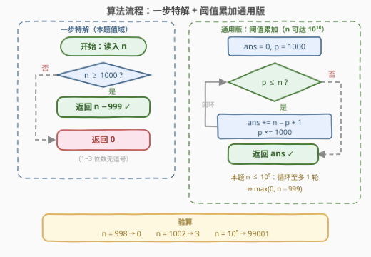

# LeetCode 统计范围内的逗号 题解

## 1. 题目概述

- **标题 / 题号**：统计范围内的逗号（#3870，easy）
- **链接**：https://leetcode.cn/problems/count-commas-in-range/
- **难度**：简单
- **标签**：数学

**题意**：给定整数 $n$，把 $[1, n]$ 内**所有**整数按**标准格式**书写——从右边起每三位数字插一个逗号（如 `1,000`、`56,789`），位数少于四位的数不含逗号——求整个区间共用到多少个逗号。

**示例 1**：

```text
输入：n = 1002
输出：3
解释："1,000"、"1,001"、"1,002" 各含一个逗号，共 3 个。
```

**示例 2**：

```text
输入：n = 998
输出：0
解释：1 到 998 的所有数位数都少于四位，没有逗号。
```

**约束**：

- $1 \le n \le 10^5$

> 💡 **审题关键**：① 统计的是**逗号总数**而非含逗号的数的个数——但注意一个数可能有多个逗号（如 $10^9$ 写作 `1,000,000,000` 有 3 个）；② 约束 $n \le 10^5$ 是本题最大的提示：最大的数 $100000$ 写作 `100,000`，也只有 **1 个**逗号——所以「逗号总数」与「含逗号的数的个数」在本题值域内恰好相等；③ 标准格式的分组从**右边**起算，与位数 $d$ 一一对应，逗号数是位数的确定函数。

## 2. 解题思路

### 2.1 暴力思路：逐个数位数

对 $[1, n]$ 每个数 $x$：求位数 $d = \lfloor \log_{10} x \rfloor + 1$（或 `len(str(x))`），累加它的逗号数 $\lfloor (d-1)/3 \rfloor$。总复杂度 $O(n \log n)$，$n \le 10^5$ 时约十万次运算，轻松通过。

但显然**同一个信息被反复重算**：$1000 \sim 1999$ 这一千个数的位数完全相同，逗号数完全相同——逗号数只由**位数**决定，而位数在数轴上是**连续分档**的，一档一个区间，数区间比数数字快得多。

### 2.2 核心观察：逗号数只由位数决定，区间一档数完

![核心观察：数轴按位数分档，[1,999] 无逗号，[1000,100000] 每数恰好 1 个逗号](../images/p3870_comma_zone_concept.svg)

$d$ 位数从右往左每 3 位一组，逗号插在组与组之间，故

$$
\text{commas}(x) = \left\lfloor \frac{d(x) - 1}{3} \right\rfloor
$$

| 位数 $d$ | 数值区间 | 逗号数 |
|----------|----------|--------|
| 1 ~ 3 | $[1, 999]$ | 0 |
| 4 ~ 6 | $[1000, 999999]$ | 1 |
| 7 ~ 9 | $[10^6, 999999999]$ | 2 |

本题 $n \le 10^5 < 10^6$，**整个值域只跨前两档**：$[1, 999]$ 贡献 0，$[1000, n]$ 中每个数恰好贡献 1。于是

$$
\text{answer} = \max(0,\; n - 1000 + 1) = \max(0,\; n - 999)
$$

一行公式，$O(1)$ 收工。验算：$n = 1002 \Rightarrow 1002 - 999 = 3$ ✓；$n = 998 \Rightarrow 0$ ✓。

> 💡 **更一般的视角（阈值计数）**：$x$ 至少有 $m$ 个逗号 $\iff x \ge 10^{3m}$。把「每个数的逗号数求和」交换求和顺序，改成「对每个逗号档位 $m$，数出至少拥有 $m$ 个逗号的数的个数」：
> $$
> \text{Total}(n) = \sum_{m \ge 1} \max\left(0,\; n - 10^{3m} + 1\right)
> $$
> 本题值域内只有 $m = 1$ 一项非零，正是上式退化成 $\max(0, n-999)$ 的原因。这与 172「阶乘尾零」的 $\sum_k \lfloor n/5^k \rfloor$ 是同款定式——**把逐元素求和换成逐阈值计数**，见第 5 节。

### 2.3 算法流程图



| 步骤 | 操作 | 说明 |
|------|------|------|
| ① 输入 | 读入 $n$ | $1 \le n \le 10^5$ |
| ② 判档 | $n \ge 1000$？ | 本题值域只有这一道门槛 |
| ③a 否 | 返回 $0$ | 整个区间都是 1~3 位数 |
| ③b 是 | 返回 $n - 999$ | $[1000, n]$ 每数恰好 1 个逗号 |

> ⚠️ 右侧通用循环（`p = 1000; while p ≤ n: ans += n − p + 1; p *= 1000`）在 $n \le 10^5$ 时至多执行 1 轮，与一步公式等价——面试中先给 $O(1)$ 特解、再主动给出通用版，是加分项。

### 2.4 示例演算

| $n$ | 无逗号区间 | 1 逗号区间 | 计算 | 答案 |
|-----|-----------|-----------|------|------|
| 998 | $[1, 998]$ | $\varnothing$ | $\max(0, 998-999)$ | 0 |
| 1000 | $[1, 999]$ | $\{1000\}$ | $1000 - 999$ | 1 |
| 1002 | $[1, 999]$ | $[1000, 1002]$ | $1002 - 999$ | 3 |
| $10^5$ | $[1, 999]$ | $[1000, 10^5]$ | $100000 - 999$ | 99001 |

> 💡 边界自检：$n = 999$ 时 $\max(0, 0) = 0$；$n = 1000$ 时恰好 1（`1,000` 一个逗号）——公式在门槛两侧都严丝合缝。

## 3. 参考代码

### C++

```cpp
class Solution {
public:
    int countCommas(int n) {
        // n ≤ 1e5 < 1e6：只有 [1000, n] 每个数恰好 1 个逗号
        return max(0, n - 999);
    }
};
```

### Python

```python
class Solution:
    def countCommas(self, n: int) -> int:
        return max(0, n - 999)
```

## 4. 复杂度分析

| 维度 | 复杂度 | 说明 |
|------|--------|------|
| **时间** | $O(1)$ | 一次比较一次减法；暴力版 $O(n \log n)$、通用循环版 $O(\log_{1000} n)$ |
| **空间** | $O(1)$ | 无额外存储 |
| **量级 / 值域** | $n \le 10^5$ | 答案上界 $99001$，`int` 绰绰有余 |

## 5. 扩展：阈值累加的通用公式

若把 $n$ 的上界放大到 $10^{18}$，一步公式不再够用，套 2.2 的阈值计数通式：

$$
\text{Total}(n) = \sum_{m \ge 1} \max\left(0,\; n - 10^{3m} + 1\right)
$$

```python
class Solution:
    def countCommas(self, n: int) -> int:
        ans, p = 0, 1000          # p = 10^(3m)：至少 m 个逗号的门槛
        while p <= n:
            ans += n - p + 1      # [p, n] 每个数至少 m 个逗号
            p *= 1000             # 下一档门槛
        return ans
```

- 循环轮数 $\le \lfloor \log_{1000} n \rfloor \le 6$，复杂度 $O(\log n)$；
- $n = 10^{18}$ 时答案约 $6 \times 10^{18}$，仍在 `long long`（$2^{63}-1 \approx 9.2 \times 10^{18}$）范围内，但已接近上限——再放大值域就得上 Python 大整数或 `__int128`；
- 对照 172「阶乘尾零」的 $\sum_k \lfloor n / 5^k \rfloor$：那边门槛是「$5^k$ 的倍数」用整除，这边门槛是「$\ge 10^{3m}$」用减法，骨架同为**逐阈值累加计数**。

## 6. 面试要点

**Q1：为什么不需要逐个数？**

> 逗号数是位数 $d$ 的确定函数 $\lfloor (d-1)/3 \rfloor$，而位数在 $[1, n]$ 上随 $x$ 单调不减、按区间分档。**档内所有数逗号数相同**，于是「逐元素求和」坍缩成「数出每档的元素个数」——这是所有按值域分档计数题的共同杠杆。

**Q2：一个 $d$ 位数为什么恰好 $\lfloor (d-1)/3 \rfloor$ 个逗号？**

> 从右往左每 3 位一组，$d$ 位数共 $\lceil d/3 \rceil$ 组，逗号插在**组间**（$k$ 个组有 $k-1$ 个间隔），故逗号数 $= \lceil d/3 \rceil - 1 = \lfloor (d-1)/3 \rfloor$。注意与「组数」区分——首组左侧不插逗号。

**Q3：通用公式 $\sum_{m \ge 1} \max(0, n - 10^{3m} + 1)$ 是怎么来的？**

> 交换求和顺序：$\sum_x \text{commas}(x) = \sum_x \sum_{m \ge 1} [x \ge 10^{3m}] = \sum_{m \ge 1} \#\{x \le n : x \ge 10^{3m}\}$。每个数的每个逗号都被恰好数一次——它在自己拥有的每一档 $m$ 里各贡献 1。「值之和 = 各阈值处的计数之和」这一换序技巧在期望、前缀和、贡献法里反复出现。

**Q4：$n$ 放大到 $10^{18}$ 要注意什么？**

> 公式从一步退化为至多 6 轮的循环（门槛 $10^3, 10^6, \dots, 10^{18}$）；答案约 $6n$ 量级，$n = 10^{18}$ 时逼近 `long long` 上限，加法过程需防溢出——Python 天然大整数无此虑，C++ 可在临界处换 `__int128` 或 `unsigned long long`。

**Q5：和 172「阶乘后的零」有什么联系？**

> 同一个定式的两个实例：172 数「因子 5 的个数」，对每个 $k$ 累加 $\lfloor n/5^k \rfloor$（是 $5^k$ 倍数的数）；本题数「逗号个数」，对每个 $m$ 累加 $n - 10^{3m} + 1$（达到 $10^{3m}$ 门槛的数）。都是**把逐元素统计改写为逐阈值统计**后得到的多项式/对数级算法。

> 💡 **一句话总结**：逗号数只由位数决定，$n \le 10^5$ 时值域只跨「无逗号 / 1 个逗号」两档——答案就是 $\max(0, n - 999)$；放大值域则用 $\sum_m \max(0, n - 10^{3m} + 1)$ 逐阈值累加。

## 同类练习题

| # | 题目 | 与本题的关联 |
|---|------|-------------|
| 172 | [阶乘后的零](https://leetcode.cn/problems/factorial-trailing-zeroes/)（[题解](../0101-0200/172_阶乘后的零.md)） | 同款阈值累加定式——$\sum_k \lfloor n/5^k \rfloor$，把逐个数的因子统计换成逐门槛计数 |
| 233 | [数字 1 的个数](https://leetcode.cn/problems/number-of-digit-one/)（[题解](../0201-0300/233_数字1的个数.md)） | 同为「$[1, n]$ 区间内数字格式统计」，按数位逐位做贡献法，本题的进阶亲戚 |
| 400 | [第 N 位数字](https://leetcode.cn/problems/nth-digit/)（[题解](../0301-0400/400_第N位数字.md)） | 按位数分档（1 位数、2 位数……）定位目标，与本题「按位数分档数逗号」同源 |
| 357 | [统计各位数字都不同的数字个数](https://leetcode.cn/problems/count-numbers-with-unique-digits/)（[题解](../0301-0400/357_统计各位数字都不同的数字个数.md)） | 按位数分档 + 逐档组合计数，位数分档思想的另一应用 |
