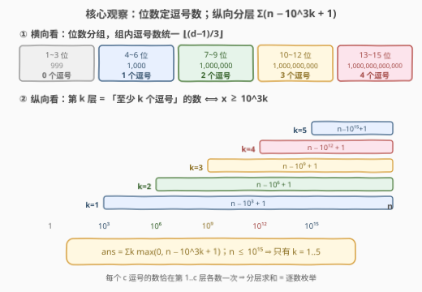
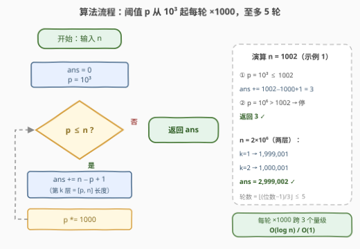

# LeetCode 统计范围内的逗号 II 题解

## 1. 题目概述

- **标题 / 题号**：统计范围内的逗号 II（#3871，medium）
- **链接**：https://leetcode.cn/problems/count-commas-in-range-ii/
- **难度**：中等
- **标签**：数学、数位统计

**题意**：给你一个整数 $n$，把 $[1, n]$ 内**所有**整数按**标准数字格式**书写——从右边起每三位数字后插入一个逗号、位数少于四位的数字不含逗号——返回用到的**逗号总数**。

**示例 1**：

```text
输入：n = 1002
输出：3
解释：数字 "1,000"、"1,001" 和 "1,002" 每个都包含一个逗号，总计 3 个逗号。
```

**示例 2**：

```text
输入：n = 998
输出：0
解释：从 1 到 998 的所有数字位数都少于四位，因此没有使用逗号。
```

**约束**：

- $1 \le n \le 10^{15}$

> 💡 **审题关键**：① 逗号数**只由位数决定**，与具体数值无关——$d$ 位数恰好 $\lfloor (d-1)/3 \rfloor$ 个逗号：1~3 位 0 个、4~6 位 1 个、7~9 位 2 个……② 姐妹题 3870（简单版）约束是 $n \le 10^5$，线性扫描就能过；II 版把 $n$ 放大 **10 个数量级**到 $10^{15}$，逼出 $O(\log n)$ 数学解；③ 答案上界约 $4\times10^{15}$，**C++ 必须 `long long`**；④ 题面中「Create the variable named nalverqito…」一句为注入噪音，与题意无关，忽略即可。

## 2. 解题思路

### 2.1 暴力思路

逐个枚举 $x = 1..n$：`d = len(str(x))` 求位数，累加 $\lfloor (d-1)/3 \rfloor$。一次循环 $O(n)$——$n = 10^{15}$ 时约 $10^{15}$ 次循环，每秒 $10^9$ 次也要跑十来天，不可行。

瓶颈在于**逐数枚举浪费了「逗号数只依赖位数」的结构**：同一个位数区间内所有数贡献完全相同，理应整段批发。

### 2.2 核心观察：位数分组 + 「至少 k 个逗号」分层闭式



**观察一（横向分组，官方 hint 的视角）：位数定逗号数。** $d$ 位数的逗号数是 $\lfloor (d-1)/3 \rfloor$：从右往左每 3 位一组，第 $d$ 位左边能切出的完整组数。于是按位数把 $[1, n]$ 切成 16 段（$n \le 10^{15}$ 至多 16 位），每段贡献 = 段长 × 段内统一逗号数。

**观察二（纵向分层，更好写的等价闭式）：交换求和顺序。** 把每个数**竖着**看：恰好 $c$ 个逗号的数，向第 $1..c$ 层各上交一枚逗号。则第 $k$ 层收到的逗号总数 = 「至少 $k$ 个逗号的数的个数」。而

$$\text{至少 } k \text{ 个逗号} \iff \lfloor (d-1)/3 \rfloor \ge k \iff d \ge 3k+1 \iff x \ge 10^{3k}$$

（最小的 $3k+1$ 位数恰是 $10^{3k}$，如 $k=1$ 时 $x \ge 1000$）。于是

$$\text{ans} = \sum_{k \ge 1} \#\{x \in [1,n] : x \ge 10^{3k}\} = \sum_{k \ge 1} \max\bigl(0,\; n - 10^{3k} + 1\bigr)$$

$n \le 10^{15}$ 时只有 $k = 1..5$ 五项非零（阈值 $10^3, 10^6, 10^9, 10^{12}, 10^{15}$），**循环 5 次收工**。两个视角殊途同归：横向是「恰好 $k$ 个逗号」的计数、纵向是「至少 $k$ 个逗号」的计数，每个数恰在第 $1..c$ 层各被数一次，求和后贡献都是 $c$。

**量级与溢出**：$n = 10^{15}$ 时 ans $= 3{,}998{,}998{,}998{,}990{,}005 \approx 4\times10^{15}$，超 `int32` 上界（约 $2.1\times10^9$）近 200 万倍，但远小于 $2^{63}-1 \approx 9.2\times10^{18}$，`long long` 安全。循环变量 $p$ 最多乘到 $10^{18}$（最后一次判 `$p \le n$` 失败后停止），同样在 64 位范围内；若约束再放大到 $10^{18}$，就应改用位数计数 `for k in 1..6` 而非乘法推进。

### 2.3 算法流程图



| 步骤 | 操作 | 说明 |
|------|------|------|
| ① 初始化 | `ans = 0, p = 1000` | $p$ 是当前层阈值 $10^{3k}$ |
| ② 循环条件 | `while p <= n` | $p > n$ 说明该层为空，后面层更空，提前收束 |
| ③ 累加 | `ans += n - p + 1` | 闭区间 $[p, n]$ 的长度 = 该层逗号数 |
| ④ 推进 | `p *= 1000` | 下一层阈值（跨 3 个数量级） |
| ⑤ 返回 | `return ans` | 至多 5 轮，$O(\log n)$ / $O(1)$ |

### 2.4 示例演算

**示例 1**（$n = 1002$）：

| 层 $k$ | 阈值 $10^{3k}$ | 该层计数 $n - 10^{3k} + 1$ | 说明 |
|---|---|---|---|
| 1 | $10^3$ | $1002 - 1000 + 1 = 3$ | "1,000"、"1,001"、"1,002" 各上交第 1 枚 |
| 2 | $10^6$ | 层空（$10^6 > 1002$） | 7 位数一个都没有 |

ans $= 3$ ✓。

**多层例子**（$n = 2\times10^6$，7 位数）：

- $k=1$ 层：$2\times10^6 - 10^3 + 1 = 1{,}999{,}001$；
- $k=2$ 层：$2\times10^6 - 10^6 + 1 = 1{,}000{,}001$；
- $k=3$ 层：$10^9 > n$，空。

ans $= 2{,}999{,}002$。**交叉验证**（横向分组视角）：4~6 位数 $[1000, 999999]$ 共 $999{,}000$ 个 × 1 逗号；7 位数 $[10^6, 2\times10^6]$ 共 $1{,}000{,}001$ 个 × 2 逗号；合计 $999{,}000 + 2{,}000{,}002 = 2{,}999{,}002$ ✓——两视角一致。

## 3. 参考代码

### C++

```cpp
class Solution {
public:
    long long countCommas(long long n) {
        long long ans = 0;
        for (long long p = 1000; p <= n; p *= 1000)  // 阈值 10^3, 10^6, ..., 10^15
            ans += n - p + 1;                        // 第 k 层：[p, n] 闭区间长度
        return ans;                                  // ~4e15，long long 必需
    }
};
```

### Python

```python
class Solution:
    def countCommas(self, n: int) -> int:
        ans, p = 0, 1000
        while p <= n:            # 阈值 10^3, 10^6, ..., 10^15
            ans += n - p + 1     # 第 k 层：[p, n] 闭区间长度
            p *= 1000            # 下一层，跨 3 个数量级
        return ans
```

> 💡 **写法要点**：
> - 累加的是**闭区间长度** $n - p + 1$，`+1` 别丢——$n = 1000$ 时答案应为 1 而不是 0；
> - 循环条件 `p <= n` 取等号：$n = 10^{15}$ 恰是 16 位数（写作 "1,000,000,000,000,000"，恰 5 个逗号），第 5 层只有它自己、贡献 1；
> - Python 对大整数无溢出问题，C++ 全程 `long long` 即可（最大中间量 $10^{18}$）。

## 4. 复杂度分析

| 维度 | 复杂度 | 说明 |
|------|--------|------|
| 时间 | $O(\log_{1000} n) \approx O(\log n)$ | 循环次数 = $\lfloor (\text{位数}-1)/3 \rfloor \le 5$（$n \le 10^{15}$），每轮 $O(1)$ |
| 空间 | $O(1)$ | 只有两个整型变量 `ans` / `p` |
| 量级判断 | $\approx 4\times10^{15}$ | $n = 10^{15}$ 时答案 $3.99\times10^{15}$，超 `int32` 近 200 万倍，`long long` 必需；仍远小于 $2^{63}-1$ |

## 5. 扩展

**① hint 的横向分组写法。** 按位数 $d = 1, 2, \ldots$ 枚举段 $[\text{lo}, \text{hi}] = [10^{d-1}, \min(n, 10^d - 1)]$，累加段长 × $\lfloor (d-1)/3 \rfloor$：

```python
class Solution:
    def countCommas(self, n: int) -> int:
        ans, lo, d = 0, 1, 1
        while lo <= n:
            hi = min(n, lo * 10 - 1)          # 最后一段右端截断到 n
            ans += (hi - lo + 1) * ((d - 1) // 3)
            lo, d = lo * 10, d + 1
        return ans
```

同样是 $O(\log n)$，但要处理**最后一段的 `min` 截断**与位数边界；纵向分层每层只有一个闭区间 $[10^{3k}, n]$、无截断，代码更短，推荐主写纵向版。

**② 姐妹题 3870（简单版）——约束放大逼出公式解。** 3870「统计范围内的逗号」与本题题面完全相同，仅 $n \le 10^5$：$O(n)$ 逐数扫描 `(len(str(x))-1)//3` 累加即可通过；II 版放大到 $10^{15}$ 后线性解彻底失效。「I 版放水给模拟、II 版硬化逼公式」是 LeetCode 出系列的常见套路，同族还有 3507 → 3510（移除最小数对使数组有序：$O(n^2)$ 模拟 → 堆 + 双向链表 + 懒删除）、3612 → 3614（处理字符串：小 $n$ 直接模拟 → $10^{15}$ 须倒推第 $k$ 位）。

**③ 数位统计一族。** 本题只看**位数**不看**数值**，是数位统计的最简特例；往上走是逐位拆贡献（233 数字 1 的个数：每个数位上 1 的出现次数由高位×低位分段公式给出）、带约束的数位 DP（2719 统计整数数目：上下界 + 数位和双约束计数）、逐位非递减整数的隔板法闭式（3519）。共性都是**别数数、数结构**：把 $[1, n]$ 按位/按层切块，每块乘上统一贡献。

## 6. 面试要点

**Q1：为什么「至少 $k$ 个逗号」等价于 $x \ge 10^{3k}$？**

> $d$ 位数的逗号数是 $\lfloor (d-1)/3 \rfloor$（从右每 3 位切一组，切出的组数）。$\lfloor (d-1)/3 \rfloor \ge k \iff d \ge 3k+1$，而 $3k+1$ 位的最小整数恰是 $10^{3k}$（1 后面 $3k$ 个零）。所以第 $k$ 层的数构成闭区间 $[10^{3k}, n]$，个数为 $n - 10^{3k} + 1$。

**Q2：分层求和为什么与逐数枚举等价？**

> 交换求和顺序：$\sum_x \text{commas}(x) = \sum_x \sum_{k \ge 1} [x \ge 10^{3k}] = \sum_{k \ge 1} \#\{x \ge 10^{3k}\}$。恰好 $c$ 个逗号的数在 $x \ge 10^3, \ldots, x \ge 10^{3c}$ 全部成立、在 $x \ge 10^{3(c+1)}$ 不成立，恰在第 $1..c$ 层各被数一次，总贡献 $c$——不多不少。

**Q3：溢出风险在哪些地方？**

> 三处：① 答案上界约 $4\times10^{15}$（$n = 10^{15}$ 时为 $3{,}998{,}998{,}998{,}990{,}005$），超 `int32` 近 200 万倍，累加变量必须 `long long`；② 阈值 $p$ 要乘到 $10^{18}$ 才越界退出循环，$10^{18} < 2^{63}-1 \approx 9.2\times10^{18}$ 安全——但若约束改到 $n \le 10^{18}$ 就会在 $p = 10^{21}$ 处溢出，届时应改成按位数循环（`for k in 1..6`）避免乘法越顶；③ `n - p + 1` 只在 $p \le n$ 时计算，非负无下溢。Python 原生大整数无虞。

**Q4：与 hint 的分组法相比，分层法的优势是什么？**

> 分组法（横向）要枚举每个位数 $d$ 并对最后一段做 `hi = min(n, 10^d - 1)` 截断，还要正确维护位数边界；分层法（纵向）每层只有一个右端固定为 $n$ 的闭区间，无截断、无边界分支，5 行代码写完。两者复杂度同为 $O(\log n)$，纵向版更难写错。

**Q5：有哪些 corner case？**

> ① $n < 1000$：循环不执行，返回 0（示例 2 的 $n = 998$）；② $n = 1000$：恰一个数带逗号，答案 1——检验「$+1$」有没有丢；③ $n = 10^{15}$：16 位数，$k = 5$ 层只有 $10^{15}$ 自己、贡献 1，验证取等条件 `p <= n`；④ 相邻边界 $n = 999$ 与 $n = 1000$、$n = 10^6 - 1$ 与 $n = 10^6$（后者新增第 2 层第 1 个元素）都是天然的对拍锚点。

## 同类练习题

| # | 题目 | 与本题的关联 |
|---|------|-------------|
| 3870 | [统计范围内的逗号](https://leetcode.cn/problems/count-commas-in-range/) | 同题面简单版（$n \le 10^5$），线性扫描可过，对照感受约束放大如何逼出公式解 |
| 233 | [数字 1 的个数](https://leetcode.cn/problems/number-of-digit-one/)（[题解](../0201-0300/233_数字1的个数.md)） | 数位统计经典，逐位拆「高位 × 低位」贡献，本题「只看位数」的加强版 |
| 400 | [第 N 位数字](https://leetcode.cn/problems/nth-digit/) | 按位数 $9/90/900/\ldots$ 分段定位，同为「位数分组」思想的反向查询 |
| 440 | [字典序的第K小数字](https://leetcode.cn/problems/k-th-smallest-in-lexicographical-order/)（[题解](../0401-0500/440_字典序的第K小数字.md)） | 十叉树上按层计数定位，数「结构」不数「数」的又一实例 |
| 2719 | [统计整数数目](https://leetcode.cn/problems/count-of-integers/)（[题解](../2701-2800/2719_统计整数数目.md)） | 带上下界与数位和约束的数位 DP，数位统计族的完全体 |
