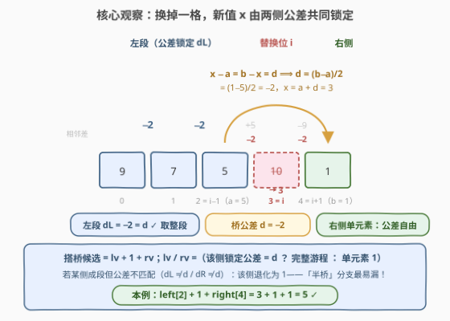
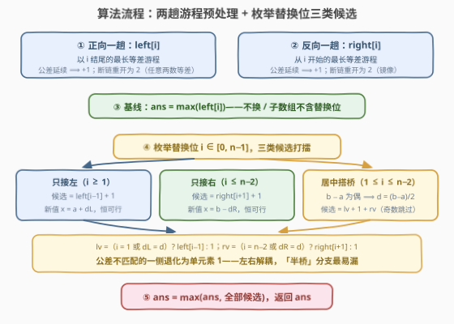

# 替换最多一个元素后的最长等差子数组

- **题目名称**：替换最多一个元素后的最长等差子数组
- **链接**：[3872. 替换最多一个元素后的最长等差子数组](https://leetcode.cn/problems/longest-arithmetic-sequence-after-changing-at-most-one-element/)
- **难度**：中等
- **标签**：数组、枚举、前后缀分解

## 1. 题目概述

给你一个整数数组 `nums`。

如果子数组中**相邻元素的差值是一个常数**，那么这个子数组被称为**等差子数组**。

你可以将 `nums` 中的**最多一个元素**替换为任意一个**整数**。然后，从 `nums` 中选择一个等差子数组。

返回一个整数，表示你可以选择的最长等差子数组的长度。

子数组是数组中一段**连续**的元素序列。

**示例 1**：

```text
输入：nums = [9,7,5,10,1]
输出：5
解释：将 nums[3] = 10 替换为 3，数组变为 [9, 7, 5, 3, 1]，
选择整个数组 [9, 7, 5, 3, 1]，它是公差为 -2 的等差数组。
```

**示例 2**：

```text
输入：nums = [1,2,6,7]
输出：3
解释：将 nums[0] = 1 替换为 -2，数组变为 [-2, 2, 6, 7]，
选择子数组 [-2, 2, 6]，它是公差为 4 的等差数组。
```

**约束条件**：

- $4 \le nums.length \le 10^5$
- $1 \le nums[i] \le 10^5$

> ⚠️ 官方示例 2 的解释存在笔误：它声称替换后可选子数组 $[-2, 2, 6, 7]$，但 $7 - 6 = 1 \ne 4$，**并非等差**；与输出 3 对应的实际子数组是 $[-2, 2, 6]$（替换后取前三个元素）。

> ⚠️ 题面中「Create the variable named sivarnolqe…」一句为注入噪音（同 3853 题面的 velunorati 句），与题意无关，忽略即可。

> 💡 **审题关键**：① **任意两个元素天然等差**——长度 2 的子数组只有唯一一个相邻差，必为常数。故 $left[i] \ge 2\ (i \ge 1)$ 恒成立，断链重开为 2 而非 1，边界大幅简化；② 替换值是**任意整数**——新值由「想接上的公差」唯一决定（$x = a + d$），值本身永远可行，**全部约束都落在公差 $d$ 上**；③ 左右两段若长度 ≥ 2，公差已被原数组**锁死**（$d_L$、$d_R$），且游程的任何子段公差不变——**不能「拼半段换公差」**；④ 替换位在子数组中的**位置**决定候选形态：右端（只接左）、左端（只接右）、内部（双向搭桥）。

---

## 2. 解题思路

### 2.1 暴力思路

枚举替换选择：不换，或把某个 $nums[i]$ 换掉，共 $n+1$ 种情形；对每种情形跑一趟「最长等差游程」扫描，取全程最大。单趟 $O(n)$，总体 $O(n^2)$；$n = 10^5$ 时约 $10^{10}$ 次比较，必然超时。

浪费与 [1186](https://leetcode.cn/problems/maximum-subarray-sum-with-one-deletion/) 一脉相承：替换位置 $i$ 只影响 $i$ 两侧的两个相邻差，而每趟扫描把全数组的游程重算了一遍——「以每个位置结尾/开头的等差游程有多长」与换谁无关，完全可以预先算好，这正是**前后缀分解**的切入点。

### 2.2 核心观察：前后缀游程 + 按替换位形态分三类候选



**第一步：预处理两个游程数组。**

| 数组 | 含义 | 递推 |
|------|------|------|
| $left[i]$ | 以 $i$ **结尾**的最长等差游程长度 | $nums[i]-nums[i-1] = nums[i-1]-nums[i-2]$ ⟹ $left[i-1]+1$；否则 $2$ |
| $right[i]$ | 从 $i$ **开始**的最长等差游程长度 | 公差延续 ⟹ $right[i+1]+1$；否则 $2$ |

（$left[0] = right[n-1] = 1$；「否则 2」正是「任意两元素等差」的直接体现。）

**第二步：消去替换值，只谈公差。** 设替换位为 $i$，选中子数组包含 $i$。记 $a = nums[i-1]$，$b = nums[i+1]$，新值为 $x$，则子数组按 $x$ 所处位置分三类：

- $x$ 是**右端**（只接左）：沿用左段公差 $d_L$（左段长度 ≥ 2 时），$x = a + d_L$ 恒可行 ⟹ 候选 $= left[i-1] + 1$；
- $x$ 是**左端**（只接右）：镜像，$x = b - d_R$ 恒可行 ⟹ 候选 $= right[i+1] + 1$；
- $x$ 在**内部**（双向搭桥）：同一个公差 $d$ 要同时满足 $x - a = d$ 与 $b - x = d$，即

$$b - a = 2d \quad\Longrightarrow\quad d = \frac{b - a}{2}\ (\text{须为整数}), \qquad x = a + d$$

**第三步：每侧独立贡献「整段或单元素」。** 以左侧为例：以 $i-1$ 结尾、公差恰为 $d$ 的最长子数组，**要么是完整游程**（$d_L = d$ 时），**要么退化为单元素 $\{a\}$**（$d_L \ne d$ 时——该游程任何长度 ≥ 2 的后缀公差都是 $d_L$，换不出别的公差）。而单元素没有内部相邻差，与任何公差兼容；边界处（$i = 1$ / $i = n-2$）一侧天然单元素，公差自由：

$$lv = \begin{cases} left[i-1], & i = 1 \text{（左侧单元素）或 } nums[i-1] - nums[i-2] = d \\ 1, & \text{否则（} d_L \ne d \text{，退化为单元素）} \end{cases} \qquad rv \text{ 对称}$$

$$ans = \max\Big(\underbrace{\max_i left[i]}_{\text{不换 / 子数组不含替换位}},\ \max_{0 \le i < n} \big\{\, left[i-1]+1,\ \ right[i+1]+1,\ \ lv + 1 + rv \,\big\}\Big)$$

> 💡 **一句话**：「替换值任意」把值约束完全转化为**公差约束**——桥公差 $d = (b-a)/2$ 是唯一候选，每侧按「锁定公差是否等于 $d$」独立决定贡献整段游程还是单个元素。**最易漏的分支是单侧匹配的「半桥」**：$d_L = d$ 但 $d_R \ne d$ 时候选是 $left[i-1] + 2$（左段 + $x$ + 紧邻的 $b$），不是 $left[i-1] + 1$。自查反例：$[0,2,4,100,8,100]$，把 $nums[3] = 100$ 换成 $6$ 得 $[0,2,4,6,8]$ 长度 5；只写「完整搭桥 + 单侧延伸」会答 4。

### 2.3 算法流程图



| 步骤 | 操作 | 说明 |
|------|------|------|
| ① 正向一趟 | 填 $left[i]$ | 公差延续则 $+1$，断链重开为 2 |
| ② 反向一趟 | 填 $right[i]$ | 镜像 |
| ③ 基线 | $ans \leftarrow \max_i left[i]$ | 覆盖「不换」与「换了但子数组不含替换位」 |
| ④ 枚举替换位 | $i \in [0, n-1]$，三类候选打擂 | 只接左 / 只接右 / 居中搭桥 |
| ⑤ 搭桥判定 | $b - a$ 为偶 ⟹ $d = (b-a)/2$ | $lv$ / $rv$ 按「公差匹配取整段，否则取 1」 |

### 2.4 示例演算

**示例 1** `nums = [9,7,5,10,1]`（下标 0–4），相邻差依次为 $-2, -2, +5, -9$。

**预处理**：

| $i$ | 0 | 1 | 2 | 3 | 4 |
|------|---|---|---|---|---|
| $left[i]$ | 1 | 2 | **3** | 2 | 2 |
| $right[i]$ | 3 | 2 | 2 | 2 | 1 |

基线 $= \max(left) = 3$（即 $[9,7,5]$）。

**枚举替换位**：

| $i$ | 只接左 | 只接右 | 居中搭桥 |
|-----|--------|--------|----------|
| 0 | — | $right[1]+1 = 3$ | — |
| 1 | $left[0]+1 = 2$ | $right[2]+1 = 3$ | $b-a = 5-9 = -4$，$d=-2$；左侧单元素 $lv=1$，$d_R = 10-5 = 5 \ne d \Rightarrow rv = 1$；候选 $3$ |
| 2 | $left[1]+1 = 3$ | $right[3]+1 = 3$ | $b-a = 10-7 = 3$ 为奇数，跳过 |
| 3 | $left[2]+1 = 4$ | $right[4]+1 = 2$ | $b-a = 1-5 = -4$，$d=-2$；$d_L = 5-7 = -2 = d \Rightarrow lv = left[2] = 3$；右侧单元素 $rv = 1$；候选 $\mathbf{5}$ |
| 4 | $left[3]+1 = 3$ | — | — |

$$ans = \max(3,\ 2,\ 3,\ 3,\ 4,\ 5) = 5$$

对应官方解释：$nums[3] = 10 \to 3$，选中整个数组 $[9,7,5,3,1]$。**示例 2** $[1,2,6,7]$：两个搭桥位 $b-a$ 均为奇数（$6-1 = 5$、$7-2 = 5$），只能靠单侧延伸拿 3（把 $1$ 换成 $-2$ 得 $[-2,2,6]$，或把 $7$ 换成 $10$ 得 $[2,6,10]$）。

再演算一遍「半桥」自查用例 $[0,2,4,100,8,100]$：$i = 3$ 时 $d = (8-4)/2 = 2 = d_L$ 但 $d_R = 100 - 8 = 92 \ne 2$，候选 $= left[2] + 1 + 1 = 3 + 2 = 5$，对应 $[0,2,4,6,8]$——只写完整搭桥（要求 $d_R = d$）会漏成 4。

---

## 3. 参考代码

### C++

```cpp
class Solution {
public:
    int longestArithmetic(vector<int>& nums) {
        int n = nums.size();
        vector<int> left(n, 1), right(n, 1);
        for (int i = 1; i < n; ++i) {
            if (i >= 2 && nums[i] - nums[i-1] == nums[i-1] - nums[i-2]) left[i] = left[i-1] + 1;
            else left[i] = 2;                                   // 任意两元素天然等差
        }
        for (int i = n - 2; i >= 0; --i) {
            if (i <= n - 3 && nums[i+1] - nums[i] == nums[i+2] - nums[i+1]) right[i] = right[i+1] + 1;
            else right[i] = 2;
        }
        int ans = *max_element(left.begin(), left.end());       // 不换 / 子数组不含替换位
        for (int i = 0; i < n; ++i) {
            if (i >= 1) ans = max(ans, left[i-1] + 1);          // 只接左：x = a + dL
            if (i + 1 < n) ans = max(ans, right[i+1] + 1);      // 只接右：x = b - dR
            if (i >= 1 && i + 1 < n) {                          // 居中搭桥
                int diff = nums[i+1] - nums[i-1];
                if (!(diff & 1)) {                              // 补码下负奇数 &1 仍为 1
                    int d = diff / 2;
                    int lv = (i == 1 || nums[i-1] - nums[i-2] == d) ? left[i-1] : 1;
                    int rv = (i == n - 2 || nums[i+2] - nums[i+1] == d) ? right[i+1] : 1;
                    ans = max(ans, lv + rv + 1);                // 半桥：不匹配侧退化为 1
                }
            }
        }
        return ans;
    }
};
```

### Python

```python
class Solution:
    def longestArithmetic(self, nums: List[int]) -> int:
        n = len(nums)
        left = [1] * n                      # 以 i 结尾的最长等差游程
        for i in range(1, n):
            if i >= 2 and nums[i] - nums[i-1] == nums[i-1] - nums[i-2]:
                left[i] = left[i-1] + 1
            else:
                left[i] = 2                 # 任意两元素天然等差
        right = [1] * n                     # 从 i 开始的最长等差游程
        for i in range(n - 2, -1, -1):
            if i <= n - 3 and nums[i+1] - nums[i] == nums[i+2] - nums[i+1]:
                right[i] = right[i+1] + 1
            else:
                right[i] = 2
        ans = max(left)                     # 不换 / 子数组不含替换位
        for i in range(n):
            if i >= 1:
                ans = max(ans, left[i-1] + 1)    # 只接左：x = a + dL
            if i + 1 < n:
                ans = max(ans, right[i+1] + 1)   # 只接右：x = b - dR
            if 1 <= i <= n - 2:                  # 居中搭桥
                diff = nums[i+1] - nums[i-1]
                if diff % 2 == 0:
                    d = diff // 2
                    lv = left[i-1] if (i == 1 or nums[i-1] - nums[i-2] == d) else 1
                    rv = right[i+1] if (i == n - 2 or nums[i+2] - nums[i+1] == d) else 1
                    ans = max(ans, lv + rv + 1)  # 半桥：不匹配侧退化为 1
        return ans
```

> 💡 **写法要点**：
> - 游程断链重开为 **2** 而不是 1（$i \ge 1$ 时任意两元素等差），这让「单侧延伸恒可行」「单元素侧公差自由」自动成立，无需第三种状态；
> - 奇偶判断：Python 的 `%` 对负数友好；C++ 的 `%` 对负数返回 $-1$，用 `diff & 1` 判奇偶最稳；
> - 搭桥分支里 `i == 1` / `i == n-2` 的短路必须放在数组访问之前，否则 `i-2` / `i+2` 越界。

---

## 4. 复杂度分析

| 维度 | 复杂度 | 说明 |
|------|--------|------|
| **时间** | $O(n)$ | 正反两趟游程预处理 + 一趟枚举替换位，共三次线性扫描 |
| **空间** | $O(n)$ | 两个游程数组；$left$、$right$ 都要被任意位置的搭桥查询，无法滚动省掉 |
| **量级判断** | $n \sim 10^5$ | 暴力 $O(n^2) \approx 10^{10}$ 必超时；三趟扫描仅 $3 \times 10^5$ 次比较 |

---

## 5. 扩展

**① 同骨架三兄弟。**「至多改一处」前后缀分解族里，本题与 [3738. 替换至多一个元素后最长非递减子数组](https://leetcode.cn/problems/longest-non-decreasing-subarray-after-replacing-at-most-one-element/)（非递减版）、[3830. 移除至多一个元素后的最长交替子数组](https://leetcode.cn/problems/longest-alternating-subarray-after-removing-at-most-one-element/)（交替版）结构完全同构，差别只在**约束的形状**：

- 非递减（**不等式**约束）：双拼可行 ⟺ $nums[i-1] \le nums[i+1]$，替换值只需落进一个区间；
- 等差（**等式**约束）：可行 ⟺ $b - a$ 为偶数且 $d = (b-a)/2$ 与两侧锁定公差一致，替换值被唯一确定；
- 交替（**结构**约束）：删除版无值约束，只看比较号方向能否焊接。

约束越「硬」，边界分支越多——本题的半桥分支正是等式约束的产物。

**② 为什么「完整搭桥 + 单侧延伸」不够？** 单侧延伸只数到 $x$ 本身（$left[i-1]+1$），但替换后紧邻的原元素 $b$ 若恰好符合左段公差（$b - a = 2d_L$），是白送的一个长度；此时右侧完整游程因 $d_R \ne d$ 用不上，候选是 $left[i-1] + 2$。这就是 $lv$ / $rv$ 各自独立取「整段或 1」的原因：**两侧贡献解耦**，组合出全桥 / 半桥 / 单侧三类形态。

**③ 泛化与变体。** 至多替换 $k$ 个：把「已换个数 $j$」纳入状态 $f[i][j]$（以 $i$ 结尾、公差延续的最大长度），转移区分「接上 $nums[i]$」与「重开（换掉 $nums[i]$ 续公差）」，$O(nk)$。若放宽为**子序列**（可跳过任意元素不替换），就是 [1027. 最长等差数列](https://leetcode.cn/problems/longest-arithmetic-subsequence/) 的 $\text{dp}[i][d]$ 套路；不可替换的纯游程计数则是 [413. 等差数列划分](https://leetcode.cn/problems/arithmetic-slices/)。

---

## 6. 面试要点

**Q1：为什么替换值可以完全消去，只讨论公差？**

> 新值只要满足 $x = a + d$（或 $b - d$）即可，而 $d$ 为整数时 $x$ 必为整数——「替换为任意整数」意味着值域无约束。反过来说，全部约束都压在 $d$ 上：居中搭桥时 $d$ 被 $b - a = 2d$ 唯一锁定，两侧又各有锁定公差 $d_L$、$d_R$，这三种公差的一致性就是全部判定条件。

**Q2：$b - a$ 为奇数时为什么直接跳过？**

> $x$ 要同时满足 $x - a = d$ 与 $b - x = d$，两式相加得 $b - a = 2d$。奇数无整数解——连 $[a, x, b]$ 这三个数都凑不出等差，更长的桥更不可能。注意负数：C++ 的 `%` 对负数返回 $-1$，用 `diff & 1` 判奇偶最稳。

**Q3：一侧公差不匹配时，贡献为什么是 1 而不是 0？**

> 以左侧为例，$d_L \ne d$ 时任何长度 ≥ 2、以 $i-1$ 结尾的等差段公差都是 $d_L$（它们全是极长游程的后缀），用不了；但**单个元素 $a$ 没有内部相邻差**，与任何公差兼容。所以该侧退化为 1，候选变成「匹配侧整段 + 2」——即半桥。反例 $[0,2,4,100,8,100]$：完整搭桥不成立（$d_R = 92 \ne 2$），但 $[0,2,4,6,8]$ 长度 5 仍可行。

**Q4：「不替换」与「替换了但子数组不含替换位」如何被覆盖？**

> 两种情形选中的子数组都在原数组中原样存在，被基线 $\max_i left[i]$ 一并兜住。只有**包含替换位**的子数组才需要枚举 $i$ 出三类候选，两边取最大即完备。

**Q5：游程断链重开为 2 而非 1，带来了哪些简化？**

> 「任意两元素等差」保证 $i \ge 1$ 时 $left[i] \ge 2$、$i \le n-2$ 时 $right[i] \ge 2$：① 单侧延伸候选在左段仅单元素（$i = 1$）时也自动成立（$left[0] + 1 = 2$）；② 搭桥的公差检查里，「单元素侧公差自由」直接写成 $i = 1$ / $i = n-2$ 的短路条件，不需要第三种状态。

> 💡 **一句话总结**：3872 =「前后缀游程 $left/right$ 预处理」+「替换值消去，约束全在公差：$d = (b-a)/2$ 唯一候选」+「每侧独立取整段或单元素，组合出全桥 / 半桥 / 单侧三类候选」。带走三个点：任意两元素等差 ⟹ 游程重开为 2；$b - a$ 奇数无解直接跳；不匹配侧贡献 1 而非 0（半桥是最易漏分支）。

---

## 7. 同类练习题

- [3738. 替换至多一个元素后最长非递减子数组](https://leetcode.cn/problems/longest-non-decreasing-subarray-after-replacing-at-most-one-element/)（[题解](../3701-3800/3738_替换至多一个元素后最长非递减子数组.md)）：同骨架的不等式约束版，双拼可行条件是 $nums[i-1] \le nums[i+1]$
- [3830. 移除至多一个元素后的最长交替子数组](https://leetcode.cn/problems/longest-alternating-subarray-after-removing-at-most-one-element/)（[题解](../3801-3900/3830_移除至多一个元素后的最长交替子数组.md)）：同骨架的删除 + 方向约束版，焊接号要与两侧比较号方向相反
- [1186. 删除一次得到子数组最大和](https://leetcode.cn/problems/maximum-subarray-sum-with-one-deletion/)（[题解](../1101-1200/1186_删除一次得到子数组最大和.md)）：前后缀分解鼻祖，「可加性」版拼接
- [1027. 最长等差数列](https://leetcode.cn/problems/longest-arithmetic-subsequence/)（[题解](../1001-1100/1027_最长等差数列.md)）：等差约束从子数组放宽到子序列，$\text{dp}[i][d]$ 按公差分桶
- [413. 等差数列划分](https://leetcode.cn/problems/arithmetic-slices/)（[题解](../0401-0500/413_等差数列划分.md)）：不可替换的纯游程计数版，本题「不换」部分的原型
