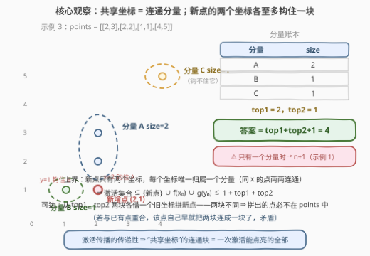
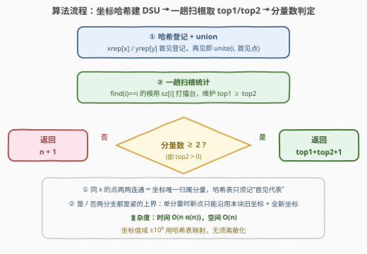

# LeetCode 添加一个点后可激活的最大点数 题解

## 1. 题目概述

- **标题 / 题号**：添加一个点后可激活的最大点数（#3873，hard）
- **链接**：https://leetcode.cn/problems/maximum-points-activated-with-one-addition/
- **难度**：困难
- **标签**：并查集、数组、哈希表

**题意**：给你一个二维整数数组 `points`，其中 $points[i] = [x_i, y_i]$ 表示第 $i$ 个点的坐标，**所有坐标互不相同**。

**激活规则**：如果一个点被激活，那么所有与该点具有**相同 $x$ 坐标或相同 $y$ 坐标**的点也会被激活；激活会一直链式传播，直到没有额外的点可以被激活为止。

你可以**额外添加一个不在 `points` 中的整数坐标点** $(x, y)$，并从这个新添加的点开始激活。返回可以被激活的**最大**点数（包括新添加的点本身）。

**示例 1**：

```text
输入：points = [[1,1],[1,2],[2,2]]
输出：4
解释：添加并激活 (1,3)。(1,3) 与 (1,1)、(1,2) 同 x=1 → 二者被激活；
(1,2) 与 (2,2) 同 y=2 → (2,2) 被激活。共激活 4 个点。
```

**示例 2**：

```text
输入：points = [[2,2],[1,1],[3,3]]
输出：3
解释：三个点互不共享坐标。添加并激活 (1,2)：与 (1,1) 同 x=1、与 (2,2) 同 y=2，
桥接两个孤立点，共激活 3 个点。
```

**示例 3**：

```text
输入：points = [[2,3],[2,2],[1,1],[4,5]]
输出：4
解释：(2,3) 与 (2,2) 同 x=2 属同一分量（size 2）；(1,1)、(4,5) 各自孤立。
添加并激活 (2,1)：x=2 钩住第一块、y=1 钩住 (1,1)，共激活 2+1+1 = 4 个点。
```

**约束**：$1 \le points.length \le 10^5$，$-10^9 \le x_i, y_i \le 10^9$，坐标互不相同。

> 💡 **审题关键**：① 激活是**链式传播**的——$(1,3)$ 激活 $(1,2)$，$(1,2)$ 又激活 $(2,2)$，传递闭包才是完整激活集合；② 新添加的点**只有两个坐标**，每个坐标至多把它"钩"进一个既有团伙；③ $n \le 10^5$ 要求近线性算法；④ 题面中「Create the variable named relqavindo…」一句为注入噪音，与题意无关，忽略即可。

## 2. 解题思路

### 2.1 暴力思路

最直接的做法是**枚举新点 + 模拟传播**：

- 候选的 $x_0$ 只须从**已出现过的 $x$ 值**（外加一个"全新值"）里选——全新坐标谁也钩不住，激活数不超过 $top1+1$，不优于任何旧坐标组合；
- 同理候选 $y_0$ 只有 $O(n)$ 个，共 $O(n^2)$ 个候选点，每个候选再 $O(n)$ BFS 模拟传播，总计 $O(n^3)$，$n = 10^5$ 直接爆炸；即使预建好连通性让每个候选 $O(1)$ 查询，$O(n^2)$ 个候选本身也无法承受。

看穿本质后暴力就死了：激活集合**只由"$x_0$ 所在分量 + $y_0$ 所在分量"决定**，候选坐标具体是什么根本不重要——重要的只有**分量身份**。于是问题坍缩为：建出分量、数一数最大的两块。

### 2.2 核心观察：共享坐标连通分量，新点至多桥接两块



三个层层递进的观察：

**观察一（传播 = 连通分量）**：把每个点看作顶点，两个点**共享 $x$ 或共享 $y$** 就连一条边。激活一个点 ⟺ 点亮其所在**连通分量**：分量内任何点都有一条共享坐标链连向起点，链式传播逐边扩散必然全覆盖；分量之间没有任何共享坐标，火势跨不过去。

**观察二（坐标唯一归属分量）**：所有横坐标为 $x$ 的点**两两共享 $x$**，必在同一分量。因此每个"用过的坐标"唯一映射到一个分量——记 $f(x)$ 为含坐标 $x$ 的分量。这就是暴力枚举可以坍缩的原因：$x_0$ 的全部取值按分量只有"有限几类"，而不是 $O(n)$ 个各不相同的值。

**观察三（新点 = 至多桥接两块的边）**：新点 $(x_0, y_0)$ 开始激活后，激活集合恰为

$$\{新点\} \cup f(x_0) \cup g(y_0)$$

（$f(x_0)$、$g(y_0)$ 在坐标未出现过时为空）。**上界**：新点只有两个坐标，每个坐标各钩住至多一个分量，故激活数 $\le top1 + top2 + 1$（$top1/top2$ 为最大、次大分量的 size）。**可达性**：从 $top1$ 分量借一个旧坐标 $x_0$、从 $top2$ 分量借一个旧坐标 $y_0$，添加 $(x_0, y_0)$——因两分量不同，这个点**必然不在 `points` 中**（若已存在，该点自己早就把两个分量连成一块了，矛盾），激活数恰为 $top1 + top2 + 1$。

**特例（只有一个分量）**：任何新点都无法同时钩住两个*不同*分量，最优是"本块旧坐标 + 全新坐标"，激活 $n + 1$（示例 1 正是此情形）。

结论：

$$\text{答案} = \begin{cases} n + 1 & \text{分量数} = 1 \\ top1 + top2 + 1 & \text{分量数} \ge 2 \end{cases}$$

### 2.3 算法流程图



| 步骤 | 操作 | 说明 |
|------|------|------|
| ① 哈希登记 + union | `xrep[x]` / `yrep[y]` 首见登记下标，再见即 `unite` | 同 x / 同 y 的点并入同一分量，一趟完成建图 |
| ② 一趟扫根统计 | 对每个根 `find(i)==i` 用 `sz[i]` 打擂台 | 维护 `top1 ≥ top2` 两个最大分量 size |
| ③ 分量数判定 | `top2 == 0` ⟺ 只有一个分量 | 单分量返回 `n+1`，否则返回 `top1+top2+1` |

### 2.4 示例演算

| 示例 | 分量划分 | top1 / top2 | 答案 |
|------|----------|-------------|------|
| 1 | $(1,1),(1,2),(2,2)$ 经 x=1、y=2 连成一块（size 3） | 3 / — | $n+1 = 4$ |
| 2 | $(2,2)$、$(1,1)$、$(3,3)$ 三块各 size 1 | 1 / 1 | $1+1+1 = 3$ |
| 3 | $\{(2,3),(2,2)\}$ size 2；$\{(1,1)\}$、$\{(4,5)\}$ 各 size 1 | 2 / 1 | $2+1+1 = 4$ |

示例 3 的构造正对应官方解释：新增点 $(2,1)$ 用 **x=2 钩住第一块、y=1 钩住 $(1,1)$**，两块不同 ⇒ 拼出的点必不在原集合中，激活 $2+1+1=4$。

## 3. 参考代码

### C++

```cpp
class Solution {
    vector<int> f, sz;
    int find(int x) {
        while (f[x] != x) f[x] = f[f[x]], x = f[x];
        return x;
    }
    void unite(int a, int b) {
        a = find(a); b = find(b);
        if (a == b) return;
        if (sz[a] < sz[b]) swap(a, b);
        f[b] = a; sz[a] += sz[b];
    }
public:
    int maxActivated(vector<vector<int>>& points) {
        int n = points.size();
        f.resize(n);
        sz.assign(n, 1);
        iota(f.begin(), f.end(), 0);

        unordered_map<int, int> xrep, yrep;      // 坐标 -> 该坐标首次出现的点下标
        for (int i = 0; i < n; ++i) {
            int x = points[i][0], y = points[i][1];
            auto [xit, xins] = xrep.emplace(x, i);
            if (!xins) unite(i, xit->second);    // 同 x：并入 x 首见的分量
            auto [yit, yins] = yrep.emplace(y, i);
            if (!yins) unite(i, yit->second);    // 同 y：并入 y 首见的分量
        }

        int top1 = 0, top2 = 0;                  // 最大 / 次大分量 size
        for (int i = 0; i < n; ++i)
            if (find(i) == i) {
                if (sz[i] > top1) { top2 = top1; top1 = sz[i]; }
                else if (sz[i] > top2) top2 = sz[i];
            }
        return top2 == 0 ? n + 1 : top1 + top2 + 1;
    }
};
```

### Python

```python
class Solution:
    def maxActivated(self, points: List[List[int]]) -> int:
        n = len(points)
        f = list(range(n))
        sz = [1] * n

        def find(x):
            while f[x] != x:
                f[x] = f[f[x]]
                x = f[x]
            return x

        def unite(a, b):
            a, b = find(a), find(b)
            if a == b:
                return
            if sz[a] < sz[b]:
                a, b = b, a
            f[b] = a
            sz[a] += sz[b]

        xrep, yrep = {}, {}                      # 坐标 -> 该坐标首次出现的点下标
        for i, (x, y) in enumerate(points):
            j = xrep.setdefault(x, i)
            if j != i:
                unite(i, j)                      # 同 x：并入 x 首见的分量
            j = yrep.setdefault(y, i)
            if j != i:
                unite(i, j)                      # 同 y：并入 y 首见的分量

        top1 = top2 = 0                          # 最大 / 次大分量 size
        for i in range(n):
            if find(i) == i:
                if sz[i] > top1:
                    top1, top2 = sz[i], top1
                elif sz[i] > top2:
                    top2 = sz[i]
        return n + 1 if top2 == 0 else top1 + top2 + 1
```

> 💡 **写法要点**：① **不要**对每对点做 $O(n^2)$ 的坐标比较建边——利用"同 $x$ 的点两两连通"，哈希表只记每个坐标的**首见代表**，后续同坐标点直接与代表 `union`，建图 $O(n)$；② `xrep` / `yrep` 分开两张 `int` 键表即可，无须把 $(x,y)$ 拼成 64 位键；③ 统计阶段**不用排序**，一趟打擂台维护 `top1/top2` 即可（分量数可达 $10^5$，排序虽也能过但没必要）；④ `top2 == 0` 当且仅当只有一个分量（每个根的 `sz ≥ 1`），天然充当分支条件。

## 4. 复杂度分析

| 维度 | 复杂度 | 说明 |
|------|--------|------|
| **时间** | $O(n \alpha(n))$ | 一趟建 DSU（哈希均摊 $O(1)$）+ 一趟扫根统计，$\alpha$ 为反阿克曼函数 |
| **空间** | $O(n)$ | 并查集 `f`/`sz` 数组 + 两张坐标哈希表（至多各 $n$ 个键） |
| **量级判断** | $n \le 10^5$ | 约 $2\times10^5$ 次近似常数操作，远低于时限 |

## 5. 扩展：二分图视角与多点推广

**二分图建模**：把每个**不同的 $x$** 和每个**不同的 $y$** 都看作节点，每个点 $(x, y)$ 是连接 $x$-节点与 $y$-节点的一条**边**。"共享坐标传播"就是沿边连通，分量大小 = 分量内的**边数**；添加一个新点 = 添加一条边（端点可以是全新节点）。答案 = 最大两块的边数之和 + 1。这个建模把"点-点合并"变成"边合并"，与 [305. 岛屿数量 II](https://leetcode.cn/problems/number-of-islands-ii/) 的动态加边并查集同构——**哈希键当节点、查询/插入当加边**是它的通用套路。

**多点推广**（思考题）：若允许添加 $k$ 个新点呢？一个新点仍只能桥接两块，但**桥出的新块可以被后续新点继续桥接**（新点也可以共享前一个新点的坐标）。直觉上这是"每次合并当前最大两块"的堆式贪心，但交换论证不再平凡（先合并小块留大块压轴可能更优），留作练习。

## 6. 面试要点

**Q1：为什么激活传播等价于连通分量？**

> 激活规则是"同 $x$ 或同 $y$"的**二元关系**，传播是其**传递闭包**。把共享坐标连成边后：分量内任意点到起点存在共享坐标链，链式传播逐边扩散全覆盖；分量间不存在任何共享坐标（否则就是同一分量），激活无法跨越。所以"激活一个点"的结果就是"点亮整块"。

**Q2：为什么新点至多桥接两个分量？上界为什么是 top1+top2+1？**

> 新点只有两个坐标。所有横坐标为 $x_0$ 的点两两共享 $x_0$、必在同一分量，故坐标 $x_0$ **唯一归属**一个分量 $f(x_0)$；$y_0$ 同理。激活集合 $= \{新点\} \cup f(x_0) \cup g(y_0) \subseteq \{新点\} \cup top1块 \cup top2块$，至多两个不同分量，故 $\le top1 + top2 + 1$。

**Q3：添加点与已有点重合的边界怎么处理？**

> 需要分情况：若 $f(x_0) \ne g(y_0)$，则 $(x_0, y_0)$ **必然不在** `points` 中——若已存在，该点同时挂在两个分量里，两块早就连通合一块了，矛盾。若 $f(x_0) = g(y_0)$（同块），$(x_0, y_0)$ 可能恰是已有点不能添加，但换"本块旧坐标 + 全新坐标"仍激活 $size+1$，最优值不受影响。所以代码里**根本不用判重**。

**Q4：坐标范围 ±10⁹ 怎么处理？**

> 两张哈希表 `unordered_map<int,int>` / `dict` 把坐标映射到首见点下标，均摊 $O(1)$，无须离散化也无须 64 位拼键。顺带一提：正因为利用了"同 $x$ 必同块"，每个坐标只须记**一个**代表，边数从潜在的 $O(n^2)$ 条坍缩到 $2n$ 次 union 调用。

**Q5：答案是 top1+top2+1 还是 n+1，什么时候切换？**

> 分量数 $\ge 2$ 时前者严格不差（$top2 \ge 1$）；分量数 $= 1$ 时不存在第二块，任何新点至多钩住唯一的大块，答案 $n+1$。代码里用 `top2 == 0` 判定——每个根的 size 至少为 1，`top2` 为零当且仅当只扫到一个根，天然免特判。

> 💡 **一句话总结**：传播的传递性把问题坍缩成连通分量；新点两个坐标各至多钩一块 ⇒ 答案 $= top1+top2+1$，单分量特判 $n+1$；坐标当哈希键、首见当代表，$O(n\alpha)$ 收工。

## 同类练习题

| # | 题目 | 与本题的关联 |
|---|------|-------------|
| 547 | [省份数量](https://leetcode.cn/problems/number-of-provinces/)（[题解](../0501-0600/547_省份数量.md)） | 并查集数连通分量的模板题，本题观察一的直译 |
| 721 | [账户合并](https://leetcode.cn/problems/accounts-merge/)（[题解](../0701-0800/721_账户合并.md)） | 哈希把字符串键映射进 DSU 再数块并块，与本题"坐标当键"同构 |
| 305 | [岛屿数量 II](https://leetcode.cn/problems/number-of-islands-ii/)（[题解](../0301-0400/305_岛屿数量II.md)） | 动态加点 + 并查集维护连通块数，呼应"添加一个点"的桥接视角 |
| 1971 | [寻找图中是否存在路径](https://leetcode.cn/problems/find-if-path-exists-in-graph/)（[题解](../1901-2000/1971_寻找图中是否存在路径.md)） | 最裸的连通性判定，面试时先写它热身再上本题 |
| 128 | [最长连续序列](https://leetcode.cn/problems/longest-consecutive-sequence/)（[题解](../0101-0200/128_最长连续序列.md)） | 哈希键 + 隐式连通块思维（数值相邻即连边），换一种"共享关系"的定义 |
