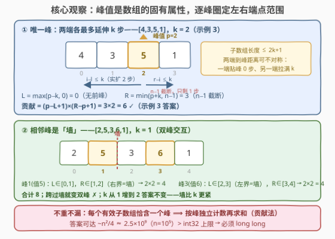
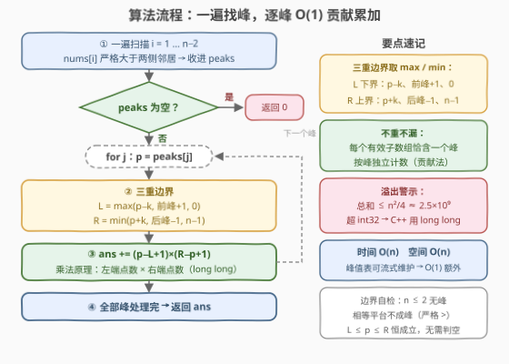

# 具有恰好一个峰值的有效子数组

- **题目名称**：具有恰好一个峰值的有效子数组
- **链接**：[3874. 具有恰好一个峰值的有效子数组](https://leetcode.cn/problems/valid-subarrays-with-exactly-one-peak/)
- **难度**：中等
- **标签**：数组、数学

## 1. 题目概述

> ⚠️ 本题为 LeetCode 付费题，题意描述根据官方示例用例与 hints 重建，可能与官方题面有出入。

**题意**：给定长度为 $n$ 的整数数组 $nums$ 和整数 $k$。**峰值**是 $nums$ 的**固有属性**——与选哪个子数组无关：下标 $i$（$0 < i < n-1$）满足 $nums[i] > nums[i-1]$ 且 $nums[i] > nums[i+1]$ 即为峰值。子数组 $[l, r]$ **有效**当且仅当：

- 它**恰好包含一个**峰值下标 $i$；
- $i - l \le k$ 且 $r - i \le k$（峰值到子数组两端的距离都不超过 $k$）。

返回有效子数组的数目。**子数组**是数组中的连续非空元素序列。

**示例 1**：

```text
输入：nums = [1,3,2], k = 1
输出：4
解释：i = 1 是唯一峰值（3 > 1 且 3 > 2）。有效子数组必须包含下标 1，
且两端到它的距离不超过 1：[3]、[1,3]、[3,2]、[1,3,2]，共 4 个。
```

**示例 2**：

```text
输入：nums = [7,8,9], k = 2
输出：0
解释：单调递增数组没有峰值，答案为 0。
```

**示例 3**：

```text
输入：nums = [4,3,5,1], k = 2
输出：6
解释：i = 2 是唯一峰值（5 > 3 且 5 > 1）。左端点 L ∈ [0,2]、右端点 R ∈ [2,3]，
共 3×2 = 6 个：[5]、[3,5]、[5,1]、[3,5,1]、[4,3,5]、[4,3,5,1]。
```

**约束条件**：

- $1 \le n = nums.length \le 10^5$
- $-10^5 \le nums[i] \le 10^5$
- $1 \le k \le n$

> 💡 **审题关键**：① 峰值按**原数组**定义，与子数组形状无关——单元素子数组 $[3]$ 也能"包含峰值下标 1"（示例 1 的第一个有效子数组正是它）；② 距离约束绑定的是那个**唯一峰值** $i$：子数组长度 $\le 2k+1$，但两端到峰的距离**不必对称**（一端可贴峰 0 步、另一端拉满 $k$ 步）；③ "恰好一个峰值"+"距离 $\le k$" 共同圈定了每个峰的势力范围，这正指向逐峰计数。

---

## 2. 解题思路

### 2.1 暴力思路：枚举所有子数组

一遍扫描得到峰值标记数组后做**前缀和** $pre[i]$（前 $i$ 个位置中的峰值个数），再枚举全部 $O(n^2)$ 个子数组 $[l, r]$：若 $pre[r+1] - pre[l] = 1$，定位这个唯一峰值 $i$（对峰值下标表二分），检查 $i - l \le k$ 与 $r - i \le k$。时间 $O(n^2)$，$n = 10^5$ 时约 $5 \times 10^9$ 次判定，不可行。

> 💡 暴力的浪费在于：固定峰值 $i$ 后，合法左端点是一段**连续区间**、合法右端点是另一段**连续区间**，逐子数组判定把"区间 × 区间"的乘法拆成了逐点枚举。直接算乘积即可。

### 2.2 核心观察：按峰贡献——左右端点各是一段区间，乘法原理数完



**观察一：峰值是原数组的固有属性**。一遍扫描把所有峰值下标收进有序表 $peaks$（严格大于两侧邻居）。子数组"恰好一个峰值" $\iff$ 恰好包含 $peaks$ 中的一个下标。

**观察二：固定唯一峰值 $p$，合法左端点是一段连续区间**。左端点 $l$ 受三重约束：

- **距离**：$l \ge p - k$；
- **不含前一个峰值**：$l \ge prev + 1$（$prev$ 为 $peaks$ 中 $p$ 的前驱；一旦 $l \le prev$，子数组便同时包含 $prev$ 与 $p$ 两个峰，违反"恰好一个"）；
- **数组边界**：$l \ge 0$。

三者取最大：$L = \max(p-k,\ prev+1,\ 0)$，恒有 $L \le p$，故左端点恰有 $p - L + 1$ 种。右端点对称：$R = \min(p+k,\ next-1,\ n-1) \ge p$，恰 $R - p + 1$ 种。由**乘法原理**，以 $p$ 为唯一峰值的有效子数组恰有

$$
(p - L + 1) \times (R - p + 1)
$$

**观察三：按峰求和，不重不漏**。每个有效子数组恰好包含一个峰值，被且仅被它包含的那个峰计数一次；反过来，每个被计数的 $(l, r)$ 都满足三重约束，确实是有效子数组。这正是**贡献法**的标准形态。

> ⚠️ 只需排除**相邻**峰值：$l \ge prev + 1$ 已把所有更左的峰值挡在门外（它们 $< prev < l$，下标有序性自动传递）；右侧同理。相邻者即最紧者。

> ⚠️ **溢出**：答案可达 $\sim n^2/4 \approx 2.5 \times 10^9$（单峰居中、$k = n$ 时取到），超出 `int32` 上限 $2.1 \times 10^9$；C++ 须 `long long` 且乘法前转型（`1LL *`），Python 天然大整数无此虑。

### 2.3 算法流程图



| 步骤 | 操作 | 说明 |
|------|------|------|
| ① 找峰 | 一遍扫描收集 $peaks$ | 严格大于两侧邻居；$n \le 2$ 时表为空，直接返回 0 |
| ② 逐峰 | 计算 $L$ 与 $R$ | 三重下界取 max、三重上界取 min |
| ③ 累加 | $ans \mathrel{+}= (p-L+1) \times (R-p+1)$ | 乘法原理；64 位运算 |
| ④ 返回 | $ans$ | 上界 $\sim n^2/4 \approx 2.5 \times 10^9$ |

### 2.4 示例演算

以 $nums = [2,5,3,6,1]$、$k = 1$ 为例（双峰交互，验证"墙"的作用）：

| 峰值 $p$ | 前峰 / 后峰 | $L = \max(p-k,\ prev{+}1,\ 0)$ | $R = \min(p+k,\ next{-}1,\ n{-}1)$ | 贡献 |
|----------|------------|--------------------------------|------------------------------------|------|
| 1（值 5） | 无 / 3 | $\max(0,\ -,\ 0) = 0$ | $\min(2,\ 2,\ 4) = 2$ | $2 \times 2 = 4$ |
| 3（值 6） | 1 / 无 | $\max(2,\ 2,\ 0) = 2$ | $\min(4,\ -,\ 4) = 4$ | $2 \times 2 = 4$ |

合计 $8$：$[5],[2,5],[5,3],[2,5,3]$ 与 $[6],[3,6],[6,1],[3,6,1]$。注意 $[2,5,3,6]$ 同时包含两个峰、不有效——正是 $L \ge prev+1$ 与 $R \le next-1$ 这两堵"墙"在起作用；且把 $k$ 从 1 放大到 2 答案仍是 8（两峰间距 2，墙比 $k$ 更紧，三重取 min/max 中墙说了算）。

再验算官方示例：$[1,3,2], k{=}1$：峰 1，$L=0$、$R=2$，$2 \times 2 = 4$ ✓；$[4,3,5,1], k{=}2$：峰 2，$L=0$、$R=3$，$3 \times 2 = 6$ ✓；$[7,8,9]$：无峰，$0$ ✓。

---

## 3. 参考代码

### C++

```cpp
class Solution {
public:
    long long validSubarrays(vector<int>& nums, int k) {
        int n = nums.size();
        vector<int> peaks;
        for (int i = 1; i + 1 < n; ++i)
            if (nums[i] > nums[i - 1] && nums[i] > nums[i + 1])
                peaks.push_back(i);

        long long ans = 0;
        for (int j = 0; j < (int)peaks.size(); ++j) {
            int p = peaks[j];
            int L = max(p - k, 0);
            if (j > 0) L = max(L, peaks[j - 1] + 1);
            int R = min(p + k, n - 1);
            if (j + 1 < (int)peaks.size()) R = min(R, peaks[j + 1] - 1);
            ans += 1LL * (p - L + 1) * (R - p + 1);
        }
        return ans;
    }
};
```

### Python

```python
class Solution:
    def validSubarrays(self, nums: List[int], k: int) -> int:
        n = len(nums)
        peaks = [i for i in range(1, n - 1)
                 if nums[i] > nums[i - 1] and nums[i] > nums[i + 1]]

        ans = 0
        for j, p in enumerate(peaks):
            L = max(p - k, peaks[j - 1] + 1 if j > 0 else 0, 0)
            R = min(p + k, peaks[j + 1] - 1 if j + 1 < len(peaks) else n - 1, n - 1)
            ans += (p - L + 1) * (R - p + 1)
        return ans
```

---

## 4. 复杂度分析

| 维度 | 复杂度 | 说明 |
|------|--------|------|
| **时间** | $O(n)$ | 找峰一遍 + 逐峰 $O(1)$ 贡献；暴力版 $O(n^2)$ |
| **空间** | $O(n)$ | 峰值下标表；改为流式维护"前一个峰值"可做到 $O(1)$ 额外空间 |
| **值域 / 溢出** | $n \le 10^5$ | 答案上界 $\sim n^2/4 \approx 2.5 \times 10^9$，超 `int32`；单项乘积同样可达该量级，C++ 必须 `long long` 且乘法前转型 |

---

## 5. 扩展：两个变体

**变体一：$k \ge n$（去掉距离约束）**。三重边界只剩"隔壁峰值"与数组两端，取哨兵 $p_{-1} = -1$、$p_m = n$，答案化为闭式

$$
\sum_{j=0}^{m-1} (p_j - p_{j-1}) \times (p_{j+1} - p_j)
$$

即每个峰独占"前一个峰之后 × 后一个峰之前"的整片区间。

**变体二：改为"至多一个峰值"**。在原答案上再补"零峰值"子数组：相邻峰值之间的无峰空档（含首峰之前、末峰之后两段）是极大无峰连续段，长度为 $g$ 的段贡献 $g(g+1)/2$ 个不含任何峰的子数组。距离约束 $k$ 只绑定唯一峰值、对零峰值子数组无从谈起，故该变体默认同时去掉 $k$。

---

## 6. 面试要点

**Q1：为什么"恰好一个峰值"可以按峰独立计数而不重不漏？**

> 每个有效子数组包含**恰好一个**峰值下标，这个峰唯一确定它的归属；对固定峰 $p$，三重约束（距离、隔壁峰、数组边界）恰好刻画了"以 $p$ 为唯一峰"的全部 $(l, r)$。全体有效子数组按所含峰划分成互不相交的类，每类用乘法原理直接数——这是贡献法的标准形态。

**Q2：为什么只需检查相邻的前驱/后继峰值，而不是所有其他峰值？**

> 峰值下标有序。$l \ge prev + 1 \Rightarrow$ 所有 $< prev$ 的峰也 $< l$，全部被挡在子数组外；右侧同理。约束经有序性自动"传递"，相邻者即最紧者。

**Q3：什么时候"墙"（隔壁峰）比 $k$ 更紧？什么时候相反？**

> 两峰间距 $\le 2k$ 时墙更紧：如 $[2,5,3,6,1]$ 中两峰间距 2，$k \ge 1$ 后墙主导、答案不再随 $k$ 增长；峰稀疏且 $k$ 小时距离主导。$L$、$R$ 的 max/min 正是两类约束的合成——写代码时把三重边界一次取全，无需分类讨论。

**Q4：溢出风险具体在哪里？**

> 单项贡献 $(p-L+1)(R-p+1)$ 在单峰居中、$k = n$ 时约 $n^2/4 \approx 2.5 \times 10^9$，答案总和同量级——都超 `int32`（$\approx 2.1 \times 10^9$）。C++ 中乘法两因子都是 `int`，须先转 `long long`（`1LL *`）再乘，仅在累加时转型已经晚了。

**Q5：峰值定义里的严格大于怎么影响边界情况？**

> 平台不成峰：$[1,3,3,1]$ 中间两个 3 都不满足 $3 > 3$，整段无峰。另外 $n \le 2$ 时 $0 < i < n-1$ 无解，直接返回 0。代码照抄题面比较符即可，勿自作主张改成 $\ge$（语义完全不同：平台会被误判成峰）。

> 💡 **一句话总结**：峰值是原数组的固有属性，先一遍扫描收峰；每个峰的合法左右端点各是一段连续区间（三重边界取 max/min），贡献 = 左端点数 × 右端点数，按峰求和即为答案，$O(n)$ 收工，注意 64 位。

---

## 7. 同类练习题

- [2951. 找出峰值](https://leetcode.cn/problems/find-the-peaks/)（[题解](../2901-3000/2951_找出峰值.md)）：同款"严格大于两侧邻居"的峰值定义，本题找峰步骤的独立练习
- [845. 数组中的最长山脉](https://leetcode.cn/problems/longest-mountain-in-array/)（[题解](../0801-0900/845_数组中的最长山脉.md)）：同样以峰为锚向两侧扩展，求最长而非计数
- [907. 子数组的最小值之和](https://leetcode.cn/problems/sum-of-subarray-minimums/)（[题解](../0901-1000/907_子数组的最小值之和.md)）：贡献法经典——每个元素作为最小值各自管辖一段左右边界，乘出贡献
- [2444. 统计定界子数组的数目](https://leetcode.cn/problems/count-subarrays-with-fixed-bounds/)（[题解](../2401-2500/2444_统计定界子数组的数目.md)）：以关键元素锚定窗口边界来数子数组，与本题"按锚点定界"思想同源
- [2104. 子数组范围和](https://leetcode.cn/problems/sum-of-subarray-ranges/)（[题解](../2101-2200/2104_子数组范围和.md)）：贡献法 + 边界扩张计数的又一实践，体会"逐锚点定界"的通用性
