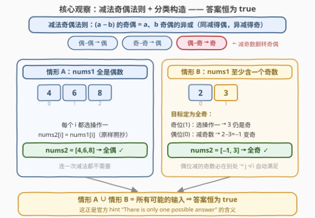
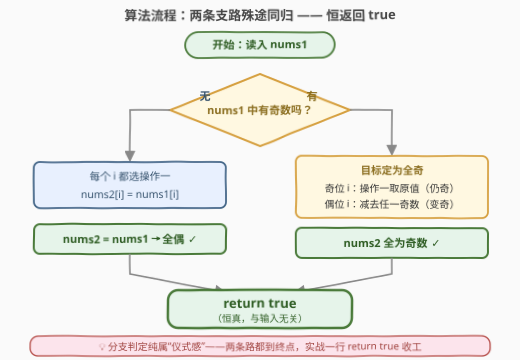

# 构造奇偶一致的数组 I

- **题目名称**：构造奇偶一致的数组 I
- **链接**：[3875. 构造奇偶一致的数组 I](https://leetcode.cn/problems/construct-uniform-parity-array-i/)
- **难度**：简单
- **标签**：数组、数学

## 1. 题目概述

**题意**：给定长度为 $n$、元素**互不相同**的整数数组 `nums1`，需要构造等长数组 `nums2`，使其元素**要么全为奇数、要么全为偶数**。每个下标 $i$ 必须（独立地）从以下两种选择中**任选其一**：

- **操作一**：$nums2[i] = nums1[i]$（原样保留）；
- **操作二**：$nums2[i] = nums1[i] - nums1[j]$，其中 $j \ne i$（$j$ 逐位各自挑选，差可为负）。

能构造出满足条件的 `nums2` 返回 `true`，否则返回 `false`。

**示例 1**：

```text
输入：nums1 = [2,3]
输出：true
解释：nums2[0] = nums1[0] - nums1[1] = 2 - 3 = -1，
      nums2[1] = nums1[1] = 3，
      nums2 = [-1, 3]，两个元素均为奇数。
```

**示例 2**：

```text
输入：nums1 = [4,6]
输出：true
解释：nums2[0] = 4，nums2[1] = 6，
      nums2 = [4, 6]，两个元素均为偶数。
```

**约束条件**：

- $1 \le n = nums1.length \le 100$
- $1 \le nums1[i] \le 100$
- `nums1` 中所有整数互不相同

> 💡 **审题关键**：① 只关心**奇偶性**，不关心具体数值——差可以是负数（示例 1 的 $-1$）；② 每个下标的 $j$ **独立任选**，不是全局共用一个 $j$；③ 「互不相同」在本题几乎不起作用（只保证差非零），它是给加强版 II 的「大小关系」埋的伏笔；④ 官方 hint 直接点破：「There is only one possible answer」——答案与输入无关，**恒为 `true`**。

---

## 2. 解题思路

### 2.1 暴力思路：枚举每个下标的选法

每个下标 $i$ 有 $n$ 种选择：操作一，或减去另外 $n-1$ 个数中的某一个，组合数高达 $n^n$（$n=100$ 时约 $10^{200}$），直接枚举不可行。

改进的暴力：先求每个下标的**可达奇偶集合**

$$S_i = \{p_i\} \cup \{p_i \oplus p_j \mid j \ne i\}, \quad p_k = nums1[k] \bmod 2$$

再判断是否存在统一的目标奇偶 $t \in \{0,1\}$ 使所有 $S_i$ 都包含 $t$，复杂度 $O(n^2)$。但顺着这个集合看下去会发现：$t$ **永远存在**——这正是 2.2 的观察。

### 2.2 核心观察：答案恒为 true（构造证明）



**引理（减法奇偶法则）**：

$$(a - b) \bmod 2 = (a \bmod 2) \oplus (b \bmod 2)$$

因为在模 2 意义下 $-b \equiv b$（$2b \equiv 0$），减法与加法同余。口诀：**同奇偶相减得偶，异奇偶相减得奇**；等价说法——**减偶数不变奇偶，减奇数翻转奇偶**。

于是在奇偶的世界里，只需两种情形的构造：

| 情形 | 构造 | 结果 |
|------|------|------|
| **A：nums1 全是偶数** | 每个下标都选操作一，`nums2 = nums1` | 全偶 ✓ |
| **B：nums1 至少含一个奇数** | 目标定为**全奇**：奇位选操作一（仍奇）；偶位减去任一奇数（偶−奇=奇） | 全奇 ✓ |

情形 B 中，偶位 $i$ 要减的奇数必然存在于**别的下标**（$nums1[i]$ 是偶数，奇数不在 $i$ 处），$j \ne i$ 自动满足。两种情形穷尽一切输入，故：

> ⚠️ **答案恒为 `true`**——代码只需 `return true`。官方 hint「There is only one possible answer」说的就是这件事。

> 💡 **为什么目标定「全奇」而不是「全偶」？** 反例：`nums1 = [1,2,4]` 恰有一个奇数，奇位 $1$ 想变偶必须「减奇」，但唯一的奇数就是它自己（$j \ne i$ 排除）——全偶不可达；而全奇在「至少含一个奇数」时永远可达。证明恒真式的技巧：**选一个任何情形下都构造得出的目标**。

### 2.3 算法流程图



| 步骤 | 操作 | 说明 |
|------|------|------|
| ① 判定 | `nums1` 中是否存在奇数 | 唯一「像样」的分支 |
| ② 情形 A | 全选操作一，`nums2 = nums1` | 全偶 |
| ③ 情形 B | 奇位操作一、偶位减任一奇数 | 全奇 |
| ④ 返回 | `return true` | 两条支路殊途同归 |

### 2.4 示例演算

- **示例 1** `nums1 = [2,3]`：含奇数（3），走情形 B。下标 0（偶 2）：$2 - 3 = -1$ 奇；下标 1（奇 3）：操作一取 $3$。`nums2 = [-1, 3]` 全奇 ✓
- **示例 2** `nums1 = [4,6]`：无奇数，走情形 A。全选操作一，`nums2 = [4,6]` 全偶 ✓
- **补充** `nums1 = [1,2,4]`（自造）：恰一个奇数。全偶不可达（见 2.2 反例）；全奇可行：$[1,\ 2-1,\ 4-1] = [1,1,3]$ ✓——这也解释了构造目标为何选「全奇」。

---

## 3. 参考代码

### C++

```cpp
class Solution {
public:
    bool uniformArray(vector<int>& nums1) {
        return true;    // 构造证明见 2.2：情形 A/B 穷尽一切输入
    }
};
```

### Python

```python
class Solution:
    def uniformArray(self, nums1: List[int]) -> bool:
        return True  # 构造证明见 2.2：情形 A/B 穷尽一切输入
```

> 💡 **面试建议**：直接 `return true` 之前，先能口头给出 2.2 的构造证明。若想「眼见为实」，可写一个**实际构造并验证**的版本，把证明逐字翻译成代码：

```python
class Solution:
    def uniformArray(self, nums1: List[int]) -> bool:
        odd = next((j for j, x in enumerate(nums1) if x % 2 == 1), -1)
        if odd == -1:                       # 情形 A：全偶，原样照抄
            nums2 = nums1[:]
        else:                               # 情形 B：含奇，目标全奇
            nums2 = [x if x % 2 == 1 else x - nums1[odd] for x in nums1]
        return len({x % 2 for x in nums2}) == 1
```

（构造版 $O(n)$，可用于对拍自证恒真。）

---

## 4. 复杂度分析

| 维度 | 复杂度 | 说明 |
|------|--------|------|
| **时间** | $O(1)$ | 不读数据直接返回；构造验证版 $O(n)$ |
| **空间** | $O(1)$ | 一行返回无辅助结构；构造版需 $O(n)$ 存 `nums2` |
| **量级** | $n \le 100$ | 一行代码，微秒级 |

---

## 5. 扩展：3876 构造奇偶一致的数组 II

加强版 II 加了一条致命约束：**操作二要求 $nums1[i] - nums1[j] \ge 1$**，即减数必须**严格更小**（差不能为负），且 $n$ 放大到 $10^5$、值域到 $10^9$。自由度被抽掉后答案**不再恒真**——例如 `[2,3]` 在 II 中是 `false`（$2-3=-1<1$ 无法翻转，$3-2=1$ 仍是奇）。

解法骨架与本题一脉相承：减奇翻转、减偶不变的法则不变；翻转奇偶必须减**更小的奇数**，因此「最小奇数」是所有需要翻转的下标共享的最优减数。分别假设目标为全偶/全奇，逐位判定「保留（操作一）或翻转（减最小奇数）」是否可行，$O(n)$ 收工。

---

## 6. 面试要点

**Q1：为什么答案恒为 true？**

> 引理 $(a-b) \bmod 2 = (a \bmod 2) \oplus (b \bmod 2)$（减奇翻转、减偶不变）。全偶输入 → 全选操作一得全偶；含奇输入 → 奇位操作一保留、偶位减任一奇数翻转，得全奇。两情形穷尽一切输入，构造总是成功。

**Q2：为什么构造目标选「全奇」而不是「全偶」？**

> 全偶不恒可行：恰有一个奇数时（如 `[1,2,4]`），该奇位想变偶必须减另一个奇数，但不存在——只能维持奇。全偶仅在「无奇数」或「奇数 ≥ 2 个」时可行；而「至少含一个奇数」时全奇恒可行。两目标拼起来恰好覆盖所有输入。

**Q3：「互不相同」这个条件在本题起什么作用？**

> 几乎没有——它只保证操作二的差非零，而奇偶性对差是否为零不敏感。它的真正价值在 II 版本：配合「差 ≥ 1」约束，最小奇数成为唯一值得考虑的减数。识别「烟雾弹条件」是读题的基本功。

**Q4：$n=1$ 的边界怎么处理？**

> 单元素数组天然「全奇或全偶」，且操作二不可用（无 $j \ne 0$），`nums2 = nums1` 即合法。构造证明对 $n=1$ 依然成立（含奇 → 操作一全奇；全偶 → 操作一全偶），无需特判。

**Q5：如何识破「答案恒定」型题目？**

> 小规模打表：写个暴力（枚举全部选法或可达奇偶集合）跑随机数据，发现输出清一色 `true`，就转向找不变量/构造证明。同款套路：292 Nim 游戏（$n \bmod 4 \ne 0$ 恒赢）、319 灯泡开关（恒为 $\lfloor\sqrt{n}\rfloor$）。

> 💡 **一句话总结**：减奇翻转、减偶不变 ⇒ 全偶照抄、含奇造全奇——两行分类讨论穷尽所有输入，答案恒 `true`。

---

## 7. 同类练习题

- [3876. 构造奇偶一致的数组 II](https://leetcode.cn/problems/construct-uniform-parity-array-ii/)：本题加强版——差须 $\ge 1$，答案不再恒真，需用「最小奇数」做减数逐位判定
- [292. Nim 游戏](https://leetcode.cn/problems/nim-game/)（[题解](../0201-0300/292_Nim游戏.md)）：同为「答案由简单不变量唯一决定」的打表发现型题目
- [319. 灯泡开关](https://leetcode.cn/problems/bulb-switcher/)：经典恒定答案 $\lfloor\sqrt{n}\rfloor$，同样靠不变量证明
- [922. 按奇偶排序数组 II](https://leetcode.cn/problems/sort-array-by-parity-ii/)（[题解](../0901-1000/922_按奇偶排序数组II.md)）：按奇偶槽位要求重排数组的构造题
- [1486. 数组异或操作](https://leetcode.cn/problems/xor-operation-in-an-array/)（[题解](../1401-1500/1486_数组异或操作.md)）：数组构造 + 按奇偶分类的闭式化简
