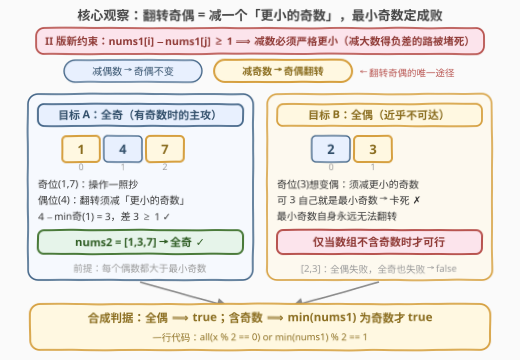
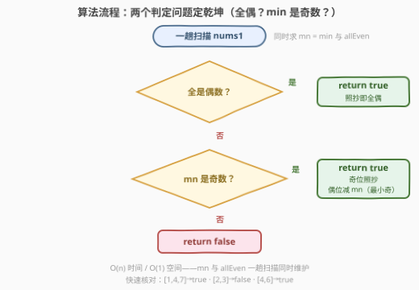

# LeetCode 构造奇偶一致的数组II 题解

## 1. 题目概述

- **标题 / 题号**：构造奇偶一致的数组II（#3876，medium）
- **链接**：https://leetcode.cn/problems/construct-uniform-parity-array-ii/
- **难度**：中等
- **标签**：数组、数学

**题意**：给定长度为 $n$、元素**互不相同**的整数数组 `nums1`，需要构造等长数组 `nums2`，使其元素**要么全为奇数、要么全为偶数**。每个下标 $i$ 必须（独立地）从以下两种选择中**任选其一**：

- **操作一**：$nums2[i] = nums1[i]$（原样保留）；
- **操作二**：$nums2[i] = nums1[i] - nums1[j]$，其中 $j \ne i$ 且 $nums1[i] - nums1[j] \ge 1$（**差必须为正**，即减数严格更小）。

能构造出满足条件的 `nums2` 返回 `true`，否则返回 `false`。

**示例 1**：

```text
输入：nums1 = [1,4,7]
输出：true
解释：nums2[0] = nums1[0] = 1，
      nums2[1] = nums1[1] - nums1[0] = 4 - 1 = 3，
      nums2[2] = nums1[2] = 7，
      nums2 = [1, 3, 7]，所有元素均为奇数。
```

**示例 2**：

```text
输入：nums1 = [2,3]
输出：false
解释：无法构造出满足所有元素奇偶性相同的 nums2。
```

**示例 3**：

```text
输入：nums1 = [4,6]
输出：true
解释：nums2 = [4, 6]，所有元素均为偶数。
```

**约束**：

- $1 \le n = nums1.length \le 10^5$
- $1 \le nums1[i] \le 10^9$
- `nums1` 中所有整数互不相同

> 💡 **审题关键**：① 与前作 [3875](3875_构造奇偶一致的数组I.md) 的唯一区别是操作二要求**差 $\ge 1$**——减数必须严格更小，I 版「减大数得负差照样翻转奇偶」的走法被封死，**答案不再恒真**；② 每个下标的 $j$ **独立任选、可重复使用**，没有「每个 $j$ 只能用一次」的限制；③ 只关心奇偶性，不关心差的具体数值（只要 $\ge 1$）。

## 2. 解题思路

### 2.1 暴力思路：枚举选法 → 可达奇偶集合

每个下标 $i$ 有 $n$ 种选择（操作一，或减去另外 $n-1$ 个数之一），总组合数 $n^n$（$n = 10^5$ 时是天文数字），直接枚举不可行。

改进：仿照 I 版，先求每个下标的**可达奇偶集合**

$$S_i = \{p_i\} \cup \{p_i \oplus p_j \mid j \ne i,\ nums1[j] < nums1[i]\}, \quad p_k = nums1[k] \bmod 2$$

（注意与 I 版的差别：差 $\ge 1$ 把 $j$ 的范围限制为 $nums1[j] < nums1[i]$。）再判断是否存在目标 $t \in \{0, 1\}$ 落在所有 $S_i$ 中，复杂度 $O(n^2)$，$n = 10^5$ 仍会超时。但观察 $S_i$ 的结构会发现它**至多两个元素**，且第二个元素是否存在只取决于「有没有更小的奇数」——这正是 2.2 的切入点。

### 2.2 核心观察：翻转奇偶 = 减「更小的奇数」，最小奇数定乾坤



**引理一（减法奇偶法则）**：$(a - b) \bmod 2 = (a \bmod 2) \oplus (b \bmod 2)$，口诀**同减得偶、异减得奇**，等价说法——**减偶不变、减奇翻转**。因此想改变某个元素的奇偶性，**只有「减去一个奇数」一条路**（减偶数是无效操作，不如照抄）。

**引理二（差 $\ge 1$ ⟹ 减数严格更小）**：操作二只能减**比自己小**的数，且互不相同保证差 $\ge 1$ 自动成立。

**引理三（最小奇数是公共最优减数）**：元素 $nums1[i]$ 能翻转奇偶 ⟺ 存在奇数 $nums1[j] < nums1[i]$（$j \ne i$）。由**互不相同**，这等价于 $nums1[i] > \text{minOdd}$（最小奇数）——若 $nums1[i] > \text{minOdd}$，则取到最小奇数的下标 $j$ 必满足 $j \ne i$（值不等）。若可行，直接减 $\text{minOdd}$ 即可：减哪个奇数都是翻转，而减最小值让差最大、最稳妥。**只需判断可行性，无需纠结减哪个。**

据此对两个目标分别判定：

| 目标 | 免变换的位置 | 必须翻转的位置 | 可行条件 |
|------|------------|--------------|---------|
| **全奇** | 奇位（照抄） | 每个偶位须 $> \text{minOdd}$ | 无偶数，或 $\text{minOdd} < \text{minEven}$ |
| **全偶** | 偶位（照抄） | 每个奇位须 $> \text{minOdd}$ | **无奇数**（最小奇数自身永远卡死） |

**合成判据**：

- 全偶数组 → 目标全偶，照抄即可，`true`；
- 含奇数时全偶方案**必败**（最小奇数无处借力），只剩全奇方案，其条件「每个偶数 $> \text{minOdd}$」在存在偶数时即 $\text{minOdd} < \text{minEven}$，恰好等价于「**全局最小值是奇数**」；无偶数（全奇）时 $\min$ 天然为奇，同样被覆盖。

> ⚠️ **一行判据**：答案 = `nums1` 全为偶数 **或** $\min(nums1)$ 为奇数。

### 2.3 算法流程图



| 步骤 | 操作 | 说明 |
|------|------|------|
| ① 扫描 | 一趟求 $\min$ 并检查是否全偶 | 两个量同时维护 |
| ② 判据一 | 全是偶数？ | 照抄得全偶，直接 `true` |
| ③ 判据二 | $\min$ 是奇数？ | 奇位照抄、偶位减 $\min$（即最小奇数）得全奇 |
| ④ 返回 | 两个判据都否 | 两种目标都构造不出，`false` |

### 2.4 示例演算

- **示例 1** `[1,4,7]`：$\min = 1$ 为奇 → `true`。构造：奇位 $1, 7$ 照抄；偶位 $4 - 1 = 3$（差 $3 \ge 1$ ✓）→ `nums2 = [1,3,7]` 全奇 ✓
- **示例 2** `[2,3]`：$\min = 2$ 为偶且非全偶 → `false`。全奇：偶位 $2$ 需要比它小的奇数，唯一奇数 $3$ 太大 ✗；全偶：奇位 $3$ 想变偶须减更小奇数，它自己就是最小奇数 ✗。
- **示例 3** `[4,6]`：全偶 → `true`。照抄 `nums2 = [4,6]` ✓
- **补充** `[3,2,9]`（自造）：$\min = 2$ 为偶且非全偶 → `false`。全奇：$2$ 需要更小奇数（最小奇数 $3 > 2$）✗；全偶：最小奇数 $3$ 卡死 ✗。

## 3. 参考代码

### C++

```cpp
class Solution {
public:
    bool uniformArray(vector<int>& nums1) {
        int mn = nums1[0];
        bool allEven = true;
        for (int x : nums1) {
            mn = min(mn, x);
            if (x & 1) allEven = false;
        }
        return allEven || (mn & 1);   // 全偶照抄；或最小值为奇 → 全奇方案
    }
};
```

### Python

```python
class Solution:
    def uniformArray(self, nums1: list[int]) -> bool:
        return all(x % 2 == 0 for x in nums1) or min(nums1) % 2 == 1
```

> 💡 **眼见为实**：想实际验证构造而非只判真假，可按 2.2 的方案显式生成 `nums2` 再检查（对拍自证）：

```python
class Solution:
    def uniformArray(self, nums1: list[int]) -> bool:
        if all(x % 2 == 0 for x in nums1):
            nums2 = nums1[:]                          # 目标全偶：照抄
        else:
            mn = min(nums1)
            if mn % 2 == 0:
                return False                          # 最小值非奇 → 全奇方案也不可行
            nums2 = [x if x % 2 == 1 else x - mn for x in nums1]   # 目标全奇
        return len({x % 2 for x in nums2}) == 1
```

## 4. 复杂度分析

| 维度 | 复杂度 | 说明 |
|------|--------|------|
| **时间** | $O(n)$ | 一趟扫描同时求 $\min$ 与判断全偶 |
| **空间** | $O(1)$ | 仅维护两个标量；构造版需 $O(n)$ 存 `nums2` |
| **量级** | $n \le 10^5$，$nums1[i] \le 10^9$ | `int` 即可容纳（$< 2^{31}$），无溢出风险 |

## 5. 扩展：最小偶数是「烟雾弹」

官方 hint 之二提到「Use the smallest odd/even element」，但整个推导中**最小偶数从未登场**：减偶数不改变奇偶，任何目标下都不需要用它来翻转；而「减偶数但奇偶不变」又不如操作一照抄来得直接。真正参与判定的只有**最小奇数**——它是所有需要翻转的位置共享的唯一候选减数。

再看与前作 I 版（3875）的对比：差可为负时，数组里只要有奇数，**任何位置**都能翻转（减一个更大的数也行），故答案恒 `true`；II 版把减数限制为「严格更小」后，「最小奇数」成为全局瓶颈——一条小小的约束，把恒真构造题变成了真正的判定题。这也提示我们：**遇到加强版先 diff 约束，再判断旧结论的哪一环被破坏**。

## 6. 面试要点

**Q1：II 版与 I 版的本质区别是什么？**

> 差 $\ge 1$ 封死了「减大数得负差」的翻转路径。I 版中只要数组含奇数，任何位置都能翻转（奇偶性只看异或、不看符号），故恒 `true`；II 版中翻转必须减**严格更小的奇数**，「最小奇数」成为瓶颈，答案退化为「全偶 ∨ $\min$ 为奇数」。

**Q2：为什么翻转奇偶只有「减奇数」一条路？**

> 模 2 意义下 $-b \equiv b$（$2b \equiv 0$），减法与加法同余：减偶数奇偶不变，减奇数翻转。因此需要变奇的偶位、想变偶的奇位，都必须减去更小的奇数；减偶数对奇偶目标是无效操作。

**Q3：为什么全偶方案几乎不可行？**

> 含奇数时，每个奇位都必须减一个更小的奇数才能变偶，而**最小奇数**自身找不到更小的奇数——必然卡死。所以全偶仅在数组**不含奇数**（无需任何变换）时成立。

**Q4：判据为何能合并成「全偶 ∨ $\min$ 为奇数」？**

> 含奇数时全偶必败，只剩全奇方案：每个偶数 $> \text{minOdd}$ ⟺ $\text{minOdd} < \text{minEven}$ ⟺ 全局最小值是奇数。全奇数组（无偶数）时 $\min$ 天然为奇，也被该条件覆盖；再并上「全偶」情形即完整判据。

**Q5：$j$ 可以重复使用吗？$n = 1$ 怎么办？**

> 题目对 $j$ 没有使用次数限制，各下标独立决策——多个偶位可以都减同一个最小奇数。$n = 1$ 时操作二不可用（无 $j \ne 0$），单元素天然「全奇或全偶」，恒 `true`：若该元素为奇则 $\min$ 为奇，若为偶则全偶，判据自动覆盖，无需特判。

> 💡 **一句话总结**：减奇翻转、减偶不变，差 $\ge 1$ 逼你减更小的奇数——**全偶照抄，含奇看最小值是不是奇数**，一趟扫描收工。

## 同类练习题

| # | 题目 | 与本题的关联 |
|---|------|-------------|
| 3875 | [构造奇偶一致的数组 I](https://leetcode.cn/problems/construct-uniform-parity-array-i/)（[题解](3875_构造奇偶一致的数组I.md)） | 前作——差可为负时答案恒 `true` 的构造证明，与本题恰好构成约束 diff 的对照 |
| 3854 | [使数组奇偶交替的最少操作](https://leetcode.cn/problems/minimum-operations-to-make-array-parity-alternating/)（[题解](3854_使数组奇偶交替的最少操作.md)） | 同为「奇偶目标 + 减法变换」的构造判定题 |
| 922 | [按奇偶排序数组 II](https://leetcode.cn/problems/sort-array-by-parity-ii/)（[题解](../0901-1000/922_按奇偶排序数组II.md)） | 按奇偶槽位要求重排数组，奇偶性判定的经典构造 |
| 905 | [按奇偶排序数组](https://leetcode.cn/problems/sort-array-by-parity/)（[题解](../0901-1000/905_按奇偶排序数组.md)） | 奇偶分区双指针，与本题同为「只关心奇偶、不关心数值」 |
| 1550 | [存在连续三个奇数的数组](https://leetcode.cn/problems/three-consecutive-odds/)（[题解](../1501-1600/1550_存在连续三个奇数的数组.md)） | 一趟扫描统计奇偶性的轻量判定题 |
