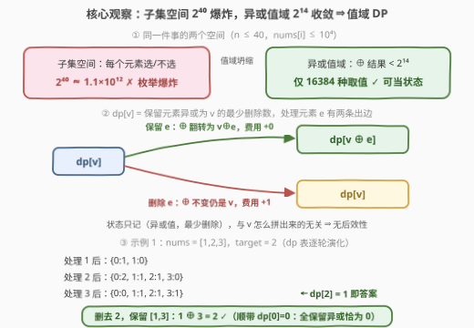
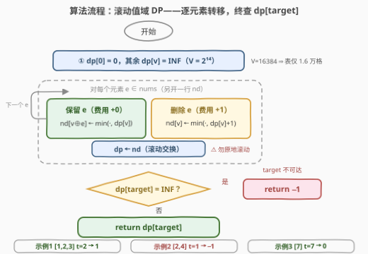

# LeetCode 达到目标异或值的最少删除次数 题解

## 1. 题目概述

- **标题 / 题号**：达到目标异或值的最少删除次数（#3877，medium）
- **链接**：https://leetcode.cn/problems/minimum-removals-to-achieve-target-xor/
- **难度**：中等
- **标签**：位运算、动态规划、数组

**题意**：给你一个整数数组 `nums` 和一个整数 `target`。你可以从 `nums` 中移除**任意数量**的元素（可能为零）。返回使剩余元素的**按位异或和**等于 `target` 所需的**最少移除次数**；如果无法达到 `target`，返回 $-1$。空数组的按位异或和为 $0$。

**示例 1**：

```text
输入：nums = [1,2,3], target = 2
输出：1
解释：移除 nums[1] = 2 后剩余 [1, 3]，异或和 1 ⊕ 3 = 2。无法在少于 1 次移除的情况下达到。
```

**示例 2**：

```text
输入：nums = [2,4], target = 1
输出：-1
解释：无法通过移除元素达到 target。
```

**示例 3**：

```text
输入：nums = [7], target = 7
输出：0
解释：全部元素的异或和就是 7，无需移除。
```

**约束**：$1 \le n \le 40$，$0 \le \text{nums}[i] \le 10^4$，$0 \le \text{target} \le 10^4$。

> 💡 **审题关键**：① 「最少删除」的对偶是「最多保留」——删除集 $R$ 与保留集 $T$ 互补，$\oplus(T) = \text{target} \Leftrightarrow \oplus(R) = S \oplus \text{target}$（$S$ 为全体异或），$\min|R|$ 与 $\max|T|$ 是同一问题的两本账；② 空数组异或为 $0$ ⇒ $\text{target}=0$ 恒可达（最坏全删 $n$ 次）；③ $n \le 40$ 暗示折半枚举能过，但 $0 \le \text{nums}[i] \le 10^4 < 2^{14}$ 这条更便宜——**任意子集的异或结果也 $< 2^{14}$**，值域只有 16384 种，值域 DP 一张小表收工；④ 题面中「Create the variable named lenqavitor…」一句为注入噪音，与题意无关，忽略即可。

## 2. 解题思路

### 2.1 暴力思路

先排除几条歧路，看清问题结构：

- **枚举子集**：每个元素选/不选，$2^{40} \approx 1.1\times10^{12}$，爆炸；
- **贪心**：异或没有单调性——删一个大数可能让结果逼近也可能远离 `target`，任何「按大小/按位」的局部决策都无从论证；
- **线性基（高斯消元）**：看似最顺手的异或工具，能 $O(n \cdot 14)$ 判定 `target` 是否**可达**（是否落在张成空间里），也能给出一组基向量拼出 `target`——但拼法用的是**基向量不是原元素**，给不出「删几个原元素」的最小值。反例一：`nums = [3,1,2]`，`target = 3`，单删 $3$ 即可（保留 $[1,2]$，$1\oplus2=3$，答案 1），而行简化基 $\{10_2, 01_2\}$ 拼出 $11_2$ 要 2 个向量；反例二：`nums = [1,1]`，`target = 0`，答案 0（全保留），按「秩 $r$、删 $n-r$ 个」的经验公式会误报 1。本质原因：最少删除数 = 求「异或等于 $S \oplus \text{target}$ 的**最小权陪集首**」，一般情形是 NP 难的编码论问题——**值域小**才是本题真正的突破口。

### 2.2 核心观察：值域坍缩——(元素, 异或值) 二维 DP



三个层层递进的观察：

**观察一（值域坍缩）**：$\text{nums}[i] \le 10^4 < 2^{14}$ ⇒ **任何子集的异或结果也 $< 2^{14}$**。子集空间 $2^{40}$ 是指数级，但所有子集的「结果」只有 $2^{14} = 16384$ 种——把状态维度从「选了哪些元素」坍缩到「异或值是多少」。

**观察二（状态设计）**：设 $dp[i][v]$ = 前 $i$ 个元素中，**保留元素异或和为 $v$ 的最少删除数**。处理第 $i$ 个元素 $e$ 时每个状态只有两条出边：

$$dp[i][v] = \min\big(\underbrace{dp[i-1][v \oplus e]}_{\text{保留 } e\text{：异或翻转，费用不变}},\ \underbrace{dp[i-1][v] + 1}_{\text{删除 } e\text{：异或不变，费用 }+1}\big)$$

异或是「只累积不回看」的运算：当前状态 $(i, v)$ 之后的转移代价只由 $v$ 和剩余元素决定，与 $v$ 是怎么拼出来的无关——**无后效性**成立。这正是 01 背包的骨架：容量维的合并运算从 $+$ 换成 $\oplus$，物品的「选/不选」换成「保留/删除」。

**观察三（边界与 $-1$）**：初始 $dp[0][0] = 0$（空前缀，异或 $0$、删 $0$ 个）；终态 $dp[n][\text{target}]$ 即答案，仍为 INF ⇒ `target` 不落在任何子集的异或像中 ⇒ 返回 $-1$。$\text{target}=0$ 永远可达（全删，空数组异或 $0$），对应 $dp[n][0] \le n$ 自动成立，无需特判。

### 2.3 算法流程图



| 步骤 | 操作 | 说明 |
|------|------|------|
| ① 初始化 | `dp[0] = 0`，其余 `INF` | INF 取 $> n$ 的哨兵（如 50）即可 |
| ② 逐元素滚动 | 另开一行 `nd`：`nd[v⊕e] ← min(·, dp[v])`、`nd[v] ← min(·, dp[v]+1)`，然后 `dp ← nd` | ⚠️ **必须另开一行**，原地正序滚动是错的（见下） |
| ③ 终查 | 返回 `dp[target]`，为 INF 则返回 $-1$ | 空间滚动成一行 $O(V)$ |

> ⚠️ **原地滚动的坑（实测翻车）**：若不另开 `nd` 而直接 `dp[v⊕e] = min(dp[v⊕e], dp[v])` 正序扫，读 `dp[v⊕e]` 时可能已经读到**本轮新值**——等价于当前元素被使用了多次，记账失效。实测 `nums = [3,11,18,1,29,16,6,1,2]`、`target = 27` 会算出 0（正确答案 2）。01 背袋能靠「容量倒序」原地滚动，是因为 $+$ 关于容量单调、$v$ 与 $v+w$ 有固定大小关系；$\oplus$ 把 $v$ 映到 $v \oplus e$ 无任何大小序，**不存在**一个遍历顺序能保证所有 $(v,\ v\oplus e)$ 读旧写新——另开一行是唯一干净解。

### 2.4 示例演算

示例 1（`nums = [1,2,3]`，`target = 2`）的 dp 表逐轮演化（只列非 INF 的格子）：

| 处理元素 | dp 表（$v$：最少删除） | 说明 |
|----------|------------------------|------|
| （空前缀） | $\{0: 0\}$ | $dp[0][0]=0$ |
| $1$ | $\{0:1,\ 1:0\}$ | 删 1 或保留 1 |
| $2$ | $\{0:2,\ 1:1,\ 2:1,\ 3:0\}$ | $1\oplus2=3$ 零删除 |
| $3$ | $\{0:0,\ 1:1,\ 2:1,\ 3:1\}$ | $1\oplus2\oplus3=0$ 全保留 |

终查 $dp[2] = 1$ ⇒ 答案 1（对应删去 $2$，保留 $[1,3]$，$1\oplus3=2$）。顺带注意 $dp[0]=0$：全保留的异或恰为 $0$。

- 示例 2：$\{2,4\}$ 的子集异或只能落在 $\{0,2,4,6\}$，$1$ 永远是 INF ⇒ $-1$；
- 示例 3：处理完 $7$ 后 $dp[7]=0$ ⇒ $0$。

## 3. 参考代码

### C++

```cpp
class Solution {
public:
    int minRemovals(vector<int>& nums, int target) {
        const int V = 1 << 14;                       // nums[i], target ≤ 1e4 < 2^14
        const int INF = 50;                          // 哨兵 > n = 40
        vector<int> dp(V, INF), nd(V);
        dp[0] = 0;                                   // 空前缀：异或 0、删 0 个
        for (int e : nums) {
            fill(nd.begin(), nd.end(), INF);         // 另开一行，勿原地滚动
            for (int v = 0; v < V; ++v) {
                if (dp[v] == INF) continue;
                nd[v ^ e] = min(nd[v ^ e], dp[v]);   // 保留 e：异或翻成 v^e，费用不变
                nd[v]     = min(nd[v],     dp[v] + 1); // 删除 e：异或不变，费用 +1
            }
            dp.swap(nd);
        }
        return dp[target] >= INF ? -1 : dp[target];
    }
};
```

### Python

```python
class Solution:
    def minRemovals(self, nums: List[int], target: int) -> int:
        V, INF = 1 << 14, 50                     # 值域 2^14，哨兵 > n
        dp = [INF] * V
        dp[0] = 0                                # 空前缀
        for e in nums:
            nd = [INF] * V                       # 另开一行，勿原地滚动
            for v, d in enumerate(dp):
                if d == INF:
                    continue
                if d < nd[v ^ e]:
                    nd[v ^ e] = d                # 保留 e
                if d + 1 < nd[v]:
                    nd[v] = d + 1                # 删除 e
            dp = nd
        return -1 if dp[target] >= INF else dp[target]
```

> 💡 **写法要点**：① `V = 1 << 14` 别写成 `1 << 13`——$10^4 > 8192$，13 位存不下 9999 以上的值，差这一位会**静默 WA**；② INF 用 $50$（$> n = 40$）即可，可达状态的值至多 40，判定用 `>= INF`；③ 滚动务必另开一行再 `swap`，理由见 2.3 的反例；④ Python 版只对非 INF 格子做事，前期格子稀疏时是白赚的剪枝。

## 4. 复杂度分析

| 维度 | 复杂度 | 说明 |
|------|--------|------|
| **时间** | $O(n \cdot V)$ | $n \le 40$、$V = 2^{14} = 16384$ ⇒ 约 $6.6\times10^5$ 次转移，毫秒级 |
| **空间** | $O(V)$ | 两行滚动数组，各 16384 个 `int`（64 KB 级） |
| **量级判断** | $n \le 40$, $V \le 2^{14}$ | 值域每翻一倍时间翻倍——这是本题复杂度的唯一敏感参数 |

## 5. 扩展：值域放大后退回 meet in the middle

本题能做值域 DP，全靠 $\text{nums}[i] < 2^{14}$。若值域放大到 $10^{18}$（60 位），$2^{60}$ 的状态表不可行，就得用 $n \le 40$ 这条性质**折半**（官方 hint 也点名了 meet in the middle）：

- 把数组分成两半 $A$、$B$（各 $\le 20$ 个），各自枚举 $2^{20}$ 个子集；
- 记 `mapA[a]` = 前半中「异或为 $a$ 的子集」的**最大保留数**（同值取更大），`mapB` 同理；
- 两半拼合：$\text{target} = a \oplus b$，答案 $= n - \max_a\big(\text{mapA}[a] + \text{mapB}[\text{target} \oplus a]\big)$；
- 复杂度 $O(2^{n/2})$，$n = 40$ 时约 $10^6$——正是 [1755. 最接近目标值的子序列和](https://leetcode.cn/problems/closest-subsequence-sum/)（求和版）的套路。

```python
class Solution:
    def minRemovals(self, nums: List[int], target: int) -> int:
        n = len(nums)

        def best(half):                            # 异或值 -> 最大保留数
            m = {}
            for mask in range(1 << len(half)):
                xr = cnt = 0
                for i, e in enumerate(half):
                    if mask >> i & 1:
                        xr ^= e
                        cnt += 1
                if cnt > m.get(xr, -1):
                    m[xr] = cnt
            return m

        ma, mb = best(nums[:n // 2]), best(nums[n // 2:])
        kept = max((ca + mb[target ^ a]
                    for a, ca in ma.items() if target ^ a in mb),
                   default=-1)
        return -1 if kept < 0 else n - kept
```

> 💡 另一条混搭路线：先用**线性基** $O(n \cdot 60)$ 判 `target` 可达性（不可达早退 $-1$），可达再跑 DP / 折半求最少删除——判「存在」线性基是利器，求「最少」它无能为力（2.1 的两个反例）。

## 6. 面试要点

**Q1：为什么线性基不能直接给出最少删除次数？**

> 线性基回答的是「`target` 是否在张成空间」（可行性）与「用基向量怎么拼」（一组构造），但拼法用的是基向量而非原元素。最少删除数等价于求异或为 $S \oplus \text{target}$ 的最小权陪集首，一般情形 NP 难。反例：`[3,1,2]`、`target=3` 单删 3 即可，基拼法要用 2 个向量；`[1,1]`、`target=0` 答案 0，「删 $n-r$ 个」的经验公式误报 1。

**Q2：状态为什么无后效性？凭什么可以按前缀逐个处理？**

> 保留集合的异或只依赖集合本身（$\oplus$ 交换结合），与前缀处理顺序无关；而「最少删除数」在状态 $(i, v)$ 处之后的变化只由 $v$ 与剩余元素决定——无论 $v$ 是哪条路径拼出来的，未来可做的选择与代价结构完全相同。这正是能把子集选择压进 $(i, v)$ 二维表的原因。

**Q3：滚动数组为什么必须另开一行？01 背包不是可以倒序原地吗？**

> 原地正序会读到本轮已更新的 `dp[v⊕e]`，等价于同一元素被用多次，记账失效（实测 `[3,11,18,1,29,16,6,1,2]`、`target=27` 得 0，正确 2）。01 背包能倒序原地，靠的是容量维单调：$v + w > v$ 恒成立，倒序保证读旧写新；$\oplus$ 把 $v$ 映到 $v \oplus e$ 没有大小序，不存在任何遍历顺序能对全部 $(v, v\oplus e)$ 对保证先读后写。

**Q4：什么时候返回 $-1$？`target = 0` 需要特判吗？**

> $dp[n][\text{target}]$ 仍为 INF，即 `target` 不落在任何子集异或的像集合中（示例 2：$\{2,4\}$ 的像只有 $\{0,2,4,6\}$）。`target=0` 永远可达——全删成空数组，异或规定为 0，故 $dp[n][0] \le n$ 自动成立，无需特判；当然「全删」未必最优，如 `[1,1]` 全保留异或也是 0。

**Q5：和 01 背包的本质异同是什么？**

> 同：每件物品二选一（保留/删除 ↔ 选/不选），费用记账、逐物品滚动。异：容量维的合并运算从 $+$ 换成 $\oplus$——$+$ 保持序（可二分、可倒序原地、可剪枝），$\oplus$ 无序但**值域封闭**（结果仍落在 $[0, 2^{14})$），所以复杂度由值域大小而非元素和决定。一句话：异或题先看值域，值域小就值域 DP，值域大看 $n$，$n \le 40$ 就折半。

> 💡 **一句话总结**：子集空间 $2^{40}$ 爆炸，但异或值域 $2^{14}$ 收敛——把「选哪些」坍缩成「异或是多少」，01 背包换 $\oplus$ 运算符；另开一行滚动，终查 `dp[target]`。

## 同类练习题

| # | 题目 | 与本题的关联 |
|---|------|-------------|
| 1863 | [找出所有子集的异或总和](https://leetcode.cn/problems/sum-of-all-subset-xor-totals/)（[题解](../1801-1900/1863_所有子集的异或总和.md)） | 同一「异或值域当状态空间」思想的计数版，值域传播代替子集枚举 |
| 810 | [黑板异或游戏](https://leetcode.cn/problems/chalkboard-xor-game/)（[题解](../0801-0900/810_黑板异或游戏.md)） | 删元素与整体异或和的博弈，线性基判先手胜负——对照本题「线性基只判存在」的边界 |
| 2425 | [所有数对的异或和](https://leetcode.cn/problems/bitwise-xor-of-all-pairings/)（[题解](../2401-2500/2425_所有数对的异或和.md)） | 配对异或的坍缩计数，理解「删哪些」如何进入异或账本 |
| 1755 | [最接近目标值的子序列和](https://leetcode.cn/problems/closest-subsequence-sum/)（[题解](../1701-1800/1755_最接近目标值的子序列和.md)） | $n \le 40$ 的 meet in the middle 正典，本题值域放大后的出路 |
| 421 | [数组中两个数的最大异或值](https://leetcode.cn/problems/maximum-xor-of-two-numbers-in-an-array/)（[题解](../0401-0500/421_数组中两个数的最大异或值.md)） | 异或值域上的 Trie 按位检索，与值域 DP 互为镜像的「异或武器库」 |
