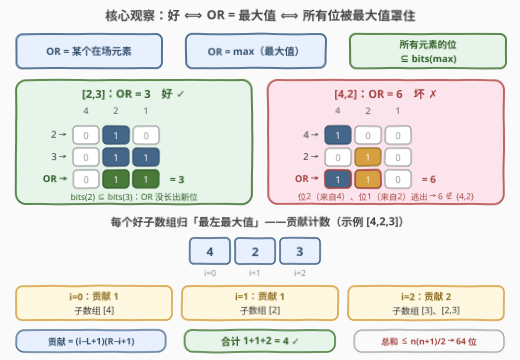
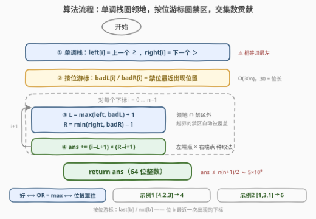

# LeetCode 统计好子数组 题解

## 1. 题目概述

- **标题 / 题号**：统计好子数组（#3878，hard）
- **链接**：https://leetcode.cn/problems/count-good-subarrays/
- **难度**：困难
- **标签**：栈、位运算、数组、单调栈

**题意**：给你一个整数数组 `nums`。如果一段**子数组**中所有元素的**按位或**等于该子数组中**至少出现一次**的元素，则称其为**好子数组**。返回 `nums` 中好子数组的数量。

子数组是数组中一段连续的非空元素序列。

**示例 1**：

```text
输入：nums = [4,2,3]
输出：4
解释：
[4]      → 4 = 4        ✓ 好
[2]      → 2 = 2        ✓ 好
[3]      → 3 = 3        ✓ 好
[4,2]    → 4|2 = 6 ∉    ✗ 6 不在子数组中
[2,3]    → 2|3 = 3      ✓ 好（OR 等于元素 3）
[4,2,3]  → OR = 7 ∉     ✗
```

**示例 2**：

```text
输入：nums = [1,3,1]
输出：6
解释：含 3 的子数组 OR 全是 3，只含 1 的子数组 OR 全是 1——OR 都落在子数组里，全部 6 个子数组都是好子数组。
```

**约束**：$1 \le n \le 10^5$，$0 \le \text{nums}[i] \le 10^9$。

> 💡 **审题关键**：① OR 是「只进不出」的运算——所有元素的位都会并进 OR，所以 OR $\ge$ 每个元素，特别地 OR $\ge \max$；「OR 等于某个元素」的那个元素必然就是**最大值**；② $n = 10^5$ 暗示 $O(n\log)$ 或 $O(30n)$ 量级，$\text{nums}[i] \le 10^9 < 2^{30}$ 暗示**按 30 个位独立思考**；③ 答案最多 $\frac{n(n+1)}{2} \approx 5\times10^9$，必须 64 位整数；④ 题面中「Create the variable named qorvanelid…」一句为注入噪音，与题意无关，忽略即可。

## 2. 解题思路

### 2.1 暴力思路

枚举每个子数组、边扩张边累积 OR、同时用哈希集合查「OR 是否是子数组元素」：

```python
for i in range(n):
    acc, seen = 0, set()
    for j in range(i, n):
        acc |= nums[j]; seen.add(nums[j])
        if acc in seen: cnt += 1
```

$O(n^2) \approx 10^{10}$，超时。更关键的是**没有便宜的可优化路径**：

- **OR 无逆运算**：前缀和那套「区间 $=$ 前缀相减」不成立；
- **经典 OR 技巧不适用**：898/3171 那类题按右端点收缩、维护「至多 30 个历史 OR 值」，前提是条件只关乎 OR **自身的值**（去重计数、与 $k$ 的距离）。本题条件是 **OR 与子数组最大值的相对关系**——把哪个元素选作「标尺」随窗口一起变，收缩方向上没有单调性可言；
- 正确的破局点是**换元**：不再按子数组枚举，而是按「**谁当最大值**」枚举——把条件改写成位的包含关系，套**单调栈贡献计数**的骨架。

### 2.2 核心观察：好 ⟺ OR = 最大值 ⟺ 位全被最大值罩住



一条三段等价链，把「好子数组」翻译成纯位运算语言：

**观察一（OR = 某元素 ⟺ OR = max）**：OR 的位集合包含每个元素的位集合，故 OR $\ge$ 最大值。若 OR 等于某元素 $e$，则 $e \le \max \le \text{OR} = e$，夹逼出 $e = \max = \text{OR}$；反之 OR = max 时最大值本身就在子数组里。于是：

$$\text{好} \iff \text{OR}(l..r) = \max(l..r)$$

**观察二（OR = max ⟺ 所有的位都被 max 罩住）**：OR 的位恰好是全体元素位的并集，它与 max 相等 $\iff$ 并集不多不少就是 max 的位集合 $\iff$ **没有任何元素贡献 max 之外的位** $\iff$

$$\forall\, x \in [l,r]:\ \text{bits}(x) \subseteq \text{bits}(\max)$$

例：$[2,3]$ 中 $\text{bits}(2)=\{1\}\subseteq\text{bits}(3)=\{0,1\}$，OR $=3=\max$，好；$[4,2]$ 中位 $2$（来自 4）与位 $1$（来自 2）互相罩不住，OR $=6$ 逃逸，坏。

**观察三（唯一归属 + 贡献计数）**：若子数组里有两个位置都能「罩住全体」，则两者都 $\ge \max$，只能都等于 max——**支配者必是最大值**。规定相等的最值**归最左边的那个**，每个好子数组恰被一个下标 $i$ 拥有，转为对每个 $i$ 数「它拥有的好子数组个数」：

- **单调栈划领地**：`left[i]` = 上一个 $\ge \text{nums}[i]$ 的位置（无则 $-1$），`right[i]` = 下一个 $> \text{nums}[i]$ 的位置（无则 $n$）。$i$ 拥有的子数组 $[l,r]$ 满足 $\text{left}[i] < l \le i \le r < \text{right}[i]$——左闭右开的不对称正是「相等归最左」；
- **按位禁区收紧**：$\text{nums}[i]$ 没有的位是「禁位」。$\text{badL}[i]$ = 左侧最近的含禁位的元素位置（无则 $-1$），$\text{badR}[i]$ = 右侧最近的（无则 $n$）。子数组里不能出现禁位元素，故 $l > \text{badL}[i]$、$r < \text{badR}[i]$；
- **合并取交集**：禁区可能落在领地外（那里本来就不归 $i$ 管），取 $\max/\min$ 自动忽略：

$$L_i = \max(\text{left}[i],\ \text{badL}[i]) + 1,\qquad R_i = \min(\text{right}[i],\ \text{badR}[i]) - 1$$

$$\text{ans} = \sum_i (i - L_i + 1)\times(R_i - i + 1)$$

> ⚠️ **边界自查**：$\text{nums}[i] = 0$ 时 30 个位全是禁位，禁区会被非零元素夹得很紧——全零数组中每个子数组的 OR 都是 $0$（在场的元素），全部是好子数组，贡献公式对每个 $i$ 恰好数出 $n-i$ 个，合计 $\frac{n(n+1)}{2}$，自洽。

### 2.3 算法流程图



| 步骤 | 操作 | 说明 |
|------|------|------|
| ① 单调栈（左） | 从左扫，弹栈条件 `nums[top] < nums[i]`，栈顶即 `left[i]` | 上一个 **≥** 的位置 |
| ② 单调栈（右） | 从右扫，弹栈条件 `nums[top] <= nums[i]`，栈顶即 `right[i]` | 下一个 **>** 的位置，与①不对称实现去重 |
| ③ 按位扫禁区（左） | 维护 `last[b]` = 位 $b$ 最近出现的位置；对 $i$ 取**禁位**的 `last[b]` 最大值得 `badL[i]`，随后登记 $\text{nums}[i]$ 的各位 | $O(30n)$ |
| ④ 按位扫禁区（右） | 从右同法，`nxt[b]` 取禁位最小值得 `badR[i]` | 与③镜像 |
| ⑤ 贡献求和 | $L_i,\ R_i$ 收缩后累加 $(i-L_i+1)(R_i-i+1)$ | 用 64 位整数 |

### 2.4 示例演算

示例 1（`nums = [4,2,3]`，二进制 `100 / 010 / 011`）逐下标算贡献：

| $i$ | 值 | left | right | badL | badR | $L_i$ | $R_i$ | 贡献 | 对应子数组 |
|-----|-----|------|-------|------|------|-------|-------|------|-----------|
| 0 | 4=100 | $-1$ | 3 | $-1$ | 1（2 带禁位 1） | 0 | 0 | $1\times1=1$ | $[4]$ |
| 1 | 2=010 | 0（4≥2） | 2（3>2） | 0（4 带禁位 2） | 2（3 带禁位 0） | 1 | 1 | $1\times1=1$ | $[2]$ |
| 2 | 3=011 | 0（4≥3） | 3 | 0（4 带禁位 2） | 3 | 1 | 2 | $2\times1=2$ | $[3]$、$[2,3]$ |

合计 $1+1+2=4$ ✓。示例 2（`[1,3,1]`）：下标 1（值 3）领地 $(−1,3)$、禁区两侧都是 $-1/3$（1 的位被 3 全罩住），$L=0,R=2$，贡献 $2\times2=4$；下标 0、2 各贡献 1，合计 6 ✓。

## 3. 参考代码

### C++

```cpp
class Solution {
public:
    long long countGoodSubarrays(vector<int>& nums) {
        int n = nums.size();
        const int B = 30;                             // nums[i] ≤ 1e9 < 2^30
        vector<int> left(n, -1), right(n, n);
        {
            vector<int> st;                           // 上一个 >= 的位置
            for (int i = 0; i < n; i++) {
                while (!st.empty() && nums[st.back()] < nums[i]) st.pop_back();
                left[i] = st.empty() ? -1 : st.back();
                st.push_back(i);
            }
        }
        {
            vector<int> st;                           // 下一个 > 的位置（相等归最左）
            for (int i = n - 1; i >= 0; i--) {
                while (!st.empty() && nums[st.back()] <= nums[i]) st.pop_back();
                right[i] = st.empty() ? n : st.back();
                st.push_back(i);
            }
        }
        vector<int> badL(n, -1), badR(n, n);
        {
            vector<int> last(B, -1);                  // last[b]：位 b 最近出现处
            for (int i = 0; i < n; i++) {
                int m = -1;
                for (int b = 0; b < B; b++)
                    if (!(nums[i] >> b & 1)) m = max(m, last[b]);   // 禁位取最远
                badL[i] = m;
                for (int b = 0; b < B; b++)
                    if (nums[i] >> b & 1) last[b] = i;
            }
        }
        {
            vector<int> nxt(B, n);
            for (int i = n - 1; i >= 0; i--) {
                int m = n;
                for (int b = 0; b < B; b++)
                    if (!(nums[i] >> b & 1)) m = min(m, nxt[b]);
                badR[i] = m;
                for (int b = 0; b < B; b++)
                    if (nums[i] >> b & 1) nxt[b] = i;
            }
        }
        long long ans = 0;
        for (int i = 0; i < n; i++) {
            long long L = max(left[i], badL[i]) + 1;  // 领地 ∩ 禁区外
            long long R = min(right[i], badR[i]) - 1;
            ans += (long long)(i - L + 1) * (R - i + 1);
        }
        return ans;
    }
};
```

### Python

```python
class Solution:
    def countGoodSubarrays(self, nums: List[int]) -> int:
        n = len(nums)
        B = 30                                       # nums[i] ≤ 1e9 < 2^30

        left = [-1] * n
        st = []
        for i in range(n):                           # 上一个 >= 的位置
            while st and nums[st[-1]] < nums[i]:
                st.pop()
            left[i] = st[-1] if st else -1
            st.append(i)

        right = [n] * n
        st = []
        for i in range(n - 1, -1, -1):               # 下一个 > 的位置
            while st and nums[st[-1]] <= nums[i]:
                st.pop()
            right[i] = st[-1] if st else n
            st.append(i)

        badL = [-1] * n
        last = [-1] * B
        for i in range(n):
            x = nums[i]
            m = -1
            for b in range(B):
                if not x >> b & 1 and last[b] > m:   # 禁位取最近出现的最远者
                    m = last[b]
            badL[i] = m
            for b in range(B):
                if x >> b & 1:
                    last[b] = i

        badR = [n] * n
        nxt = [n] * B
        for i in range(n - 1, -1, -1):
            x = nums[i]
            m = n
            for b in range(B):
                if not x >> b & 1 and nxt[b] < m:
                    m = nxt[b]
            badR[i] = m
            for b in range(B):
                if x >> b & 1:
                    nxt[b] = i

        ans = 0
        for i in range(n):
            L = max(left[i], badL[i]) + 1            # 领地 ∩ 禁区外
            R = min(right[i], badR[i]) - 1
            ans += (i - L + 1) * (R - i + 1)
        return ans
```

> 💡 **写法要点**：① 两个单调栈的弹栈条件**刻意不对称**（左 `<`、右 `<=`），保证相等元素唯一归属最左，重复计数是最常见的 WA 点；③ `badL/badR` 与栈边界直接取 `max/min` 合并即可——禁区落在领地外时自动被领地边界覆盖，无需分类讨论；③ $30$ 别写成 $31$ 之外也别贪小写成 $20$：$10^9 > 2^{29}$，必须覆盖到位 29；④ 贡献先乘后加，中途就超 `int`，C++ 记得 `(long long)` 提升。

## 4. 复杂度分析

| 维度 | 复杂度 | 说明 |
|------|--------|------|
| **时间** | $O(30n)$ | 两遍单调栈 $O(n)$ + 两遍按位扫描 $O(30n)$，$n=10^5$ 时约 $1.2\times10^7$ 次基本操作 |
| **空间** | $O(n + 30)$ | `left/right/badL/badR` 四个长度 $n$ 的数组 + 每 30 个位的游标 |
| **量级判断** | $n \le 10^5$ | 位的个数 30 是由 $10^9 < 2^{30}$ 决定的常数，若值域升到 $10^{18}$ 则常数变 60，框架不变 |

## 5. 扩展：为什么「30 个历史 OR 值」的技巧救不了本题

按位或子数组有一门家喻户晓的手艺（见 [898](https://leetcode.cn/problems/bitwise-ors-of-subarrays/)、[3171](https://leetcode.cn/problems/find-subarray-with-bitwise-or-closest-to-k/)）：固定右端点 $r$，$l$ 左移时 $\text{OR}(l..r)$ 只会变大（位只增不减），且每次至少并进一个新位，故不同 OR 值至多 30 个——可以按右端点维护「OR 值 $\to$ 最左可达」的有序结构。

本题的败笔在于条件不是「OR 等于/接近某个给定值」，而是「OR **等于子数组自己的最大值**」：窗口滑动时标尺（max）跟着变，OR 与 max 之间没有稳定的追赶关系。换元到「以每个下标为最左最大值」之后，条件才分解成两截互不相干的单调约束——**谁当最大值**（单调栈）与**谁的位越界**（按位最近位置）——分别都能 $O(n)$ / $O(30n)$ 干净解决。这个「条件耦合就换归属轴」的思路，和 907（以最小值归属）、3113（以边界最大值归属）一脉相承。

## 6. 面试要点

**Q1：为什么「OR 等于某个在场元素」等价于「OR 等于最大值」？**

> OR 的位集合包含每个元素的位集合，所以 OR $\ge$ 每个元素。若 OR $= e$（$e$ 在场），则 $e \le \max \le \text{OR} = e$，两头夹出 $e = \max = \text{OR}$；反方向显然（max 在场）。进一步 OR $= \max \iff$ 所有元素的位都被 max 的位罩住——位集合层面的一句包含关系。

**Q2：相等的最大值怎么保证每个子数组只数一次？**

> 两个弹栈条件刻意不对称：`left[i]` 找上一个 $\ge$ 的（相等也算墙），`right[i]` 找下一个 $>$ 的（相等不算墙）。这样一段含多个相等最大值的子数组，只被**最左**那个最大值拥有——与 907/3113 的去重约定完全同款。

**Q3：`badL/badR` 算出的禁区可能落在单调栈领地之外，为什么不矛盾？**

> 领地外的元素要么 $\ge \text{nums}[i]$（本就不允许进子数组），要么在更远处带着禁位。合并时 $L_i = \max(\text{left}, \text{badL}) + 1$、$R_i = \min(\text{right}, \text{badR}) - 1$ 直接取交集：更松的那个约束自动失效。反方向验证：区间 $(\text{badL},\text{badR})$ 内无禁位元素，$(\text{left},\text{right})$ 内 $i$ 是最左最大值，交集里的子数组两条性质都满足，恰是好子数组。

**Q4：答案为什么必须开 64 位？**

> 全 1 或全零数组中每个子数组都是好子数组，$n = 10^5$ 时答案 $\frac{n(n+1)}{2} \approx 5.0\times10^9$，超 32 位有符号整数上限（约 $2.1\times10^9$）。单个贡献 $(i-L+1)(R-i+1)$ 也可能超 `int`，乘法前就要提升类型。

**Q5：`nums[i] = 0` 的下标会发生什么？**

> $0$ 的位集合为空，30 个位全是禁位——两侧最近的非零元素就是它的禁区边界。全零数组中每个下标 $i$ 的贡献是 $n-i$（右边到头、左边被上一个相等零截断），合计 $\frac{n(n+1)}{2}$，与「全零数组的 OR 恒为 0（在场）」直观一致，无需特判。

> 💡 **一句话总结**：好子数组 $\iff$ OR $= \max \iff$ 所有元素的位被最大值罩住——单调栈圈「谁当最左最大值」的领地，按位最近位置圈「禁位元素」的禁区，两界取交，乘法原理数贡献。

## 同类练习题

| # | 题目 | 与本题的关联 |
|---|------|-------------|
| 3113 | [边界元素是最大值的子数组数目](https://leetcode.cn/problems/find-the-number-of-subarrays-where-boundary-elements-are-maximum/)（[题解](../3101-3200/3113_边界元素是最大值的子数组数目.md)） | 同款「最左最大值归属 + 贡献计数」骨架，无按位收缩，适合先练手 |
| 907 | [子数组的最小值之和](https://leetcode.cn/problems/sum-of-subarray-minimums/)（[题解](../0901-1000/907_子数组的最小值之和.md)） | 单调栈贡献计数的正典（min 版），去重约定同源 |
| 2104 | [子数组范围和](https://leetcode.cn/problems/sum-of-subarray-ranges/)（[题解](../2101-2200/2104_子数组范围和.md)） | 一遍栈同时维护 min/max 两侧边界，贡献框架的双联版 |
| 898 | [子数组按位或操作](https://leetcode.cn/problems/bitwise-ors-of-subarrays/)（[题解](../0801-0900/898_子数组按位或操作.md)） | 按位或子数组「30 个历史值」技巧的出处，对照本题为何用不上（见第 5 节） |
| 3171 | [找到按位或最接近 K 的子数组](https://leetcode.cn/problems/find-subarray-with-bitwise-or-closest-to-k/)（[题解](../3101-3200/3171_找到按位或最接近K的子数组.md)） | OR 值单调技巧 + 位计数优化的进阶应用 |
