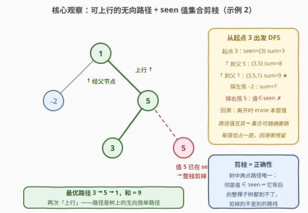
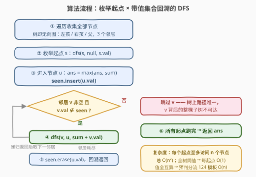

# LeetCode 二叉树中的最大不同路径和 题解

## 1. 题目概述

- **标题 / 题号**：二叉树中的最大不同路径和（#3879，medium）
- **链接**：https://leetcode.cn/problems/maximum-distinct-path-sum-in-a-binary-tree/
- **难度**：中等
- **标签**：树、深度优先搜索、哈希表、二叉树

> ⚠️ 本题为 LeetCode 付费题（Plus 会员专享），题意描述根据官方示例用例与 hints 重建，可能与官方题面有出入。

**题意**：给定一棵二叉树的根节点 `root`，树中**节点值可能重复**。「路径」定义为一列节点：从**任意节点**出发，每一步可以移动到**左孩子、右孩子或父节点**（即树上的无向移动），且每个节点至多经过一次。一条路径是**合法的**，当且仅当路径上**所有节点的值互不相同**（"不同路径"）。返回所有合法路径的**节点值之和的最大值**；单个节点自身也是一条合法路径。

**示例 1**：

```text
输入：root = [2,2,1]
输出：3
解释：根 2 → 右孩子 1，和为 3。两个值为 2 的节点不能同时出现在一条路径上。
```

**示例 2**：

```text
输入：root = [1,-2,5,null,null,3,5]
输出：9
解释：路径 3 → 5 → 1（两次上行经过父节点），和为 9。
     任何包含两个 5 的路径（如 1 → 5 → 5、3 → 5 → 5）都不合法。
```

**示例 3**：

```text
输入：root = [4,6,6,null,null,null,9]
输出：19
解释：路径 4 → 6 → 9，和为 19。左边的 6 与右边的 6 值相同，无法同现。
```

**约束条件**（官方约束未公开，按同类题推测）：

- 树中节点数目在 $[1, 10^4]$ 范围内
- $-10^5 \le \text{Node.val} \le 10^5$

> 💡 **审题关键**：① 这**不是** [124. 二叉树中的最大路径和](../0101-0200/124_二叉树中的最大路径和.md) 那种「拐点拼两条向下腿」的路径——官方 hint 明说可移动到**父节点**，即路径是树上的**无向简单路径**，起点终点都任意；② 「不同」修饰的是**值**不是节点——值相等的两个不同节点也不能同现于一条路径（示例 1/3 的两个 2、两个 6 都是这么被卡掉的）；③ 单节点是合法路径，全负树上答案就是最大单点值，`ans` 不能初始化成 0。

## 2. 解题思路

### 2.1 暴力思路

树上任意一条无向简单路径由其两个**端点**唯一确定（树无环，两点间路径唯一）。于是最直接的暴力：枚举所有 $O(n^2)$ 个节点对 $(a, b)$，沿父指针找到 $a \to b$ 的唯一路径，检查路径上值是否互异，合法则用路径和更新答案——单次检查 $O(n)$，总计 $O(n^3)$。

略作改进：固定端点 $a$，沿无向边 DFS 逐步延伸路径、增量维护「已用值集合」，就能把单端点枚举降到 $O(n)$，总 $O(n^2)$。这正是官方 hints 指定的解法——下面把它讲透。

### 2.2 核心观察：无向图视角 + seen 值集合的回溯剪枝



**观察一（路径 = 无向简单路径，起点必须能上行）**：hint「possible outgoing edges are the left child, right child, and parent」说明要把二叉树看成一张**无向图**，每个节点至多 3 个邻居。合法路径就是这张无向图上的一条简单路径，外加「值互异」约束。

> ⚠️ **常见错误（实测翻车）**：让 DFS 从起点**只向下走**（只递归左孩子/右孩子）。这样只能覆盖「一端点是另一端点祖先」的路径，形如 `左子树某点 → 根 → 右子树某点`（最高点在路径内部）的路径会整体漏掉。示例 2 的最优路径 3 → 5 → 1 就需要从 3 **上行**两步。正确写法是：起点的三个结构邻居（左孩、右孩、**树父**）都要尝试，用「来路节点」或值判重防止走回头路。

**观察二（值判重的剪枝 = 正确性本身）**：DFS 时维护当前路径的**已用值集合** `seen`。邻居 $v$ 的值已在 `seen` 中，意味着「起点 $s$ 到 $v$ 的唯一路径」中途必有值冲突——而树上路径**唯一**，$v$ 没有第二条路可绕，于是 $v$ 及其背后**只能经由 $v$ 到达的整棵子树全部不可达**，整枝剪掉。这一步不是启发式优化，而是精确刻画了合法可达集：从 $s$ 出发的 DFS 恰好访问 $\{\,t : \text{path}(s,t) \text{ 合法}\,\}$。树越重复、剪得越狠——全树同值时每个起点只访问 $O(1)$ 个节点。

**观察三（124 的拐点拼合为何失效）**：124 题能 $O(n)$，靠的是「每个拐点处，左右子树各自的最优向下路径独立可求、再拼合」。本题的值互异是**整条路径上的全局集合约束**：拐点处拼合的两条腿不仅各自值互异，还要求**两条腿的值集合互不相交、且都不含拐点值**——子问题的答案不再是一个标量，而要背着「禁用值集合」走，状态规模指数爆炸。换根 DP 同理卡死。所以本题按 hint 指路老老实实「枚举起点 + 回溯 DFS」，用 $O(n^2)$ 换正确性。

**回溯的关键细节**：进入节点时 `seen.insert(val)`，离开时 `seen.erase(val)`。因为合法路径上的值必然互异（进门前就查过），`seen` 中每个值恰占一层，`erase` 精确撤销、零残留。若忘记撤销，起点切换后会把上一条路径的值误当「在当前路径上」，大面积漏解。

### 2.3 算法流程图



| 步骤 | 操作 | 说明 |
|------|------|------|
| ① 预处理 | 一趟遍历收集全部节点，并记录每个节点的**树父指针** | 之后把树当无向图用：邻居 = {左孩, 右孩, 树父} |
| ② 枚举起点 | 对每个节点 $s$，从它出发做一次 DFS | hint「Take the maximum over all possible starting nodes」 |
| ③ 进入节点 | `ans = max(ans, sum)`；`seen.insert(u.val)` | 每个到达的节点都是一条合法路径的终点，顺手更新答案 |
| ④ 扩展邻居 | 遍历 $v \in$ {左孩, 右孩, 树父}：$v$ 非空且 $v.val \notin seen$ 才递归 | 值在 `seen` 中 ⇒ 该邻居背后整棵子树不可达，剪掉 |
| ⑤ 回溯 | 邻居处理完，`seen.erase(u.val)` 后返回上层 | 路径值互异 ⇒ 集合可精确撤销 |
| ⑥ 汇总 | 所有起点跑完，返回 `ans` | `ans` 初始化为 $-\infty$（单点路径合法） |

**为什么每个起点只需 $O(n)$**：树上路径唯一 ⇒ 一次 DFS 中每个节点至多被进入一次（见 2.2 观察二），单起点工作量 $\le n$；总计 $O(n^2)$。每条路径会被它的两个端点各枚举一遍（$s \to t$ 与 $t \to s$ 互为反向），对取 `max` 无影响，不必去重。

### 2.4 示例演算：root = [1,-2,5,null,null,3,5]

| 起点 | DFS 探索过程（`seen` / 路径和演化） | 局部最优 |
|------|-------------------------------------|----------|
| 3 | 3 → 上行到父 5 → 上行到父 1 → 下行到 −2：`seen` 依次 $\{3\} \to \{3,5\} \to \{3,5,1\} \to \{3,5,1,-2\}$，和依次 $3 \to 8 \to 9 \to 7$；在 5 处探右孩 5：值 $\in seen$，剪 | **9** |
| 1 | 1 → 5 → 3 得 9；1 → 5 → (右孩 5) 剪枝；1 → −2 得 −1 | 9 |
| −2 | −2 → 1 → 5 → 3 得 7；右孩 5 剪枝 | 7 |
| 5（叶） | 5 → 上行到父 5：值 5 已在 `seen`，剪——只能停在自身 | 5 |

四个起点取最大，答案 **9**（示例 1 中同理：从根 2 出发，左孩 2 被剪、右孩 1 可达，得 3；示例 3 中从 9 出发一路上行 9 → 6 → 4，再探另一棵 6 时被剪，得 19）。

## 3. 参考代码

### C++

```cpp
class Solution {
    unordered_map<TreeNode*, TreeNode*> par;   // 树父指针：支持从任意起点上行
    vector<TreeNode*> nodes;
    unordered_set<int> seen;                   // 当前路径的已用值集合
    long long ans = LLONG_MIN;

    void dfs(TreeNode* u, long long sum) {
        ans = max(ans, sum);                   // 每个到达的节点都是一条合法路径
        seen.insert(u->val);
        for (TreeNode* v : {u->left, u->right, par[u]})   // 三个结构邻居
            if (v && !seen.count(v->val))      // 值冲突 ⇒ 整棵子树不可达，剪
                dfs(v, sum + v->val);
        seen.erase(u->val);                    // 回溯：精确撤销本层值
    }

public:
    long long maxDistinctPathSum(TreeNode* root) {
        vector<TreeNode*> stk = {root};        // 一趟收集全部节点 + 父指针
        par[root] = nullptr;
        while (!stk.empty()) {
            TreeNode* u = stk.back(); stk.pop_back();
            nodes.push_back(u);
            for (TreeNode* c : {u->left, u->right})
                if (c) { par[c] = u; stk.push_back(c); }
        }
        for (TreeNode* s : nodes) dfs(s, s->val);   // 枚举起点
        return ans;
    }
};
```

### Python

```python
class Solution:
    def maxDistinctPathSum(self, root: Optional[TreeNode]) -> int:
        ans = float('-inf')
        seen = set()
        par = {root: None}                     # 树父指针：支持上行
        nodes, stk = [], [root]
        while stk:                             # 一趟收集全部节点 + 父指针
            u = stk.pop()
            nodes.append(u)
            for c in (u.left, u.right):
                if c:
                    par[c] = u
                    stk.append(c)

        for s in nodes:                        # 枚举起点
            stack = [('in', s, s.val)]         # 显式栈版回溯，防链状树爆递归
            while stack:
                tag, u, sm = stack.pop()
                if tag == 'out':               # 离开节点：撤销本层值
                    seen.remove(u.val)
                    continue
                if sm > ans:
                    ans = sm
                seen.add(u.val)
                stack.append(('out', u, 0))    # 先压出口事件，子树处理完才轮到它
                for v in (u.left, u.right, par[u]):
                    if v and v.val not in seen:
                        stack.append(('in', v, sm + v.val))
        return ans
```

> 💡 **写法要点**：① 函数签名按题名重建（`maxDistinctPathSum`），提交时以实际签名为准；② Python 版用 `('in'/'out')` 双事件显式栈模拟递归——`out` 事件先压栈，子树全部处理完才弹出，回溯语义与递归版完全一致，链状树深 $10^4$ 也不怕递归栈溢出；③ 邻居判重**只看值**：来路节点（无论是孩子还是父亲）的值必然已在 `seen` 中，天然被剪掉，无需额外的 `visited` 数组——树上路径唯一保证了这点（见 2.2 观察二）；④ 值域未知时和可能超 `int`，路径和与答案用 `long long`。

## 4. 复杂度分析

| 维度 | 复杂度 | 说明 |
|------|--------|------|
| **时间** | $O(n^2)$ 最坏 | $n$ 个起点 × 每起点至多访问 $n$ 个节点；值全互异时无任何剪枝，是真正的最坏情形 |
| **时间** | 远小于 $O(n^2)$（重复多时） | 全树同值 ⇒ 每起点所有邻居都被剪，退化为 $O(n)$；重复值越密越快 |
| **空间** | $O(n)$ | `seen` 集合 + 父指针哈希表 + 节点表；递归版另有 $O(h)$ 栈深（$h$ 为树高，链状时 $O(n)$） |
| **量级判断** | $n \le 10^4$ ⇒ 约 $10^8$ 次哈希操作 | Medium 定位 + hint 明示此解法，实测约束应支持；若 $n$ 放大到 $10^5$ 需另寻出路（见第 5 节） |

## 5. 扩展：什么时候能做到 O(n)？

**特例一（全树值互异）**：若预先统计发现**没有任何值出现 ≥ 2 次**，值互异约束自动满足，本题瞬间退化为 [124. 二叉树中的最大路径和](../0101-0200/124_二叉树中的最大路径和.md)，后序 DFS 拐点拼合 $O(n)$ 收工。可以 $O(n)$ 预判分流：有重复才跑 $O(n^2)$ 回溯。这也解释了复杂度的两极——剪枝强度完全由**重复值的密度**决定。

**特例二（值域极小，如 $\le 10$）**：合法路径长度 $\le$ 值域中不同值个数 $D$，DFS 深度天然 $\le D$，单起点工作量骤降。

**一般情形的次平方解法并不显然**：值互异是全局集合约束，124 式的「子树标量答案拼合」与换根 DP 都因「两条腿值集必须不相交」而失效（2.2 观察三）。一个可想的方向是只对**出现 ≥ 2 次的值**（真正的约束源）建冲突结构做虚树/辅助树上的 DP，但状态仍需携带值集合的交信息，复杂度难以保证——本题作为 Medium，hint 指定的「枚举起点 + 回溯」就是预期解。

> 💡 **反向对照**：若把约束反过来——「路径上**相邻**节点值不同」——那就是 [2246. 相邻字符不同的最长路径](https://leetcode.cn/problems/longest-path-with-different-adjacent-characters/)，相邻性是**局部**约束，子树答案可拼合，$O(n)$ 可解。局部约束与全局集合约束的可解性差距，正是本题最值得记住的一课。

## 6. 面试要点

**Q1：为什么「邻居值 ∈ seen 就剪掉整棵子树」是正确的，不会漏解？**

> 树上任意两点间路径**唯一**。若从起点 $s$ 到 $t$ 的唯一路径中途出现重复值，$t$ 不存在第二条合法路线——剪掉的不是「还没试的其它路径」，而是**本来就非法的可达性**。所以从 $s$ 出发的 DFS 恰好访问合法可达集，不多不少。

**Q2：既然值判重了，还需要 `visited` 数组或父指针防回头吗？**

> 不需要额外机制，但**树父指针本身必须存**。来路节点（无论上行还是下行到达）的值必在 `seen` 中，值判重天然挡住回头路；树无环又保证每个节点只有唯一路径可达，不会二次进入。但起点的 DFS 必须能走向**树父**（2.2 的翻车点），所以父指针要预先记录——它提供的是「上行能力」，不是防回头。

**Q3：为什么不能用 124 题的拐点拼合做到 $O(n)$？**

> 124 的分解依赖左右子树子问题**独立**；本题两条腿的值集合必须互不相交、且不含拐点值，是跨越两棵子树的全局集合约束，子树答案不再是标量。把「禁用值集合」编进状态会指数爆炸，换根 DP 同理失效。

**Q4：回溯时 `seen.erase(u.val)` 为什么安全？会不会误删同值节点？**

> 合法 DFS 栈上的路径值必然互异（进入前就检查过），`seen` 中每个值恰好对应一层，`erase` 精确撤销本层、零残留。反过来，若忘记 erase，切换到新起点时旧路径的值残留，会把大量本可达的节点误判为值冲突，静默 WA。

**Q5：`ans` 为什么必须初始化为 $-\infty$ 而不是 0？**

> 单节点是合法路径，且节点值可为负——全负树的最优解就是最大的那个单点值。初始化成 0 会在全负输入上错报 0（示例外推：`[-5]` 的正确答案是 $-5$）。这也是「路径至少一个节点、可以为单点」这条题意的直接体现。

## 同类练习题

| # | 题目 | 与本题的关联 |
|---|------|-------------|
| 124 | [二叉树中的最大路径和](https://leetcode.cn/problems/binary-tree-maximum-path-sum/)（[题解](../0101-0200/124_二叉树中的最大路径和.md)） | 无值互异约束的版本，拐点拼合 $O(n)$——对照本题看全局集合约束如何破坏可分解性 |
| 437 | [路径总和 III](https://leetcode.cn/problems/path-sum-iii/) | 树上向下路径 + 前缀和哈希，同样是「DFS 进出时增删哈希」的回溯骨架 |
| 687 | [最长同值路径](https://leetcode.cn/problems/longest-univalue-path/) | 值相等才延伸——与本题「值互异才可达」互为镜像的值约束题 |
| 2246 | [相邻字符不同的最长路径](https://leetcode.cn/problems/longest-path-with-different-adjacent-characters/) | 约束只看相邻节点（局部），子树可拼合 $O(n)$，与本题的全局约束形成鲜明对比 |
| 1372 | [二叉树中的最长交错路径](https://leetcode.cn/problems/longest-zigzag-path-in-a-binary-tree/)（[题解](../1301-1400/1372_二叉树中的最长交错路径.md)） | 另一类「树上带约束路径」的树形 DP，体会哪些约束能压进子树状态 |
