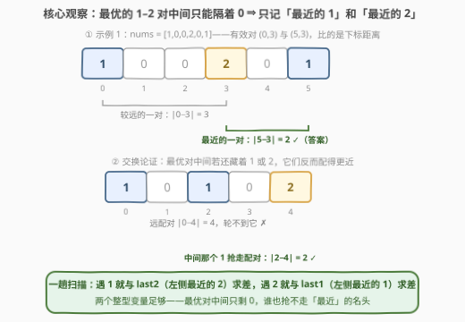
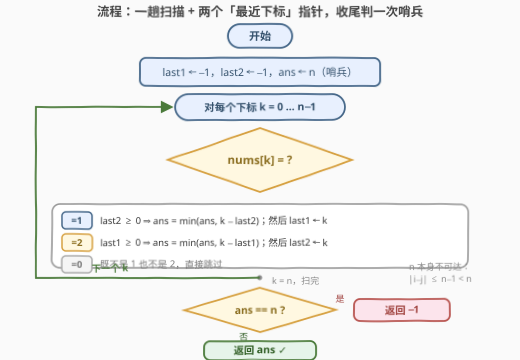

# LeetCode 两个值之间的最小绝对差值 题解

## 1. 题目概述

- **标题 / 题号**：两个值之间的最小绝对差值（#3880，easy）
- **链接**：https://leetcode.cn/problems/minimum-absolute-difference-between-two-values/
- **难度**：简单
- **标签**：数组、枚举

**题意**：给你一个只包含 **0、1 和 2** 的整数数组 `nums`。如果 $\text{nums}[i] = 1$ 且 $\text{nums}[j] = 2$，则称下标对 $(i, j)$ 为**有效**的。请返回所有有效下标对中 $i$ 和 $j$ 之间的**最小**绝对差；如果不存在有效下标对，则返回 $-1$。下标 $i$ 和 $j$ 之间的绝对差定义为 $\lvert i - j \rvert$。

**示例 1**：

```text
输入：nums = [1,0,0,2,0,1]
输出：2
解释：有效下标对有 (0,3)，|0−3| = 3；(5,3)，|5−3| = 2。因此结果是 2。
```

**示例 2**：

```text
输入：nums = [1,0,1,0]
输出：-1
解释：数组中不存在有效下标对，因此结果是 -1。
```

**约束**：$1 \le \text{nums.length} \le 100$，$0 \le \text{nums}[i] \le 2$。

> 💡 **审题关键**：① 有效对**不要求 $i < j$**——示例 1 的 $(5,3)$ 里 $i > j$；但 $\lvert i-j \rvert$ 关于 $i$、$j$ 对称，所以本质上就是「任意一个 1 的位置」与「任意一个 2 的位置」的**最小距离**，方向无所谓；② 数组里的 **0 是纯干扰项**，既不能当 1 也不能当 2；③ 「无有效对返回 $-1$」对应「数组里没有 1，或没有 2」，需要哨兵兜底。

## 2. 解题思路

### 2.1 朴素思路：双重循环枚举所有 (i, j)

官方 hint 就是 **Use brute force**：$n \le 100$，双重循环枚举所有「值为 1 的下标 $i$ × 值为 2 的下标 $j$」，打擂台取 $\min \lvert i-j \rvert$，一共至多 $10^4$ 次比较，怎么写都能过。朴素做法有两个易错点：

- **内层 $j$ 必须扫全数组**，不能只扫 $i$ 之后的——本题不要求 $i < j$，只扫一侧会漏掉 $(5,3)$ 这种「2 在 1 前面」的配对；
- **答案初值**要选一个不可达的量（如 $n$ 或 $\infty$），扫完仍是初值说明没有 1 或没有 2，返回 $-1$。

暴力正确性无懈可击，但它是 $O(n^2)$——数据范围小只是「允许」暴力，不是「只配」暴力。这题真正想考察的是把 $O(n^2)$ 的配对枚举压成 $O(n)$ 的那个观察。

### 2.2 核心观察：一趟扫描 + 两个「最近下标」指针



用**交换论证**想清楚「哪个配对才可能是最优解」：

1. 取一个距离最小的有效对 $(i, j)$，不妨设 $i < j$（$i > j$ 的情形对称，绝对差相同）。若 $(i, j)$ **中间还藏着另一个 1**，它与 $j$ 的距离严格更小，与「最优」矛盾；若**藏着另一个 2**，它与 $i$ 的距离严格更小，同样矛盾；
2. 所以**最优对的 1 和 2 之间只能隔着 0**。这意味着：扫描到任意位置 $k$ 时，候选答案只可能由「**左侧最近的 1**」$\text{last1}$ 和「**左侧最近的 2**」$\text{last2}$ 参与构成——更远的早已出局。

于是算法水到渠成，一趟扫描维护两个变量：

- $\text{nums}[k] = 1$：若 $\text{last2}$ 已出现，更新 $\text{ans} = \min(\text{ans},\ k - \text{last2})$；然后 $\text{last1} \leftarrow k$；
- $\text{nums}[k] = 2$：若 $\text{last1}$ 已出现，更新 $\text{ans} = \min(\text{ans},\ k - \text{last1})$；然后 $\text{last2} \leftarrow k$；
- $\text{nums}[k] = 0$：跳过。

> 💡 **为什么 $i > j$ 的情形自动被覆盖**：设最优对里 2 在前、1 在后，即 $j < i$。扫描到后面的 1（下标 $i$）时，前面的 2（下标 $j$）恰好就是 $\text{last2}$——因为 $(i,j)$ 中间只剩 0，$j$ 正是 $i$ 左侧最近的 2。对称地把两个方向都照顾到了，一趟就够。这本质上是 **219. 存在重复元素 II**「哈希维护最近一次出现下标」的无哈希版——值域只有 $\{0,1,2\}$，两个整型变量就装下了整张哈希表。

### 2.3 算法流程图



| 步骤 | 操作 | 说明 |
|------|------|------|
| ① 初始化 | `last1 = last2 = -1`，`ans = n` | `n` 是**不可达哨兵**：$\lvert i-j \rvert \le n-1 < n$ |
| ② 逐元素分派 | 遇 1 与 `last2` 求差、遇 2 与 `last1` 求差、遇 0 跳过 | 求差前先判「对面出现过没有」 |
| ③ 更新指针 | `last1 ← k`（当前是 1）/ `last2 ← k`（当前是 2） | **先求差后更新**，顺序不能反 |
| ④ 收尾判定 | `ans == n` ? 返回 `-1` : 返回 `ans` | 哨兵未动 = 没有有效对 |

### 2.4 示例演算

官方示例 1 `nums = [1,0,0,2,0,1]`，逐事件记录（只列发生动作的下标）：

| $k$ | $\text{nums}[k]$ | 动作 | $\text{last1}$ | $\text{last2}$ | $\text{ans}$ |
|-----|------|------|------|------|------|
| 0 | 1 | `last2 = −1`，不求差；`last1 ← 0` | 0 | −1 | 6（=n） |
| 3 | 2 | $\text{ans}=\min(6,\ 3-0)=3$；`last2 ← 3` | 0 | 3 | 3 |
| 5 | 1 | $\text{ans}=\min(3,\ 5-3)=2$；`last1 ← 5` | 5 | 3 | **2** |

（下标 1、2、4 处的 0 全部跳过。）扫完 $\text{ans} = 2 \ne n$，返回 2 ✓。这正是 $(5,3)$ 这对「2 在前、1 在后」的最优对——被「扫描到 1 时与 $\text{last2}$ 求差」那条分支捕获。

示例 2 `nums = [1,0,1,0]`：全程没有 2，$\text{last2}$ 恒为 $-1$，两个 1 都不求差，$\text{ans}$ 保持哨兵 $n=4$，返回 $-1$ ✓。

## 3. 参考代码

### C++

```cpp
class Solution {
public:
    int minAbsoluteDifference(vector<int>& nums) {
        int n = nums.size();
        int last1 = -1, last2 = -1;   // 左侧最近的 1 / 2 的下标
        int ans = n;                  // 哨兵：|i-j| <= n-1 < n 永不可达
        for (int k = 0; k < n; ++k) {
            if (nums[k] == 1) {
                if (last2 >= 0) ans = min(ans, k - last2);  // 先求差
                last1 = k;                                   // 后更新
            } else if (nums[k] == 2) {
                if (last1 >= 0) ans = min(ans, k - last1);
                last2 = k;
            }
        }
        return ans == n ? -1 : ans;   // 哨兵未动 ⇔ 没有有效对
    }
};
```

### Python

```python
class Solution:
    def minAbsoluteDifference(self, nums: list[int]) -> int:
        n = len(nums)
        last1 = last2 = -1
        ans = n                        # 不可达哨兵
        for k, v in enumerate(nums):
            if v == 1:
                if last2 >= 0:
                    ans = min(ans, k - last2)
                last1 = k
            elif v == 2:
                if last1 >= 0:
                    ans = min(ans, k - last1)
                last2 = k
        return -1 if ans == n else ans
```

> 💡 **写法要点**：① **先求差、后更新指针**——顺序反了会把当前元素和自己比（差 0）；② 判「出现过」用 `last >= 0`，别用 `!= -1` 之外的隐式真值（Python 里 `last1 and ...` 会在下标 0 处翻车）；③ 想交暴力也行，Python 三行版：`ones = [i for i,v in enumerate(nums) if v==1]`，`twos = [j for j,v in enumerate(nums) if v==2]`，`return min((abs(i-j) for i in ones for j in twos), default=-1)`——`min` 的 `default` 参数恰好充当哨兵。

## 4. 复杂度分析

| 维度 | 复杂度 | 说明 |
|------|--------|------|
| **时间** | $O(n)$ | 每个元素一次分派判定 + 至多一次求差，全部 $O(1)$ |
| **空间** | $O(1)$ | 两个下标变量 + 一个答案变量，值域 $\{0,1,2\}$ 免哈希 |
| **量级判断** | $n \le 100$ | 暴力 $O(n^2) = 10^4$ 也能过；但 $O(n)$ 是信息论下界（每个元素至少看一眼），线性解才是这题的「满血」答案 |

## 5. 扩展：把「最近」玩出花

- **求最大距离怎么办**？把「最近一次出现」换成「**第一次出现**」：`first1` 只在首次遇 1 时赋值，答案取 $\max(k - \text{first}_{对面})$。最优最近对中间只剩 0、最优最远对要贴着两端——「最近 ↔ 最远」就是「last ↔ first」一字之差；
- **1 和 2 换成任意两个目标值 $a$、$b$**：套路原封不动，这就是 [219. 存在重复元素 II](https://leetcode.cn/problems/contains-duplicate-ii/) 的同值版（判 $\lvert i-j \rvert \le k$），值域大了就用哈希表代替这两个变量；
- **问「值的最小差」而非「下标的最小差」**：排序后看相邻元素差（[1200. 最小绝对差](https://leetcode.cn/problems/minimum-absolute-difference/)）——对象从下标换成值，排序的「相邻最优」与本题的「最近最优」是同一个交换论证；
- **要求 $i < j$ 且求最大 $j - i$**：变成 [962. 最大宽度坡](https://leetcode.cn/problems/maximum-width-ramp/)，一趟扫描不够，得上单调栈。

## 6. 面试要点

**Q1：有效对要求 $i < j$ 吗？怎么处理 $i > j$ 的情形？**

> 不要求——示例 1 的 $(5,3)$ 就是 $i > j$。但 $\lvert i-j \rvert$ 对称，「1 在前 2 在后」与「2 在前 1 在后」绝对差相同。一趟扫描里两个方向天然都被覆盖：扫描到后到的那个值时，先到的最优搭档恰是 `last` 指针。

**Q2：为什么只维护「最近一次出现」就够？交换论证怎么说？**

> 取最优对 $(i,j)$，若中间还有 1，它与 $j$ 更近；若中间还有 2，它与 $i$ 更近——都与最优矛盾。所以最优对中间只剩 0，后到的端点回看时，「左侧最近的对面值」正是它的最优搭档，更远的候选全部出局。

**Q3：哨兵为什么选 $n$？用 `INT_MAX` 行不行？**

> 行，但 $n$ 更讲究：合法答案 $\lvert i-j \rvert \le n-1 < n$，$n$ 恰好是**取值域外的最小整数**，语义就是「不可达」，比较与返回零特判；`INT_MAX` 也对，只是「恰好贴着值域上界」更能体现对答案范围的把握（承接 3861 打擂台初值取值域上界+1 的同一习惯）。

**Q4：官方 hint 就是暴力，面试里该交哪个？**

> 两个都写、先讲线性。$n \le 100$ 时暴力是「允许」，不是「只能」——主动给出 $O(n)$ 并说清交换论证，才证明你看穿了这个「下标配对最小距离」模型的本质；再补一句「数据放大到 $10^5$ 暴力必超时」展示量级意识。

**Q5：`last1`、`last2` 这个套路什么时候会失效？**

> 两类场景：① 求**最大**距离——要记「首次出现」而非「最近出现」；② 配对带**顺序或约束**（如必须 $i<j$ 求 $\max j-i$ 的 962 最大宽度坡，或带大小关系的 1944 可见性）——一旦「对面值」的选择不满足贪心可交换性，单指针就不够，需要单调栈/前缀最值等结构。

> 💡 **一句话总结**：3880 = 「最优对中间只剩 0」的**交换论证** + 「两个 last 指针」的**一趟扫描** + 「$n$ 当哨兵」的**值域意识**。带走的知识点：下标配对求最小距离，维护两侧最近出现即可线性收工。

## 同类练习题

| # | 题目 | 与本题的关联 |
|---|------|-------------|
| 219 | [存在重复元素II](https://leetcode.cn/problems/contains-duplicate-ii/)（[题解](../0201-0300/219_存在重复元素II.md)） | 同款「维护最近一次出现下标」，判 $\lvert i-j \rvert \le k$ 的存在性版 |
| 1200 | [最小绝对差](https://leetcode.cn/problems/minimum-absolute-difference/)（[题解](../1101-1200/1200_最小绝对差.md)） | 从「下标差」换轨到「值差」，排序后相邻最优是同一个交换论证 |
| 962 | [最大宽度坡](https://leetcode.cn/problems/maximum-width-ramp/)（[题解](../0901-1000/962_最大宽度坡.md)） | 把「最小距离」换成「最大 $j-i$ 且带大小约束」，单指针失效上单调栈 |
| 2441 | [与对应负数同时存在的最大正整数](https://leetcode.cn/problems/largest-positive-integer-that-exists-with-its-negative/)（[题解](../2401-2500/2441_与对应负数同时存在的最大正整数.md)） | 同款「一趟扫描维护配对信息求最值」的哈希版 |
| 1 | [两数之和](https://leetcode.cn/problems/two-sum/)（[题解](../0001-0100/1_两数之和.md)） | 「已见过的另一半」思想的鼻祖——本题只是把哈希表坍缩成两个整型变量 |
