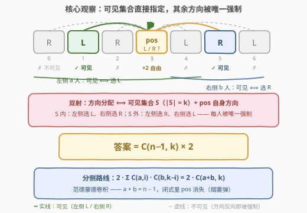
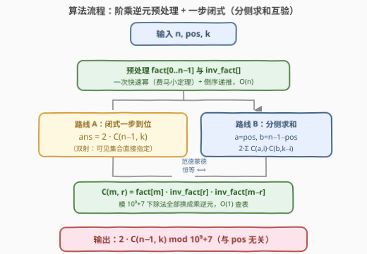

# LeetCode 恰好看到 K 个人的方向选择 题解

## 1. 题目概述

- **标题 / 题号**：恰好看到 K 个人的方向选择（#3881，medium）
- **链接**：https://leetcode.cn/problems/direction-assignments-with-exactly-k-visible-people/
- **难度**：中等
- **标签**：数学、组合数学

**题意**：有 $n$ 个人排成一排，下标从 $0$ 到 $n-1$。每个人**独立地**选择一个方向：

- `'L'`：只对他们**右边**的人可见；
- `'R'`：只对他们**左边**的人可见。

位于下标 $pos$ 的人观察其他人：下标 $i < pos$ 的人**可见当且仅当他们选择 `'L'`**；下标 $i > pos$ 的人**可见当且仅当他们选择 `'R'`**。返回使得位于 $pos$ 的人**恰好**看到 $k$ 个人的方向分配数量，对 $10^9+7$ 取余。

**示例 1**：

```text
输入：n = 3, pos = 1, k = 0
输出：2
解释：下标 0 在左侧必须选 'R'、下标 2 在右侧必须选 'L'，二人均不可见；
位于 1 的人自己选 'L' 或 'R' 均不影响计数，故答案为 2。
```

**示例 2**：

```text
输入：n = 3, pos = 2, k = 1
输出：4
解释：左侧 {0,1} 中恰一人选 'L'（2 种），右侧无人；位于 2 的人自由二选一，2 × 2 = 4。
```

**示例 3**：

```text
输入：n = 1, pos = 0, k = 0
输出：2
解释：左右均无人，pos 自己自由二选一。
```

**约束**：

- $1 \le n \le 10^5$
- $0 \le pos, k \le n-1$

> 💡 **审题关键**：① 每个人的选择只被「自己 + 观察者位置」两个因素决定，人与人之间**零交互**——不存在遮挡、身高、顺序问题；② $pos$ 看到的人全是**别人**，$pos$ 自己选什么都不影响他看到多少——这个「自由度 ×2」是全题最容易被漏掉的因子；③ $n \le 10^5$ 排除 $2^n$ 枚举，指向组合数学闭式；④ $k \le n-1$ 保证组合数 $C(n-1,k)$ 永不越界。

## 2. 解题思路

### 2.1 暴力思路：枚举全部 2ⁿ 种分配

枚举 $n$ 个人每人 `'L'`/`'R'` 的全部 $2^n$ 种分配，对每种分配数一遍 $pos$ 可见的人数：

```text
def dfs(i):
    if i == n: return count_visible() == k
    return dfs(i+1, 选 L) + dfs(i+1, 选 R)
```

复杂度 $O(2^n \cdot n)$：$n = 10^5$ 时是天文学数字。瓶颈在于**把「分配」当成独立个体逐个判定**——但「$pos$ 能否看见 $i$」只取决于 $i$ 自己选了什么（左侧看 `'L'`、右侧看 `'R'`），与其它任何人的选择无关。每个人对可见性的贡献**完全解耦**，这正是组合计数可以直接乘起来的前提。

### 2.2 核心观察：可见集合直接指定 ⇒ 答案 = 2·C(n−1, k)



**观察一（可见性只由本人方向决定）**：$pos$ 看见 $i$ 当且仅当「$i$ 在左侧且选 `'L'`」或「$i$ 在右侧且选 `'R'`」。设左侧有 $a = pos$ 人、右侧有 $b = n - pos - 1$ 人，则**每一侧内部的可见与否互不相干**，两侧可独立计数。

**观察二（选定可见集合 ⇒ 其余人方向被唯一强制）**：左侧某人选 `'L'` ⟺ 他是可见的，选 `'R'` ⟺ 不可见——左侧每个人只有「可见 = `'L'`」「不可见 = `'R'`」两种身份，且方向与身份一一对应；右侧镜像同理。于是「恰好 $k$ 个可见者」⟺「从其余 $n-1$ 人中指定一个大小为 $k$ 的可见集合 $S$」：$S$ 中左侧者选 `'L'$、右侧者选 `'R'`，$S$ 外左侧者选 `'R'`、右侧者选 `'L'`，**全部唯一确定**。

**观察三（pos 自身是自由变量）**：$pos$ 看到的人全在别人身上，他自己选 `'L'` 还是 `'R'` 不改变任何可见性——白送因子 $\times 2$。

把三条观察拼起来就是**双射计数**：

$$\text{答案} = \binom{n-1}{k} \times 2 \pmod{10^9+7}$$

> 💡 **pos 是烟雾弹**：闭式里根本没有 $pos$！无论观察者站在哪，他左右的「可见 = 左 L / 右 R」规则合起来恰好把「$n-1$ 人中任选 $k$ 个」与「方向分配」一一对应——位置只改变左、右两段的长短分摊，不改变总量。

**范德蒙德卷积互证**（与官方 hints 的分侧路线殊途同归）：分侧计算时，左侧出 $i$ 个可见、右侧出 $k-i$ 个可见，求和得

$$\text{答案} = 2 \sum_{i=\max(0,\,k-b)}^{\min(k,\,a)} \binom{a}{i}\binom{b}{k-i} \;\;\xlongequal{\;\text{Vandermonde}\;}\;\; 2\binom{a+b}{k} = 2\binom{n-1}{k}$$

范德蒙德恒等式的组合证明正是「从 $a+b$ 个里选 $k$ 个 = 左段选 $i$ 个、右段选 $k-i$ 个，对所有 $i$ 求和」——与上文双射是同一件事的两种说法。

### 2.3 算法流程图



| 步骤 | 操作 | 说明 |
|------|------|------|
| ① 预处理 | 线性推出 `fact[0..n-1]`，费马小定理求 `fact[n-1]^{MOD-2}` 后倒序推出 `inv_fact` | $O(n)$ 一趟，模 $10^9+7$（质数）下除法全部换成乘逆元 |
| ② 闭式 | $ans = 2 \cdot fact[n{-}1] \cdot inv\_fact[k] \cdot inv\_fact[n{-}1{-}k] \bmod MOD$ | $C(m, r)$ 定义保证 $k \le n-1$（约束给定），无越界 |
| ③ 互验（可选） | 分侧求和 $2\sum_i C(a,i)C(b,k{-}i)$ 对拍 | 与闭式恒等（范德蒙德），写题时可用于自检 |

### 2.4 示例演算

以**示例 2**（$n=3,\ pos=2,\ k=1$）演算两条路线：$a = 2,\ b = 0$，$m = n-1 = 2$。

| 路线 | 计算 | 结果 |
|------|------|------|
| 分侧求和 | $2 \times \big[C(2,1) \cdot C(0,0)\big] = 2 \times 2$ | $4$ ✓ |
| 闭式（范德蒙德） | $2 \cdot C(2, 1) = 2 \times 2$ | $4$ ✓ |

**示例 1**（$n=3,\ pos=1,\ k=0$）：$2 \cdot C(2,0) = 2 \times 1 = 2$ ✓。**示例 3**（$n=1,\ pos=0,\ k=0$）：$2 \cdot C(0,0) = 2$ ✓。三个示例一把闭式全部验证通过。

## 3. 参考代码

### C++

```cpp
class Solution {
    static constexpr int MOD = 1'000'000'007;

    long long qpow(long long b, long long e) {
        long long r = 1;
        while (e) {
            if (e & 1) r = r * b % MOD;
            b = b * b % MOD;
            e >>= 1;
        }
        return r;
    }

public:
    int countVisiblePeople(int n, int pos, int k) {
        vector<long long> fact(n), inv_fact(n);
        fact[0] = 1;
        for (int i = 1; i < n; ++i) fact[i] = fact[i - 1] * i % MOD;
        inv_fact[n - 1] = qpow(fact[n - 1], MOD - 2);          // 费马小定理
        for (int i = n - 1; i > 0; --i)
            inv_fact[i - 1] = inv_fact[i] * i % MOD;

        // 答案 = 2 · C(n-1, k)（范德蒙德卷积：Σ C(a,i)·C(b,k-i) = C(a+b,k)）
        int m = n - 1;
        long long c = fact[m] * inv_fact[k] % MOD * inv_fact[m - k] % MOD;
        return int(c * 2 % MOD);
    }
};
```

### Python

```python
class Solution:
    def countVisiblePeople(self, n: int, pos: int, k: int) -> int:
        MOD = 1_000_000_007
        fact = [1] * n
        for i in range(1, n):
            fact[i] = fact[i - 1] * i % MOD
        inv_fact = [1] * n
        inv_fact[n - 1] = pow(fact[n - 1], MOD - 2, MOD)       # 费马小定理
        for i in range(n - 1, 0, -1):
            inv_fact[i - 1] = inv_fact[i] * i % MOD

        # 答案 = 2 · C(n-1, k)（pos 是烟雾弹，闭式与 pos 无关）
        m = n - 1
        return fact[m] * inv_fact[k] % MOD * inv_fact[m - k] % MOD * 2 % MOD
```

> 💡 **写法要点**：① 逆元阶乘只需一次快速幂，其余用 `inv_fact[i-1] = inv_fact[i] · i` 倒序递推，避免 $n$ 次快速幂；② 中间乘积最大 $\approx (10^9)^2 < 2^{63}$，`long long` 全程安全，收尾取模收窄回 `int`；③ 约束保证 $k \le n-1$，若题目放宽需先判 $k > n-1$ 返回 $0$（组合数定义 $C(m,k)=0$）；④ 分侧求和版本（`a = pos, b = n-1-pos`，枚举 $i$）复杂度同为 $O(n)$，可作为对拍互验。

## 4. 复杂度分析

| 维度 | 复杂度 | 说明 |
|------|--------|------|
| **时间** | $O(n)$ | 阶乘与逆元阶乘各一趟线性递推 + 一次 $O(\log MOD)$ 快速幂，闭式查询 $O(1)$；$n = 10^5$ 毫无压力 |
| **空间** | $O(n)$ | 两个长度 $n$ 的模乘表；若只用一次 $C(n-1,k)$，可改用 $O(\min(k, n-1-k))$ 的「边乘边乘逆元」省成 $O(1)$ 额外空间（每步一次快速幂则时间变 $O(k \log MOD)$，得不偿失，通常不换） |
| **量级判断** | 对比暴力 $2^{10^5}$ | 可见性解耦 ⟹ 组合闭式一步到位；即使按 hints 的分侧求和也只有 $O(n)$，两者只差一个范德蒙德 |

## 5. 扩展

### 5.1 范德蒙德卷积：一步合并两侧的「批发」视角

$\sum_i \binom{a}{i}\binom{b}{k-i} = \binom{a+b}{k}$ 是组合计数里最常用的**求和坍缩**：当两侧独立、只在总量上汇合（左出 $i$、右出 $k-i$），求和式可整体收成一个组合数。识别信号是「**乘积形式 + 指标互补 + 求和范围随边界自动截断**」。反过来，遇到单个 $\binom{a+b}{k}$ 也可故意**拆成两段**（按需要插入分段边界）转成求和式——拆与合是同一恒等式的两个方向。特例 $\sum_i \binom{n}{i}^2 = \binom{2n}{n}$（中央二项系数）。

### 5.2 变体速查

- **问「恰好 k 个」改成「至少 k 个」**：答案 $= 2\sum_{j \ge k}\binom{n-1}{j}$，无更简闭式，用逆元阶乘表对 $j$ 求和仍是 $O(n)$；注意不要试图用 $2^{n-1}$ 的对称性硬凑（部分和不对称）。
- **观察者变成「每个人」**（问所有人对看到的个数都有要求）：完全不同的问题，交互不再解耦，通常需要按端点/单调结构分析（参照 1944 队列中可见人数的「遮挡型」可见性）。
- **引入遮挡**（高个子挡住矮个子）：可见性不再只由本人方向决定，闭式失效，退回单调栈 $O(n)$ 计数——「解耦」是本题全部红利的来源，也是扩展时第一个要检查的性质。
- **方向改成三选**（如加 `'B'` 双向可见）：仍是「每人独立指定身份」，可见集合的组合数不变，变的只是不可见者与 $pos$ 自身的自由度倍数。

## 6. 面试要点

**Q1：为什么答案与 $pos$ 完全无关？怎么向面试官讲清楚？**

> 双射论证：一个方向分配 ⟺ 「可见集合 $S$（大小 $k$）+ $pos$ 自身方向」。$S$ 中每个人方向被「左右位置 + 可见性」唯一确定，$S$ 外同样被唯一确定（反向），$pos$ 自由二选一。所以计数 $= \binom{n-1}{k} \cdot 2$，全程只有「其余共 $n-1$ 人」这一个总量参与。分侧视角下这是范德蒙德卷积 $\sum_i \binom{a}{i}\binom{b}{k-i} = \binom{a+b}{k}$，位置只影响 $a,b$ 的分摊，不影响 $a+b$。

**Q2：$\times 2$ 这个因子为什么容易漏？**

> 直觉上「$pos$ 自己也要选方向」和「$pos$ 看到多少人」容易混在一起。但可见性的定义全部落在**别人**身上：左侧看 `'L'`、右侧看 `'R'`，没有任何条款涉及 $pos$ 自己的选择。三个示例都含这个因子（$2/4/2$ 全是偶数），拿示例验算是最快的自查手段。

**Q3：模 $10^9+7$ 下怎么算大组合数？**

> 质数模 + 费马小定理：$C(m,r) = fact[m] \cdot inv\_fact[r] \cdot inv\_fact[m-r]$，其中 $inv\_fact$ 由 $fact[m]^{MOD-2}$ 一次快速幂后倒序递推（$inv\_fact[i-1] = inv\_fact[i] \cdot i$）。$O(n)$ 预处理、$O(1)$ 查询；模数不是质数时需 exLucas 或阶乘分解，本题用不到。

**Q4：如果没看出范德蒙德，分侧求和的写法对不对？**

> 完全正确且是官方 hints 的路线：$a = pos$、$b = n-1-pos$，答案 $= 2\sum_{i=\max(0,k-b)}^{\min(k,a)}\binom{a}{i}\binom{b}{k-i}$。复杂度同样 $O(n)$。两条路线结果恒等，写题时甚至可以一条当主解、一条当对拍——「先写笨办法再化简」在组合计数题里是稳妥的工程习惯。

**Q5：这题的「解耦」性质如果被破坏，会发生什么？**

> 组合计数能直接乘，前提是各人选择的效果互不影响。本题可见性只读「本人方向 + 相对位置」两个局部量。一旦引入遮挡（高个挡矮个，见 1944）或多人耦合约束，「指定可见集合 ⇒ 分配唯一」不再成立，闭式消失，需退回结构化计数（单调栈/DP）。面试中主动指出「我的解法依赖哪条性质、何时失效」是高分信号。

> 💡 **一句话总结**：3881 =「可见性逐人解耦 ⟹ 可见集合直接指定 $\binom{n-1}{k}$」+「$pos$ 自身自由 $\times 2$」+「分侧求和被范德蒙德坍缩成一步」。带走的知识点：**「恰好 k 个」型计数先找双射——把 k 个名额当成被指定的集合，其余自由度逐一清点**。

## 同类练习题

| # | 题目 | 与本题的关联 |
|---|------|-------------|
| 77 | [组合](https://leetcode.cn/problems/combinations/)（[题解](../0001-0100/77_组合.md)） | 本题闭式的母题——「从 $n-1$ 人中选 $k$ 个可见者」正是从 $m$ 个元素里选 $k$ 个的抽象 |
| 1735 | [生成乘积数组的方案数](https://leetcode.cn/problems/count-ways-to-make-array-with-product/)（[题解](../1701-1800/1735_生成乘积数组的方案数.md)） | 阶乘 + 模逆元求组合数的工程模板加强版（质因数指数上做隔板法） |
| 2514 | [统计同位异构字符串数目](https://leetcode.cn/problems/count-anagrams/)（[题解](../2501-2600/2514_统计同位异构字符串数目.md)） | 多重集排列 $= m!/\prod c_i!$，模世界除法换逆元的同款处理 |
| 2954 | [统计感冒序列的数目](https://leetcode.cn/problems/count-the-number-of-infection-sequences/)（[题解](../2901-3000/2954_统计感冒序列的数目.md)） | 分段组合数乘积再求和的困难版——范德蒙德救不了场时老实分段乘 |
| 2400 | [恰好移动 k 步到达某一位置的方法数目](https://leetcode.cn/problems/number-of-ways-to-reach-a-position-after-exactly-k-steps/) | 「恰好」型计数的另一形态，约束拆解后同样一步化成单个组合数 |
