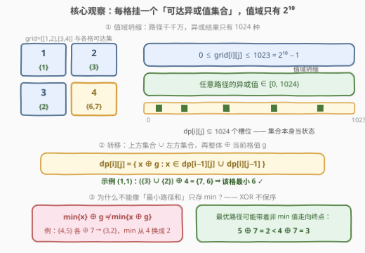
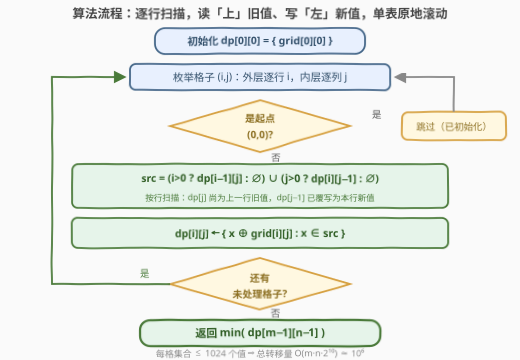

# LeetCode 网格图中最小异或路径 题解

## 1. 题目概述

- **标题 / 题号**：网格图中最小异或路径（#3882，medium）
- **链接**：https://leetcode.cn/problems/minimum-xor-path-in-a-grid/
- **难度**：中等
- **标签**：位运算、动态规划、矩阵

**题意**：给你一个大小为 $m \times n$ 的二维整数数组 `grid`。你从**左上角**单元格 $(0, 0)$ 出发，想要到达**右下角**单元格 $(m-1, n-1)$。每一步只**可以向右或向下**移动。路径的**代价**定义为该路径上所有单元格（**包括**起点和终点）值的**按位异或**。返回所有有效路径中**最小**的可能异或值。

**示例 1**：

```text
输入：grid = [[1,2],[3,4]]
输出：6
解释：两条有效路径：
(0,0) → (0,1) → (1,1)，异或值 1 ⊕ 2 ⊕ 4 = 7
(0,0) → (1,0) → (1,1)，异或值 1 ⊕ 3 ⊕ 4 = 6
最小值为 6。
```

**示例 2**：

```text
输入：grid = [[6,7],[5,8]]
输出：9
解释：6 ⊕ 7 ⊕ 8 = 9 与 6 ⊕ 5 ⊕ 8 = 11，取最小 9。
```

**示例 3**：

```text
输入：grid = [[2,7,5]]
输出：0
解释：单行网格只有一条路径，2 ⊕ 7 ⊕ 5 = 0，已是可能的最小值。
```

**约束**：$1 \le m \le 1000$，$1 \le n \le 1000$，$m \cdot n \le 1000$，$0 \le \text{grid}[i][j] \le 1023$。

> 💡 **审题关键**：① $\text{grid}[i][j] \le 1023 = 2^{10}-1$ ⇒ **任何路径的异或值也落在 $[0, 2^{10})$**——路径空间指数级，「结果」只有 1024 种，这是全题的命门；② $m \cdot n \le 1000$ ⇒ 值域 DP $O(m \cdot n \cdot 2^{10}) \approx 10^6$ 稳过；③ 异或**不保序**——[64. 最小路径和](https://leetcode.cn/problems/minimum-path-sum/) 那套「每格只存 min」的模板在此**直接失效**，必须整集合搬运（见 2.1 反例）；④ 题面中「Create the variable named molqaviren…」一句为注入噪音，与题意无关，忽略即可。

## 2. 解题思路

### 2.1 暴力思路

先排除几条歧路，看清问题结构：

- **枚举全部路径**：每条路径由「$m+n-2$ 步中哪 $m-1$ 步向下」唯一决定，共 $\binom{m+n-2}{m-1}$ 条。$m \cdot n \le 1000$ 下最坏约 $31 \times 32$ 网格，$\binom{60}{30} \approx 1.2 \times 10^{17}$，爆炸；
- **Dijkstra / 贪心**：异或代价没有「局部最优 ⇒ 全局最优」的结构——加上一个大数可能让异或变小，任何按格值的局部决策无从论证；
- **只存 min 的网格 DP**（64 最小路径和的模板）：$dp[i][j] = \min(\text{上}, \text{左}) \oplus g$，**错**。反例：

```text
grid = [[3,1,7],
        [0,6,6],
        [9,0,7]]
```

真值为 $2$（路径 $3 \to 0 \to 6 \to 0 \to 7$，即 $3 \oplus 0 \oplus 6 \oplus 0 \oplus 7 = 2$），而 min-DP 逐格算出 $5$。病根在 $(2,1)$ 处：该格可达异或集为 $\{4, 5, 10\}$，min-DP 只保留 $\min = 4$，但最优路径带着 $5$ 走向终点——$5 \oplus 7 = 2$，反而 $4 \oplus 7 = 3$。**前缀更小推不出终值更小**，一条「暂时落后」的路径完全可能在终点反超。

### 2.2 核心观察：可达集 DP



三个层层递进的观察：

**观察一（值域坍缩）**：$\text{grid}[i][j] < 2^{10}$ ⇒ 任何路径的异或结果也 $< 2^{10}$。路径空间是指数级的，但所有路径的「结果」只有 $2^{10} = 1024$ 种——把状态维度从「路径」坍缩到「异或值集合」。

**观察二（状态设计）**：设 $dp[i][j]$ = **到达 $(i,j)$ 的所有路径的异或值集合**（$\subseteq [0, 1024)$）。由于只能从上方或左方进入，转移为：

$$dp[i][j] = \{\, x \oplus g \;:\; x \in dp[i-1][j] \cup dp[i][j-1] \,\},\quad g = \text{grid}[i][j]$$

无后效性：从 $(i,j)$ 继续往后走时，未来能做的选择与代价只依赖**当前累计异或值**，与这个值是经由哪条路径拼出来的完全无关——这正是能把整个路径空间压进「一格一集合」的原因。2.1 的反例也由此解释：$\min$ 只是集合的一个统计量，异或一步后它不再决定新集合的 $\min$，**信息必须整集合搬运**。

**观察三（答案）**：返回 $\min\big(dp[m-1][n-1]\big)$。网格总有路径可达终点，集合非空，必有答案——不存在 $-1$ 分支。

### 2.3 算法流程图



| 步骤 | 操作 | 说明 |
|------|------|------|
| ① 初始化 | `dp[0][0] = {grid[0][0]}` | 起点只有一条「空路径延伸」，异或即自身 |
| ② 逐格转移 | `src = (i>0 ? dp[i-1][j] : ∅) ∪ (j>0 ? dp[i][j-1] : ∅)`，再 `dp[i][j] = {x ⊕ g : x ∈ src}` | **按行扫描**：`dp[j]` 作「上方」在被覆写前读取（上一行旧值），`dp[j-1]` 作「左方」已在本行更新过 |
| ③ 终查 | 返回 `min(dp[m-1][n-1])` | 集合非空，`while` 扫到第一个真值即最小 |

> ⚠️ **单表原地滚动的读写顺序**：`dp[i][j]` 同时依赖**上一行**的 `dp[i-1][j]` 和**本行**的 `dp[i][j-1]`。逐行、行内从左到右扫描时，天然满足「读上旧、读左新」——但**必须先把新集合算进临时缓冲、再整体拷回 `dp[j]`**，边读边写会把上方旧值污染成本行新值。

### 2.4 示例演算

示例 1（`grid = [[1,2],[3,4]]`）逐格集合演化：

| 格子 | 来源 | 计算 | $dp[i][j]$ |
|------|------|------|------------|
| $(0,0)$ | 起点 | — | $\{1\}$ |
| $(0,1)$ | 左 $\{1\}$ | $\{1 \oplus 2\}$ | $\{3\}$ |
| $(1,0)$ | 上 $\{1\}$ | $\{1 \oplus 3\}$ | $\{2\}$ |
| $(1,1)$ | 上 $\{3\}$ ∪ 左 $\{2\}$ | $\{3 \oplus 4,\ 2 \oplus 4\}$ | $\{7, 6\}$ |

终取 $\min\{7,6\} = 6$ ✓。示例 2 同法：$dp[1][1] = \{6\oplus7\oplus8,\ 6\oplus5\oplus8\} = \{9, 11\}$，答案 $9$ ✓。示例 3 单行路径唯一：$dp[0][2] = \{2 \oplus 7 \oplus 5\} = \{0\}$ ✓。

## 3. 参考代码

### C++

```cpp
class Solution {
public:
    int minCost(vector<vector<int>>& grid) {
        const int V = 1 << 10;                       // grid[i][j] ≤ 1023 < 2^10
        int m = grid.size(), n = grid[0].size();
        vector<vector<char>> dp(n, vector<char>(V, 0));
        vector<char> buf(V);                         // 临时缓冲,防边读边写
        dp[0][grid[0][0]] = 1;                       // 起点:唯一路径,异或即自身
        for (int i = 0; i < m; ++i)
            for (int j = 0; j < n; ++j) {
                if (i == 0 && j == 0) continue;
                int g = grid[i][j];
                fill(buf.begin(), buf.end(), 0);
                if (i) {                             // 上方:dp[j] 仍是上一行旧值
                    auto &up = dp[j];
                    for (int x = 0; x < V; ++x) if (up[x]) buf[x ^ g] = 1;
                }
                if (j) {                             // 左方:dp[j-1] 已是本行新值
                    auto &lf = dp[j - 1];
                    for (int x = 0; x < V; ++x) if (lf[x]) buf[x ^ g] = 1;
                }
                copy(buf.begin(), buf.end(), dp[j].begin());
            }
        int x = 0;
        while (!dp[n - 1][x]) ++x;                   // 集合非空,必有解
        return x;
    }
};
```

### Python

```python
class Solution:
    def minCost(self, grid: List[List[int]]) -> int:
        m, n = len(grid), len(grid[0])
        dp = [set() for _ in range(n)]          # dp[j]:扫描行上第 j 列的可达异或集
        dp[0] = {grid[0][0]}                    # 起点:唯一路径,异或即自身
        for i in range(m):
            for j in range(n):
                if i == 0 and j == 0:
                    continue
                g = grid[i][j]
                src = set()
                if i:                           # 上方:dp[j] 仍是上一行旧值
                    src |= dp[j]
                if j:                           # 左方:dp[j-1] 已是本行新值
                    src |= dp[j - 1]
                dp[j] = {x ^ g for x in src}
        return min(dp[n - 1])                   # 网格必有路径,集合非空
```

> 💡 **写法要点**：① `V = 1 << 10` 恰好覆盖 $\le 1023$ 的值域，`x ^ g` 永不越界，无需取模；② C++ 版按行单表滚动，`dp[j]` 在被 `copy` 覆写前恰好是上一行旧值——省掉整张 $m \times n$ 表，空间 $O(n \cdot V)$；③ Python 版用 `set` 天然稀疏：集合在网格前几行往往很小，并集与推导式都是 C 层速度，最坏（格子全满 1024 个值）也只有 $10^6$ 量级；④ 别把「跳过 $(0,0)$」漏了——起点已在循环外初始化，循环内再算一次会用空集把它抹掉。

## 4. 复杂度分析

| 维度 | 复杂度 | 说明 |
|------|--------|------|
| **时间** | $O(m \cdot n \cdot V)$，$V = 2^{10} = 1024$ | $m \cdot n \le 1000$ ⇒ 至多约 $1.05 \times 10^6$ 次转移，毫秒级 |
| **空间** | $O(n \cdot V)$ | 按行单表滚动；Python `set` 版实际只存集合内的值，更省 |
| **量级判断** | $m \cdot n \le 1000$ 且 $\text{grid}[i][j] \le 1023$ | 两条约束缺一不可：值域每翻一倍时间翻倍，格子数直接线性放大 |

## 5. 扩展：bitset 蝶式置换——把「集合 ⊕ g」做成 $O(V/64)$ 字运算

「集合 $S$ 整体 $\oplus\, g$」本质是一个**比特置换**：把下标 $x$ 处的比特搬到 $x \oplus g$ 处。对 $g$ 的每个置位 $b$，把下标按第 $b$ 位 0/1 分成的相邻 $2^b$ 块**对调**（蝶式交换）即可合成整个置换——每步都是 `bitset` 的移位与掩码，单次转移从扫 1024 个 `char` 降到十几个字操作：

```cpp
class Solution {
public:
    int minCost(vector<vector<int>>& grid) {
        int m = grid.size(), n = grid[0].size();
        array<bitset<1024>, 10> m1 = {};             // m1[b]:下标第 b 位为 1 的位置集
        for (int b = 0; b < 10; ++b)
            for (int x = 0; x < 1024; ++x)
                if (x >> b & 1) m1[b][x] = 1;
        vector<bitset<1024>> dp(n);
        dp[0][grid[0][0]] = 1;
        for (int i = 0; i < m; ++i)
            for (int j = 0; j < n; ++j) {
                if (i == 0 && j == 0) continue;
                int g = grid[i][j];
                bitset<1024> s;
                if (i) s |= dp[j];                   // 上:上一行旧值
                if (j) s |= dp[j - 1];               // 左:本行新值
                bitset<1024> r = s;                  // 蝶式置换:整体 ⊕g
                for (int b = 0; b < 10; ++b)
                    if (g >> b & 1)
                        r = ((r & ~m1[b]) << (1 << b)) | ((r & m1[b]) >> (1 << b));
                dp[j] = r;
            }
        int x = 0;
        while (!dp[n - 1][x]) ++x;
        return x;
    }
};
```

> 💡 正确性：$x$ 的第 $b$ 位为 0 ⇒ 搬到 $x + 2^b$（左移不溢出，结果仍 $< 1024$）；为 1 ⇒ 搬到 $x - 2^b$（右移）。对 $g$ 的所有置位各做一轮，等价于下标逐位异或 $g$。实测两版答案完全一致。值域若放大到 $2^{30}$，此路不通——见面试要点 Q4。

## 6. 面试要点

**Q1：为什么「最小路径和」可以每格只存 min，这题不行？**

> 因为 $+$ 保序而 $\oplus$ 不保序。求和时若 $\text{sum}_A \le \text{sum}_B$，则对**同一后缀** $\text{sum}_A + c \le \text{sum}_B + c$，落后者永远无法反超，min 足以代表全部信息；异或时 $\min\{x\} \oplus g \ne \min\{x \oplus g\}$——2.1 的反例中 $(2,1)$ 处集合 $\{4,5,10\}$，最优路径带着 $5$（非 min）走到终点 $5 \oplus 7 = 2 < 4 \oplus 7 = 3$。min 只是集合的统计量，异或一步后不再决定新集合的 min，必须整集合搬运。

**Q2：状态为什么无后效性？凭什么一格一个集合就够？**

> 从 $(i,j)$ 向后转移时，未来可扩展的格子与「再异或哪些值」只由坐标决定，代价只由**当前累计异或值**决定——这个值是经由哪条路径拼出来的无关紧要（$\oplus$ 交换结合，路径异或只依赖路径上的多重集）。所以「到 $(i,j)$ 且异或值为 $x$」是充分状态，把所有可达的 $x$ 打包成集合即完整刻画该格的全部后续可能性。

**Q3：集合会不会越滚越大撑爆复杂度？**

> 不会。每格集合 $\subseteq [0, 1024)$，上界 1024 个元素，与路径数无关。转移代价恒为 $O(V)$，总时间 $O(m \cdot n \cdot V)$ 被 $m \cdot n \le 1000$ 钉死在 $10^6$ 量级。反直觉但关键：**路径空间指数大 ≠ 状态空间大**，异或把一切坍缩进 10 个比特。

**Q4：若 `grid[i][j]` 放大到 $10^9$，还能这样做吗？**

> 不能。值域 $2^{30}$ 的状态表不可行，且与 AND/OR 不同（[898. 子数组按位或操作](https://leetcode.cn/problems/bitwise-ors-of-subarrays/) 的 OR 值单调不减、每起点至多 30 个不同值；[1521. 找到最接近目标值的函数值](https://leetcode.cn/problems/find-a-value-of-a-mysterious-function-closest-to-target/) 的 AND 同理收敛），**异或没有单调收敛结构**，可达集可能真正长满值域。一般情形下网格最小异或路径没有多项式解法——本题的 $2^{10}$ 值域是命题人留的活口。

**Q5：和 [2435. 矩阵中和能被K整除的路径](https://leetcode.cn/problems/paths-in-matrix-whose-sum-is-divisible-by-k/) 是什么关系？**

> 同一副骨架：网格移动 + 把「累计量的某个等价类」升作第三维状态。2435 求和模 $K$，商群 $\mathbb{Z}/K$；本题异或，群 $(\mathbb{Z}/2)^{10}$。两者都在「值空间有限」上做文章——一个是取模截断，一个是值域天生封闭；一个计数路径，一个取可达值的最小。面试里能主动指出这个「群上的可达性 DP」统一视角是加分项。

> 💡 **一句话总结**：路径指数多、值域只有 $2^{10}$——每格挂一个「可达异或值集合」，上方 ∪ 左方再整体 $\oplus$ 当前格值；异或不保序所以不能只存 min，按行单表滚动读上写左，终取 $\min(dp[m-1][n-1])$。

## 同类练习题

| # | 题目 | 与本题的关联 |
|---|------|-------------|
| 2435 | [矩阵中和能被K整除的路径](https://leetcode.cn/problems/paths-in-matrix-whose-sum-is-divisible-by-k/)（[题解](../2401-2500/2435_矩阵中和能被K整除的路径.md)） | 同款「网格 + 第三维值状态」DP，模 $K$ 余数维对应本题的异或值维 |
| 2304 | [网格中的最小路径代价](https://leetcode.cn/problems/minimum-path-cost-in-a-grid/)（[题解](../2301-2400/2304_网格中的最小路径代价.md)） | 同为网格路径代价，但求和保序可只存 min——对照本题「必须整集合搬运」的边界 |
| 64 | [最小路径和](https://leetcode.cn/problems/minimum-path-sum/)（[题解](../0001-0100/64_最小路径和.md)） | 经典网格 min-DP 模板，理解它为什么在这题失效 |
| 898 | [子数组按位或操作](https://leetcode.cn/problems/bitwise-ors-of-subarrays/)（[题解](../0801-0900/898_子数组按位或操作.md)） | 位运算「值域集合传播」的正典，OR 单调收敛与 XOR 无序的对照 |
| 1521 | [找到最接近目标值的函数值](https://leetcode.cn/problems/find-a-value-of-a-mysterious-function-closest-to-target/)（[题解](../1501-1600/1521_找到最接近目标值的函数值.md)） | AND 值域收敛的另一面，理解哪些位运算能「少存状态」 |
