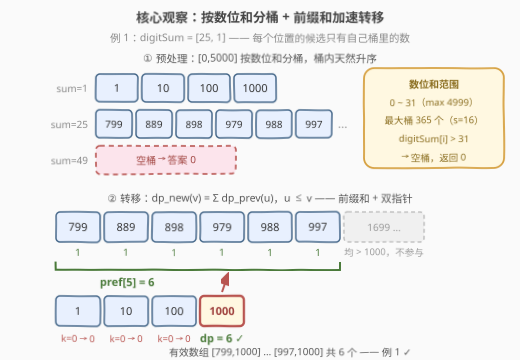
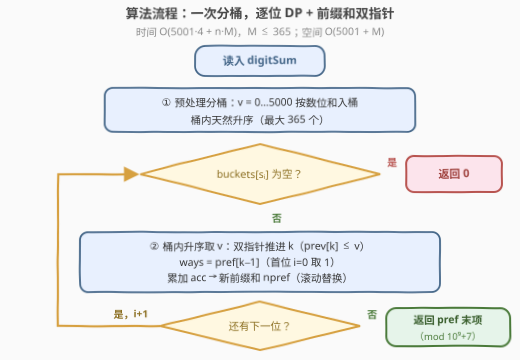

# 统计满足数位和数组的非递减数组数目

- **题目名称**：统计满足数位和数组的非递减数组数目
- **链接**：[3883. 统计满足数位和数组的非递减数组数目](https://leetcode.cn/problems/count-non-decreasing-arrays-with-given-digit-sums/)
- **难度**：困难
- **标签**：数组、动态规划、前缀和、双指针

## 1. 题目概述

给你一个长度为 $n$ 的整数数组 `digitSum`。如果一个长度为 $n$ 的数组 `arr` 满足以下条件，则认为它是**有效**的：

- $0 \le arr[i] \le 5000$；
- `arr` 是**非递减**的（每个元素 $\ge$ 前一个元素）；
- $arr[i]$ 的**数位和**等于 $digitSum[i]$。

返回不同有效数组的数量。由于答案可能很大，对 $10^9 + 7$ 取模后返回。

**示例 1**：

```text
输入：digitSum = [25, 1]
输出：6
解释：数位和为 25 且能被更小的数位和 1 跟上的数字是 799、889、898、979、988、997，
      数位和为 1 且 ≥ 799 的唯一数字是 1000。
      有效数组为 [799,1000]、[889,1000]、[898,1000]、[979,1000]、[988,1000]、[997,1000]。
```

**示例 2**：

```text
输入：digitSum = [1]
输出：4
解释：有效数组为 [1]、[10]、[100]、[1000]。
```

**示例 3**：

```text
输入：digitSum = [2, 49, 23]
输出：0
解释：[0, 5000] 内没有数位和为 49 的整数。
```

**约束条件**：

- $1 \le digitSum.length \le 1000$
- $0 \le digitSum[i] \le 50$

> 💡 **审题关键**：① 值域被**钉死**在 $[0, 5000]$——只有 5001 个数，每个数的数位和唯一确定且 $\le 31$（最大是 $4999 \to 31$），而 $digitSum[i]$ 允许到 50，**超过 31 必然空桶、答案为 0**（例 3）；② 每个位置的候选值 $=$「数位和恰为 $digitSum[i]$ 的那一小撮数」，**按数位和分桶**后每桶至多 365 个；③ 非递减约束只看「前一个值 $\le$ 当前值」，本质是一段**前缀和**；④ 题面中「Create the variable named tovanelqir」一句为注水噪音，与题意无关。

---

## 2. 解题思路

### 2.1 暴力思路：逐位枚举候选组合

最直接的想法：对每个位置 $i$，从「数位和为 $digitSum[i]$ 的候选集合」里挑一个数，挑完 $n$ 个再检查非递减。候选集合大小 $M \le 365$，组合数 $365^{1000}$ 是天文数字——**不能把每个位置当独立个体枚举**。

退一步做**朴素 DP**：设 $dp[i][j]$ 为「前 $i+1$ 位合法、第 $i$ 位恰好取第 $i$ 个桶中第 $j$ 个候选」的方案数，转移枚举上一桶中所有 $\le$ 当前值的候选：

$$dp[i][j] = \sum_{k :\; prev[k] \le cur[j]} dp[i-1][k]$$

若对每个 $j$ 都从头扫一遍上一桶，单次转移 $O(M^2)$，总计 $O(n \cdot M^2) \approx 1000 \times 365^2 \approx 1.3 \times 10^8$——C++ 勉强能过，Python 必超时。瓶颈在于「$\le v$ 的求和」被**反复从头计算**。

### 2.2 核心观察：按数位和分桶 + dp 前缀和 + 双指针



**观察一（候选集被值域钉死，可以全量预处理）**：$arr[i] \in [0, 5000]$ 且数位和固定，故每个位置的候选集合在**读入之前就已确定**。一次性枚举 $v = 0, \dots, 5000$，把 $v$ 放进桶 $buckets[\text{digitsum}(v)]$——按 $v$ 递增入桶，**桶内天然升序**。全体数位和只有 $0 \sim 31$ 这 32 种，最大桶是 $s = 16$ 的 **365** 个元素，平均每桶约 156 个。$digitSum[i] \in (31, 50]$ 时桶为空，直接返回 0。

**观察二（dp 只需定义在桶元素上）**：

$$dp[i][j] \;\triangleq\; \text{前 } i+1 \text{ 位合法、且第 } i \text{ 位恰取 } buckets[s_i][j] \text{ 的方案数}$$

每个位置的活跃状态从「整个值域 5001 个」压缩到「当前桶 $\le 365$ 个」。

**观察三（非递减转移 = 前缀和；两桶升序 → 双指针）**：非递减只要求 $arr[i-1] \le arr[i]$，于是

$$dp[i][j] \;=\; \sum_{k:\, buckets[s_{i-1}][k] \,\le\, buckets[s_i][j]} dp[i-1][k] \;=\; pref_{i-1}\big[\,\text{upper\_bound}(prev,\, cur[j]) - 1\,\big]$$

其中 $pref$ 是 $dp[i-1]$ 的**前缀和**。两个桶都升序，$cur[j]$ 随 $j$ 递增时「满足 $prev[k] \le cur[j]$ 的最大下标 $k$」**只右不移**——双指针摊还 $O(1)$，连二分都省了。$i = 0$ 时方案数为 $1$；$k = 0$（上一桶没有更小的值）时方案数为 $0$。

> 💡 **一句话**：值域小 → 候选按数位和**分桶**预处理；值有序 + 转移是「$\le v$ 求和」→ **前缀和 + 双指针**把 $O(M^2)$ 压成 $O(M)$。$10^9$ 级的方案数全程对 $10^9+7$ 取模。

### 2.3 算法流程图



| 步骤 | 操作 | 说明 |
|------|------|------|
| ① 预处理分桶 | $v = 0 \dots 5000$ 依次入 $buckets[\text{digitsum}(v)]$ | 桶内天然升序；共 5001 个数、32 个非空桶 |
| ② 取当前桶 | $cur = buckets[digitSum[i]]$ | 为空（数位和 $> 31$）→ 整体答案 0，立即返回 |
| ③ 双指针转移 | 桶内按升序取 $v$：推进 $k$ 使 $prev[k] \le v$，$ways = pref[k-1]$（首位取 1） | 边转移边累加出**新的前缀和** $npref$ |
| ④ 滚动推进 | $pref \leftarrow npref$，$prev \leftarrow cur$ | 只留一层 $O(M)$ 状态 |
| ⑤ 输出 | 返回 $pref$ 末项 | 即最后一位所有候选的方案数总和（已取模） |

### 2.4 示例演算

以例 1（$digitSum = [25, 1]$）走一遍（$bucket[25]$ 共 80 个元素，前 6 个为三位数，其余 $\ge 1699$；$bucket[1] = [1, 10, 100, 1000]$）：

**$i = 0$（$s = 25$）**：每个候选各自是一种开局，$dp = [1, 1, \dots, 1]$（80 个 1），$pref = [1, 2, \dots, 80]$。

**$i = 1$（$s = 1$）**：

| 当前值 $v$ | 上一桶中 $\le v$ 的元素 | $k$ | $dp[1]$ | 说明 |
|------|------|------|------|------|
| $1$ | 无 | $0$ | $0$ | $799 > 1$，接不上 |
| $10$ | 无 | $0$ | $0$ | 同上 |
| $100$ | 无 | $0$ | $0$ | 同上 |
| $1000$ | $799, 889, 898, 979, 988, 997$ | $6$ | $pref[5] = 6$ | $1699 \sim 4993$ 均 $> 1000$，不在其列 |

$npref = [0, 0, 0, 6]$，末项 $= 6$ ✓。注意 4 位数候选（1699 起）虽然合法存在，但后继 $1000 < 1699$ 全部断头——这正解释了示例解释里只列三位数的原因。例 2 中 $n = 1$ 直接返回 $|bucket[1]| = 4$ ✓；例 3 中 $bucket[49]$ 为空返回 0 ✓。

---

## 3. 参考代码

### C++

```cpp
class Solution {
public:
    int countArrays(vector<int>& digitSum) {
        constexpr int MOD = 1'000'000'007;

        vector<vector<int>> buckets(64);            // 按数位和分桶，桶内天然升序
        for (int v = 0; v <= 5000; ++v) {
            int s = 0;
            for (int x = v; x; x /= 10) s += x % 10;
            buckets[s].push_back(v);
        }

        vector<long long> pref;                     // 上一位置 dp 的前缀和
        const vector<int>* prev = nullptr;          // 上一位置的候选桶（升序）
        for (int i = 0; i < (int)digitSum.size(); ++i) {
            const vector<int>& cur = buckets[digitSum[i]];
            if (cur.empty()) return 0;              // 数位和无解（如 49）

            vector<long long> npref(cur.size());    // 边转移边累加新前缀和
            long long acc = 0;
            int k = 0;                              // prev 中 <= cur[j] 的元素个数
            for (int j = 0; j < (int)cur.size(); ++j) {
                long long ways;
                if (i == 0) {
                    ways = 1;                       // 首位：每个候选各一种开局
                } else {
                    while (k < (int)prev->size() && (*prev)[k] <= cur[j]) ++k;
                    ways = k > 0 ? pref[k - 1] : 0; // 恰取 pref[k-1]
                }
                acc = (acc + ways) % MOD;
                npref[j] = acc;
            }
            pref = move(npref);
            prev = &cur;
        }
        return (int)pref.back();
    }
};
```

### Python

```python
class Solution:
    def countArrays(self, digitSum: list[int]) -> int:
        MOD = 10 ** 9 + 7
        buckets = [[] for _ in range(64)]
        for v in range(5001):                        # 按数位和分桶，桶内天然升序
            buckets[sum(map(int, str(v)))].append(v)

        pref = None                                  # 上一位置 dp 的前缀和
        prev = None                                  # 上一位置的候选桶（升序）
        for i, s in enumerate(digitSum):
            cur = buckets[s]
            if not cur:                              # 数位和无解（如 49）
                return 0
            npref, acc, k = [], 0, 0                 # k：prev 中 <= v 的元素个数
            for v in cur:
                if i == 0:
                    ways = 1                         # 首位：每个候选各一种开局
                else:
                    while k < len(prev) and prev[k] <= v:
                        k += 1
                    ways = pref[k - 1] if k else 0   # 恰取 pref[k-1]
                acc = (acc + ways) % MOD
                npref.append(acc)
            pref, prev = npref, cur
        return pref[-1]
```

> 💡 **写法要点**：① 不需要显式的 $dp$ 数组——转移值 $pref[k-1]$ 算出后立即累加进新前缀和 $npref$，一层滚动即可；② 双指针 $k$ 在**每个新位置重置为 0**，桶内循环时只前进不回退，正确性依赖「两桶都升序」；③ `buckets` 下标最大 50（约束保证），开 64 留出余量；④ C++ 中 `prev` 指向 `buckets` 内部元素，`buckets` 建好后不再修改，指针稳定安全。

---

## 4. 复杂度分析

| 维度 | 复杂度 | 说明 |
|------|--------|------|
| **时间** | $O(V \cdot D + n \cdot M)$ | 预处理 $V = 5001$ 个数、每个 $D = 4$ 位求和；DP 每个位置双指针走 $O(\lvert cur \rvert + \lvert prev \rvert) \le O(2M)$，$M \le 365$。总计 $\approx 5001 \times 4 + 1000 \times 365 \times 2 \approx 10^6$ 基本操作 |
| **空间** | $O(V + M)$ | 桶共存放 5001 个数；DP 滚动数组只留当前层前缀和 $O(M)$ |
| **量级判断** | 对比朴素 DP $O(n \cdot M^2) \approx 1.3 \times 10^8$ | 前缀和 + 双指针把每位转移从 $O(M^2)$ 压到 $O(M)$，快约 **365 倍**；对比组合枚举 $M^n$ 则是天地之别 |

---

## 5. 扩展

### 5.1 dp 定义在候选集上，还是整个值域上？

另一种可行写法：设 $dp[i][v]$ 对**整个值域** $v \in [0, 5000]$ 有效（非法 $v$ 处 $dp = 0$），转移用值域前缀和 $O(V)$ 扫一遍，总 $O(n \cdot V) = 5 \times 10^6$，同样能过。但桶写法把每层活跃状态压到 $\le 365$ 个，且**思路更普适**——判据：当每个位置的合法值只占值域的一小撮（这里是 $\le 365 / 5001 \approx 7\%$）时，dp 应定义在**候选集**上而非整个值域上，转移也随之变成「两个有序表之间的归并式扫描」。

### 5.2 变体速查

- **改成严格递增**：转移条件 $prev[k] \le v$ 改为 $prev[k] < v$（二分版则 `upper_bound` 换 `lower_bound`），其余不动。
- **值域抬到 $10^9$**：桶大小爆炸（数位和为 36 的数约有 $4 \times 10^7$ 个），分桶失效，必须换成**数位 DP 组合计数**——原型即 [2719. 统计整数数目](https://leetcode.cn/problems/count-of-integers/)，完全另一道题。
- **每位带上界 $arr[i] \le upper[i]$**：预处理入桶时按上界过滤，或双指针前先截断，结构不变。
- **统计别的量**（如所有方案的最大元素和）：前缀和结构照样成立，只是把「维护求和」换成「维护 max 的前缀最大值」。

---

## 6. 面试要点

**Q1：为什么可以、也需要按数位和分桶？桶有多大？**

> 值域 $[0, 5000]$ 固定且极小，每个数的数位和唯一、取值 $0 \sim 31$（最大 $4999 \to 31$），于是 5001 个数被划进 32 个桶，**桶在读入前即可全量预处理**、桶内按 $v$ 递增天然有序。最大桶是数位和 16 的 365 个元素。$digitSum[i] > 31$（题面允许到 50）时桶空，答案 0——这是最先要交代的无解判定。

**Q2：转移为什么能用前缀和 + 双指针？正确性依赖什么？**

> 非递减只约束 $arr[i-1] \le arr[i]$，故 $dp_{new}(v) = \sum_{u \le v} dp_{prev}(u)$，是对上一桶的**前缀和**查询；又因当前桶升序、$v$ 单调递增，双指针 $k$（上一桶中 $\le v$ 的元素个数）只右不移，摊还 $O(1)$。正确性依赖**两桶都升序**这一预处理性质——若桶无序，需先排序或退回二分。

**Q3：哪些输入会返回 0？**

> ① 某位置数位和 $> 31$（如例 3 的 49），$[0,5000]$ 内无解；② 更隐蔽地，相邻桶「值域错位」——如 $[25, 1]$ 中若 $bucket[25]$ 只有三四位数（无 799 这档），则后继 1000 接不上任何前驱。代码里 $k = 0$（无 $\le v$ 的前驱）时该候选方案数为 0，无需特判。

**Q4：取模与溢出要注意什么？**

> 答案是指数级组合数（$n = 1000$、每桶数百候选），远超 64 位整数范围，**必须逐层取模**。C++ 中 $acc$ 用 `long long`，每次累加后取模，单次加法两个 $< 10^9$ 的数不溢出；Python 无溢出问题但同样要 `% MOD` 控制数的大小。注意 $dp$ 值、前缀和全程 $< MOD$，最终返回 `pref.back()` 即已取模。

**Q5：与 LIS 类计数 DP（如 673）有何异同？**

> 同：都是「以某元素结尾的方案数/长度」的序列 DP，转移都要枚举满足大小关系的前驱。异：LIS 的前驱约束是**下标 + 值**的二维偏序，且值域不受限，前缀和不能直接加速（673 用树状数组或 $O(n^2)$）；本题**值域被钉死在 $[0,5000]$ 且候选按值有序**，$\le v$ 的求和才是天然的前缀和结构。面试时可点出：**前缀和优化的舞台是「转移区间随值单调」**。

> 💡 **一句话总结**：3883 =「值域小 → 按数位和**分桶**定候选」+「非递减 → 转移是**前缀和**」+「两桶升序 → **双指针**归并式扫描」。带走的知识点：候选集受限的计数 DP，先看值域能否全量预处理、转移区间是否随值单调——两关都过就是前缀和 + 双指针的模板题。

---

## 7. 同类练习题

- [2719. 统计整数数目](https://leetcode.cn/problems/count-of-integers/)（[题解](../2701-2800/2719_统计整数数目.md)）：数位和落在区间内的数位 DP 计数，本题值域放大后的形态
- [673. 最长递增子序列的个数](https://leetcode.cn/problems/number-of-longest-increasing-subsequence/)（[题解](../0601-0700/673_最长递增子序列的个数.md)）：同样「以某值结尾的方案数」计数 DP，对照本题前缀和为何在此失效
- [2400. 恰好移动 k 步到达某一位置的方法数目](https://leetcode.cn/problems/number-of-ways-to-reach-a-position-after-exactly-k-steps/)（[题解](../2301-2400/2400_恰好移动k步到达某一位置的方法数目.md)）：前缀和把区间求和转移压成 $O(1)$ 的同款套路
- [300. 最长递增子序列](https://leetcode.cn/problems/longest-increasing-subsequence/)（[题解](../0201-0300/300_最长递增子序列.md)）：非递减/递增约束 DP 的入门原型，理解「前驱需满足大小关系」的来源
- [2376. 统计特殊整数](https://leetcode.cn/problems/count-special-integers/)（[题解](../2301-2400/2376_统计特殊整数.md)）：值域 $10^9$ 级的数位计数只能上数位 DP，与本题的「小值域分桶」形成边界对照
