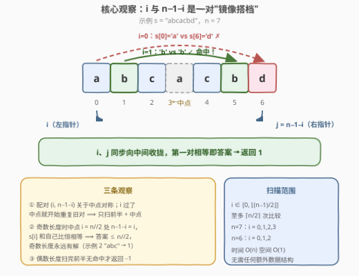
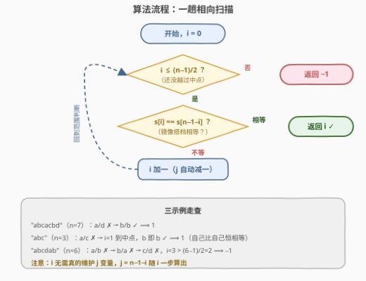

# LeetCode 双端字符匹配 题解

## 1. 题目概述

- **标题 / 题号**：双端字符匹配（#3884，easy）
- **链接**：https://leetcode.cn/problems/first-matching-character-from-both-ends/
- **难度**：简单
- **标签**：双指针、字符串

**题意**：给你一个长度为 $n$ 的字符串 `s`，其中只包含小写英文字母。

返回**最小的下标** $i$，使得 $s[i] = s[n - i - 1]$。如果不存在这样的下标，返回 $-1$。

**示例 1**：

```text
输入：s = "abcacbd"
输出：1
解释：在下标 i = 1 处，s[1] 和 s[5] 的值均为 'b'。
      没有更小的下标满足条件，因此答案是 1。
```

**示例 2**：

```text
输入：s = "abc"
输出：1
解释：在下标 i = 1 处，左右对应位置重合，因此字符均为 'b'。
```

**示例 3**：

```text
输入：s = "abcdab"
输出：-1
解释：对于每个下标 i，位置 i 和 n - i - 1 的字符均不相同。
```

**约束**：

- $1 \le n = |s| \le 100$
- `s` 仅包含小写英文字母

> 💡 **审题关键**：① 要求的是**最小**下标，从左往右找到的第一对命中就是答案；② 示例 2 揭示了一个关键语义——当 $i$ 恰好落在**中点**（$n$ 为奇数）时，$n - i - 1 = i$，位置和它自己比较，**恒相等**。所以奇数长度的串**永远有解**。

## 2. 解题思路

### 2.1 直译思路

按题意直译：让 $i$ 从 $0$ 递增，逐一检查 $s[i]$ 与 $s[n-1-i]$ 是否相等，返回第一个命中的 $i$；扫完全表都无命中则返回 $-1$。这样写也是 $O(n)$、也能通过（$n \le 100$），但它**没有利用对称结构**：

- 当 $i > n - 1 - i$ 之后，$(i,\ n-1-i)$ 与更早检查过的 $(n-1-i,\ i)$ 是**同一对**，全都是重复劳动——后半趟循环一无所获；
- 也没有意识到"奇数长度中点必命中"这一事实，`return -1` 分支实际上对奇数长度**永远不会执行**。

### 2.2 核心观察：镜像搭档 + 中点必命中



把 $i$ 和 $n-1-i$ 想象成一对**从两端出发、同步向中间收拢的指针**（$i$ 每加一，$j = n-1-i$ 自动减一），三步看穿本题：

**观察一：配对关于中点对称，扫前半 + 中点即可。**
每一对 $(i,\ n-1-i)$ 关于中点对称，$i$ 越过中点后配对开始与之前重复。因此 $i$ 只需取 $0 \le i \le \lfloor (n-1)/2 \rfloor$，至多 $\lceil n/2 \rceil$ 次比较。

**观察二：奇数长度时中点是"自己配自己"，恒命中。**
$n$ 为奇数时，取 $i = n/2$（整除）有 $n - i - 1 = i$，于是 $s[i] = s[i]$ 恒成立。这意味着：

$$n \text{ 为奇数} \implies \text{答案必然存在且} \le \lfloor n/2 \rfloor$$

示例 2 的 `"abc"` 返回 $1$ 正是落在中点上。

**观察三：只有偶数长度才可能返回 $-1$。**
$n$ 为偶数时不存在重合位置，前半的 $n/2$ 对全都不相等（示例 3 的 `"abcdab"`）才有 $-1$。

> ⚠️ **一个易错细节**：循环上界建议统一写成 `i <= (n-1)/2`（C++ 整除）或 `range((n+1)//2)`（Python）。若误写成 `i < n/2`，奇数长度时会**漏掉中点**，把示例 2 算成 $-1$；若写成扫全表，虽然结果碰巧也对，但白扫了一半。

### 2.3 算法流程图



整个算法只有一重循环，且甚至**不需要真正维护右指针变量**——$j = n-1-i$ 随 $i$ 一步算出，连"双指针"都退化成了"单下标 + 一个镜像公式"。

### 2.4 示例演算

| 串 | 逐对判定 | 输出 |
|----|----------|------|
| `"abcacbd"`（$n=7$） | $i{=}0$：a vs d ✗ → $i{=}1$：**b vs b ✓** | $1$ |
| `"abc"`（$n=3$） | $i{=}0$：a vs c ✗ → $i{=}1$：中点重合，b 即 b ✓ | $1$ |
| `"abcdab"`（$n=6$） | a vs b ✗ → b vs a ✗ → c vs d ✗，$i = 3 > \lfloor 5/2 \rfloor = 2$，循环结束 | $-1$ |

## 3. 参考代码

### C++

```cpp
class Solution {
public:
    int firstMatchingIndex(string s) {
        int n = s.size();
        for (int i = 0; i <= (n - 1) / 2; i++) {
            if (s[i] == s[n - 1 - i]) return i;  // 第一对镜像相等
        }
        return -1;  // 只有偶数长度才可能走到这里
    }
};
```

### Python

```python
class Solution:
    def firstMatchingIndex(self, s: str) -> int:
        n = len(s)
        for i in range((n + 1) // 2):
            if s[i] == s[n - 1 - i]:
                return i
        return -1
```

> 💡 两种上界写法等价：`i <= (n-1)/2` 与 `i < (n+1)/2` 对所有 $n$ 给出同一取值集合——偶数 $n$ 是 $\{0, \dots, n/2 - 1\}$，奇数 $n$ 是 $\{0, \dots, \lfloor n/2 \rfloor\}$（含中点）。

## 4. 复杂度分析

| 维度 | 复杂度 | 说明 |
|------|--------|------|
| **时间** | $O(n)$ | 单趟循环，至多 $\lceil n/2 \rceil$ 次字符比较 |
| **空间** | $O(1)$ | 只用常数个下标变量，无额外数据结构 |
| **比较次数** | $\lceil n/2 \rceil$ 上界 | 奇数长度最坏在中点命中；偶数长度最坏扫完前半 |

## 5. 扩展：对称性把问题"砍半"的思维

本题是"**利用对称性压缩扫描范围**"的最小样本，同一思想反复出现在各种题目里：

- **回文判定**（125）：比较 $s[i]$ 与 $s[n-1-i]$ 是否**全部**相等——本题问的是**第一对**相等出现在哪，回文判定问的是**有没有不相等的对**，扫描骨架完全相同；
- **中心扩展**（如 5. 最长回文子串）：$n$ 个中心（$n - 1$ 个相邻对 + $n$ 个单字符）本质也是把"对 $(i, j)$"按中点归类，每个中心向两侧对称展开；
- **折半枚举**：任何满足"$(i, j)$ 与 $(j, i)$ 等价"的对称关系，枚举时都可以只走 $i \le j$（或 $i < j$）的那一半。

> 💡 面试中遇到形如 $s[i]$ 对 $s[\sigma(i)]$（$\sigma$ 为某个下标变换）的题，第一步先分析 $\sigma$ 的**轨道结构**（哪些下标构成一组、会不会重合、什么时候 $\sigma(i) = i$），扫描范围和循环边界往往就自动浮出来了。

## 6. 面试要点

**Q1：为什么 i 只需要扫到 $\lfloor (n-1)/2 \rfloor$？**

> 因为配对 $(i,\ n-1-i)$ 与 $(n-1-i,\ i)$ 是同一对。$i$ 越过中点后，后续所有判定都是前半的镜像重复，不会再产生新信息；首个命中（即最小下标）必然在"前半 + 可能的中点"里出现。

**Q2：奇数长度为什么永远不返回 $-1$？**

> $i = \lfloor n/2 \rfloor$ 时 $n - 1 - i = i$，条件退化为 $s[i] = s[i]$ 恒真。所以奇数长度的答案上界就是中点下标，循环必然中途 `return`，`return -1` 只为偶数长度准备。

**Q3：把循环写成扫全表 `for i in range(n)` 结果会对吗？有什么损失？**

> 结果恰好也对（重复检查镜像对不改变"第一个命中"），复杂度也还是 $O(n)$——损失的是对问题结构的理解：它没有体现"答案只可能出现在前半"这一性质，比较次数翻倍，且容易让人忽略中点必命中的边界语义。工程上更多是"不够漂亮"而非"错误"。

**Q4：如果题目改成"返回所有满足条件的下标"或"统计满足条件的下标数"呢？**

> 扫描骨架不变，把"首个命中即返回"改为收集/计数。注意 $i$ 与 $n-1-i$ 是两个不同下标（除中点外），统计**下标**时不重不漏地各算一次，只有重合的中点算一个——对称计数的经典坑。

**Q5：本题的双指针和 167（两数之和 II）的相向双指针有何异同？**

> 同：都是 `left` 从左、`right` 从右、同步向中间推进一轮。异：167 中两指针**独立移动**（依据 `sum` 与 `target` 的大小关系移动其中一边），指针位置携带了信息；本题的 $j = n-1-i$ 完全由 $i$ 决定，其实是"**伪双指针**"——一个下标加一个线性变换就够，这也解释了为什么代码里连 `j` 变量都可以不出现。

## 同类练习题

| # | 题目 | 与本题的关联 |
|---|------|-------------|
| 125 | [验证回文串](https://leetcode.cn/problems/valid-palindrome/)（[题解](../0101-0200/125_验证回文串.md)） | 同一副"镜像对比较"骨架，从"找第一对相等"换成"检查全部相等" |
| 680 | [验证回文串 II](https://leetcode.cn/problems/valid-palindrome-ii/)（[题解](../0601-0700/680_验证回文串II.md)） | 镜像对扫描 + 允许一次跳过的分支回溯，本题的进阶近亲 |
| 167 | [两数之和 II - 输入有序数组](https://leetcode.cn/problems/two-sum-ii-input-array-is-sorted/)（[题解](../0101-0200/167_两数之和%20II%20-%20输入有序数组.md)） | 真正"两指针独立移动"的相向双指针招牌题，对照理解 Q5 中"伪双指针"的区别 |
| 917 | [仅仅反转字母](https://leetcode.cn/problems/reverse-only-letters/)（[题解](../0901-1000/917_仅仅反转字母.md)） | 首尾指针 + 条件跳过，同属字符串两端操作的入门双指针 |
| 344 | [反转字符串](https://leetcode.cn/problems/reverse-string/) | 首尾对调的相向双指针最纯形态，$i$ 与 $n-1-i$ 的配对关系与本题完全一致 |
