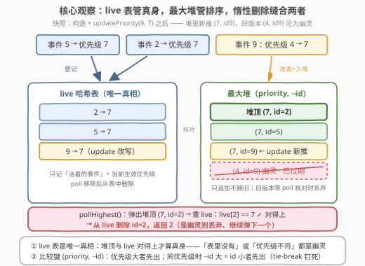
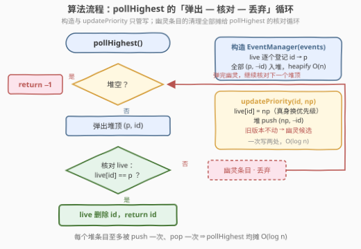

# 设计事件管理器

- **题目名称**：设计事件管理器
- **链接**：[3885. Design Event Manager](https://leetcode.cn/problems/design-event-manager/)
- **难度**：中等
- **标签**：设计、堆（优先队列）、哈希表、有序集合

## 1. 题目概述

管理一组事件，每个事件有唯一的 `eventId` 和一个 `priority`（优先级）。实现 `EventManager` 类：

- `EventManager(int[][] events)`：用 `events[i] = [eventId, priority]` 初始化管理器。
- `void updatePriority(int eventId, int newPriority)`：将 id 为 `eventId` 的**活跃事件**的优先级更新为 `newPriority`。
- `int pollHighest()`：移除并返回具有**最高优先级**的活跃事件的 `eventId`；若多个活跃事件优先级相同，返回 `eventId` 最小者；若无活跃事件，返回 `-1`。

**活跃事件**：尚未被 `pollHighest()` 移除的事件。

**示例 1**：

```text
输入：
["EventManager", "pollHighest", "updatePriority", "pollHighest", "pollHighest"]
[[[[5, 7], [2, 7], [9, 4]]], [], [9, 7], [], []]

输出：
[null, 2, null, 5, 9]

解释：
EventManager em = new EventManager([[5,7], [2,7], [9,4]]); // 三个事件入管
em.pollHighest();       // 事件 5 和 2 优先级均为 7，返回 id 最小的 2
em.updatePriority(9, 7); // 事件 9 的优先级 4 → 7
em.pollHighest();       // 剩下最高优先级的是 5 和 9，返回 5
em.pollHighest();       // 返回 9
```

**示例 2**：

```text
输入：
["EventManager", "pollHighest", "pollHighest", "pollHighest"]
[[[[4, 1], [7, 2]]], [], [], []]

输出：
[null, 7, 4, -1]

解释：
em.pollHighest(); // 返回 7（优先级 2 最高）
em.pollHighest(); // 返回 4
em.pollHighest(); // 无剩余事件，返回 -1
```

**约束条件**：

- $1 \le \text{events.length} \le 10^5$
- $1 \le \text{eventId}, \text{priority}, \text{newPriority} \le 10^9$
- `events` 中所有 `eventId` 互不相同
- 每次 `updatePriority` 的 `eventId` 都指向一个**活跃事件**
- `updatePriority` 与 `pollHighest` 的总调用次数不超过 $10^5$

> 💡 **审题关键**：① `pollHighest` 的选取是**双关键字**——优先级最大、同优先级取 `eventId` 最小，比较键天然是 `(priority, -eventId)`；② `pollHighest` **既删又返回**，被移除的事件从此对一切操作隐身，`updatePriority` 只改优先级不删事件；③ 操作总量 $10^5$，每次操作至少要做到 $O(\log n)$；④ `eventId`、`priority` 都到 $10^9$，只能哈希不能开数组。

---

## 2. 解题思路

### 2.1 暴力思路：数组存事件，每次线性扫

用一个数组存所有活跃事件 `(eventId, priority)`：`updatePriority` 线性找 `eventId` 再改值，$O(n)$；`pollHighest` 线性扫找双关键字最大再删除，也是 $O(n)$。最坏 $10^5$ 次操作 × $10^5$ 个事件 ≈ $10^{10}$ 次比较，必然超时。

瓶颈有两个：**按 `eventId` 定位慢**、**按优先级取最值慢**——两个访问方向完全不同，和 3822（设计订单管理系统）的困局同构。出路：每个方向各配一个数据结构。

### 2.2 核心观察：live 哈希表 + 最大堆 + 惰性删除



**观察一（哈希表管定位与真相）。** `live[eventId] = priority` 只存**活跃事件**当前生效的优先级：`updatePriority` 一次哈希写 $O(1)$；事件被 `pollHighest` 移除后从表中删除。这张表就是「谁还活着、活成什么优先级」的**唯一真相**。

**观察二（最大堆管最值）。** `pollHighest` 要的是 `(priority, -eventId)` 字典序最大者——这恰好是最大堆的堆顶，弹出 $O(\log n)$。

**观察三（惰性删除缝合两表）。** 堆不支持高效的随机改键：`updatePriority` 改了优先级，堆里的旧条目就「名不副实」了。解法是**不删旧的、只推新的**（官方 hint 1："Push every new priority version into the heap without removing old ones"）——旧条目沦为**幽灵**（过期条目）；`pollHighest` 弹出堆顶后与 `live` 表核对（hint 2："keep popping until the top matches the live priority"）：`live` 中存在该 `id` **且**优先级相等才是真身；对不上即幽灵，丢弃后继续弹下一个堆顶。

**tie-break 的实现**（hint 3）：堆里存 `(priority, -eventId)`。C++ 的 `priority_queue<pair<int,int>>` 按 pair 字典序取最大：先比 `priority`（大者优先），再比 `-eventId`（更大 $\Leftrightarrow$ `eventId` 更小者优先）。Python 的 `heapq` 是最小堆，存 `(-priority, eventId)` 镜像同理。

> 💡 **一句话总结**：`live` 表管「真身」，堆管「排队」；update 只追加新版本，poll 负责对账清理——**惰性删除**把「堆不能改键」的死结绕开了。

### 2.3 算法流程图



**逻辑执行步骤**：

| 步骤 | 操作 | 说明 |
|------|------|------|
| ① 构造 | `live` 逐个登记 + 全部条目入堆 | `heapify` $O(n)$ |
| ② updatePriority | `live[id] = np`；堆 `push (np, -id)` | 旧堆条目不动，沦为幽灵候选 |
| ③ pollHighest | 循环：堆空 → 返回 `-1`；弹出 `(p, id)`；`live[id] == p` → 删除 `live[id]`、返回 `id`；否则丢弃再弹 | 每个条目至多被弹一次 |

> ⚠️ **幽灵的两种来历，核对条件必须都防**：① `live` 里有 `id` 但 `live[id] != p` —— 优先级已被 update 改掉；② `live` 里**根本没有** `id` —— 事件已被 poll 移除。核对条件写成 `live.count(id) && live[id] == p` 两条缺一不可：漏判第二种会把死而复生的事件再返回一次。

### 2.4 示例演算

用示例 1 全流程走一遍（堆内容以 `(priority, -id)` 记，按堆顶优先排列）：

| 操作 | live（真身表） | 堆（含幽灵） | 返回 |
|------|---------------|--------------|------|
| 构造 `[[5,7],[2,7],[9,4]]` | `{2:7, 5:7, 9:4}` | `(7,-2) (7,-5) (4,-9)` | — |
| `pollHighest` | 弹 `(7,-2)`：`live[2]=7` ✓ → 删 `2` | `(7,-5) (4,-9)` | **2** ✓ |
| `updatePriority(9,7)` | `9: 4→7` | push `(7,-9)`：`(7,-5) (7,-9) (4,-9)` | — |
| `pollHighest` | 弹 `(7,-5)`：`live[5]=7` ✓ → 删 `5` | `(7,-9) (4,-9)` | **5** ✓ |
| `pollHighest` | 弹 `(7,-9)`：`live[9]=7` ✓ → 删 `9` | `(4,-9)` ← 幽灵留在堆底 | **9** ✓ |

与期望输出 `[null, 2, null, 5, 9]` 逐项一致 ✓。注意最后一步幽灵 `(4,-9)` **并没有被弹出**——因为 update 是升级（4→7），新版本 `(7,-9)` 优先级更高、总排在它前面；若有第四次 `pollHighest`，会先弹出 `(4,-9)`，此时 `live` 里已无 `9` → 幽灵，丢弃 → 堆空 → 返回 `-1`。若 update 反过来是**降级**（如 9 从 7 改成 4），幽灵 `(7,-9)` 会直接压在堆顶，核对-丢弃当场立功——两个方向都被核对循环覆盖。

---

## 3. 参考代码

### C++

```cpp
class EventManager {
    unordered_map<int, int> live;        // eventId -> 当前生效优先级（唯一真相）
    priority_queue<pair<int, int>> pq;   // (priority, -eventId) 最大堆，允许含幽灵

  public:
    EventManager(vector<vector<int>>& events) {
        vector<pair<int, int>> init;
        init.reserve(events.size());
        for (auto& e : events) {
            live[e[0]] = e[1];
            init.emplace_back(e[1], -e[0]);
        }
        pq = priority_queue<pair<int, int>>(init.begin(), init.end());  // make_heap O(n)
    }

    void updatePriority(int eventId, int newPriority) {
        live[eventId] = newPriority;     // 旧堆条目不删，沦为幽灵候选
        pq.push({newPriority, -eventId});
    }

    int pollHighest() {
        while (!pq.empty()) {
            auto [p, negId] = pq.top();
            pq.pop();
            int id = -negId;
            auto it = live.find(id);
            if (it != live.end() && it->second == p) {  // 活着且优先级对得上 → 真身
                live.erase(it);
                return id;
            }
            // 否则是幽灵（已被 poll 或已被 update）→ 丢弃，继续弹
        }
        return -1;
    }
};
```

> 💡 **写法要点**：
> - `(priority, -eventId)` 借 `pair` 的字典序比较，**零自定义比较器**实现双关键字最大堆；
> - 构造用范围构造（内部 `make_heap`）$O(n)$，比逐个 `push` 的 $O(n \log n)$ 干净；
> - `live.find` 拿一次迭代器同时判存在与取值，避免 `count` + `[]` 双重哈希；
> - 核对条件 `it != live.end() && it->second == p` 两段短路，正是 2.3 节强调的两种幽灵。

### Python

```python
import heapq


class EventManager:
    def __init__(self, events: list[list[int]]):
        self.live = {eid: p for eid, p in events}      # eventId -> 生效优先级（唯一真相）
        self.heap = [(-p, eid) for eid, p in events]   # 最小堆模拟最大堆：(-priority, eventId)
        heapq.heapify(self.heap)

    def updatePriority(self, eventId: int, newPriority: int) -> None:
        self.live[eventId] = newPriority
        heapq.heappush(self.heap, (-newPriority, eventId))

    def pollHighest(self) -> int:
        while self.heap:
            neg_p, eid = heapq.heappop(self.heap)
            if self.live.get(eid) == -neg_p:           # 活着且优先级对得上 → 真身
                del self.live[eid]
                return eid
            # 幽灵 → 丢弃，继续弹
        return -1
```

> 💡 **写法要点**：
> - `heapq` 是最小堆，存 `(-priority, eid)`：`-p` 最小 = 优先级最大；同优先级时 `eid` 小者先出，tie-break 与 C++ 版完全一致；
> - `self.live.get(eid)` 在 `eid` 不存在时返回 `None`，与任何 `int` 比较均为 `False`——**存在性判断被 `.get` 一行吸收**；
> - `heapify` 把初始化压到 $O(n)$；总 push 数上界 $n + q$，堆永不缩但也不失控。

---

## 4. 复杂度分析

设 $n$ 为初始事件数、$q$ 为 `updatePriority` 与 `pollHighest` 的总调用次数。

| 维度 | 复杂度 | 说明 |
|------|--------|------|
| 构造 | $O(n)$ | 哈希表逐项登记 + `heapify` |
| updatePriority | $O(\log(n+q))$ | 一次 `live` 哈希写 + 一次堆 push |
| pollHighest（均摊） | $O(\log(n+q))$ | 每个堆条目至多被 push 一次、pop 一次；总 push 数 $\le n+q$，弹出成本摊到各次调用 |
| 空间 | $O(n+q)$ | `live` $\le$ 活跃事件数；堆 $\le$ 历史总版本数（含幽灵） |

> - 对比暴力：最坏 $10^{10}$ 次比较 vs. 本解约 $2 \times 10^5$ 次堆操作，差四个数量级——全部来自「按访问方向分工 + 惰性删除免改键」。

---

## 5. 扩展：变体与进阶

**变体一：真删除——有序集合版。** 不想堆里攒幽灵，可以换 `set<pair<int,int>>` 按 `(priority, -eventId)` 有序存储：`updatePriority` 先 `erase({live[id], -id})` 再 `insert({np, -id})`（旧键从 `live` 表 O(1) 拿到）；`pollHighest` 取 `*rbegin()` 并 `erase`。每次操作严格 $O(\log n)$、零幽灵，代价是删除依赖旧键——`live` 表照样要建。2353（设计食物评分系统）的进阶写法即此。

**变体二：还要 `pollLowest`。** 双端取最值：双堆各管一端（最大堆 + 最小堆共用 `live` 对账，核对逻辑原样复制两份），或直接上有序集合 `begin()` / `rbegin()` 双向取。

**变体三：幽灵无界的流式场景。** 本题 $n + q \le 2 \times 10^5$，堆里攒幽灵无所谓；若 update 次数不受控（无界流），堆会无限膨胀——要么真删除（变体一 / 索引堆），要么**懒重建**：当堆大小超过 `live` 的 2 倍时用 `live` 全量重建堆，均摊仍是 $O(\log n)$（每次重建摊掉至少一半幽灵）。

---

## 6. 面试要点

**Q1：堆不支持改键，为什么可以不删旧条目？**

> 惰性删除 + 均摊分析：每个堆条目的生命周期 = 一次 push + 至多一次 pop，总代价 $O((n+q)\log(n+q))$，摊到每次操作就是 $O(\log)$。正确性由核对保证：幽灵永远不可能被当成真身返回——堆顶若与 `live` 对不上就被丢弃。

**Q2：核对条件为什么是「存在」和「相等」两条，缺一不可？**

> `live` 里没有该 `id` → 事件已被 `pollHighest` 移除（幽灵来历一）；有 `id` 但 `live[id] != p` → 优先级已被 `updatePriority` 改掉（幽灵来历二）。只判相等不判存在，会把已移除的事件「死而复生」再返回一次；只判存在不判相等，会返回旧优先级对应的事件、破坏当前优先级序。

**Q3：`(priority, -eventId)` 的 tie-break 是怎么起作用的？**

> 最大堆按 pair 字典序取最大：第一维 `priority` 大者先出；同为 $p$ 时比第二维 `-id`，$-id$ 更大 $\Leftrightarrow$ $id$ 更小者先出。Python 用 `(-p, id)` 最小堆是镜像写法。若直接存 `(priority, eventId)`，同优先级会先弹出 id **大**的，与题意相反。

**Q4：同一事件反复 update、甚至 update 成相同优先级，会不会错？**

> 不会。同值 update 让 `live` 不变、堆里多一个重复条目：`poll` 时第一个命中即从 `live` 删除，后续重复条目核对时 `live` 已无此 `id`，按幽灵丢弃。反复 update 同理——堆里至多积累该 `id` 的全部历史版本，每个版本都会被清理恰好一次，这正是均摊分析的计数基础。

**Q5：什么时候必须放弃惰性删除？**

> 幽灵占内存 $O(n+q)$——本题上界 $2 \times 10^5$ 无所谓；无界流或内存敏感场景要真删除（有序集合 / 索引堆 / 懒重建，见第 5 节）。另外若查询不是「取最值」而是任意名次（第 k 大）或按区间过滤，堆也无能为力，直接上有序集合 + 平衡树语义。

> 💡 **一句话总结**：3885 = `live` 哈希表（真身）+ 最大堆（排序）+ 惰性删除（免改键）。带走三点：核对条件防两种幽灵、`(p, -id)` 钉死 tie-break、每个条目至多弹一次撑起均摊 $O(\log n)$。

---

## 7. 同类练习题

- [2353. 设计食物评分系统](https://leetcode.cn/problems/design-a-food-rating-system/)：同款「哈希真身 + 堆惰性删除」处理修改评分，本题的直系亲属
- [2034. 股票价格波动](https://leetcode.cn/problems/stock-price-fluctuation/)：时间戳哈希 + 最大最小双堆对账，惰性删除的双端版
- [1845. 座位预约管理系统](https://leetcode.cn/problems/seat-reservation-manager/)：最小堆 reserve/release，无修改的入门版——体会没有 update 时根本不需要 live 表
- [1801. 积压订单中的订单总数](https://leetcode.cn/problems/number-of-orders-in-the-backlog/)：双堆撮合、订单成交即作废——核对式弹出同款思想
- [716. 最大栈](https://leetcode.cn/problems/max-stack/)：`popMax` 与普通 pop 的「标记删除 / 对账」思想同源
