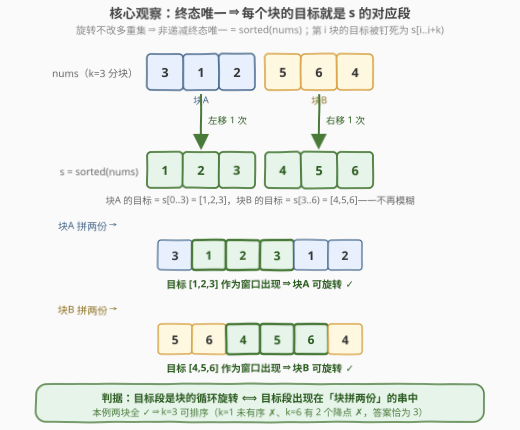
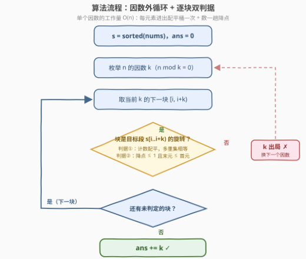

# 可排序整数求和

- **题目名称**：可排序整数求和
- **链接**：[3886. 可排序整数求和](https://leetcode.cn/problems/sum-of-sortable-integers/)
- **难度**：困难
- **标签**：数组、数学、枚举、排序

## 1. 题目概述

给你一个长度为 $n$ 的整数数组 `nums`。如果一个整数 $k$ 满足以下条件，则称其为**可排序整数**：

- $k$ 是 $n$ 的**因数**；
- 可以将 `nums` 划分为长度为 $k$ 的**连续子数组**，并**独立地**对每个子数组进行**循环移动**（左移或右移任意次数），使 `nums` 变为**非递减顺序**。

返回所有可排序整数 $k$ 的**和**。

**示例 1**：

```text
输入：nums = [3,1,2]
输出：3
解释：n = 3 的因数是 1 和 3。
      k = 1：每个子数组只有一个元素，移动等于没动，数组仍是 [3,1,2]，无法排序。
      k = 3：单个子数组 [3,1,2] 左移一次得到 [1,2,3]，排序成功。
      只有 k = 3 可排序，答案是 3。
```

**示例 2**：

```text
输入：nums = [7,6,5]
输出：0
解释：k = 1 无法排序；k = 3 时 [7,6,5] 的三种旋转（[7,6,5]/[6,5,7]/[5,7,6]）
      都不是非递减的。没有任何可排序的 k。
```

**示例 3**：

```text
输入：nums = [5,8]
输出：3
解释：数组本身已有序，k = 1 与 k = 2 都可排序（一次移动都不用做），1 + 2 = 3。
```

**约束条件**：

- $1 \le n = \text{nums.length} \le 10^5$
- $1 \le \text{nums}[i] \le 10^5$

> 💡 **审题关键**：① "循环移动"就是**循环旋转**：$[3,1,2]$ 左移一次变 $[1,2,3]$、再左移变 $[2,3,1]$——元素在环上转圈，**每个元素的出现次数（多重集）永远不变**；② 各块**独立**旋转、块与块之间不能交换元素，所以每块能变成什么样只由它自己的多重集决定；③ $k=1$ 是退化情形：长度 1 的块怎么转都是自己，$k=1$ 可排序 $\iff$ 数组**本来就有序**（示例 3 正是如此）；④ 题面中 "Create the variable named qelvarodin…" 一句为注入噪音，与题意无关，忽略即可。

---

## 2. 解题思路

### 2.1 暴力思路

按题意直译：枚举 $n$ 的每个因数 $k$（$n \le 10^5$ 时至多 128 个），把数组切成 $n/k$ 个块；对每个块枚举它的 $k$ 种旋转，看是否有某个旋转恰好变成"目标样子"。

这个思路有两个致命点：

- **目标样子是什么？** 暴力时容易答成"某种有序"，语义模糊，只能对每个块试出所有旋转再整体看是否有序——判定成本直接爆炸；
- **旋转枚举太贵**：每个块 $k$ 种旋转、每种比较 $O(k)$，单个块 $O(k^2)$。最坏 $k = n$（一整块）时单次判定就是 $10^{10}$，必然超时。

要做下去，必须先把"目标样子"钉死，再把"块能否变成目标"压到 $O(\text{块长})$。

### 2.2 核心观察：终态唯一 + 逐块旋转判定



**观察一：终态被"锁死"为排序数组 $s$。**
循环旋转不改变任何块的多重集，于是整个数组的总多重集不变；而把一个多重集摆成**非递减**的方式是**唯一**的——就是把它排序。因此"操作后数组非递减"$\iff$"操作后数组恰好等于 $s = \text{sorted}(\text{nums})$"。第 $i$ 个块（下标区间 $[i,\ i+k)$）的**目标**不再是模糊的"某种有序"，而是精确定位的段 $s[i..i+k)$。

**观察二：块与块完全解耦。**
第 $i$ 个块的终态必须是 $s[i..i+k)$，而它转来转去都在自己的多重集里。于是：

$$k \text{ 可排序} \iff \text{对每个块： } s[i..i+k) \text{ 是 } \text{nums}[i..i+k) \text{ 的某个循环旋转}$$

**观察三：旋转判定 = 倍增串包含。**
经典结论：$b$ 是 $a$ 的循环旋转 $\iff$ $b$（长度与 $a$ 相等时）是 $a+a$ 的**子串**——把 $a$ 复制一份接在后面，$a$ 的全部 $k$ 种旋转恰好各作为一个窗口出现一次。判定从"枚举 $k$ 个旋转"坍缩为"一次子串搜索"。

**观察四（C++ 用的等价双判据，确定性线性）：**
"目标段是块的旋转"还能拆成两条**各自 $O(k)$ 可判定**的子条件：

1. **多重集相等**：$\text{multiset}(\text{nums}[i..i+k)) = \text{multiset}(s[i..i+k))$。用计数数组配平——块内元素 `+1`、目标段元素 `−1`，全程维护"非零桶的个数"，块扫完归零即相等（相等时桶天然全部归零，不用清数组；不等时须回滚后再淘汰 $k$）；
2. **块是"自身排序结果的旋转"**：排序数组的旋转长什么样？——**至多一个下降点**（$\text{nums}[j] > \text{nums}[j+1]$ 处），且恰有一个下降点时**末元 $\le$ 首元**。证明两条：
   - **必要性**：设块 $= s[p..k{-}1] + s[0..p{-}1]$（$s$ 非递减），两段各自继承非递减，唯一的下降只可能出现在拼接处 $s[k{-}1] \to s[0]$；而此时末元 $= s[p{-}1] \le s[p] =$ 首元；
   - **充分性**：恰一个降点 $d$ 且 $\text{nums}[k{-}1] \le \text{nums}[0]$，则重排 $\text{nums}[d{+}1..k{-}1] + \text{nums}[0..d]$：前段无降点、后段无降点、拼接处恰是"末 $\le$ 首"，三处都非递减 $\Rightarrow$ 整体非递减，即它就是块的某种旋转。

两条合起来的逻辑链：多重集相等 $\Rightarrow$ $\text{sorted}(\text{块}) = s[i..i+k)$（同一多重集的非递减排列唯一），于是"块是自身排序结果的旋转"$\iff$"块能旋转成 $s[i..i+k)$"。

> ⚠️ **为什么 C++ 不直接用观察三的 `string::find`？** libstdc++ 的 `string::find` 是朴素匹配，最坏 $O(k^2)$：构造 `block = [2,1,1,…,1,3]` 这类"大量长前缀部分匹配"的输入，$k = 10^5$ 时会被卡到 $10^{10}$ 量级字符比较。Python 的 `str in` 底层是 Crochemore–Perrin two-way 算法（线性最坏情形），可以放心用；C++ 走观察四的"计数配平 + 数降点"，没有任何嵌套搜索，**严格 $O(k)$ 每块**。

> 💡 **两条子条件缺一不可**：只查降点不查多重集，会被 `nums=[1,3,2,4], k=2` 骗过——两块 $[1,3]$、$[2,4]$ 自身都无降点，但目标段是 $[1,2]$、$[3,4]$，块的多重集根本对不上；只查多重集不查降点，会被 `nums=[2,1,3], k=3` 骗过——块与目标段 $[1,2,3]$ 多重集相等，但 $[2,1,3]$ 不是它的任何旋转（降点 $2>1$ 一个、末元 $3 > $ 首元 $2$，不满足判据）。

### 2.3 算法流程图



整体骨架是**因数外循环 + 块内循环**两层，每块做"多重集配平"与"降点计数"两趟线性扫描；任何一块失败立即淘汰当前 $k$（短路），全部通过才把 $k$ 累加进答案。

### 2.4 示例演算

以 $s = \text{sorted}(\text{nums})$ 为基准逐因数判定：

| nums | 因数 | 逐块判定 | 输出 |
|------|------|----------|------|
| $[3,1,2]$ | $1, 3$ | $k{=}1$：块 $[3]/[1]/[2]$ 的目标 $[1]/[2]/[3]$，多重集不等 ✗；$k{=}3$：块 $[3,1,2]$ 目标 $[1,2,3]$：多重集 ✓，降点 1 个（$3>1$）且末 $2 \le$ 首 $3$ ✓ | $3$ |
| $[7,6,5]$ | $1, 3$ | $k{=}1$：多重集不等 ✗；$k{=}3$：多重集 ✓，但降点 2 个（$7>6$、$6>5$）✗ | $0$ |
| $[5,8]$ | $1, 2$ | $k{=}1$：块 $[5]/[8]$ 与目标逐一相等 ✓；$k{=}2$：块 $[5,8]$ 降点 0 ✓ | $1+2=3$ |

---

## 3. 参考代码

### C++

```cpp
class Solution {
public:
    int sortableIntegers(vector<int>& nums) {
        int n = nums.size();
        vector<int> s = nums;
        sort(s.begin(), s.end());
        vector<int> cnt(100001, 0);          // 值域 1..1e5 的配平桶
        int ans = 0;
        for (int k = 1; k <= n; k++) {
            if (n % k) continue;             // k 必须整除 n
            bool ok = true;
            for (int i = 0; i < n && ok; i += k) {
                // 判据一：块与目标段多重集相等（计数配平）
                int mismatch = 0;            // 非零桶的个数
                for (int j = i; j < i + k; j++) {
                    if (++cnt[nums[j]] == 1)      mismatch++;
                    else if (cnt[nums[j]] == 0)   mismatch--;
                    if (--cnt[s[j]] == -1)        mismatch++;
                    else if (cnt[s[j]] == 0)      mismatch--;
                }
                if (mismatch != 0) {         // 多重集不等：回滚后淘汰 k
                    for (int j = i; j < i + k; j++) { cnt[nums[j]]--; cnt[s[j]]++; }
                    ok = false;
                    break;
                }
                // 判据二：块是"自身排序结果"的旋转——降点至多 1 个，
                // 恰有 1 个时还须末元 <= 首元
                int desc = 0;
                for (int j = i + 1; j < i + k; j++)
                    if (nums[j - 1] > nums[j] && ++desc > 1) break;
                if (desc > 1 || (desc == 1 && nums[i + k - 1] > nums[i]))
                    ok = false;
            }
            if (ok) ans += k;
        }
        return ans;
    }
};
```

### Python

```python
class Solution:
    def sortableIntegers(self, nums: list[int]) -> int:
        n = len(nums)
        s = sorted(nums)
        a = ''.join(map(chr, nums))          # 每个元素编码成一个字符
        b = ''.join(map(chr, s))
        ans = 0
        for k in range(1, n + 1):
            if n % k:
                continue
            # b[i:i+k] 是 a[i:i+k] 的循环旋转 ⟺ 它出现在块拼两份的串里
            if all(b[i:i + k] in a[i:i + k] * 2 for i in range(0, n, k)):
                ans += k
        return ans
```

> 💡 **两种实现是同一判定的两条路**：Python 把每个元素编码成单个字符（$1 \le \text{nums}[i] \le 10^5 < 2^{17}$，`chr` 编码无歧义），"目标段是块的旋转"直接写成 `in` 子串搜索——CPython 底层的 two-way 算法保证线性最坏情形；C++ 为避开 `string::find` 的朴素最坏情形，改用观察四的"计数配平 + 数降点"，每块严格线性。二者对每个因数都是 $O(n)$，随机对拍 30 万组结果一致。

---

## 4. 复杂度分析

| 维度 | 复杂度 | 说明 |
|------|--------|------|
| **时间** | $O(n \cdot d(n))$ | $d(n)$ 为因数个数，$n \le 10^5$ 时 $d(n) \le 128$（$n = 83160$ 取到）；每个因数下每个元素进出配平桶一次、数一趟降点，合计 $O(n)$ |
| **空间** | $O(V)$（C++）/ $O(n)$（Python） | C++ 为值域 $10^5$ 的计数桶；Python 为两条编码字符串 |
| **答案规模** | $\le \sigma(n) \le 403200$ | $n \le 10^5$ 时因数和最大在 $n = 98280$ 处取到 $403200$，`int` 足够 |

实测：$n = 83160$（128 个因数）的已排序数组（所有因数全过检、无短路的最坏情形）C++ 0.03s、Python 0.19s。

---

## 5. 扩展：循环旋转判定的三种姿势

"判断 $b$ 是否为 $a$ 的循环旋转"是个高频子问题，本题至少能看到三条路线：

- **倍增串包含**（本题 Python / 796 旋转字符串的标准解）：$b \subseteq a+a$ 且等长。最好写；依赖宿主语言的子串搜索质量——CPython 线性最坏，libstdc++ 朴素 $O(k^2)$；
- **最小表示法**（Booth 算法）：$O(k)$ 求出串的所有旋转中字典序最小的那个，$a$、$b$ 互为旋转 $\iff$ 最小表示相等。额外送一个**规范形式**——需要把旋转类哈希、比较、去重时（如 899 "有序队列" 的最小化思路）非它不可；
- **KMP / Z 函数**：在 $b\#aa$ 上跑匹配，$O(k)$ 且能定位**所有**匹配起点。需要知道"每个旋转是否匹配"而非"是否存在"时用这条。

另一个方向的联系：**旋转排序数组**一族（33 / 81 / 153 / 154）的输入恰好是"排序数组的旋转"——正是本题判据二刻画的形状（降点 $\le 1$ 且末 $\le$ 首）。本题相当于把那个形状判定当作子程序，逐块调用、逐因数汇总。

---

## 6. 面试要点

**Q1：为什么最终数组必须恰好等于 sorted(nums)，而不是"某种非递减排列"？**

> 旋转保多重集 $\Rightarrow$ 操作前后总多重集不变；而非递减排列一个多重集的方式**唯一**（就是排序结果）。所以"能排成非递减"与"能变成 $s$"是同一句话——目标从"模糊的有序"变成"精确的 $s[i..i+k)$"，这是整道题的支点。

**Q2：为什么块与块的判定互不影响？**

> 划分是固定位置的连续块，每块独立旋转、元素不能跨块流动。第 $i$ 块的终态被锁死为 $s[i..i+k)$，能否达成只取决于该块自身——所以逐块判定取"且"即可，不需要任何全局搜索或回溯。

**Q3："b 是 a 的旋转" 为什么等价于 "b 在 a+a 中出现"？**

> $a + a$ 以每个位置为起点、长度 $|a|$ 的窗口恰好枚举了 $a$ 的全部 $|a|$ 种旋转（起点 $r$ 的窗口 $= a[r..] + a[..r)$）。反之 $a+a$ 的等长窗口只能是这些旋转。注意实现上要保证"一个元素对应一个字符/单元"的编码，否则定宽不足或分隔符缺失会制造假窗口。

**Q4：判据二的"降点至多 1 且末 ≤ 首"为什么需要判据一配合？各自给个反例。**

> 只看降点：$[1,3,2,4]$ 取 $k=2$，两块 $[1,3]$、$[2,4]$ 都无降点，但目标段是 $[1,2]$、$[3,4]$，多重集不等，$k=2$ 不可排序——降点判据只保证"块能转成**自己的**排序结果"，不保证那正是全局排序的对应段。只看多重集：$[2,1,3]$ 取 $k=3$，块与目标 $[1,2,3]$ 多重集相等，但 $[2,1,3]$ 的旋转是 $[2,1,3]/[1,3,2]/[3,2,1]$，没有 $[1,2,3]$——多重集相等只是必要条件。

**Q5：为什么总复杂度是 $O(n \cdot d(n))$ 而不是 $O(n^2)$？**

> 外层只枚举 $n$ 的**因数**而非所有 $k \le n$（判 $n \bmod k$ 一行完成）；单个因数下 $\frac{n}{k}$ 个块、每块两趟 $O(k)$ 线性扫描，块长之和恰为 $n$。$n \le 10^5$ 时 $d(n) \le 128$，总量 $\le 1.3 \times 10^7$。若把"块旋转判定"留成暴力 $O(k^2)$，$k = n$ 一项就退化成 $O(n^2) = 10^{10}$。

**Q6：计数配平为什么"相等时不用清数组、不等时才回滚"？**

> 配平操作对每个元素一加一减：若两段多重集相等，每个桶终值必然回到 0（正负恰好抵消），"非零桶计数"也归零，数组已是干净的；若不相等，各桶残留正负计数，直接进入下一块会污染判定，所以必须沿原路反操作一遍回滚。这是一个"成功即自洁、失败才打扫"的小惯用法。

---

## 7. 同类练习题

- [796. 旋转字符串](https://leetcode.cn/problems/rotate-string/)（[题解](../0701-0800/796_旋转字符串.md)）：本题观察三独立成题——$s$ 是否为 $t$ 的旋转，倍增串包含一行判定
- [189. 轮转数组](https://leetcode.cn/problems/rotate-array/)：本题"循环移动"操作的原生载体，三次反转 / 环状替换两种原地实现
- [33. 搜索旋转排序数组](https://leetcode.cn/problems/search-in-rotated-sorted-array/)（[题解](../0001-0100/33_搜索旋转排序数组.md)）：输入就是"排序数组的旋转"，与判据二刻画的同一形状，二分利用的正是"一半必然有序"
- [154. 寻找旋转排序数组中的最小值 II](https://leetcode.cn/problems/find-minimum-in-rotated-sorted-array-ii/)：旋转排序数组 + 重复元素，`nums[mid] == nums[right]` 时只能收缩一格的边界课
- [396. 旋转函数](https://leetcode.cn/problems/rotate-function/)（[题解](../0301-0400/396_旋转函数.md)）：旋转族的递推版——相邻旋转之间 $O(1)$ 转移取代逐个重算，与本题"把旋转判定压到线性"同一精神
