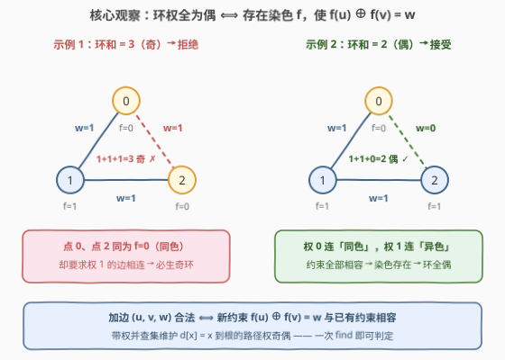
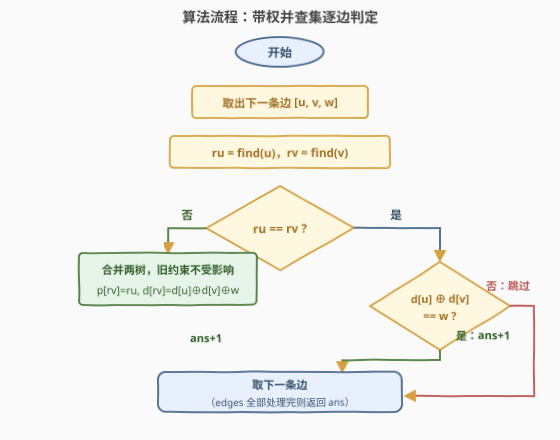

# LeetCode 增量偶权环查询 题解

## 1. 题目概述

- **标题 / 题号**：增量偶权环查询（#3887，hard）
- **链接**：https://leetcode.cn/problems/incremental-even-weighted-cycle-queries/
- **难度**：困难
- **标签**：并查集、带权并查集、图论、位运算

**题意**：给你一个正整数 $n$。有一个由 $n$ 个节点组成的**无向图**，节点编号从 $0$ 到 $n-1$，初始没有任何边。

再给定二维整数数组 `edges`，其中 `edges[i] = [u_i, v_i, w_i]` 表示一条连接节点 $u_i$ 和 $v_i$ 的边，权重 $w_i \in \{0, 1\}$。

**按给定顺序**处理每条边：如果将其添加到图中后，图中的**每个环**的边权和依然是**偶数**，则将这条边添加到图中。

返回最终成功添加到图中的边的数量。

**示例 1**：

```text
输入：n = 3, edges = [[0,1,1],[1,2,1],[0,2,1]]
输出：2
解释：[0,1,1]、[1,2,1] 依次加入。
      [0,2,1] 不加入：环 0-1-2-0 的边权和 1+1+1=3 为奇数。
```

**示例 2**：

```text
输入：n = 3, edges = [[0,1,1],[1,2,1],[0,2,0]]
输出：3
解释：三条边全部加入，环 0-1-2-0 的边权和 1+1+0=2 为偶数。
```

**约束**：

- $3 \le n \le 5 \times 10^4$
- $1 \le \text{edges.length} \le 5 \times 10^4$
- `edges[i] = [u_i, v_i, w_i]`，$0 \le u_i < v_i < n$，所有边唯一
- $w_i = 0$ 或 $w_i = 1$

> 💡 **审题关键**：① 「每个环」听起来吓人，但**归纳**可知任何时刻已接受的边集都满足"环全偶"（初始无边，此后只加入不破坏条件的边），所以加新边时**只需检查新产生的环**——旧环不含新边，权值不变；② 新边两端若不在同一连通分量，加入后**不产生任何环**，必然合法；③ 两端同分量时，新边恰产生**一个**新环 = 树上 $u \to v$ 路径 + 新边。整个问题坍缩为：**逐边判定"路径奇偶 vs 边权"**。

## 2. 解题思路

### 2.1 暴力思路：每加一条边，全图重新染色判定

最直观的做法：依次尝试每条边，加入后对全图做一次 BFS/DFS **奇偶染色判定**——给每个点标 $f(v) \in \{0,1\}$，若能做到"每条边 $(u,v,w)$ 都满足 $f(u) \oplus f(v) = w$"，则所有环权为偶，保留该边；否则回退。

单次判定 $O(n + m)$，总计 $O(m \cdot (n+m))$。代入上界 $5 \times 10^4 \times 10^5 = 5 \times 10^9$，必然超时。瓶颈在于**每条边都从头判定全图**，完全没有复用历史信息。

### 2.2 核心观察：环权全偶 ⟺ 奇偶染色存在



**引理**：无向图中所有环的边权和为偶数 $\iff$ 存在染色 $f: V \to \{0,1\}$，使每条边 $(u, v, w)$ 满足

$$f(u) \oplus f(v) = w$$

即**权 0 的边连"同色"点，权 1 的边连"异色"点**。

**证明**：

-（$\Leftarrow$）任取一个环 $v_0 \to v_1 \to \cdots \to v_k = v_0$，环权 $\equiv \sum_i \big(f(v_i) \oplus f(v_{i+1})\big) = f(v_0) \oplus f(v_k) = 0 \pmod 2$， telescoping 相消，恒为偶。

-（$\Rightarrow$）固定根 $r$，定义 $f(v) = $「$r$ 到 $v$ 任意路径的权和 $\bmod 2$」。由于所有环是偶的，两条 $r \to v$ 路径拼成的闭路径可分解为若干环，权为偶，故两条路径奇偶**必然一致**——$f$ 良定义。对每条边 $(u,v,w)$：$r \to u \to v \to r$ 是闭路径（偶），展开即得 $f(u) \oplus f(v) = w$。$\blacksquare$

有了引理，加边合法性一步到位：

$$\text{加边 } (u,v,w) \text{ 合法} \iff \text{约束系统 } \{f(x) \oplus f(y) = w_{xy}\} \cup \{f(u) \oplus f(v) = w\} \text{ 仍可满足}$$

维护"异或约束系统的可满足性"正是**带权并查集**（也叫扩展域/种类并查集）的拿手好戏：

- `d[x]` 记录 $x$ 到其所在树**树根**的路径权奇偶（0/1）；
- 于是树上任意两点 $u, v$（同树）的路径奇偶 $= d[u] \oplus d[v]$——**这就是"隐式路径"的查询**，不必真的存路径。

### 2.3 算法流程图



逐边处理只有两个分支：

- **不同根**：合并两棵树，连接权 $d[rv] = d[u] \oplus d[v] \oplus w$（保证约束 $f(u) \oplus f(v) = w$ 在新树中成立），**计数 +1**；
- **同根**：比较 $d[u] \oplus d[v]$（树上 $u \to v$ 路径的奇偶）与 $w$。相等 ⟺ 新环权为偶 ⟺ 接受，**计数 +1**；否则跳过。

### 2.4 示例演算

以示例 1（`n=3, edges=[[0,1,1],[1,2,1],[0,2,1]]`）走一遍（初始每个点自成一树，$d$ 全 0）：

| # | 边 $[u,v,w]$ | `ru, rv` | 判定与动作 | 关键值 | `ans` |
|---|--------------|----------|------------|--------|-------|
| 1 | $[0,1,1]$ | $0,\ 1$（异根） | 合并：`p[1]=0, d[1]=d[0]⊕d[1]⊕1=1` | $f(1)\oplus f(0)=1$ ✓ | 1 |
| 2 | $[1,2,1]$ | $0,\ 2$（异根） | 合并：`p[2]=0, d[2]=d[1]⊕d[2]⊕1=1⊕0⊕1=0` | $f(2)\oplus f(0)=0$ ✓ | 2 |
| 3 | $[0,2,1]$ | $0,\ 0$（同根） | $d[0]\oplus d[2]=0\oplus0=0 \ne w=1$ | 树上 $0\to2$ 路径权偶，加 1 权边成**奇环** | 2 |

返回 `ans = 2` ✓。示例 2 仅第 3 条边不同：$d[0] \oplus d[2] = 0 = w$，接受，返回 3 ✓。

## 3. 参考代码

### C++

```cpp
class Solution {
    vector<int> parent, sz, d;   // d[x]：x 到父节点的边权奇偶（0/1）

    int find(int x) {
        int root = x;
        while (parent[root] != root) root = parent[root];
        // 收集路径后从靠近根的一端累积，把 d[x] 更新为「x 到根」的奇偶
        vector<int> path;
        for (int cur = x; cur != root; cur = parent[cur]) path.push_back(cur);
        int acc = 0;
        for (int i = (int)path.size() - 1; i >= 0; i--) {
            acc ^= d[path[i]];
            d[path[i]] = acc;
            parent[path[i]] = root;
        }
        return root;
    }

public:
    int numberOfEdgesAdded(int n, vector<vector<int>>& edges) {
        parent.resize(n);
        iota(parent.begin(), parent.end(), 0);
        sz.assign(n, 1);
        d.assign(n, 0);

        int ans = 0;
        for (auto& e : edges) {
            int u = e[0], v = e[1], w = e[2];
            int ru = find(u), rv = find(v);
            if (ru == rv) {
                if ((d[u] ^ d[v]) == w) ans++;      // 树上路径奇偶 == w，环为偶
            } else {
                if (sz[ru] < sz[rv]) swap(ru, rv);  // 按大小合并
                parent[rv] = ru;
                d[rv] = d[u] ^ d[v] ^ w;            // 维持约束 f(u) ⊕ f(v) = w
                sz[ru] += sz[rv];
                ans++;                              // 连接两个分量，必不产生环
            }
        }
        return ans;
    }
};
```

### Python

```python
class Solution:
    def numberOfEdgesAdded(self, n: int, edges: List[List[int]]) -> int:
        parent = list(range(n))
        sz = [1] * n
        d = [0] * n  # d[x]：x 到父节点的边权奇偶

        def find(x: int) -> int:
            path = []
            while parent[x] != x:
                path.append(x)
                x = parent[x]
            root, acc = x, 0
            for node in reversed(path):      # 从靠近根的一端累积
                acc ^= d[node]
                d[node] = acc
                parent[node] = root
            return root

        ans = 0
        for u, v, w in edges:
            ru, rv = find(u), find(v)
            if ru == rv:
                if d[u] ^ d[v] == w:         # 树上 u→v 路径奇偶与新边一致
                    ans += 1
            else:
                if sz[ru] < sz[rv]:
                    ru, rv = rv, ru
                parent[rv] = ru
                d[rv] = d[u] ^ d[v] ^ w      # 维持约束 f(u) ⊕ f(v) = w
                sz[ru] += sz[rv]
                ans += 1                     # 连接两个分量，必不产生环
        return ans
```

> ⚠️ **合并公式速记**：约束 $f(u) \oplus f(v) = w$，其中 $f(u) = f(ru) \oplus d[u]$、$f(v) = f(rv) \oplus d[v]$，合并后 $f(rv) = f(ru) \oplus d[rv]$。代入化简即得 $d[rv] = d[u] \oplus d[v] \oplus w$——**三个量异或出连接权**，交换 $u, v$ 或换挂靠方向公式都不变。

## 4. 复杂度分析

| 维度 | 复杂度 | 说明 |
|------|--------|------|
| **时间** | $O\big((n + m) \cdot \alpha(n)\big)$ | 每条边两次 `find` + $O(1)$ 合并，近似线性；$n, m \le 5\times10^4$ 轻松通过 |
| **空间** | $O(n)$ | `parent` / `sz` / `d` 三个长度 $n$ 的数组 |
| **单次判定** | 均摊近 $O(1)$ | 相比暴力每边 $O(n+m)$ 全图重染色的关键收益 |

## 5. 扩展：为什么只查"一条树路径"就够？

同根时我们只比较了**并查集树上**那条 $u \to v$ 路径的奇偶，但实际图中 $u$ 到 $v$ 可能有无穷多条路径（走不同的环），凭什么查一条就代表全部？

**闭路径分解论证**：设归纳不变量成立——当前已接受边集的所有环权均为偶。任取图中两条 $u \to v$ 路径 $P_1, P_2$，首尾相接得到一条闭路径，其权和 $w(P_1) + w(P_2) \equiv 0 \pmod 2$（闭路径在 $\mathbb{Z}_2$ 上可分解为若干简单环之和，每个环权偶）。于是

$$w(P_1) \equiv w(P_2) \pmod 2$$

即 **$u \to v$ 路径的奇偶是良定义的**，与走哪条路无关。所以用树上那条路径（$d[u] \oplus d[v]$）判定一次，等价于检查了所有包含新边的环。

另一个视角：本题本质是在维护一个**模 2 线性方程组**（每个点一个未知数 $f(v) \in \{0,1\}$，每条已接受边一个方程），问新方程加入后方程组是否仍相容。带权并查集就是在 $O(\alpha)$ 时间内回答这个"增量相容性"查询——它是模 2 高斯消元在**森林结构**上的退化特例（每条方程只含两个未知数，相容性只需传递关系即可判定）。

## 6. 面试要点

**Q1：为什么「所有环权为偶」等价于「存在奇偶染色 $f$」？**

> 正向：固定根 $r$，令 $f(v)$ 为 $r$ 到 $v$ 任意路径权的奇偶；环全偶保证这个定义良定义（两条路径拼成闭路径，可分解为偶权环）。反向：环权 telescoping 相消等于 $f(v_0) \oplus f(v_k) = 0$。这一引理把"全局环检查"转化为"局部边约束"，是整题的支点。

**Q2：带权并查集的 `d` 数组语义是什么？合并公式怎么推？**

> `d[x]` 是 $x$ 到**当前父节点**的边权奇偶，路径压缩后变成 $x$ 到**根**的奇偶。合并时令 $d[rv] = d[u] \oplus d[v] \oplus w$，代入 $f(u) = f(ru) \oplus d[u]$、$f(v) = f(rv) \oplus d[v]$ 验证约束 $f(u) \oplus f(v) = w$ 恰好成立。公式对 $u, v$ 互换和挂靠方向均对称。

**Q3：同根时只比较一条树路径，不怕别的 $u \to v$ 路径奇偶不同吗？**

> 不怕。归纳不变量保证已接受边集环全偶；任意两条 $u \to v$ 路径拼接是闭路径，分解为偶权环，故两路径奇偶恒同——路径奇偶是良定义的。查树上路径一条即代表全体。

**Q4：本题与「二分图判定」是什么关系？**

> 二分图判定 = 本题所有边权取 1 的特例：环权全偶 ⟺ 无奇环 ⟺ 二分图。所以本题是二分图判定的**加权推广**，而"增量加边 + 在线判定"的形态正对应带权并查集的增量约束维护（同理，全 0 权的特例就是普通连通性并查集）。

**Q5：`find` 为什么用迭代而不是递归？**

> $n$ 可达 $5 \times 10^4$，若不加按大小合并且数据形成长链，递归深度线性增长，有栈溢出风险。迭代版先收集路径节点、再从靠近根的一端倒序累积 `d`（顺序累积会读到尚未更新的父节点值，是常见 bug）。

## 同类练习题

| # | 题目 | 与本题的关联 |
|---|------|-------------|
| 990 | [等式方程的可满足性](https://leetcode.cn/problems/satisfiability-of-equality-equations/)（[题解](../0901-1000/990_等式方程的可满足性.md)） | 同为「约束系统可满足性 + 并查集」，把 `==`/`!=` 换成异或语义 |
| 399 | [除法求值](https://leetcode.cn/problems/evaluate-division/)（[题解](../0301-0400/399_除法求值.md)） | 带权并查集的招牌题，权值从「奇偶异或」换成「比值乘法」 |
| 2076 | [处理含限制条件的好友请求](https://leetcode.cn/problems/process-restricted-friend-requests/)（[题解](../2001-2100/2076_处理含限制条件的好友请求.md)） | 同样按序处理请求、逐条判定能否合并，流程骨架最接近本题 |
| 1722 | [执行交换操作后的最小汉明距离](https://leetcode.cn/problems/minimize-hamming-distance-after-swap-operations/)（[题解](../1701-1800/1722_执行交换操作后的最小汉明距离.md)） | 带权/扩展域并查集分组后组内自由交换的典例 |
| 684 | [冗余连接](https://leetcode.cn/problems/redundant-connection/)（[题解](../0601-0700/684_冗余连接.md)） | 并查集判"加入后成环"的入门题，可视为本题去掉权值的简化版 |
