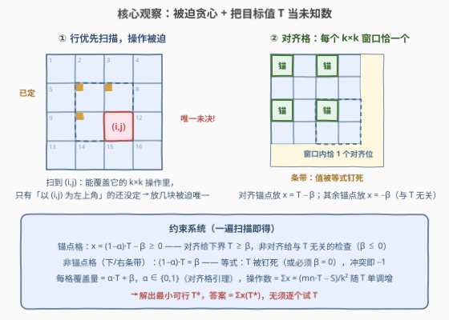
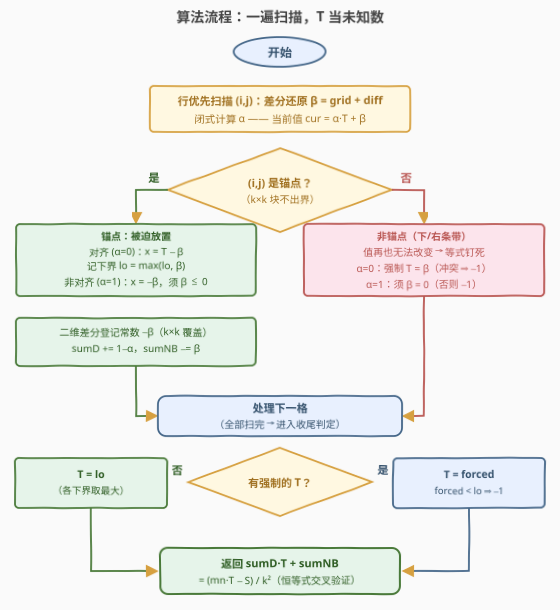

# LeetCode 使所有网格元素相等的最小操作次数 题解

## 1. 题目概述

- **标题 / 题号**：使所有网格元素相等的最小操作次数（#3888，hard）
- **链接**：https://leetcode.cn/problems/minimum-operations-to-make-all-grid-elements-equal/
- **难度**：困难
- **标签**：数组、数学、矩阵、二维差分、贪心

> ⚠️ 本题为 LeetCode 付费题（Plus 会员专享），题意按官方示例用例与 hints 重建，并已对照社区镜像核对（官方示例、约束一致），可信度较高。

**题意**：给定一个大小为 $m \times n$ 的二维整数数组 `grid` 和一个整数 $k$。一次操作中，你可以：

- 选择 `grid` 的任意 $k \times k$ **子矩阵**（行、列均连续且完全落在网格内），并且
- 将该子矩阵中的所有元素 **加 1**。

返回使网格中**所有元素相等**所需的最少操作次数；如果不可能，返回 $-1$。

**示例 1**：

```text
输入：grid = [[3,3,5],[3,3,5]], k = 2
输出：2
解释：选择左边的 2×2 子矩阵（覆盖前两列）并操作两次。
      1 次后：[[4,4,5],[4,4,5]]
      2 次后：[[5,5,5],[5,5,5]] —— 全部变为 5。
```

**示例 2**：

```text
输入：grid = [[1,2],[2,3]], k = 1
输出：4
解释：k=1 时每次操作给单个格子 +1，最终值必须是 3。
      1→3 需 2 次，2→3 需 1 次，2→3 需 1 次，3→3 需 0 次，共 4 次。
```

**约束**：

- $1 \le m = \text{grid.length} \le 1000$
- $1 \le n = \text{grid[i].length} \le 1000$
- $-10^5 \le \text{grid[i][j]} \le 10^5$
- $1 \le k \le \min(m, n)$

> 💡 **审题关键**：① 操作**只能加不能减**，元素只增不减；② $k \times k$ 的块必须**完整落在网格内**——左上角 $(i,j)$（0-indexed）合法当且仅当 $i \le m-k$ 且 $j \le n-k$，合法左上角称为**锚点**；③ "使所有元素相等"意味着最终存在公共目标值 $T$。操作只加不减 ⇒ $T \ge \max(\text{grid})$。

## 2. 解题思路

### 2.1 暴力思路：枚举目标值，逐个试探

操作只加不减，所以最终公共值 $T \ge \max(\text{grid})$。于是自然的框架是：**枚举 $T$，判定「能否用若干 $k \times k$ 块把每格恰好补到 $T$」，并数出最少块数**。

单个 $T$ 的判定看似要搜索「选哪些块、各选几次」，实则完全不用——本文观察一会证明：按行优先扫描，每一步放置**被迫唯一**，配二维差分即可 $O(mn)$ 精确判定。

真正的坑在 $T$ 的**候选范围**：从 $\max$ 开始逐个试，第一个可行 $T$ 可能离 $\max$ 很远——

```text
grid = [[100000, 0, 100000],
        [100000, 0, 100000]],  k = 2
```

设左块（覆盖前两列）用 $x$ 次、右块用 $y$ 次，三列终值分别为 $10^5+x$、$x+y$、$10^5+y$。相等 forces $x = y$ 且 $T = x + y = 2x = 10^5 + x$，即 $T = 2 \times 10^5$ **被唯一钉死**——距 $\max$ 有 $10^5$ 步。逐个试探要 $10^5 \times O(mn) = 10^{11}$ 次操作，必然超时，而且「试到哪里停」没有任何安全准则。

### 2.2 核心观察：被迫贪心 + 把目标值 $T$ 当未知数



**观察一（被迫性）**：按**行优先**次序扫描格子。能覆盖 $(i,j)$ 的块，其锚点必落在以 $(i,j)$ 为**右下角**的 $k \times k$ 窗口内（锚点行、列都不超过 $(i,j)$）。处理到 $(i,j)$ 时，窗口内除 $(i,j)$ 自身外的锚点都已定完块数，而锚点排在 $(i,j)$ 之后的块**永远不会覆盖** $(i,j)$。于是当前格离 $T$ 还差多少，只能靠「以 $(i,j)$ 为左上角的块」补——**放几块被唯一确定，贪心没有任何选择余地**。用**二维差分**把每块的影响 $O(1)$ 摊进覆盖量，单次判定 $O(mn)$。

**观察二（总和守恒）**：每次操作给全网格总和恰好 $+k^2$。若最终全为 $T$，则

$$\text{操作数} = \frac{mn \cdot T - S}{k^2}, \qquad S = \sum \text{grid[i][j]}$$

它是 $T$ 的严格增函数——**最小化操作数 ⟺ 最小化可行 $T$**。（这也解释了总和一致性：$k^2 \mid mn \cdot T - S$ 是可行性的必要条件，贪心成功时自动成立。）

**观察三（$T$ 不能猜，要解出来）**：2.1 的反例说明 $T$ 会被结构**钉死**。既然单个 $T$ 的判定是被迫贪心，那把 $T$ 当**未知数**跑同样的贪心：扫描中每个量都是 $T$ 的一次函数

$$\text{cur}(i,j) = \alpha \cdot T + \beta$$

（放置的块数 $x = T - \text{cur}$ 本身也是一次函数），一遍扫描就能**收集关于 $T$ 的全部约束**：

- **锚点格**：$x = (1-\alpha) \cdot T - \beta \ge 0$（不等式）；
- **非锚点格**（最下方 $k-1$ 行 / 最右侧 $k-1$ 列的条带，无法作为左上角，处理到它时值已定）：$(1-\alpha) \cdot T = \beta$（**等式**——$T$ 常被钉死）。

**观察四（对齐格引理：$\alpha \in \{0,1\}$）**：任意 $k$ 个连续整数恰含一个 $k$ 的倍数，所以以任一格为右下角的 $k \times k$ 窗口内恰有一个**对齐位置**（行、列下标均为 $k$ 的倍数）。归纳可证：

- **对齐锚点**（$i \bmod k = 0$ 且 $j \bmod k = 0$）：窗口内的对齐位就是自己 ⇒ 处理前覆盖系数 $\alpha = 0$，放 $x = T - \beta$ 块（**系数 1**）；
- **其余锚点**：窗口内的对齐位 ≠ 自己，且有效、排在前面 ⇒ $\alpha = 1$，放 $x = -\beta$ 块（**系数 0，与 $T$ 无关**）。

于是每格覆盖量的系数 $\alpha \in \{0,1\}$，还有**闭式**（0-indexed，表示「窗口内的对齐位有效且不等于自己」）：

$$\alpha = 1 \iff \big(i \bmod k \ne 0 \text{ 或 } j \bmod k \ne 0\big) \wedge \Big(\big(\lfloor i/k \rfloor + 1\big) \cdot k \le m\Big) \wedge \Big(\big(\lfloor j/k \rfloor + 1\big) \cdot k \le n\Big)$$

由于 $d = 1-\alpha \in \{0,1\}$ 恒非负，约束系统里**没有上界**，可行集极其简单：

$$\text{可行集} = \{\text{forced}\} \cap [\text{lo}, +\infty)$$

其中 `forced` 是条带等式强制出的 $T$（可能不存在），`lo` 是对齐锚点给出的下界 $\max \beta$。取最小可行 $T^\*$，答案就是 $\sum x(T^\*) = \text{sumD} \cdot T^\* + \text{sumNB}$（sumD 为对齐锚点个数，恰为 $\lfloor m/k \rfloor \cdot \lfloor n/k \rfloor$）。

> 💡 **返回 $-1$ 的四种硬冲突**：① 非对齐锚点处 $\beta > 0$（要放负数块）；② $\alpha=1$ 的条带格 $\beta \ne 0$（值已定却对不上）；③ 多个条带等式强制出不同的 $T$；④ 强制的 $T <$ 下界 lo。任一出现即无解。

### 2.3 算法流程图



一遍行优先扫描，二维差分维护 $\beta$，闭式计算 $\alpha$；锚点处登记被迫放置并累计 `sumD/sumNB`，条带处登记等式；扫描结束后解出最小可行 $T$，按公式返回。

### 2.4 示例演算

先用反例 $\text{grid} = [[3,0,3],[3,0,3]]$，$k=2$（$m=2, n=3$，锚点只有 $(0,0)$、$(0,1)$，其中对齐锚点仅 $(0,0)$）：

| 格子 | $\alpha$ | $\beta$（cur $= \alpha T + \beta$） | 身份 | 约束 / 动作 |
|------|----------|-----------------------------------|------|-------------|
| $(0,0)$ | 0 | $3$ | 对齐锚点 | 下界 $T \ge 3$；放 $x = T-3$（差分登记 $-3$） |
| $(0,1)$ | 1 | $0 - 3 = -3$ | 非对齐锚点 | $x = 3$ 与 $T$ 无关（$\beta \le 0$ ✓）；差分登记 $+3$ |
| $(0,2)$ | 0 | $3 + 3 = 6$ | 条带非锚点 | **强制 $T = 6$** |
| $(1,0)$ | 1 | $3 - 3 = 0$ | 条带非锚点 | $\beta = 0$ ✓ |
| $(1,1)$ | 1 | $0 - 3 + 3 = 0$ | 条带非锚点 | $\beta = 0$ ✓ |
| $(1,2)$ | 0 | $3 + 3 = 6$ | 条带非锚点 | 强制 $T = 6$（一致 ✓） |

结论：$T^\* = 6 \ge$ 下界 $3$，答案 $= \text{sumD} \cdot T + \text{sumNB} = 1 \times 6 + (-3 + 3) = \mathbf{6}$。

- **验证**：左块操作 3 次、右块操作 3 次，三列终值 $3+3$、$0+6$、$3+3$ 全为 6 ✓；
- **交叉验证**：$(mn \cdot T - S)/k^2 = (6 \times 6 - 12)/4 = 6$ ✓；
- **为什么 $T = \max = 3$ 不行**：扫到 $(0,2)$ 时被迫放置的块已把它顶到 $3+3=6 > 3$——逐个试 $T$ 会在这里失败，必须让 $T$ 升到 6。

再快速过一遍官方示例 1（$[[3,3,5],[3,3,5]]$，$k=2$）：$(0,0)$ 对齐、$\beta=3$ → 下界 $T \ge 3$；$(0,1)$ 非对齐、$\beta = 3-3 = 0$ → 放 0 块；$(0,2)$ 条带、$\alpha=0$、$\beta = 5+0 = 5$ → **强制 $T=5$**；其余条带格 $\beta = 0$ ✓。$T^\* = 5$，答案 $= 1 \times 5 - 3 = \mathbf{2}$ ✓。示例 2（$k=1$）所有格子都是对齐锚点、无条带等式，$T = \max = 3$，答案 $= 4 \times 3 - 8 = \mathbf{4}$ ✓。

## 3. 参考代码

### C++

```cpp
class Solution {
public:
    long long minOperations(vector<vector<int>>& grid, int k) {
        int m = grid.size(), n = grid[0].size();
        // 二维差分：维护「当前值」的常数部分 beta（cur = alpha*T + beta）
        vector<vector<long long>> diff(m + 2, vector<long long>(n + 2, 0));
        long long lo = LLONG_MIN;       // T 的下界（对齐锚点给出）
        long long forced = LLONG_MIN;   // 条带等式强制出的 T
        long long sumD = 0, sumNB = 0;  // Σ(1−alpha) 与 Σ(−beta)，均在锚点处累计
        for (int i = 1; i <= m; ++i) {
            for (int j = 1; j <= n; ++j) {
                diff[i][j] += diff[i - 1][j] + diff[i][j - 1] - diff[i - 1][j - 1];
                long long b = grid[i - 1][j - 1] + diff[i][j];  // cur = alpha*T + b
                int ii = i - 1, jj = j - 1;                     // 0-indexed
                bool alpha = ((ii % k) || (jj % k))
                             && (ii / k + 1) * k <= m
                             && (jj / k + 1) * k <= n;
                if (i + k - 1 <= m && j + k - 1 <= n) {  // 锚点：可在此放块
                    if (alpha) {              // 非对齐：x = −b，与 T 无关
                        if (b > 0) return -1;
                    } else {                  // 对齐：x = T − b >= 0
                        lo = max(lo, b);
                        sumD += 1;
                    }
                    sumNB -= b;               // 差分登记这块的常数 −b（覆盖 k×k）
                    diff[i][j] -= b;
                    diff[i + k][j] += b;
                    diff[i][j + k] += b;
                    diff[i + k][j + k] -= b;
                } else {                      // 非锚点（下/右条带）：值已定
                    if (alpha) {              // alpha=1：必须 b == 0
                        if (b != 0) return -1;
                    } else {                  // alpha=0：强制 T = b
                        if (forced == LLONG_MIN) forced = b;
                        else if (forced != b) return -1;
                    }
                }
            }
        }
        long long T;
        if (forced != LLONG_MIN) {
            if (forced < lo) return -1;       // 强制值突破下界
            T = forced;
        } else {
            if (lo == LLONG_MIN) return -1;   // 防御：k<=min(m,n) 时 (0,0) 必是对齐锚点
            T = lo;
        }
        return sumD * T + sumNB;              // = (m*n*T − S) / k^2
    }
};
```

### Python

```python
class Solution:
    def minOperations(self, grid: List[List[int]], k: int) -> int:
        m, n = len(grid), len(grid[0])
        # 二维差分：维护「当前值」的常数部分 beta（cur = alpha*T + beta）
        diff = [[0] * (n + 2) for _ in range(m + 2)]
        lo = None        # T 的下界（对齐锚点给出）
        forced = None    # 条带等式强制出的 T
        sum_d = 0        # Σ(1−alpha)：对齐锚点个数
        sum_nb = 0       # Σ(−beta)：所有锚点
        for i in range(1, m + 1):
            for j in range(1, n + 1):
                diff[i][j] += diff[i - 1][j] + diff[i][j - 1] - diff[i - 1][j - 1]
                b = grid[i - 1][j - 1] + diff[i][j]      # cur = alpha*T + b
                ii, jj = i - 1, j - 1                    # 0-indexed
                alpha = 1 if (ii % k or jj % k) \
                        and (ii // k + 1) * k <= m and (jj // k + 1) * k <= n else 0
                if i + k - 1 <= m and j + k - 1 <= n:    # 锚点：可在此放块
                    if alpha:            # 非对齐：x = −b，与 T 无关
                        if b > 0:
                            return -1
                    else:                # 对齐：x = T − b >= 0
                        if lo is None or b > lo:
                            lo = b
                        sum_d += 1
                    sum_nb -= b          # 差分登记这块的常数 −b（覆盖 k×k）
                    diff[i][j] -= b
                    diff[i + k][j] += b
                    diff[i][j + k] += b
                    diff[i + k][j + k] -= b
                else:                                    # 非锚点（条带）：值已定
                    if alpha:           # alpha=1：必须 b == 0
                        if b:
                            return -1
                    else:               # alpha=0：强制 T = b
                        if forced is not None and forced != b:
                            return -1
                        forced = b
        if forced is not None:
            if lo is not None and forced < lo:
                return -1
            T = forced
        else:
            if lo is None:              # 防御：k<=min(m,n) 时 (0,0) 必是对齐锚点
                return -1
            T = lo
        return sum_d * T + sum_nb       # = (m*n*T − S) // (k*k)
```

> ⚠️ **不要**写成「只试 $T = \max$ 和 $\max+1$」：2.4 的反例（唯一可行 $T = \max + 3$，答案 6）会被错判成 $-1$。可行集是 $\{\text{forced}\} \cap [\text{lo}, +\infty)$，必须解约束。

## 4. 复杂度分析

| 维度 | 复杂度 | 说明 |
|------|--------|------|
| **时间** | $O(m \times n)$ | 每格 $O(1)$：差分前缀和还原 $\beta$、闭式算 $\alpha$、$O(1)$ 差分登记；收尾 $O(1)$ 解出 $T$ |
| **空间** | $O(m \times n)$ | $(m+2) \times (n+2)$ 的 `long long` 差分数组（$1000 \times 1000$ 约 16 MB）；$\alpha$ 用闭式计算，**无需**系数差分数组 |
| **对比暴力** | 每个省掉的因子 | 暴力逐 $T$ 试探要 $\Omega(\text{偏移} \times mn)$，偏移可达 $10^5$；符号化一遍扫描把「定 $T$」也做进了同一次扫描 |

## 5. 扩展

**① 调试恒等式**：代码算出的答案必须等于 $\frac{mn \cdot T^\* - S}{k^2}$（总和守恒），对拍时先查这一条能快速定位差分登记的符号错误。

**② 数值幅度与溢出**：$\beta$ 的绝对值随扫描线性增长，构造对抗性棋盘格模式（$\pm 10^5$ 交替）实测峰值约 $(m+n) \cdot \max|\text{grid}| \approx 2 \times 10^8$；$\text{sumD} \le 10^6$，故中间量与答案都 $\ll 2^{63}$，`long long` 安全（Python 无此忧虑）。

**③ 可行集的结构**：由 $d = 1 - \alpha \in \{0,1\}$（对齐格引理）可知约束系统**没有上界**，可行集要么空、要么单点 $\{\text{forced}\}$、要么半无穷区间 $[\text{lo}, +\infty)$。实测两万组随机用例中，「无强制等式」时 lo 恒等于 $\max(\text{grid})$——也就是说 $T$ 偏离 $\max$ 只会发生在条带等式存在之时；但该规律的证明比实现更绕，解题时老老实实解约束最稳。

**④ 若不想推 $\alpha$ 的闭式**：可以并行再开一个「系数」二维差分数组，把 $T$ 的系数也一路差分维护（即对 $(\alpha, \beta)$ 二元组做同样的差分运算），同样 $O(mn)$——闭式只是省掉了这个数组和一层归纳信任。

**⑤ 与一维版的血缘**：把本题压成一维就是「每次给连续 $k$ 个元素 $+1$」的被迫贪心 + 差分（995 / 1526）；二维化后新增的难点正是「目标值 $T$ 不再能从小到大试」——条带等式会把它钉死在远离 $\max$ 的位置，这是本题评为困难的核心考点。

## 6. 面试要点

**Q1：为什么扫描到格子 $(i,j)$ 时，放置的块数是被迫的？**

> 能覆盖 $(i,j)$ 的块，锚点必在以 $(i,j)$ 为右下角的 $k \times k$ 窗口内；行优先次序下，窗口内除 $(i,j)$ 外的锚点都已定完块数，锚点更靠后的块又永不覆盖 $(i,j)$。于是缺口只能由「以 $(i,j)$ 为左上角」的块补，放几块唯一确定——对给定 $T$，可行性与最少操作数都是**精确判定**，不存在搜索。

**Q2：为什么最小化操作次数等价于最小化目标值 $T$？**

> 每次操作给总和恰好 $+k^2$，最终总和 $mn \cdot T$，故操作数 $= (mn \cdot T - S)/k^2$，是 $T$ 的严格增函数。同时 $k^2 \mid mn \cdot T - S$ 是必要条件，贪心成功时自动满足。

**Q3：为什么不能只试 $T = \max$ 或 $\max + 1$？**

> 反例 $[[3,0,3],[3,0,3]]$（$k=2$）的条带等式把 $T$ 钉死在 $6 = \max + 3$，正确答案是 6 而「只试两个」会返回 $-1$；构造 $[[A,0,B],[A,0,B]]$ 可把偏移推到 $10^5$。可行集结构是 $\{\text{forced}\} \cap [\text{lo}, +\infty)$，$T$ 必须解出来。

**Q4：$\alpha$ 为什么一定属于 $\{0,1\}$？有什么用？**

> 任意 $k$ 个连续整数恰含一个 $k$ 的倍数 ⇒ 每个 $k \times k$ 窗口恰含一个对齐位置。归纳：对齐锚点处窗口内对齐位是自己（未放置）⇒ $\alpha=0$；其余锚点处窗口内对齐位有效且已放置 ⇒ $\alpha=1$。用途：$\alpha$ 有 $O(1)$ 闭式（省掉系数差分数组）；$d = 1-\alpha \in \{0,1\}$ 保证约束无上界、可行集结构极简；非对齐锚点的块数与 $T$ 无关，这让数值不会指数爆炸。

**Q5：什么时候返回 $-1$？**

> 四类硬冲突：非对齐锚点 $\beta > 0$（要放负块）；$\alpha=1$ 的条带格 $\beta \ne 0$（值已定却对不上）；多个条带等式强制出不同的 $T$；强制的 $T$ 小于下界 lo。另外 $(0,0)$ 永远是对齐锚点（$k \le \min(m,n)$），lo 必存在，不存在「无任何约束」的退化情形。

## 同类练习题

| # | 题目 | 与本题的关联 |
|---|------|-------------|
| 995 | [K 连续位的最小翻转次数](https://leetcode.cn/problems/minimum-number-of-k-consecutive-bit-flips/)（[题解](../0901-1000/995_K连续位的最小翻转次数.md)） | 一维版「被迫贪心 + 窗口差分」，每次翻 $k$ 个连续位——本题 $k \times k$ 的 1D 镜像 |
| 2132 | [用邮票贴满网格的最少个数](https://leetcode.cn/problems/stamping-the-grid/)（[题解](../2101-2200/2132_用邮票贴满网格图.md)） | 二维差分 + 贪心可行性判定的代表作，同为「块恰好覆盖」问题 |
| 1526 | [形成目标数组的子数组最少增加次数](https://leetcode.cn/problems/minimum-number-of-increments-on-subarrays-to-form-a-target-array/)（[题解](../1501-1600/1526_形成目标数组的子数组最少增加次数.md)） | 一维差分贪心求最少操作数，目标值视角与本题同源 |
| 2033 | [获取单值网格的最小操作数](https://leetcode.cn/problems/minimum-operations-to-make-a-uni-value-grid/)（[题解](../2001-2100/2033_使网格单值的最少操作次数.md)） | 同为「网格变单值」，但操作是单格 $\pm x$，排序取中位数即可——对照出「块操作」的难点所在 |
| 1314 | [矩阵区域和](https://leetcode.cn/problems/matrix-block-sum/)（[题解](../1301-1400/1314_矩阵区域和.md)） | 二维前缀和 / 差分的基本功，理解本题差分维护的最佳前置 |
