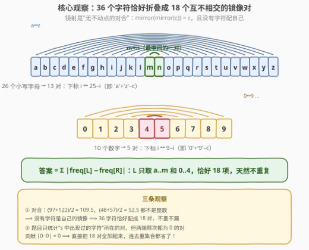
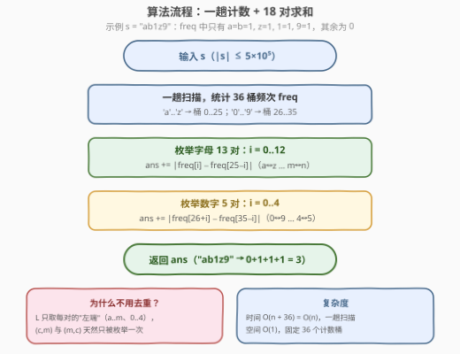

# LeetCode 镜像频次距离 题解

## 1. 题目概述

- **标题 / 题号**：镜像频次距离（#3889，medium）
- **链接**：https://leetcode.cn/problems/mirror-frequency-distance/
- **难度**：中等
- **标签**：哈希表、字符串、计数

**题意**：给你一个由小写英文字母和数字组成的字符串 `s`。每个字符有一个**镜像字符**：

- **字母**：按字母表逆序配对——`'a'` 的镜像是 `'z'`，`'b'` 的镜像是 `'y'`，以此类推；
- **数字**：按 `0` 到 `9` 逆序配对——`'0'` 的镜像是 `'9'`，`'1'` 的镜像是 `'8'`，以此类推。

设 $\mathrm{freq}(x)$ 表示字符 $x$ 在 `s` 中出现的次数。对 `s` 中每个**唯一**字符 $c$，设 $m$ 为其镜像字符，计算 $|\mathrm{freq}(c) - \mathrm{freq}(m)|$。镜像对 $(c, m)$ 与 $(m, c)$ 视为同一对，只计一次。返回所有**不同镜像对**的绝对差之和。

**示例 1**：

```text
输入：s = "ab1z9"
输出：3
解释：镜像对 (a,z): |1-1|=0，(b,y): |1-0|=1，(1,8): |1-0|=1，(9,0): |0-1|=1，
      答案 = 0 + 1 + 1 + 1 = 3。
```

**示例 2**：

```text
输入：s = "4m7n"
输出：2
解释：(4,5): |1-0|=1，(m,n): |1-1|=0，(7,2): |1-0|=1，答案 = 2。
```

**示例 3**：

```text
输入：s = "byby"
输出：0
解释：唯一出现的镜像对是 (b,y): |2-2|=0。
```

**约束**：

- $1 \le |s| \le 5 \times 10^5$
- `s` 仅由小写英文字母和数字组成

> 💡 **审题关键**：① $(c, m)$ 与 $(m, c)$ 是同一对，只算一次——这是本题最容易翻车的去重点；② 只要 $c$ 在 `s` 中出现过，**即使镜像 $m$ 一次都没出现**，$|\mathrm{freq}(c) - \mathrm{freq}(m)|$ 也要计入（示例 1 的 `(b,y)`，`y` 根本不在串里）；③ 字符集只有 36 种（26 字母 + 10 数字），规模极小，暗示解法应当以"字符集"而非"字符串"为枚举主体。

## 2. 解题思路

### 2.1 直译思路

按题面直译：先用哈希表统计每个字符的频次；再遍历 `s` 的每个唯一字符 $c$，求出镜像 $m$，计算 $|\mathrm{freq}(c) - \mathrm{freq}(m)|$。由于遍历唯一字符时 $(c, m)$ 与 $(m, c)$ 会被访问两次（比如 `"az"` 中 `a` 和 `z` 互相指向），必须维护一个去重集合，以 $(\min(c, m), \max(c, m))$ 为 key 保证每对只累加一次。

这样写是 $O(n)$、也能通过，但去重集合纯属"防御性记账"——它在补偿**枚举主体选错了**这一事实：以"字符串中出现的字符"为主体，天然会产生 $(c,m)$、$(m,c)$ 的重复访问，需要事后去重。

### 2.2 核心观察：36 个字符恰好划分成 18 个互不相交的镜像对



把枚举主体从"字符串"换成"字符集"，问题瞬间塌缩。设 $\mathrm{mirror}(c)$ 为 $c$ 的镜像，则字母下标 $i$（`a` 记 0）的镜像是 $25 - i$，数字下标 $i$ 的镜像是 $9 - i$。三步看穿结构：

**观察一：镜射是"无不动点的对合"。**
$\mathrm{mirror}(\mathrm{mirror}(c)) = c$（对合），且 $(97 + 122) / 2 = 109.5$、$(48 + 57) / 2 = 52.5$ 都不是整数，即**不存在自己配自己的字符**。没有不动点的对合作用在集合上，效果就是把集合划分成若干互不相交的二元对。

**观察二：36 个字符 = 恰好 18 对，不重不漏。**
字母折成 13 对（`a↔z, b↔y, …, m↔n`），数字折成 5 对（`0↔9, 1↔8, …, 4↔5`）。每对取"左端"作代表（字母取 `a..m`，数字取 `0..4`），枚举这 18 个代表即枚举了全部镜像对，**去重问题从根上消失**。

**观察三：两端都未出现的对贡献 0，可以放心全加。**
题目只统计"`s` 中出现过的字符"所在的对，但若 $c$ 与 $m$ 都不在 `s` 中，$|\mathrm{freq}(c) - \mathrm{freq}(m)| = |0 - 0| = 0$。所以**无需判断"这对是否在 s 中出现过"，直接把 18 对全部求和**，多加的都是 0。

> ⚠️ **一个易错细节**：不要把"遍历 36 个字符、对每个字符查镜像再累加"写成最终版——那样每对会被算两次（$(c,m)$ 一次、$(m,c)$ 一次），虽然数值相同、除以 2 也能得到正确答案，但"只枚举左端代表"的写法边界更少、意图更清晰。

### 2.3 算法流程图



整个算法 = 一趟 $O(n)$ 计数 + 恒定 18 次加法。没有任何排序、哈希集合或嵌套循环。

### 2.4 示例演算

以 `s = "ab1z9"` 为例，频次表：`a=1, b=1, 1=1, z=1, 9=1`，其余为 0。

| 镜像对 | freq(L) | freq(R) | 绝对差 | 备注 |
|--------|---------|---------|--------|------|
| (a, z) | 1 | 1 | 0 | 两端都出现 |
| (b, y) | 1 | 0 | 1 | `y` 不在 s 中，仍计入 |
| (c, x) … (l, o) | 0 | 0 | 0 | 双零对，白加 0 |
| (m, n) | 0 | 0 | 0 | 双零对 |
| (0, 9) | 0 | 1 | 1 | 只有右端 `9` 出现 |
| (1, 8) | 1 | 0 | 1 | 只有左端出现 |
| (2, 7), (3, 6), (4, 5) | 0 | 0 | 0 | 双零对 |

合计 $0 + 1 + 1 + 1 = 3$，与示例一致。

## 3. 参考代码

### C++

```cpp
class Solution {
public:
    int mirrorFrequency(string s) {
        int freq[36] = {0};                    // 0~25: 'a'..'z'，26~35: '0'..'9'
        for (char c : s) {
            if (c <= '9') freq[26 + (c - '0')]++;
            else          freq[c - 'a']++;
        }
        int ans = 0;
        for (int i = 0; i < 13; ++i)           // a..m ↔ z..n，字母 13 对
            ans += abs(freq[i] - freq[25 - i]);
        for (int i = 0; i < 5; ++i)            // 0..4 ↔ 9..5，数字 5 对
            ans += abs(freq[26 + i] - freq[35 - i]);
        return ans;
    }
};
```

### Python

```python
class Solution:
    def mirrorFrequency(self, s: str) -> int:
        freq = [0] * 36                        # 0~25: a..z，26~35: 0..9
        for c in s:
            if c.isdigit():
                freq[26 + int(c)] += 1
            else:
                freq[ord(c) - ord('a')] += 1

        ans = 0
        for i in range(13):                    # a..m ↔ z..n，字母 13 对
            ans += abs(freq[i] - freq[25 - i])
        for i in range(5):                     # 0..4 ↔ 9..5，数字 5 对
            ans += abs(freq[26 + i] - freq[35 - i])
        return ans
```

> 💡 两个循环可以合并成一个：先对 36 个字符统一累加 $\mathrm{freq}[c]$ 与 $\mathrm{freq}[\mathrm{mirror}(c)]$ 之差再除以 2（每对被对称地加了两次）。单写 13 + 5 虽然多两行，但"每对恰好枚举一次"的意图一目了然。

## 4. 复杂度分析

| 维度 | 复杂度 | 说明 |
|------|--------|------|
| **时间** | $O(n + 36) = O(n)$ | 一趟扫描计数，随后恒定 18 次加法 |
| **空间** | $O(1)$ | 固定 36 个计数桶，与 $n$ 无关 |
| **答案上界** | $18 \times 5 \times 10^5 = 9 \times 10^6$ | 18 对 × 单对最大频次差，`int` 不溢出 |

## 5. 扩展：换字符集、换定义，骨架不变

- **加入大写字母**：镜像公式同样是对折——`'A'+'Z'-c`，桶扩到 62 个，大写再折 13 对，总对数变为 31 对，循环边界相应改成 `13+13` 与 `5`，其余代码一字不动。这说明本题真正考的是"**对合配对**"的结构认知，而非 36 这个具体数字。
- **换"距离"定义**：若绝对差改成频次的 max、min 或乘积，唯一变化是那一个运算符——因为枚举结构（18 个不相交的对）与运算无关。反之，若定义改成非对称的（比如只统计 $c$ 在前 $m$ 在后的有序对），"对合配对"结构被破坏，才需要重新设计。
- **与 1657（确定两个字符串是否接近）的联系**：那道题比较的是两个字符串的**频次向量**（可重排 + 可交换频次），本题比较的是**同一字符串内按镜像关系配对的频次**，本质都是"频次统计 + 向量化比较"这一套。

## 6. 面试要点

**Q1：为什么本题完全不需要去重集合？**

> 因为镜射是无不动点的对合，36 个字符被划分成恰好 18 个互不相交的二元对。只要把枚举主体从"s 中出现的字符"换成"每对的左端代表"（`a..m` 与 `0..4`），每对天然只被访问一次，$(c, m)$ 与 $(m, c)$ 的重复问题从源头消失。

**Q2：为什么不存在"自己配自己"的字符？这个细节重要吗？**

> 字母的镜像条件 $2c = \text{'}a\text{'} + \text{'}z\text{'}$ 要求 $(97+122)/2 = 109.5$ 为整数，不成立；数字同理 $(48+57)/2 = 52.5$。所以没有不动点，36 个字符恰好两两配对。这很重要：若存在不动点字符（比如某字符集大小为奇数），"枚举左端代表"就要额外讨论自配对，且它和谁都不交换，容易被漏算或多算。

**Q3：题目说"对 s 中每个唯一字符 c"，为什么直接把 18 对全加起来也对？**

> 因为"s 中出现过的字符"所在的对必然被枚举到；而两端都没出现的对贡献 $|0-0| = 0$，加上去不改变结果。这是一个常用的免判断技巧：**当"不该计入的项"恰好恒为 0 时，就不用判断，全加即可**。

**Q4：用 36 长度的数组还是哈希表（`unordered_map` / `dict`）计数？**

> 字符集固定且稠密时数组完胜：下标直达、零哈希开销、缓存友好。`unordered_map` 每次 `++` 都要哈希 + 可能扩容，在 $n = 5 \times 10^5$ 时常数明显更大。经验法则：**字符集 ≤ 128 用定长数组（桶计数），动态或稀疏键才上哈希表**。

**Q5：答案最大可能是多少？需要 `long long` 吗？**

> 至多 18 对，每对频次差至多 $5 \times 10^5$，上界 $9 \times 10^6$，`int`（上界约 $2.1 \times 10^9$）绰绰有余。但若把约束改成 $|s| \le 10^{18}$ 之类，就要留意累加器类型——**面试中主动分析答案上界并说明所选类型的理由，是加分项**。

## 同类练习题

| # | 题目 | 与本题的关联 |
|---|------|-------------|
| 1512 | [好数对的数目](https://leetcode.cn/problems/number-of-good-pairs/)（[题解](../1501-1600/1512_好数对的数目.md)） | 同一套"先频次计数再组合求和"的桶计数骨架 |
| 383 | [赎金信](https://leetcode.cn/problems/ransom-note/)（[题解](../0301-0400/383_赎金信.md)） | 26 桶频次逐桶比较，本题计数部分的入门版 |
| 1657 | [确定两个字符串是否接近](https://leetcode.cn/problems/determine-if-two-strings-are-close/)（[题解](../1601-1700/1657_确定两个字符串是否接近.md)） | 频次向量 + 结构化比较，扩展一节的对照题 |
| 2085 | [统计出现过一次的公共字符串](https://leetcode.cn/problems/count-common-words-with-one-occurrence/)（[题解](../2001-2100/2085_统计出现过一次的公共字符串.md)） | 双哈希表频次对齐统计，训练"计数后按配对关系汇总" |
| 205 | [同构字符串](https://leetcode.cn/problems/isomorphic-strings/)（[题解](../0201-0300/205_同构字符串.md)） | 另一道"字符两两配对映射"题，对照体会映射方向性与对合的区别 |
