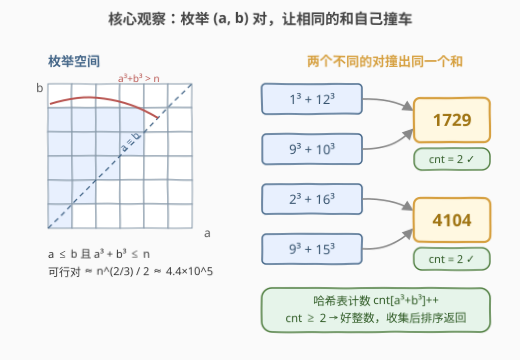
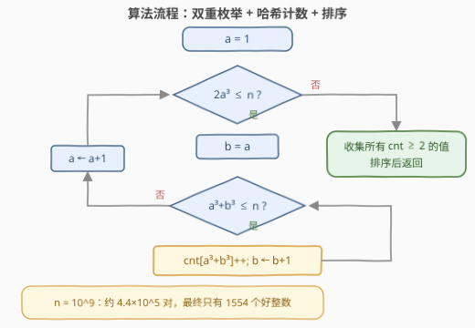

# LeetCode 可由多种立方和构造的整数 题解

## 1. 题目概述

- **标题 / 题号**：可由多种立方和构造的整数（#3890，medium）
- **链接**：https://leetcode.cn/problems/integers-with-multiple-sum-of-two-cubes/
- **难度**：中等
- **标签**：哈希表、计数、枚举、排序

**题意**：给你一个整数 `n`。当存在**至少两组不同的**整数对 `(a, b)` 满足以下条件时，整数 `x` 被称为**好整数**：

- `a` 和 `b` 是**正整数**；
- $a \le b$；
- $x = a^3 + b^3$。

返回一个数组，包含所有**小于等于 `n`** 的好整数，并按**升序**排序。

**示例 1**：

```text
输入：n = 4104
输出：[1729, 4104]
解释：
1729 = 1³ + 12³ = 9³ + 10³   （两组不同的对）
4104 = 2³ + 16³ = 9³ + 15³   （两组不同的对）
```

**示例 2**：

```text
输入：n = 578
输出：[]
解释：不存在 ≤ 578 的好整数（最小的好整数是 1729）。
```

**约束**：$1 \le n \le 10^9$。

> 💡 **审题关键**：①「至少两组**不同的**对」——$a \le b$ 已把一对规约成**无序对**，所以只需统计每个立方和**出现几次**，出现 $\ge 2$ 次即为好整数；②「不同」指对子不同，并不要求 $a \ne b$（$a = b$ 完全合法，如 $16 = 2^3 + 2^3$ 是一个合法表示）；③ $n \le 10^9$ 是本题题眼——它把 $a, b$ 死死按在 $1000$ 以内。

## 2. 解题思路

### 2.1 暴力思路：逐个数值检验

最直接的想法是对 $x$ 从 $1$ 到 $n$ 逐个检验：枚举 $a \in [1, \sqrt[3]{x}]$，算出 $x - a^3$ 后判断它是不是完全立方数，统计表示个数 $\ge 2$ 的 $x$：

- 外层 $n = 10^9$ 个候选值，内层每个最多 $\sqrt[3]{x} \approx 10^3$ 步——总计约 $10^{12}$ 次判立方数，远超时限；
- 更本质的问题：绝大多数 $x$ **根本没有两种表示**，逐值检验把力气全花在「证明它不是」上。

真正省力的方向是**换轴**：与其问「每个 $x$ 有几种表示」，不如直接**枚举所有能产生表示的对 $(a, b)$**，让相同的和**自己撞到一起**。

### 2.2 核心观察：枚举对，而不是枚举值



**观察一（$n$ 把枚举空间压到极小）**：$a, b$ 都是正整数且 $a^3 + b^3 \le n \le 10^9$，立刻得到

$$a,\ b \le \sqrt[3]{n} \le 1000$$

「$10^9$ 的值域」听起来吓人，但能参与立方和的底数**只有 1000 个**。再叠加 $a \le b$ 与 $a^3 + b^3 \le n$ 两条约束，可行对总数约为

$$\sum_{a=1}^{\sqrt[3]{n}} \left(\sqrt[3]{n - a^3} - a + 1\right) \approx 0.4 \cdot n^{2/3} \approx 4.4 \times 10^5$$

——不到五十万次哈希插入，随便过。

**观察二（相同的和自己会撞车）**：把每个可行对的和 $v = a^3 + b^3$ 喂给哈希表做 `cnt[v]++`。当第二个表示到来时计数变成 2，正好对应「至少两组不同的对」：

- $1729$：先由 $(1, 12)$ 撞出 $1 + 1728$，再由 $(9, 10)$ 撞出 $729 + 1000$；
- $4104$：先由 $(2, 16)$ 撞出 $8 + 4096$，再由 $(9, 15)$ 撞出 $729 + 3375$。

顺带一提，1729 正是数学史上著名的**哈代–拉马努金出租车数**——最小的能写成两种立方和的正整数（见第 5 节）。

**观察三（无序对天然去重）**：内层强制 $b$ 从 $a$ 起步，$(a,b)$ 与 $(b,a)$ 只会被计入一次，因此「计数 $\ge 2$」严格等价于「至少两组不同的对」，不需要任何额外去重逻辑。

### 2.3 算法流程图



| 步骤 | 操作 | 说明 |
|------|------|------|
| ① 外层 $a$ | $a$ 从 1 起，循环条件 $2a^3 \le n$ | $b \ge a$，给定 $a$ 的最小和是 $2a^3$，超过即可整层剪枝 |
| ② 内层 $b$ | $b$ 从 $a$ 起，循环条件 $a^3 + b^3 \le n$ | 同时保证 $a \le b$ 且和不超过 $n$ |
| ③ 计数 | `cnt[a³+b³] += 1` | 哈希表累计每个立方和的出现次数 |
| ④ 收集 | 遍历 `cnt`，收集计数 $\ge 2$ 的键 | 排序后返回 |

### 2.4 示例演算（n = 4104）

按「先 $a$ 后 $b$」的顺序枚举，只列出后来撞车的四个事件：

| 时刻 | 对 $(a,b)$ | 计算 | 和 | `cnt` 变化 | 备注 |
|------|-----------|------|-----|-----------|------|
| $a=1,\ b=12$ | $(1,12)$ | $1 + 1728$ | $1729$ | $0 \to 1$ | 首次出现 |
| $a=2,\ b=16$ | $(2,16)$ | $8 + 4096$ | $4104$ | $0 \to 1$ | 首次出现 |
| $a=9,\ b=10$ | $(9,10)$ | $729 + 1000$ | $1729$ | $1 \to 2$ | ✅ 晋升好整数 |
| $a=9,\ b=15$ | $(9,15)$ | $729 + 3375$ | $4104$ | $1 \to 2$ | ✅ 晋升好整数 |

枚举结束后，计数 $\ge 2$ 的只有 $1729$ 与 $4104$，排序返回 `[1729, 4104]` ✓。

## 3. 参考代码

### C++

```cpp
class Solution {
public:
    vector<int> findGoodIntegers(int n) {
        unordered_map<int, int> cnt;
        for (long long a = 1; 2 * a * a * a <= n; a++) {   // b ≥ a ⇒ 最小和 2a³
            long long a3 = a * a * a;
            for (long long b = a; a3 + b * b * b <= n; b++) {
                cnt[(int)(a3 + b * b * b)]++;
            }
        }
        vector<int> ans;
        for (auto& [v, c] : cnt)
            if (c >= 2) ans.push_back(v);
        sort(ans.begin(), ans.end());
        return ans;
    }
};
```

### Python

```python
class Solution:
    def findGoodIntegers(self, n: int) -> list[int]:
        cnt = Counter()
        a = 1
        while 2 * a * a * a <= n:          # b ≥ a ⇒ 最小和 2a³
            a3 = a * a * a
            b = a
            while a3 + b ** 3 <= n:
                cnt[a3 + b ** 3] += 1
                b += 1
            a += 1
        return sorted(v for v, c in cnt.items() if c >= 2)
```

> 💡 **写法要点**：① 外层条件写 $2a^3 \le n$ 而非 $a^3 \le n$，直接砍掉「内层一步都进不去」的死层；② C++ 里立方运算用 `long long` 参与最稳（中间量 $2a^3$ 逼近 $10^9$，虽未超 `int` 上限但余量不大），和本身 $\le 10^9$，作哈希键转回 `int` 足够；③ Python 直接用 `Counter`，无溢出顾虑。

## 4. 复杂度分析

| 维度 | 复杂度 | 说明 |
|------|--------|------|
| **时间** | $O(n^{2/3})$ | 约 $4.4 \times 10^5$ 对（$n = 10^9$ 实测 441521 对），每对一次哈希插入；排序只作用在好整数上（$n=10^9$ 时仅 1554 个，可忽略） |
| **空间** | $O(n^{2/3})$ | 哈希表至多存下所有不同的立方和（$\le$ 对数） |
| **量级判断** | $n \le 10^9$ | $\sqrt[3]{n} \le 1000$ 是能暴力枚举对的根本原因；若 $n$ 升到 $10^{18}$，对数涨到 $10^{12}$ 量级，此法失效 |

## 5. 扩展：出租车数（Taxicab Numbers）

1918 年前后，哈代去医院探望病中的拉马努金，随口说自己出租车的车牌号 1729「看起来挺无聊」。拉马努金脱口而出：「不，它是个非常有趣的数——它是能用两种方式写成两个正整数立方和的最小正整数。」$1729 = 1^3 + 12^3 = 9^3 + 10^3$，这类数从此被称为**出租车数**。

- **Ta(2) = 1729**：两种表示，即本题的最小好整数；
- **Ta(3) = 87539319**：三种表示（$167^3+436^3 = 228^3+423^3 = 255^3+414^3$），仍然 $< 10^9$——本题条件下它会以 `cnt = 3` 入选（题目要求「**至少**两组」，不是「恰好两组」）；
- 在 $n = 10^9$ 的完整枚举里，好整数共 **1554** 个（其中 8 个有三种表示，第一个是 $119824488 = 11^3+493^3 = 90^3+492^3 = 346^3+428^3$），最大的一个是 $998951616 = 306^3+990^3 = 432^3+972^3$。这串数就是 OEIS 的 [A001235](https://oeis.org/A001235)；
- 寻找更大 $k$ 的 Ta(k) 是计算数论的著名难题：Ta(4) = 6963472309248（1991 年 Elkies 等人），Ta(5)、Ta(6) 依赖大规模分布式搜索。本题 $n \le 10^9$ 的设定恰好把难度挡在「枚举 + 计数」的舒适区内。

## 6. 面试要点

**Q1：为什么值域 $10^9$ 反而是「送分」信号？**

> 立方和 $a^3 + b^3 \le 10^9$ 把两个底数都限制在 $\sqrt[3]{10^9} = 1000$ 以内。「大值域 + 幂次增长」的组合意味着可枚举的对只有 $O(n^{2/3}) \approx 4.4 \times 10^5$ 个。看到 $x = a^k + b^k$ 型约束，第一反应就应该是「先算 $\sqrt[k]{n}$，估计对数规模」。

**Q2：外层循环为什么用 $2a^3 \le n$ 做条件？**

> 因为 $b \ge a$，给定 $a$ 能产生的最小和是 $a^3 + a^3 = 2a^3$；若它已超过 $n$，内层一次都进不去，不如外层直接剪掉。写成 $a^3 \le n$ 结果也对，只是白扫一段空转的 $a$。

**Q3：「至少两组不同的对」为什么等价于计数 $\ge 2$？不怕 $(a,b)$、$(b,a)$ 重复计数吗？**

> 内层从 $b = a$ 起步，天然只枚举 $a \le b$ 的**无序对**，每个表示恰好被数一次，计数达到 2 就意味着两个本质不同的表示。另注意 $a = b$ 是合法表示（如 $16 = 2^3 + 2^3$），不需要排除——当然它只有这一种表示，16 并不是好整数。

**Q4：C++ 实现里有哪些溢出坑？**

> 中间量 $2a^3$ 在临界时接近 $10^9$、判别式 $a^3 + b^3$ 同量级，虽然都压在 `int` 上限（约 $2.1 \times 10^9$）之内，但余量不算宽裕。用 `long long` 做立方运算、只在入表时转 `int`（和 $\le n \le 10^9$ 必然安全），是最稳妥的写法。Python 无此顾虑。

**Q5：如果把 $n$ 放大到 $10^{18}$，这个方法还能撑住吗？**

> 撑不住：$\sqrt[3]{10^{18}} = 10^6$，对数约 $0.4 \times 10^{12}$，时间与内存都爆炸。而且寻找多表示立方和本质是出租车数问题，没有已知的多项式捷径——这正说明本题的复杂度天花板是被 $n \le 10^9$ 精心设计出来的。

> 💡 **一句话总结**：$\sqrt[3]{n}$ 量级的底数把枚举空间压成 $n^{2/3}$ 个对；强制 $a \le b$ 让每个无序对只数一次；哈希表计数 $\ge 2$ 即好整数，收集排序收工。

## 同类练习题

| # | 题目 | 与本题的关联 |
|---|------|-------------|
| 1 | [两数之和](https://leetcode.cn/problems/two-sum/)（[题解](../0001-0100/1_两数之和.md)） | 哈希表「一边枚举一边查」的入门正典，本题的计数版是它的对偶形态 |
| 454 | [四数相加 II](https://leetcode.cn/problems/4sum-ii/)（[题解](../0401-0500/454_四数相加%20II.md)） | 同样是「枚举对 + 哈希表累计」，把 $O(n^4)$ 降到 $O(n^2)$ 的经典骨架 |
| 560 | [和为 K 的子数组](https://leetcode.cn/problems/subarray-sum-equals-k/)（[题解](../0501-0600/560_和为K的子数组.md)） | 前缀和 + 哈希计数，另一路「让目标值自己撞进表里」的打法 |
| 633 | [平方数之和](https://leetcode.cn/problems/sum-of-square-numbers/)（[题解](../0601-0700/633_平方数之和.md)） | 判断 $a^2 + b^2 = c$ 的姊妹题，练习 $a \le b$ 枚举与上界估算 |
