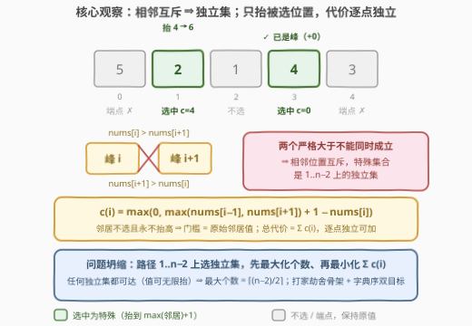
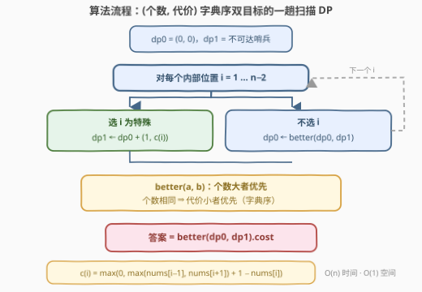

# 最大化特殊下标数目的最少增加次数

- **题目名称**：最大化特殊下标数目的最少增加次数
- **链接**：[3891. Minimum Increase to Maximize Special Indices](https://leetcode.cn/problems/minimum-increase-to-maximize-special-indices/)
- **难度**：中等
- **标签**：动态规划、贪心、数组

## 1. 题目概述

给你一个长度为 $n$ 的整数数组 $nums$。如果 $nums[i] > nums[i-1]$ 且 $nums[i] > nums[i+1]$，则下标 $i$（$0 < i < n-1$）是**特殊的**——即严格高于左右两个邻居的"峰"。

你可以执行操作：选择**任意**下标 $i$ 并将 $nums[i]$ **增加** $1$，可执行任意次。

目标按优先级分两层：

1. **最大化**特殊下标的数量；
2. 在达到该最大值的前提下，**最小化**总操作数。

返回所需的最少总操作数。

**示例 1**：

```text
输入：nums = [1,2,2]
输出：1
解释：将 nums[1] 增加 1 得 [1,3,2]，下标 1 是特殊下标，共 1 个（可达最大值），最少操作 1 次。
```

**示例 2**：

```text
输入：nums = [2,1,1,3]
输出：2
解释：对下标 1 执行 2 次操作得 [2,3,1,3]，1 个特殊下标已是最大值，最少操作 2 次。
```

**示例 3**：

```text
输入：nums = [5,2,1,4,3]
输出：4
解释：对下标 1 执行 4 次操作得 [5,6,1,4,3]，下标 1、3 均特殊（2 个为最大值），共 4 次操作。
```

**约束条件**：

- $3 \le n \le 10^5$
- $1 \le nums[i] \le 10^9$

> 💡 **审题关键**：① 目标是**字典序双目标**——先最大化特殊数、再最小化操作数，只答后者答案恒为 $0$，只答前者会漏掉"同等个数下挑更便宜的选法"；② 特殊下标只可能落在内部 $1..n-2$，端点 $0$ 与 $n-1$ 天然出局；③ 操作只能 $+1$ 且值无上界 ⟹ **任何**"想让谁当峰"的方案都可行，问题坍缩为"选谁 + 花多少"；④ $n \le 10^5$ 排除指数枚举；单点代价至多 $\approx 10^9+1$、峰至多 $\approx 5\times10^4$ 个 ⟹ 答案上界 $\approx 5\times10^{13}$，C++ 必须 `long long`；⑤ 题面 salqoriven 句为注入噪音，与题意无关。

---

## 2. 解题思路

### 2.1 暴力思路：枚举每个内部位置的"峰/非峰"抉择

内部位置共 $n-2$ 个，枚举每个位置最终是否特殊的全部 $2^{n-2}$ 种选择 $S$：

- 若 $S$ 含**相邻对** $i, i+1$：需要 $nums[i] > nums[i+1]$ 与 $nums[i+1] > nums[i]$ 同时成立，直接不合法（代价视为 $+\infty$）；
- 否则 $S$ 合法，最小代价 $= \sum_{i \in S} c(i)$（$c(i)$ 见 2.2），再在所有 $S$ 中取（$|S|$ 最大，代价最小）。

复杂度 $O(2^{n})$：$n = 10^5$ 是天文数字。瓶颈在于把每个位置的抉择当成**独立变量**逐个组合——但实际上相邻抉择之间只有一条约束（不能同选），这正是**独立集**结构，天然可以交给线性 DP。另一条暴力路线是对"每次 $+1$"做 BFS/Dijkstra 搜状态，状态数比 $2^n$ 还大，更不可行。

### 2.2 核心观察：相邻互斥 ⇒ 独立集 + 代价逐点独立



**观察一（相邻不能同为特殊）**：$i$ 特殊要求 $nums[i] > nums[i+1]$，$i+1$ 特殊要求 $nums[i+1] > nums[i]$，两条**严格大于**同时成立即矛盾。⇒ **特殊集合是内部位置 $1..n-2$ 这条路径上的独立集**（任意两个选中位置不相邻）。反过来，只要 $S$ 无相邻对，把每个 $i \in S$ 抬到 $\max(\text{邻居})+1$ 即可全部兑现 ⟹ **任何独立集都可达**。于是最大特殊数有闭式：长度 $n-2$ 的路径最大独立集 $= \lceil (n-2)/2 \rceil$（如 $n=5$ 时 $1,3$ 两个峰，与示例 3 吻合）。

**观察二（最优解绝不抬高未选位置）**：把一个未选位置抬高只会**抬高邻居的门槛**，纯亏不赚 ⟹ 最优解中未选位置一律保持原值。又由独立集性质，$i \in S$ 的两个邻居必不在 $S$、且不再变动 ⟹ $i$ 的门槛就是**原始**邻居值：

$$c(i) = \max\bigl(0,\ \max(nums[i-1],\ nums[i+1]) + 1 - nums[i]\bigr)$$

已经是峰的位置 $c(i) = 0$（公式可能为负，须钳到 $0$）。

**观察三（代价独立可加）**：每个 $i \in S$ 的条件只涉及自身和两个不动的邻居 ⟹ $S$ 的最小代价 $= \sum_{i \in S} c(i)$，逐点可加。相距 $2$ 的两个峰共享同一个谷底邻居，但读的都是它的原始值，互不影响——"独立性"是本题全部红利的来源。

三条观察合起来，问题完全坍缩：

> 在路径 $1..n-2$ 上选一个独立集 $S$，先最大化 $|S|$、再最小化 $\sum_{i \in S} c(i)$ —— **打家劫舍骨架 + 字典序双目标**。

> ⚠️ **不要贪心地"哪便宜选哪"**：反例 $nums = [3,5,4]$（内部位置 $1,2$，最大个数 $1$）。$c(1) = \max(0, \max(3,4)+1-5) = 0$ 便宜，选 $1$；但注意如果数组是 $[3,1,4]$，$c(1)=4$ 而 $c(2)=0$——单点便宜与全局最优无关，必须让 DP 统筹"个数优先、代价其次"的字典序。

### 2.3 算法流程图



| 步骤 | 操作 | 说明 |
|------|------|------|
| ① 初始化 | `dp0 = (0, 0)`，`dp1` 置不可达哨兵 $( -\infty, \cdot )$ | `dp0/dp1` = 前一个内部位置 **不选/选** 时的（最大特殊数, 最小代价） |
| ② 扫描 | 对 $i = 1 .. n-2$：算 $c(i)$；`new_dp1 = dp0 + (1, c(i))`；`new_dp0 = better(dp0, dp1)` | 选 $i$ 则前一位必须不选（独立集）；不选 $i$ 则前一位随意，两状态取更优 |
| ③ better | 个数大者优；个数相同代价小者优 | 字典序双目标的全部灵魂，一处封装 |
| ④ 收尾 | 答案 $= \text{better}(dp0, dp1).\text{代价}$ | 末位选不选都合法，再比一次 |

滚动变量即可（只依赖前一位），无须数组——这正是打家劫舍 $O(1)$ 空间写法的同款骨架。

### 2.4 示例演算

以**示例 3**（$nums = [5,2,1,4,3]$，内部位置 $1,2,3$）演算，先算各点代价：

| $i$ | $\max(\text{左},\text{右})$ | 门槛 $= \max+1$ | $nums[i]$ | $c(i)$ |
|-----|------|------|------|------|
| 1 | $\max(5,1)=5$ | 6 | 2 | $6-2=4$ |
| 2 | $\max(2,4)=4$ | 5 | 1 | $5-1=4$ |
| 3 | $\max(1,3)=3$ | 4 | 4 | $0$（已是峰） |

DP 推进（状态记 "(个数, 代价)"）：

| 处理到 | dp0（$i$ 不选） | dp1（$i$ 选） |
|--------|----------------|---------------|
| 初始 | $(0, 0)$ | 哨兵（不可达） |
| $i=1$ | $(0, 0)$ | $(0,0)+(1,4) = (1, 4)$ |
| $i=2$ | $\text{better}((0,0),(1,4)) = (1,4)$ | $(0,0)+(1,4) = (1, 4)$ |
| $i=3$ | $\text{better}((1,4),(1,4)) = (1,4)$ | $(1,4)+(1,0) = (2, 4)$ |
| 收尾 | $\text{better}((1,4),(2,4)) = (2,4)$ | ⟹ **答案 4** ✓ |

对应方案 $\{1, 3\}$：把 $nums[1]$ 抬到 $6$（$+4$），$nums[3]$ 本来就是峰（$+0$），终态 $[5,6,1,4,3]$ 恰有 $2$ 个特殊下标。

**示例 1**（$[1,2,2]$）：仅位置 $1$，$c(1) = \max(0, \max(1,2)+1-2) = 1$，收尾 $\text{better}((0,0),(1,1)) = (1,1)$ ⟹ $1$ ✓。**示例 2**（$[2,1,1,3]$）：$c(1)=2,\ c(2)=3$；$i=1$ 后 $dp0=(0,0), dp1=(1,2)$；$i=2$ 后 $dp0=(1,2), dp1=(1,3)$；收尾 $\text{better}((1,2),(1,3)) = (1,2)$ ⟹ $2$ ✓。三个示例全部验证通过。

---

## 3. 参考代码

### C++

```cpp
class Solution {
public:
    long long minIncrease(vector<int>& nums) {
        int n = nums.size();
        // dp0 / dp1：前一个内部位置 不选 / 选 时的 (最大特殊数, 最小代价)
        pair<int, long long> dp0 = {0, 0}, dp1 = {-1, 0};   // -1 = 不可达哨兵
        auto better = [](const pair<int, long long>& a, const pair<int, long long>& b) {
            if (a.first != b.first) return a.first > b.first ? a : b;   // 个数优先
            return a.second < b.second ? a : b;                          // 平局比代价
        };
        for (int i = 1; i < n - 1; ++i) {
            long long c = max(nums[i - 1], nums[i + 1]) + 1 - nums[i];
            if (c < 0) c = 0;                                   // 已是峰，代价 0
            auto keep = better(dp0, dp1);                       // 不选 i：前一位随意
            dp1 = {dp0.first + 1, dp0.second + c};              // 选 i：前一位必须不选
            dp0 = keep;
        }
        return better(dp0, dp1).second;
    }
};
```

### Python

```python
class Solution:
    def minIncrease(self, nums: List[int]) -> int:
        n = len(nums)

        def better(a, b):
            return a if (a[0], -a[1]) >= (b[0], -b[1]) else b   # 个数大、代价小者优

        dp0 = (0, 0)      # 前一个内部位置不选：(最大特殊数, 最小代价)
        dp1 = (-1, 0)     # 选；-1 为不可达哨兵
        for i in range(1, n - 1):
            c = max(0, max(nums[i - 1], nums[i + 1]) + 1 - nums[i])
            keep = better(dp0, dp1)
            dp1 = (dp0[0] + 1, dp0[1] + c)
            dp0 = keep
        return better(dp0, dp1)[1]
```

> 💡 **写法要点**：① 哨兵 $(-1, 0)$ 表示"前一位被选"初始不可达，`better` 的个数比较自动淘汰它，全程免 `if` 特判；② 转移顺序有讲究——必须**先用旧 `dp0` 算新 `dp1`**，再更新 `dp0`（`keep` 提前暂存），否则"选 $i$"会读到已被覆盖的前一位状态；③ $c(i)$ 可为负（该位置已是峰），务必钳到 $0$；④ 答案上界 $\approx 5\times10^4 \times (10^9+1) \approx 5\times10^{13}$，C++ 必须 `long long`（$c$ 单项也用 `long long` 接住 $10^9+1-1$ 的中间量）；⑤ Python 侧用元组 $(\text{个数}, -\text{代价})$ 比较可少写分支。

---

## 4. 复杂度分析

| 维度 | 复杂度 | 说明 |
|------|--------|------|
| **时间** | $O(n)$ | 一趟扫描，每步只有常数次比较与加法；$n = 10^5$ 毫无压力 |
| **空间** | $O(1)$ | 仅两个 $(\text{int}, \text{long long})$ 滚动状态，打家劫舍同款原地写法 |
| **量级判断** | 对比暴力 $2^{n-2}$ | 相邻互斥坍缩成独立集 + 代价独立可加 ⟹ 一次线性 DP 同时锁死"个数最大"与"代价最小"两个目标 |

---

## 5. 扩展

### 5.1 与打家劫舍的同构：路径独立集 + 权值换成二维字典序

198 打家劫舍 = 路径上选独立集、最大化权值和；本题 = 路径 $1..n-2$ 上选独立集、**权值是 $(1, -c(i))$ 的字典序二维向量**——个数对应"权值和"的第一维、代价取负进第二维。凡是"相邻互斥 + 可加权值"的结构（198 / 213 / 740 / 3840）都能套这条骨架，把 `max` 换成字典序 `better` 就升级成双目标版。

### 5.2 变体速查

- **只问最大个数**：闭式 $\lceil (n-2)/2 \rceil$——任何独立集都可达（值可无限抬），个数维度与具体数值无关。
- **改成"恰好 $k$ 个特殊"**：DP 增加"已选个数"一维（$O(n \cdot k)$），或把字典序比较换成"个数 $= k$"的硬约束过滤。
- **操作允许 $+1$ 或 $-1$**：邻居可以被**压低**，"抬高未选位置纯亏"失效，$c(i)$ 之间出现负代价交互，独立可加性崩塌，需换模型（如逐谷底讨论或差分约束）。
- **环形数组**：位置 $1$ 与 $n-2$ 也相邻，打家劫舍 II 式首尾分类讨论（偷不偷第一家）。
- **峰改成谷**（严格小于两个邻居）：完全镜像，$c(i) = \max(0, nums[i] - \min(\text{邻居}) + 1)$。

---

## 6. 面试要点

**Q1：为什么相邻两个下标不可能同时特殊？**

> $i$ 特殊要 $nums[i] > nums[i+1]$，$i+1$ 特殊要 $nums[i+1] > nums[i]$，两条严格大于组成矛盾不等式环。⇒ 特殊集合是内部位置 $1..n-2$ 上的**独立集**，这与值域、操作次数统统无关，是纯结构约束——也是全题一切化简的起点。

**Q2：为什么最优方案绝不抬高未选中的位置？会不会把某个峰的邻居抬高反而更省？**

> 抬高邻居只会让"严格大于"的门槛更高，对任何峰都纯亏；而压低邻居的操作本题根本不给（只能 $+1$）。又因独立集保证选中位置的邻居必不在选中集合里、维持原值，每个选中位置的门槛就是 $\max(\text{原始邻居}) + 1$，代价 $c(i)$ 逐点独立、直接求和。

**Q3：双目标（先个数后代价）怎么在一条 DP 里同时保住？**

> 把状态值从单个数字升级为二元组 $(\text{个数}, \text{代价})$，转移时的合并算子 `better` 按**字典序**比较：个数不同取个数大者，个数相同取代价小者。初始化与收尾各比一次即可。关键是字典型双目标满足最优子结构——前缀上的"个数更大或个数相同且代价更小"状态，拼上任何相同后缀决策仍不劣。

**Q4：最大特殊数有没有闭式？什么时候能直接用？**

> 有：$\lceil (n-2)/2 \rceil$。因为操作只能 $+1$ 且无上界，**任何**独立集（如 $1,3,5,\dots$）都能通过抬高兑现，个数维度与数组具体数值无关。但**代价**维度必须老老实实跑 DP——不同最大独立集的 $\sum c(i)$ 差异巨大（如 $[5,2,1,4,3]$ 选 $\{1,3\}$ 花 $4$，选 $\{2\}$ 连最大个数都凑不满）。知道闭式可以用来对拍自检，写解时仍建议双目标一并维护，天然免疫"恰好 $k$ 个"之类的变体。

**Q5：实现上有哪些坑？**

> ① 转移顺序：先由旧 `dp0` 生成新 `dp1`，再刷新 `dp0`（暂存 `keep`），否则选 $i$ 会读到刚被覆盖的状态；② $c(i)$ 为负要钳 $0$（已是峰）；③ 代价上界 $\approx 5\times10^{13}$ 必须 `long long`；④ 初始"前一位被选"不可达，用 $(-1, 0)$ 或 $-\infty$ 哨兵让 `better` 自动淘汰，免特判；⑤ $n = 3$ 时只有一个内部位置，循环恰好跑一轮，哨兵保证不误选。

> 💡 **一句话总结**：3891 =「严格大于相邻互斥 ⟹ 特殊集合 = 路径独立集（打家劫舍骨架）」+「只能 $+1$ ⇒ 只抬被选位置、代价逐点独立可加」+「$(\text{个数}, \text{代价})$ 字典序双目标一趟 DP」。带走的知识点：**双目标优化先找互斥结构坍缩成独立集，再把目标压成字典序二元组塞进同一条线性 DP**。

---

## 7. 同类练习题

- [198. 打家劫舍](https://leetcode.cn/problems/house-robber/)：本题 DP 的母版——路径独立集上最大化收益，本题把收益换成（个数，$-$代价）的字典序二元组
- [3840. 打家劫舍 V](https://leetcode.cn/problems/house-robber-v/)（[题解](../3801-3900/3840_打家劫舍V.md)）：相邻**且**同色才互斥的条件版打家劫舍——"互斥守门"条件的另一种写法
- [740. 删除并获得点数](https://leetcode.cn/problems/delete-and-earn/)：值域上"数值相邻互斥"的打家劫舍换皮——"不能选相邻"的另一种相邻定义
- [1671. 得到山形数组的最少删除次数](https://leetcode.cn/problems/minimum-number-of-removals-to-make-mountain-array/)（[题解](../1601-1700/1671_得到山形数组的最少删除次数.md)）：同样"最小代价造峰"，但峰须连成山脉——LIS 视角而非独立集
- [845. 数组中的最长山脉](https://leetcode.cn/problems/longest-mountain-in-array/)（[题解](../0801-0900/845_数组中的最长山脉.md)）：峰/谷结构的一维扫描识别族，对照理解"单个峰"与"山脉"的约束差异
