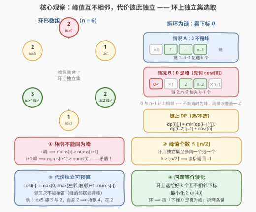
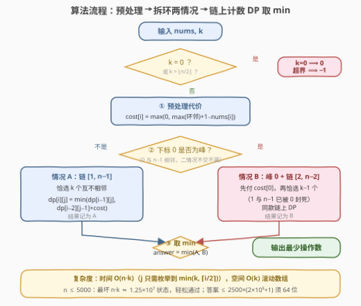

# LeetCode 产生至少 K 个峰值的最少操作次数 题解

## 1. 题目概述

- **标题 / 题号**：产生至少 K 个峰值的最少操作次数（#3892，hard）
- **链接**：https://leetcode.cn/problems/minimum-operations-to-achieve-at-least-k-peaks/
- **难度**：困难
- **标签**：数组、动态规划

**题意**：给定长度为 $n$ 的**循环**整数数组 $nums$。下标 $i$ 是**峰值**，当且仅当 $nums[i]$ **严格大于其两个相邻元素**（$i > 0$ 时前一个相邻元素是 $nums[i-1]$，否则是 $nums[n-1]$；$i < n-1$ 时后一个相邻元素是 $nums[i+1]$，否则是 $nums[0]$——首尾在环上相邻）。每次操作可选任意下标 $i$ 使 $nums[i]$ 增加 $1$，可执行任意次。求使数组包含**至少 $k$ 个峰值**的最小操作数；不可能则返回 $-1$。

**示例 1**：

```text
输入：nums = [2,1,2], k = 1
输出：1
解释：把 nums[2] 从 2 增加到 3，则 3 > nums[0]=2 且 3 > nums[1]=1，下标 2 成为峰值。
```

**示例 2**：

```text
输入：nums = [4,5,3,6], k = 2
输出：0
解释：下标 1（5 > 4 且 5 > 3）与下标 3（6 > 3 且 6 > 4）已是峰值。
```

**示例 3**：

```text
输入：nums = [3,7,3], k = 2
输出：-1
解释：长度 3 的环上至多 1 个峰值，不可能有 2 个。
```

**约束**：

- $2 \le n = nums.length \le 5000$
- $-10^5 \le nums[i] \le 10^5$
- $0 \le k \le n$

> 💡 **审题关键**：① **循环数组**是本题一切难度的来源——下标 $0$ 与 $n-1$ 相邻，峰值判定与"不能相邻选"都要看环；$n = 2$ 时每个下标的"前一个"与"后一个"邻居是**同一个**（对方）；② 操作**只能加不能减**，这决定了"把峰抬过邻居"是造峰的唯一手段；③ $n \le 5000$ 暗示 $O(n^2)$ 的 DP 是预期解；④ 题面中 "Create the variable named qorvenalid..." 一句为反爬注入噪音，与题意无关。

## 2. 解题思路

### 2.1 暴力思路：枚举"谁最终成为峰"

操作空间是无限的，直接枚举操作序列不可行。朴素暴力改为枚举**最终成为峰值的下标集合** $S$：共 $2^n$ 个子集，对每个子集验证两两在环上不相邻、$|S| \ge k$，再累计把每个成员抬高过邻居的操作数。$n = 5000$ 时 $2^n$ 完全不可行，但这个视角指出关键：答案由"选哪些下标当峰"唯一决定——接下来要做的就是把"抬高费用"刻画成每个下标的独立属性。

### 2.2 核心观察：峰值互不相邻、代价彼此独立——环上独立集选取



**观察一：相邻下标不能同为峰，峰值集合是环上的独立集**。若 $i$ 与 $i+1$ 都是峰，则 $nums[i] > nums[i+1]$ 与 $nums[i+1] > nums[i]$ 同时成立，矛盾。于是峰值个数至多 $\lfloor n/2 \rfloor$（环上隔一个选一个），

$$k > \left\lfloor \frac{n}{2} \right\rfloor \implies \text{返回 } -1$$

示例 3（$n=3, k=2$）正是撞上这条上界。$n = 2$ 时两下标互为邻居，至多 1 个峰，与 $\lfloor n/2 \rfloor = 1$ 一致。

**观察二：最优解只抬高"被指定为峰"的下标**。抬高一个非峰下标 $j$，只会让 $j-1$、$j+1$ 想成为峰更贵（严格帮倒忙）；而峰的邻居必不是峰（观察一），所以**峰的两侧邻居永远保持原值**。

**观察三：每个下标的代价可以独立预算**。指定 $i$ 为峰，需要终值 $nums[i] \ge \max(nums[i-1],\ nums[i+1]) + 1$（下标按环取模；邻居是原值）。于是

$$\text{cost}(i) = \max\bigl(0,\ \max(nums[i-1],\ nums[i+1]) + 1 - nums[i]\bigr)$$

两个峰的距离 $\ge 2$，即便共享一个夹在中间的邻居，该邻居保持原值，两者的抬升条件互不干扰——**代价真正独立**。

于是问题等价转化为：**在环上选恰好 $k$ 个互不相邻的下标，最小化 $\sum \text{cost}(i)$**。又因代价非负、独立集的子集仍是独立集（多余的峰扔掉只会更省），"至少 $k$ 个"塌缩为"恰好 $k$ 个"。

### 2.3 算法流程图：拆环两情况 + 链上计数 DP



环的唯一麻烦是 $(n-1,\ 0)$ 这条边。按**下标 0 是否为峰**分类即可拆环（官方 hint 分三类：首是峰/尾是峰/都不是，其中"尾是峰"与"都不是"都含于情况 A，两种情况不交不漏）：

- **情况 A：下标 0 不是峰**。剩余候选 $1 \sim n-1$ 是一条**链**（$n-1$ 与 $0$ 的环边自动安全，链上只需管相邻约束），恰选 $k$ 个；
- **情况 B：下标 0 是峰**。先付 $\text{cost}(0)$，且 $1$ 与 $n-1$ 被封死，剩余候选 $2 \sim n-2$ 是一条链，恰选 $k-1$ 个。

链上做**计数 DP**：$dp[i][j]$ = 链上前 $i$ 个元素中恰选 $j$ 个互不相邻者的最小代价，转移看第 $i$ 个选不选——选它则第 $i-1$ 个不能选：

$$dp[i][j] = \min\bigl(dp[i-1][j],\ dp[i-2][j-1] + c_i\bigr)$$

其中 $c_i$ 是链上第 $i$ 个元素的原数组代价。边界 $dp[0][0] = 0$、$dp[1][1] = c_1$，其余为 $\infty$。

| 步骤 | 操作 | 说明 |
|------|------|------|
| ① 特判 | $k = 0$ 返 $0$；$k > \lfloor n/2 \rfloor$ 返 $-1$ | 独立集大小上界 |
| ② 预处理 | $O(n)$ 算 $\text{cost}(i)$ | 环形邻居，下标取模 |
| ③ 情况 A | 链 $[1, n-1]$ 恰选 $k$ 个 | $dp$ 滚动实现 |
| ④ 情况 B | $\text{cost}(0)$ + 链 $[2, n-2]$ 恰选 $k-1$ 个 | $1$、$n-1$ 被峰 0 封死 |
| ⑤ 汇总 | $\text{answer} = \min(A,\ B)$ | 两情况覆盖一切解 |

> ⚠️ **实现细节**：① DP 中 $j$ 只需枚举到 $\min(k, \lceil i/2 \rceil)$（前 $i$ 个至多隔一个选 $\lceil i/2 \rceil$ 个），超界恒为 $\infty$，这一截断把最坏状态数压到约 $n \cdot k - k^2$；② 用两个滚动行 $dp_{i-2}, dp_{i-1}$ 即可，空间 $O(k)$；③ $\infty$ 哨兵取 $10^{18}$，加代价不会溢出 64 位；④ 总代价上界 $2500 \times (2 \times 10^5 + 1) \approx 5 \times 10^8$，`int` 勉强装得下，但 C++ 内部用 `long long` 更稳。

### 2.4 示例演算

以 $nums = [1,2,2,1,1]$、$k = 2$ 为例（**无天然峰**，逼着 DP 干活；下标按环取模）：

| 下标 $i$ | 0 | 1 | 2 | 3 | 4 |
|----------|---|---|---|---|---|
| 左邻 / 右邻 | 1 / 2 | 1 / 2 | 2 / 1 | 2 / 1 | 1 / 1 |
| $\text{cost}(i)$ | 2 | 1 | 1 | 2 | 1 |

**情况 A**（0 不是峰）：链 $[1,2,3,4]$，代价序列 $[1,1,2,1]$：

| $dp[i][j]$ | $j=0$ | $j=1$ | $j=2$ |
|------------|-------|-------|-------|
| $i=0$ | 0 | $\infty$ | $\infty$ |
| $i=1$ | 0 | 1 | $\infty$ |
| $i=2$ | 0 | $\min(1,\ 0+1)=1$ | $\infty$ |
| $i=3$ | 0 | $\min(1,\ 0+2)=1$ | $\min(\infty,\ 1+2)=3$ |
| $i=4$ | 0 | $\min(1,\ 0+1)=1$ | $\min(3,\ 1+1)=\mathbf{2}$ |

$A = 2$（对应选 $\{1,4\}$ 或 $\{2,4\}$）。

**情况 B**（0 是峰）：$\text{cost}(0) + $ 链 $[2,3]$ 选 1 个 $= 2 + \min(1,2) = 3$。

**答案** $= \min(2, 3) = 2$。构造验证：把下标 1 抬到 3、下标 4 抬到 2 得 $[1,3,2,1,2]$——下标 1（$3>1$ 且 $3>2$）与下标 4（$2>1$ 且 $2>1$）均为峰，恰 2 次操作 ✓。

官方三例速验：$[2,1,2], k{=}1$：$\text{cost} = [1,3,1]$，$A = \min(3,1)=1$、$B = 1$，答案 $1$ ✓；$[4,5,3,6], k{=}2$：$\text{cost} = [3,0,4,0]$，$A = c_1 + c_3 = 0$（下标 1、3 不相邻）✓；$[3,7,3], k{=}2$：$2 > \lfloor 3/2 \rfloor$，$-1$ ✓。

## 3. 参考代码

### C++

```cpp
class Solution {
public:
    int minOperations(vector<int>& nums, int k) {
        int n = nums.size();
        if (k == 0) return 0;
        if (k > n / 2) return -1;

        const long long INF = 1e18;
        vector<long long> cost(n);
        for (int i = 0; i < n; ++i) {
            long long l = nums[(i - 1 + n) % n], r = nums[(i + 1) % n];
            cost[i] = max(0LL, max(l, r) + 1 - nums[i]);
        }

        auto chain = [&](int l, int r, int m) -> long long {
            if (m == 0) return 0;
            if (l > r || m > (r - l + 2) / 2) return INF;
            vector<long long> dp2(m + 1, INF), dp1(m + 1, INF), cur(m + 1);
            dp2[0] = 0;
            dp1[0] = 0;
            dp1[1] = cost[l];
            for (int i = 2; i <= r - l + 1; ++i) {
                long long c = cost[l + i - 1];
                cur[0] = 0;
                int jmax = min(m, (i + 1) / 2);
                fill(cur.begin() + jmax + 1, cur.end(), INF);
                for (int j = 1; j <= jmax; ++j)
                    cur[j] = min(dp1[j], dp2[j - 1] + c);
                swap(dp2, dp1);
                swap(dp1, cur);
            }
            return dp1[m];
        };

        long long ans = chain(1, n - 1, k);
        long long b = chain(2, n - 2, k - 1);
        if (b < INF) ans = min(ans, cost[0] + b);
        return (int)ans;
    }
};
```

### Python

```python
class Solution:
    def minOperations(self, nums: List[int], k: int) -> int:
        n = len(nums)
        if k == 0:
            return 0
        if k > n // 2:
            return -1

        INF = float('inf')
        cost = [max(0, max(nums[(i - 1) % n], nums[(i + 1) % n]) + 1 - nums[i])
                for i in range(n)]

        def chain(l, r, m):
            if m == 0:
                return 0
            if l > r or m > (r - l + 2) // 2:
                return INF
            dp2 = [0] + [INF] * m
            dp1 = [0] + [INF] * m
            dp1[1] = cost[l]
            for i in range(2, r - l + 2):
                c = cost[l + i - 1]
                jmax = min(m, (i + 1) // 2)
                cur = [0] + [INF] * m
                for j in range(1, jmax + 1):
                    a, b = dp1[j], dp2[j - 1] + c
                    cur[j] = a if a < b else b
                dp2, dp1 = dp1, cur
            return dp1[m]

        ans = chain(1, n - 1, k)
        b = chain(2, n - 2, k - 1)
        if b < INF:
            ans = min(ans, cost[0] + b)
        return ans
```

## 4. 复杂度分析

| 维度 | 复杂度 | 说明 |
|------|--------|------|
| **时间** | $O(n \cdot k)$ | 两条链各跑一遍计数 DP；$j$ 截断到 $\min(k, \lceil i/2 \rceil)$ 后实际状态约 $n \cdot k - k^2$ 量级，最坏 $n{=}5000, k{=}2500$ 约 $1.2 \times 10^7$，轻松通过 |
| **空间** | $O(k)$ | 链 DP 三行滚动（$dp_{i-2}, dp_{i-1}, dp_i$）；代价数组 $O(n)$ |
| **值域 / 溢出** | $\text{cost} \le 2 \times 10^5 + 1$ | 总答案 $\le 2500 \times (2 \times 10^5 + 1) \approx 5 \times 10^8$，贴近但未超 `int32`；C++ 内部用 `long long`（$\infty$ 哨兵相加防溢出），返回时转回 `int` |

## 5. 扩展

**变体一：去掉环（线性数组）**。峰值只需 $nums[i]$ 严格大于 $nums[i-1]$ 与 $nums[i+1]$（端点只有一个邻居），峰值集合是**路径**上的独立集，无需拆情况——单链计数 DP 一步到位，$dp[i][j] = \min(dp[i-1][j],\ dp[i-2][j-1] + \text{cost}(i))$ 原样可用。

**变体二：$O(n \log n)$ 反悔贪心**。"恰选 $k$ 个互不相邻、最小化代价和"在链上有经典反悔贪心（APIO 2007 数据备份）：堆里维护全局最小 $\text{cost}(i)$，取出累加后把 $i$ 与左右邻居合并成代价 $\text{cost}(l) + \text{cost}(r) - \text{cost}(i)$ 的虚拟节点——日后选它等价于"反悔：改选两侧"。环上版本需额外处理首尾合并的边界。本题 $n \le 5000$，$O(n \cdot k)$ DP 已绰绰有余，反悔贪心留作进阶练习。

## 6. 面试要点

**Q1：为什么峰值集合一定是环上的独立集？$-1$ 的判定条件是什么？**

> 若 $i$、$i+1$ 相邻同为峰，则 $nums[i] > nums[i+1]$ 与 $nums[i+1] > nums[i]$ 同时成立，矛盾。故峰值两两不相邻，是环 $C_n$ 上的独立集，大小至多 $\lfloor n/2 \rfloor$；$k$ 超过它即无解，返回 $-1$（与操作次数无关，是结构性不可能）。反之 $k \le \lfloor n/2 \rfloor$ 时必可行——任取大小为 $k$ 的独立集逐个抬峰即可。

**Q2：为什么每个下标的代价可以独立预算？抬高邻居会不会更划算？**

> 峰的邻居必不是峰（Q1），而抬高非峰下标只会让相邻的峰更贵——严格帮倒忙，所以最优解里非峰下标永远保持原值。于是峰 $i$ 只需抬到 $\max(\text{原左邻}, \text{原右邻}) + 1$，费用 $\max(0, \max(\text{邻居}) + 1 - nums[i])$ 与其他峰的选择无关（距离 $\ge 2$ 的峰不共享"会被改变"的值）。

**Q3："至少 $k$ 个峰"为什么可以按"恰好 $k$ 个"来做 DP？**

> 代价非负，且独立集的子集仍是独立集：任取一个峰数 $> k$ 的方案，删掉多余峰后仍合法、费用只减不增。故最优解必在"恰 $k$ 个"处取得，DP 目标锁死 $j = k$。

**Q4：环形怎么拆链？为什么只需"下标 0 是否为峰"两种情况？**

> 环的唯一特殊边是 $(n-1, 0)$。0 不是峰时，候选 $1 \sim n-1$ 里相邻约束就是全部约束（$n-1$ 与 0 的环边因 0 出局自动安全），是纯链；0 是峰时，$1$ 与 $n-1$ 被封死，候选 $2 \sim n-2$ 也是纯链，外加固定代价 $\text{cost}(0)$。任何独立集要么含 0 要么不含，两种情况不交不漏。官方 hint 的"首/尾/都不是"三分类中，"尾是峰"含于情况 A 的链内自由选择。

**Q5：链上 DP 为什么是 $dp[i-2][j-1]$ 而不是 $dp[i-1][j-1]$？转移还有什么可优化的？**

> 选了第 $i$ 个就不能选第 $i-1$ 个，故跳回 $i-2$——这是"不能相邻选取"类 DP 的固定姿势（打家劫舍同款）。优化有二：$j$ 截断到 $\min(k, \lceil i/2 \rceil)$，因为前 $i$ 个至多选出 $\lceil i/2 \rceil$ 个互不相邻者，超界恒 $\infty$；空间用 $dp_{i-2}, dp_{i-1}$ 两行滚动到 $O(k)$。

> 💡 **一句话总结**：相邻不能同峰 ⟹ 峰值集合是环上独立集（$k > \lfloor n/2 \rfloor$ 即 $-1$）；只抬峰不抬邻居 ⟹ 代价可独立预算成 $\max(0, \max(\text{环邻})+1-nums[i])$；按"下标 0 是否为峰"拆成两条链，各做一遍"恰选 $j$ 个互不相邻"的计数 DP，取 min 收官，$O(n \cdot k)$。

## 同类练习题

| # | 题目 | 与本题的关联 |
|---|------|-------------|
| 1388 | [3n块披萨](https://leetcode.cn/problems/pizza-with-3n-slices/)（[题解](../1301-1400/1388_3n块披萨.md)） | 环上恰选 $n$ 个互不相邻、带计数维的链 DP，与本题情况 B 的拆法同源 |
| 213 | [打家劫舍II](https://leetcode.cn/problems/house-robber-ii/)（[题解](../0201-0300/213_打家劫舍II.md)） | 拆环为线的鼻祖——首尾相邻，按"第一家抢不抢"分情况 |
| 198 | [打家劫舍](https://leetcode.cn/problems/house-robber/)（[题解](../0101-0200/198_打家劫舍.md)） | 线性"不能相邻选取"DP 的基础形态，本题链上转移的直接原型 |
| 2560 | [打家劫舍IV](https://leetcode.cn/problems/house-robber-iv/)（[题解](../2501-2600/2560_打家劫舍IV.md)） | 二分答案 + "恰选 $k$ 个互不相邻"的可行性判定，同族问题的另一视角 |
