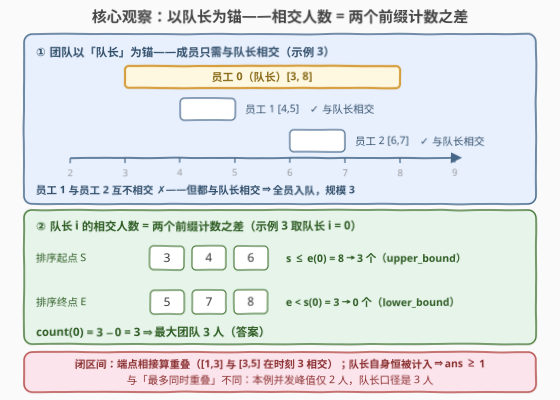
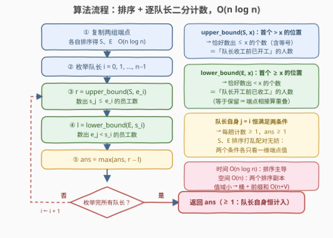

# LeetCode 最大重叠区间团队规模 题解

## 1. 题目概述

- **标题 / 题号**：最大重叠区间团队规模（#3893，medium）
- **链接**：https://leetcode.cn/problems/maximum-team-size-with-overlapping-intervals/
- **难度**：中等
- **标签**：数组、排序、二分查找

> ⚠️ 本题为 LeetCode 付费题，题意描述根据官方示例用例与 hints 重建，可能与官方题面有出入。

**题意**：给定长度为 $n$ 的整数数组 $startTime$ 与 $endTime$，第 $i$ 名员工在闭区间 $[startTime[i],\ endTime[i]]$ 内有空。需要组建一支团队并确定其中一人为**队长**：**其余每名成员的空闲区间都必须与队长的空闲区间有公共时刻**（闭区间相交，端点相接也算重叠）；成员之间是否相交不做要求。返回**最大团队规模**。

**示例 1**：

```text
输入：startTime = [1,2,3], endTime = [4,5,6]
输出：3
解释：三个区间 [1,4]、[2,5]、[3,6] 两两相交，任何人当队长都能拉满全队。
```

**示例 2**：

```text
输入：startTime = [2,5,8], endTime = [3,7,9]
输出：1
解释：[2,3]、[5,7]、[8,9] 互不相交（端点也不相接），只能单枪匹马。
```

**示例 3**：

```text
输入：startTime = [3,4,6], endTime = [8,5,7]
输出：3
解释：队长员工 0 的 [3,8] 与员工 1 的 [4,5]、员工 2 的 [6,7] 都相交——
虽然后两者彼此不相交，但只需与队长相交即可，全员入队。
```

**约束条件**（按题意重建，具体以官方为准）：$1 \le n \le 2 \times 10^5$（hints 明示二分，规模应为十万级）；$1 \le startTime[i] \le endTime[i] \le 10^9$。

> 💡 **审题关键**：① 团队**以队长为锚**——成员之间不必两两相交（示例 3 的 $[4,5]$ 与 $[6,7]$ 互不相交却同队），这与「最多同时在线」类问题（如 253. 会议室 II）有本质区别；② 区间是**闭**的：官方 hint 的排除条件是 $\mathrm{endTime}[j] < \mathrm{startTime}[i]$（**严格小于**），说明端点相接算重叠——$[1,3]$ 与 $[3,5]$ 在时刻 3 相交；③ 队长自身自然计入规模，答案 $\ge 1$。

## 2. 解题思路

### 2.1 暴力思路：枚举队长，线性数相交

枚举每个员工 $i$ 当队长，再扫一遍全体员工 $j$，统计同时满足 $startTime[j] \le endTime[i]$ 且 $endTime[j] \ge startTime[i]$ 的人数，取最大值。时间 $O(n^2)$，$n = 2\times10^5$ 时约 $4\times10^{10}$ 次判定，不可行。

> 💡 暴力的浪费在于：判定条件是**两个独立的一维比较**——$s_j \le e_i$ 只与起点集合有关、$e_j \ge s_i$ 只与终点集合有关。把两组端点**分别排序**后，两个条件都坍缩成「前缀计数」，一次二分即可取得。

### 2.2 核心观察：相交人数 = 两个前缀计数之差



**观察一：极大团队必形如「队长 + 全体与其相交者」**。团队合法性只约束「成员 ↔ 队长」这一组关系；固定队长 $i$ 后，凡与 $i$ 相交的员工全部拉入仍然合法，且规模最大。全局答案即 $\max_i \mathrm{count}(i)$。

**观察二：相交判定可拆成两个前缀计数**。员工 $j$ 与队长 $i$ 相交 $\iff s_j \le e_i$ 且 $e_j \ge s_i$（后者即排除 $e_j < s_i$）。于是

$$
\mathrm{count}(i) = \#\{j : s_j \le e_i\} - \#\{j : e_j < s_i\}
$$

直观读法：从「队长收工前已开工」的人里，扣掉「队长开工前已收工」的人。注意被扣的集合 $\{e_j < s_i\}$ 必落在 $\{s_j \le e_i\}$ 内（$s_j \le e_j < s_i \le e_i$），减法干净无重叠。

**观察三：两组端点各自排序即可，配对被打乱也无妨**。两个计数条件各自只依赖一维端点值：$s_j \le e_i$ 只看起点集合、$e_j \ge s_i$ 只看终点集合，都是**集合层面**的前缀计数，与「哪个起点配哪个终点」无关：

- $\#\{j : s_j \le e_i\}$：在排序后的起点数组 $S$ 上二分找**首个大于 $e_i$** 的位置（`upper_bound`）；
- $\#\{j : e_j < s_i\}$：在排序后的终点数组 $E$ 上二分找**首个不小于 $s_i$** 的位置（`lower_bound`）。

一松一紧恰好实现「端点相接算重叠」的闭区间语义。

> ⚠️ **与「最多同时重叠」区分**：若要求所有成员共享同一时刻（最大并发），标准做法是事件差分扫描，答案是完全不同的量。示例 3 中并发峰值只有 2（$[4,5]$ 与 $[6,7]$ 不同时），而本题队长口径的答案是 3。口径一字之差，动手前先问清。

### 2.3 算法流程图



| 步骤 | 操作 | 说明 |
|------|------|------|
| ① 排序 | 复制两组端点，各自排序得 $S$、$E$ | $O(n \log n)$；与原数组配对解耦 |
| ② 枚举 | 队长 $i = 0, 1, \dots, n-1$ | 共 $n$ 趟 |
| ③ 二分 | $r = \#\{s_j \le e_i\}$ | $S$ 上 `upper_bound` |
| ④ 二分 | $l = \#\{e_j < s_i\}$ | $E$ 上 `lower_bound` |
| ⑤ 汇总 | $ans = \max(ans,\ r - l)$ | 队长自身恒被计入，$ans \ge 1$ |

### 2.4 示例演算

以示例 3 为例（$S = [3,4,6]$，$E = [5,7,8]$）：

| 队长 $i$ | 区间 $[s_i, e_i]$ | $r = \#\{s_j \le e_i\}$ | $l = \#\{e_j < s_i\}$ | $r - l$ |
|----------|------------------|--------------------------|------------------------|---------|
| 0 | $[3, 8]$ | 3（$S$ 全部 $\le 8$） | 0（$E$ 无 $< 3$） | **3** ← 答案 |
| 1 | $[4, 5]$ | 2（3、4） | 0 | 2 |
| 2 | $[6, 7]$ | 3 | 1（$E$ 中仅 5） | 2 |

验算其余示例：示例 1 三趟均为 $3 - 0 = 3$ ✓；示例 2 三趟均为 1（如队长 $[5,7]$：$r = 2$、$l = 1$）✓。

## 3. 参考代码

### C++

```cpp
class Solution {
public:
    int maxTeamSize(vector<int>& startTime, vector<int>& endTime) {
        int n = startTime.size();
        vector<int> S(startTime), E(endTime);
        sort(S.begin(), S.end());
        sort(E.begin(), E.end());

        int ans = 0;
        for (int i = 0; i < n; ++i) {
            int r = upper_bound(S.begin(), S.end(), endTime[i]) - S.begin();
            int l = lower_bound(E.begin(), E.end(), startTime[i]) - E.begin();
            ans = max(ans, r - l);
        }
        return ans;
    }
};
```

### Python

```python
from bisect import bisect_left, bisect_right
from typing import List

class Solution:
    def maxTeamSize(self, startTime: List[int], endTime: List[int]) -> int:
        S, E = sorted(startTime), sorted(endTime)
        return max(bisect_right(S, e) - bisect_left(E, s)
                   for s, e in zip(startTime, endTime))
```

## 4. 复杂度分析

| 维度 | 复杂度 | 说明 |
|------|--------|------|
| **时间** | $O(n \log n)$ | 两次排序主导；$n$ 趟二分各 $O(\log n)$ |
| **空间** | $O(n)$ | 两组端点的排序副本；若允许原地改动输入可降为 $O(1)$ 额外空间（仅排序递归栈） |
| **值域 / 溢出** | 答案 $\le n \le 2\times10^5$ | 计数与答案均为 `int` 量级，无溢出风险 |

## 5. 扩展：换个口径——「最多同时重叠」

若题意改为所有成员须**共享同一时刻**（最大并发），用**事件差分**：把 $2n$ 个端点做成事件——$(s_j, +1)$ 开始占用、$(e_j + 1, -1)$ 结束释放（闭区间语义下结束时刻的下一刻才撤离），按时间排序后扫描，前缀和的峰值即答案。示例 3 在该口径下只有 2（任何时刻至多被两个区间覆盖），队长口径却是 3——两问一字之差，答案不同。

值域很小（如 $\le 10^6$）时，本题还能用**桶 + 前缀和**替代二分：对起点、终点分别计数后做前缀和，则 $\mathrm{count}(i) = \mathrm{preS}[e_i] - \mathrm{preE}[s_i - 1]$，整体 $O(n + V)$。

## 6. 面试要点

**Q1：为什么最优团队一定是「某队长 + 所有与其相交的人」？**

> 合法性只约束「成员 ↔ 队长」这组关系。固定队长 $i$ 时，把所有与 $i$ 相交的员工全部拉入仍合法且规模最大——极大团队必形如「队长 + 全体相交者」；任何合法团队都是某个极大团队的子集。故答案 $= \max_i \mathrm{count}(i)$。

**Q2：两个二分为什么一个用 `upper_bound`、一个用 `lower_bound`？**

> 闭区间语义要求「端点相接算重叠」：判定式是 $s_j \le e_i$（含等号）与排除 $e_j < s_i$（严格）。数「$\le$」用 `upper_bound`（首个大于 $x$ 的位置），数「$<$」用 `lower_bound`（首个不小于 $x$ 的位置）。写反会把「相接算重叠」错成「相接不算」，构造一个端点相接的用例即可暴露。

**Q3：排序打乱了起点与终点的配对，为什么不影响正确性？**

> 两个计数条件各自只依赖一维端点值：$s_j \le e_i$ 只看起点集合、$e_j \ge s_i$ 只看终点集合，都是集合层面的前缀计数，与谁配谁无关。这是「分离变量」思想的典型应用——判定条件若能按维度拆开，排序解耦就是第一反应。

**Q4：与 253. 会议室 II 的「最大并发」有何区别？**

> 会议室 II 求存在某一时刻 $t$ 被最多区间同时覆盖（全员共享 $t$）；本题只要求成员各自与队长相交，不同成员可在队长的不同时刻与其相交。示例 3 是最好的反例：并发峰值 2，队长口径 3。

**Q5：二分之外还有什么做法？**

> 值域 $V$ 小时用桶计数 + 前缀和，$O(n + V)$；若区间端点动态变化（在线查询），可上树状数组 / 线段树维护端点计数，单次查询 $O(\log V)$。

> 💡 **一句话总结**：把「与队长相交的人数」拆成两个排序数组上的前缀计数之差——`upper_bound(S, e_i) - lower_bound(E, s_i)`，枚举队长取 max，$O(n \log n)$ 收工。

## 同类练习题

| # | 题目 | 与本题的关联 |
|---|------|-------------|
| 252 | [会议室](https://leetcode.cn/problems/meeting-rooms/)（[题解](../0201-0300/252_会议室.md)） | 区间相交判定的最简形态，按起点排序后查相邻区间 |
| 253 | [会议室 II](https://leetcode.cn/problems/meeting-rooms-ii/)（[题解](../0201-0300/253_会议室II.md)） | 「最多同时重叠」口径的经典题，与本题「队长口径」对照着看 |
| 435 | [无重叠区间](https://leetcode.cn/problems/non-overlapping-intervals/)（[题解](../0401-0500/435_无重叠区间.md)） | 按右端点排序数不相交区间，体会排序键的选择 |
| 986 | [区间列表的交集](https://leetcode.cn/problems/interval-list-intersections/)（[题解](../0901-1000/986_区间列表的交集.md)） | 双指针求两组区间的交集，相交判定的进阶练习 |
| 1288 | [删除被覆盖区间](https://leetcode.cn/problems/remove-covered-intervals/)（[题解](../1201-1300/1288_删除被覆盖区间.md)） | 区间包含关系的排序判定，与相交判定一脉相承 |
