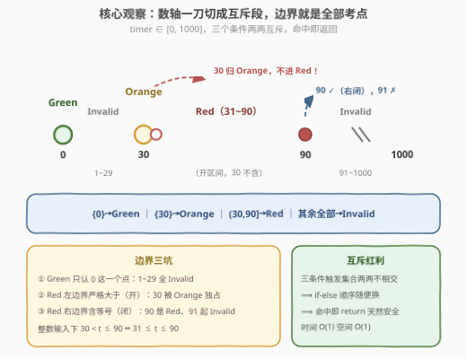
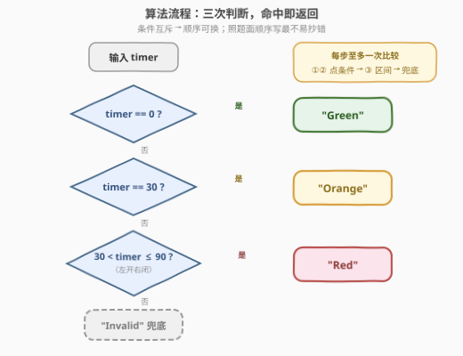

# LeetCode 交通信号灯的颜色 题解

## 1. 题目概述

- **标题 / 题号**：交通信号灯的颜色（#3894，easy）
- **链接**：https://leetcode.cn/problems/traffic-signal-color/
- **难度**：简单
- **标签**：数学、字符串、模拟

**题意**：给你一个整数 `timer`，表示交通信号灯上的剩余时间（以秒为单位）。信号灯状态遵循以下规则：

- 如果 `timer == 0`，信号灯为 `"Green"`
- 如果 `timer == 30`，信号灯为 `"Orange"`
- 如果 `30 < timer <= 90`，信号灯为 `"Red"`

返回信号灯的当前状态；如果均不满足上述条件，返回 `"Invalid"`。

**示例 1**：

```text
输入：timer = 60
输出："Red"
解释：因为 timer = 60，且 30 < timer <= 90，所以答案是 "Red"。
```

**示例 2**：

```text
输入：timer = 5
输出："Invalid"
解释：因为 timer = 5，不满足任何给定的条件，所以答案是 "Invalid"。
```

**约束**：

- $0 \le \text{timer} \le 1000$

> 💡 **审题关键**：三个条件的触发集合**两两互斥**，且远覆盖不满 $[0, 1000]$——大量输入（1~29、91~1000）都要落到 `"Invalid"` 兜底；真正的考点全在**边界**上：`30` 本身是 Orange 不是 Red（左边界严格大于），`90` 属于 Red（右边界含等号），`Green` 只认 `0` 这一个点。

## 2. 解题思路

### 2.1 暴力思路：打表

输入域只有 $[0, 1000]$ 共 1001 个整数，最"无脑"的做法是**预计算一张查询表**：开一个长度 1001 的数组，先把每个下标填成 `"Invalid"`，再把 0 改成 `"Green"`、30 改成 `"Orange"`、31~90 改成 `"Red"`，查询时下标直达，$O(1)$ 取值。

打表没有错，但纯属杀鸡用牛刀：条件总共三条、每条都是 $O(1)$ 可判的等式/不等式，直接一串 `if-else` 返回即可——既不花 1001 个字符串的空间，也不需要预处理。**当规则数量少且可直接计算时，分支判断就是最优解**；打表只在「规则多、单条计算贵、查询频繁」的场景才值得（见第 5 节扩展）。

### 2.2 核心观察：数轴上的互斥划分



把 `timer` 的取值画到数轴上，三个条件恰好把 $[0, 1000]$ 切成互不重叠的几段：

| 数轴段 | 对应条件 | 状态 |
|--------|----------|------|
| $\{0\}$（单点） | `timer == 0` | Green |
| $[1, 29]$ | 不满足任何条件 | Invalid |
| $\{30\}$（单点） | `timer == 30` | Orange |
| $(30, 90]$ | `30 < timer <= 90` | Red |
| $[91, 1000]$ | 不满足任何条件 | Invalid |

**观察一（互斥性带来顺序自由）。** 三个条件的触发集合两两不相交——$\{0\}$、$\{30\}$、$[31, 90]$ 没有任何重叠。因此 **if-else 的书写顺序不影响正确性**：任何输入至多命中一个分支，其余落进兜底的 `Invalid`。互斥也让「命中即 `return`」的提前返回写法天然安全——不需要担心某个输入被两个分支同时抢走。

**观察二（左开右闭是唯一陷阱）。** `Red` 的区间是**左开右闭** $(30, 90]$：左端 30 被 Orange 独占（条件是严格大于），右端 90 属于 Red、91 立刻 Invalid。整数输入下 `30 < timer <= 90` 等价于 `31 <= timer <= 90`，写代码用哪种都行，但**心里要有这层换算**——测试用例就该卡在 29/30/31 和 89/90/91 这六个边界值上。

> 💡 **一句话总结**：互斥条件 + 兜底分支 = 一串 if-else 直出；真正要小心的是 $(30, 90]$ 的左开右闭——30 归 Orange、90 归 Red，两头都不能错。

### 2.3 算法流程图



**逻辑执行步骤**：

| 步骤 | 判断 | 命中返回 | 未命中走向 |
|------|------|----------|------------|
| ① | `timer == 0`（点条件） | `"Green"` | 进入 ② |
| ② | `timer == 30`（点条件） | `"Orange"` | 进入 ③ |
| ③ | `timer > 30 && timer <= 90`（区间条件） | `"Red"` | 进入 ④ |
| ④ | 兜底 | `"Invalid"` | — |

按题面顺序书写：先两个**点条件**（等值判断），再一个**区间条件**，最后 `Invalid` 兜底。顺序其实可换（互斥性保证），但照题面顺序写最不容易抄错边界。

### 2.4 边界自测

拿一组卡边界的输入在脑内过一遍分支：

| timer | ① `==0` | ② `==30` | ③ `(30,90]` | 结果 |
|-------|---------|----------|-------------|------|
| 0 | ✓ | — | — | Green |
| 1 / 29 | ✗ | ✗ | ✗ | Invalid |
| 30 | ✗ | ✓ | — | Orange |
| 31 / 60 / 90 | ✗ | ✗ | ✓ | Red |
| 91 / 1000 | ✗ | ✗ | ✗ | Invalid |

其中 `timer = 30` 是最阴的一发：若把 ③ 误写成 `timer >= 30`，30 就会被 Red 抢走。本解中 ② 在 ③ 之前恰好能挡住这个错误，但若随手调换分支顺序，错误立刻暴露——这正是「按题面顺序写」的工程价值。

## 3. 参考代码

### C++

```cpp
class Solution {
  public:
    string trafficSignal(int timer) {
        if (timer == 0) return "Green";               // 点条件：只剩 0 秒
        if (timer == 30) return "Orange";             // 点条件：恰好 30 秒
        if (timer > 30 && timer <= 90) return "Red";  // 区间 (30, 90]
        return "Invalid";                             // 兜底：1~29、91~1000
    }
};
```

> 💡 **写法要点**：
> - C++ **没有链式比较**，`30 < timer <= 90` 必须展开成 `timer > 30 && timer <= 90`（直接照抄数学记法会先算 `30 < timer` 得 bool 再与 90 比较，语义全错）；
> - 三个分支命中即 `return`，零嵌套、零临时变量；
> - 最后的 `return "Invalid"` 同时满足编译器「所有路径必须有返回值」的要求。

### Python

```python
class Solution:
    def trafficSignal(self, timer: int) -> str:
        if timer == 0:
            return "Green"
        if timer == 30:
            return "Orange"
        if 30 < timer <= 90:   # 链式比较：左开右闭一步到位
            return "Red"
        return "Invalid"
```

> 💡 **写法要点**：
> - Python 的**链式比较** `30 < timer <= 90` 与数学记法 $(30, 90]$ 一模一样，`timer` 只求值一次，是本题最顺手的写法；
> - 千万别把 `and` 手滑写成 `or`——`30 < timer or timer <= 90` 恒真，91~1000 会全部误判成 Red；
> - 分支命中即返回，函数无循环、无状态，天然线程安全。

## 4. 复杂度分析

| 维度 | 复杂度 | 说明 |
|------|--------|------|
| 时间 | $O(1)$ | 至多三次比较，常数级 |
| 空间 | $O(1)$ | 无额外数据结构（对比打表法的 $O(1001)$ 字符串数组） |
| 输入域 | 1001 个值 | 有限输入域下任何正确解法都是 $O(1)$，比拼的只是常数与正确性 |

## 5. 扩展：当规则多到写不下 if-else

本题三条规则，一串 if-else 就够；若规则膨胀到成百上千条区间映射（如「时段→电价费率」「版本号→兼容策略」「成绩区间→等级」），手写分支既难维护又易错，此时有两种升级思路：

- **排序 + 二分**：把所有区间端点排序存进数组，查询时二分定位 `timer` 落在哪个区间，单次查询 $O(\log n)$。区间集合**静态不变**时首选；
- **差分 / 线段树打标记**：区间会**动态增删**时，用差分数组（离线批量）或线段树（在线单点查）维护每个点的归属。

无论哪种，第一步都是**把自然语言条件翻译成数轴上的互斥区间**——这正是 2.2 节的观察在真实工程里的放大版：先画数轴、再抠边界，规则再多也不会乱。

## 6. 面试要点

**Q1：if-else 的判断顺序可以调换吗？**

> 可以。三个条件的触发集合两两互斥（$\{0\}$、$\{30\}$、$[31,90]$），任何输入至多命中一个分支，顺序不影响结果。但工程上建议按题面顺序（点条件 → 区间条件 → 兜底）书写，减少抄写错误，code review 时也便于与题面逐条对照。

**Q2：这道题最容易错在哪里？**

> 边界 $(30, 90]$ 的**左开右闭**：左端 30 被 Orange 独占（条件是严格大于），右端 90 属于 Red（含等号）。典型错误：区间写成 `timer >= 30`（30 被 Red 抢走）或 `timer < 90`（90 掉进 Invalid）。测试就该卡 29/30/31 和 89/90/91。

**Q3：为什么最后要有一个 `return "Invalid"` 兜底？**

> 三个条件覆盖远不满 $[0, 1000]$：1~29 与 91~1000 都不满足任何条件，题目明确要求此时返回 `"Invalid"`。兜底 return 还附带健壮性红利——即便输入违规（负数、超过 1000），也会被安全接住而不是未定义行为。

**Q4：能不能用查表代替分支？**

> 能（输入域只有 1001 个值，预计算一张表 $O(1)$ 查询），但没必要：三条规则本身 $O(1)$ 可判，打表要 $O(1001)$ 空间加预处理，属于负优化。打表的适用场景是「规则多、单条计算贵、查询频繁」（见第 5 节）。

**Q5：Python 的 `30 < timer <= 90` 和 C++ 的写法为什么不一样？**

> Python 支持**链式比较**，`a < b <= c` 等价于 `a < b and b <= c`，与数学记法同构；C++ 写 `30 < timer <= 90` 会先算 `30 < timer` 得到 bool（0/1）再与 90 比较，结果恒真，是经典陷阱——必须展开成 `timer > 30 && timer <= 90`。

> 💡 **一句话总结**：互斥条件直出 if-else，考点全在 $(30, 90]$ 的左开右闭——30 归 Orange、90 归 Red，其余 Invalid 兜底；跨语言时留意链式比较的差异。

## 同类练习题

| # | 题目 | 与本题的关联 |
|---|------|-------------|
| 1480 | [一维数组的动态和](https://leetcode.cn/problems/running-sum-of-1d-array/) | 按题面逐步模拟的入门题，体会"规则直译成代码" |
| 2011 | [执行操作后的变量值](https://leetcode.cn/problems/final-value-of-variable-after-performing-operations/) | 字符串规则匹配 + 条件分支直出，同款"照规则模拟" |
| 2652 | [倍数求和](https://leetcode.cn/problems/sum-multiples/) | 数学条件（整除性）判断与边界翻译的训练 |
| 2894 | [分类求和并作差](https://leetcode.cn/problems/divisible-and-non-divisible-sums-difference/) | 按条件把数分桶，条件互斥思想的直接应用 |
| 1920 | [基于排列构建数组](https://leetcode.cn/problems/build-array-from-permutation/) | 纯粹按规则模拟、零边界陷阱的对照组 |
