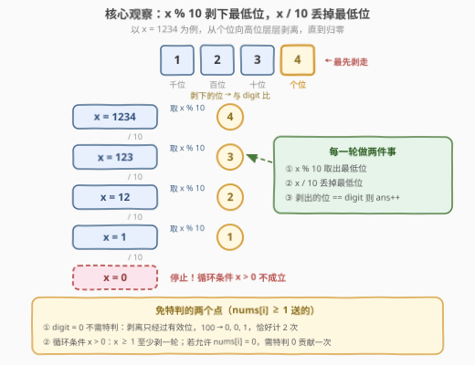
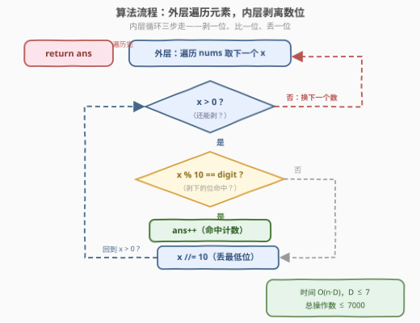

# LeetCode 统计数字出现总次数 题解

## 1. 题目概述

- **标题 / 题号**：统计数字出现总次数（#3895，medium）
- **链接**：https://leetcode.cn/problems/count-digit-appearances/
- **难度**：中等
- **标签**：数组、数学、模拟

**题意**：给你一个整数数组 `nums` 和一个整数 `digit`。返回在 `nums` **所有元素的十进制表示**中 `digit` 出现的**总次数**。

**示例 1**：

```text
输入：nums = [12,54,32,22], digit = 2
输出：4
解释：数字 2 在 12 和 32 中出现一次，在 22 中出现两次。因此，数字 2 出现的总次数为 4。
```

**示例 2**：

```text
输入：nums = [1,34,7], digit = 9
输出：0
解释：数字 9 没有出现在 nums 中任何元素的十进制表示中，所以总次数为 0。
```

**约束**：

- $1 \le \text{nums.length} \le 1000$
- $1 \le \text{nums[i]} \le 10^6$
- $0 \le \text{digit} \le 9$

> 💡 **审题关键**：统计的是**所有出现位置**，不是"包含该数位的元素个数"——`22` 里的两个 `2` 要各计一次。另外 `nums[i] \ge 1` 意味着**没有前导零**：`digit = 0` 时只会数到真实的零（如 `10`、`505` 中的 `0`），不会凭空多数。

## 2. 解题思路

### 2.1 暴力思路：转字符串逐字符扫描

最直觉的写法是把每个数转成字符串，逐字符与目标比较：

```python
ans = sum(str(x).count(str(digit)) for x in nums)
```

Python 一行收工，正确性无懈可击。但 `str(x)` 背后藏着整数→字符串的进制转换与临时对象分配，C++ 的 `to_string` 同理。数据规模小（$n \le 1000$、每个数至多 7 位）时这点开销无关痛痒，但这道题真正想考的是**不借助字符串、纯算术遍历数位**的手感——`% 10` 与 `/ 10` 的组合拳。

### 2.2 核心观察：数位剥离——`% 10` 剥下最低位，`/ 10` 丢掉最低位



十进制下，任意正整数的**每个数位**都能用两条算术指令拿到：

| 指令 | 效果 | 例（x = 1234） |
|------|------|----------------|
| `x % 10` | 取出**最低位**（个位） | 得 `4` |
| `x / 10` | **丢掉**最低位，剩余部分整体右移 | 得 `123` |

两者交替执行，直到 `x == 0`，就把全部数位**从低位到高位**遍历了一遍——像剥洋葱，一层一层直到只剩零。以 `1234` 为例：

| 轮次 | 此刻的 x | `x % 10`（剥下） | `x / 10`（剩余） |
|------|----------|------------------|------------------|
| 1 | 1234 | 4 | 123 |
| 2 | 123 | 3 | 12 |
| 3 | 12 | 2 | 1 |
| 4 | 1 | 1 | 0（停止） |

**观察一（`digit = 0` 免特判）**。由于 `nums[i] >= 1`，剥离过程只会经过**有效数位**：`100` 剥出 `0, 0, 1` 三个位，`0` 恰好被计 2 次，不多不少——不存在前导零被误数的风险，`digit = 0` 与其他数位走完全相同的代码路径。

**观察二（循环条件用 `x > 0`）**。本题 `x` 初值至少为 1，`while (x > 0)` 保证每个数至少剥一轮；`x` 归零时恰好剥完，不多不少。若题目放宽到允许 `nums[i] = 0`，`while` 版本会对 `0` 一次都不进、漏掉 `0` 本身的那次贡献——届时需要特判或改用 do-while 语义（见第 6 节 Q3）。

> 💡 **一句话总结**：每个数最多 7 位（$10^6$ 是 7 位数），`% 10` 取一位、`/ 10` 丢一位、命中则计数——纯算术、零字符串分配，总操作数上界 $1000 \times 7 = 7000$。

### 2.3 算法流程图



**逻辑执行步骤**：

| 层级 | 步骤 | 说明 |
|------|------|------|
| 外层 | 遍历 `nums` 取下一个 `x` | 每个元素独立处理，互不影响 |
| 内层 | 判断 `x > 0`？ | 否：该元素已剥光，回到外层换下一个数 |
| 内层 | 判断 `x % 10 == digit`？ | 是：`ans++`；无论是否命中，都执行 `x /= 10` |
| 收尾 | 遍历结束返回 `ans` | — |

双层循环各司其职：**外层管"换数"，内层管"剥位"**。

### 2.4 示例演算

以示例 1（`nums = [12,54,32,22]`，`digit = 2`）为例逐元素剥离：

| 元素 | 剥离序列（低位→高位） | 命中情况 | 贡献 |
|------|------------------------|----------|------|
| 12 | 2, 1 | 2 命中 | 1 |
| 54 | 4, 5 | 无 | 0 |
| 32 | 2, 3 | 2 命中 | 1 |
| 22 | 2, 2 | 2 命中两次 | 2 |

合计 $1 + 0 + 1 + 2 = 4$，与预期一致。注意 `22` 贡献 2 次——"总次数"与"元素个数"的区别正在此处。

## 3. 参考代码

### C++

```cpp
class Solution {
  public:
    int countDigitOccurrences(vector<int>& nums, int digit) {
        int ans = 0;
        for (int x : nums) {              // 外层：换数
            for (; x > 0; x /= 10) {      // 内层：剥位，剥到 0 为止
                if (x % 10 == digit) {    // 取最低位比较
                    ans++;
                }
            }
        }
        return ans;
    }
};
```

> 💡 **写法要点**：
> - 内层 `for (; x > 0; x /= 10)` 把"剥离"写进循环变量更新，循环体只剩"取位比较"，最紧凑；
> - `x` 是遍历变量的副本，修改它不影响原数组；
> - 若想更直白，可写 `while (x > 0) { ...; x /= 10; }`，两者完全等价。

### Python

```python
class Solution:
    def countDigitOccurrences(self, nums: list[int], digit: int) -> int:
        ans = 0
        for x in nums:                # 外层：换数
            while x:                  # 等价于 while x > 0（本题 x ≥ 1）
                if x % 10 == digit:   # 取最低位比较
                    ans += 1
                x //= 10              # 丢掉最低位
        return ans
```

> 💡 **写法要点**：
> - `while x` 在正整数语境下等价于 `while x > 0`，更 Pythonic；
> - 整除必须写 `//= 10`，手滑写成 `/= 10` 会把 `x` 变成 float，后续 `% 10` 的语义随之崩塌；
> - 一行版 `sum(str(x).count(str(digit)) for x in nums)` 也能 AC，面试可作对照提及（见 Q4）。

## 4. 复杂度分析

| 维度 | 复杂度 | 说明 |
|------|--------|------|
| 时间 | $O(n \cdot D)$，$D = \lfloor \log_{10}(\max) \rfloor + 1 \le 7$ | 每个数至多 7 位，总操作数 $\le 1000 \times 7 = 7000$ |
| 空间 | $O(1)$ | 纯算术，无字符串、无额外数据结构 |
| 对比 | 字符串版同为 $O(n \cdot D)$ | 渐进无差异，差别只在常数（转换与分配开销） |

## 5. 扩展：从"逐个数"到"按位批量算"——数位统计的进阶形态

本题规模小，逐个剥离绰绰有余。但若把问题放大成「统计 $1 \sim 10^9$ 中 `digit` 出现的总次数」，逐个枚举 $10^9$ 个数直接超时——这时要切换视角：**不再一个数一个数地数，而是固定数位位置，批量计算该位置上 `digit` 出现的次数**。

以个位为例：$[1, n]$ 中个位恰好是 `digit` 的数，个数由 $\lfloor n/10 \rfloor$ 与 `n % 10` 是否触达 `digit` 决定；对十位、百位……逐位套用「高位 / 当前位 / 低位」三分公式累加即可，单次查询 $O(\log n)$。这正是 [233. 数字 1 的个数](https://leetcode.cn/problems/number-of-digit-one/) 的经典套路，更一般化的工具则是**数位 DP**。

思想一脉相承：把"数"看作"数位的序列"——本题是"一次剥一个"，进阶版是"一位一档批量算"。

## 6. 面试要点

**Q1：为什么 `x % 10` 和 `x / 10` 能遍历所有数位？**

> 十进制数 $x = \sum d_i \cdot 10^i$。`x % 10` 即 $x \bmod 10$，取出系数 $d_0$；`x / 10` 即 $\lfloor x / 10 \rfloor$，整体右移一位、丢弃 $d_0$。交替执行相当于依次把 $d_0, d_1, d_2, \dots$ 逐一暴露到最低位，`x == 0` 时所有位已取尽。

**Q2：`digit = 0` 需要特判吗？**

> 本题不需要。`nums[i] >= 1` 保证了没有前导零：剥离只经过有效数位，`100` 剥出 `0, 0, 1`，`0` 恰好被计 2 次。前导零只在你把数格式化成定宽字符串（如补零到 7 位）时才会凭空出现——那才是需要警惕的写法。

**Q3：循环条件写 `x > 0`，如果 `nums[i]` 可以是 0 会怎样？**

> `while (x > 0)` 一次都不进，`0` 的贡献被漏掉。若题目允许 `nums[i] = 0` 且 `digit = 0`，需特判 `if (x == 0) ans++`，或改用 do-while 语义（至少执行一轮再判）。本题约束 `nums[i] >= 1` 天然回避了这个坑，但面试中主动指出这一点是加分项。

**Q4：算术剥离和转字符串，面试该写哪个？**

> 先写算术版：无字符串分配、跨语言行为一致，且展示对进制表示的理解。字符串一行版可作补充答案提及，体现"知道多种解法并能比较取舍"。两者渐进复杂度相同，均为 $O(n \cdot D)$，差别只在常数。

**Q5：总操作数的上界是多少？**

> $n \le 1000$，每个数 $\le 10^6$ 即至多 7 位，总剥离次数 $\le 7000$，比较次数同阶——任何语言都是瞬时完成。规模再放大 $10^3$ 倍也不怕；但如果问的是"$1 \sim n$ 范围内"这类区间统计，就该切换到按位公式或数位 DP（见第 5 节）。

> 💡 **一句话总结**：`% 10` 取位、`/ 10` 丢位、命中计数——数位剥离是数位类问题的"Hello World"；`digit = 0` 靠 `nums[i] >= 1` 免特判，`x > 0` 的边界感是隐藏考点。

## 同类练习题

| # | 题目 | 与本题的关联 |
|---|------|-------------|
| 2520 | [统计能整除数字的位数](https://leetcode.cn/problems/count-the-digits-that-divide-a-number/) | 同款 `% 10` / `/ 10` 剥离，只是把"等于 digit"换成"能整除" |
| 2269 | [找到一个数字的 K 美丽值](https://leetcode.cn/problems/find-the-k-beauty-of-a-number/) | 数位剥离 + 滑动窗口取连续数位组成的数值 |
| 233 | [数字 1 的个数](https://leetcode.cn/problems/number-of-digit-one/) | 数位统计的进阶形态，按位公式批量算，$O(\log n)$ |
| 504 | [七进制数](https://leetcode.cn/problems/base-7/) | 把 `% 10` / `/ 10` 推广到七进制，体会"进制只是基数不同" |
| 7 | [整数反转](https://leetcode.cn/problems/reverse-integer/) | 逐位剥出再逐位拼回，溢出判断是附加考点 |
