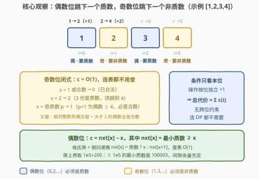
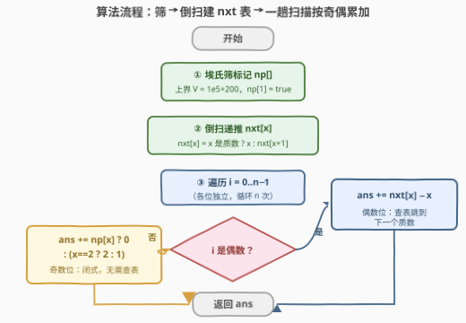

# LeetCode 将数组转换为交替质数数组的最少操作次数 题解

## 1. 题目概述

- **标题 / 题号**：将数组转换为交替质数数组的最少操作次数（#3896，medium）
- **链接**：https://leetcode.cn/problems/minimum-operations-to-transform-array-into-alternating-prime/
- **难度**：中等
- **标签**：数组、数学、数论、二分查找、排序

**题意**：给你一个整数数组 $nums$。如果满足以下条件，则认为数组是**交替质数**数组：

- **偶数**下标（从 0 开始）处的元素是**质数**；
- **奇数**下标处的元素是**非质数**。

在一次操作中，你可以将**任何元素增加 1**。

返回将 $nums$ 转换成交替质数数组所需的最少操作次数。

质数是指大于 1 且仅有两个因数（1 和其本身）的自然数。

**示例 1**：

```text
输入：nums = [1,2,3,4]
输出：3
解释：下标 0：1 → 2（1 次）；下标 1：2 → 4（2 次，因为 3 也是质数）；下标 2、3 已合法。
```

**示例 2**：

```text
输入：nums = [5,6,7,8]
输出：0
解释：偶数位 5、7 已是质数，奇数位 6、8 已是非质数。
```

**示例 3**：

```text
输入：nums = [4,4]
输出：1
解释：下标 0：4 → 5（1 次）；下标 1 已是合数。
```

**约束**：

- $1 \le nums.length \le 10^5$
- $1 \le nums[i] \le 10^5$

> 💡 **审题关键**：① 合法性条件**只看每个下标自身的奇偶与取值**，与相邻元素毫无关系 ⟹ 每个下标完全独立，总代价 = 各下标最小代价之和；② 只能 $+1$ ⟹ 单点最小代价 = 跳到"最近的、满足条件的更大数值"的距离；③ 偶数位需求"$\ge x$ 的最小质数"，奇数位需求"$\ge x$ 的最小非质数"——后者有个漂亮的**分类闭式**（见 2.2），连查表都不用；④ 值域 $10^5$、$n \le 10^5$ ⟹ 值域筛 + 一趟扫描即可；⑤ 题面 qerlanovid 句为注入噪音，与题意无关。

## 2. 解题思路

### 2.1 暴力思路：逐点向上试探 + 试除判质数

对每个下标 $i$，从 $x = nums[i]$ 起**每次 $+1$**，用 $O(\sqrt{x})$ 的试除判断目标值（偶数位判"是否质数"、奇数位判"是否非质数"），命中即停。

单点最坏要跨过一整段**素数间隙**——$10^5$ 量级实测最大间隙为 72（出现在 31397 与 31469 之间），即约 $72 \times 316 \approx 2\times10^4$ 次基本运算；$n = 10^5$ 时总量约 $2\times10^9$，超时。

瓶颈在于**同一值域的判质数被重复执行了海量次**。既然值域只有 $10^5$，就该一次性把整个值域的质数信息筛出来，把"逐点试除"变成"**查表**"。

### 2.2 核心观察：下标独立 + 两类代价一个查表一个闭式



**观察一（下标完全独立）**：合法性条件"下标 $i$ 上的值是否为质数/非质数"不涉及任何其他位置，操作又是按元素独立的 $+1$ ⟹ 总最少操作数 $= \sum_i c(i)$，其中 $c(i)$ 是让位置 $i$ 单独合法的最小加量。没有 3891 那种相邻互斥，本题连 DP 都不需要，是纯粹的"逐点定价再求和"。

**观察二（只能 $+1$ ⇒ 代价 = 到"下一个合法值"的距离）**：

- 偶数位：$c(i) = \mathrm{nextPrime}(x) - x$，其中 $\mathrm{nextPrime}(x)$ 为 $\ge x$ 的最小质数；
- 奇数位：$c(i) = \mathrm{nextNonPrime}(x) - x$。

**观察三（奇数位有 $O(1)$ 闭式，连表都不用查）**：非质数 = $1 \cup$ 合数，对奇数位取值 $x$ 逐类讨论：

| 奇数位取值 $x$ | 是否非质数 | $c(i)$ | 理由 |
|---|---|---|---|
| $x = 1$ 或合数 | ✓ | $0$ | 已合法 |
| $x = 2$ | ✗（质数） | $2$ | $3$ 也是质数，须跳到 $4$ |
| $x$ 为奇质数 $p \ge 3$ | ✗ | $1$ | $p+1$ 为偶数且 $\ge 4$，必是合数 |

关键事实是**相邻整数奇偶交替** + **大于 2 的偶数全是合数** ⟹ 任何奇质数 $+1$ 必落进合数。这也是官方提示"any number > 2 becomes non-prime after at most 1 increment (except 2)"的由来。

**观察四（偶数位靠筛 + 倒序递推建 $\mathrm{nextPrime}$ 表）**：埃氏筛 $O(V \log\log V)$ 标记非质数后，从大到小扫一遍：

$$\mathrm{nxt}[x] = \begin{cases} x, & x \text{ 是质数} \\ \mathrm{nxt}[x+1], & \text{否则} \end{cases}$$

筛上界取 $V = 10^5 + 200$：$\ge 10^5$ 的最小质数是 $100003$（$10^5 = 2\times5^5$，$100001 = 11 \times 9091$，$100002$ 为偶数），由素数定理该量级平均间隙 $\approx \ln(10^5) \approx 11.5$、实测最大间隙 72，$+200$ 余量充足，任何查询的递推链都会在 $100003$ 处终止。之后每个偶数位查表 $O(1)$。

> ⚠️ **两个常见 bug**：① 筛只到 $10^5$——$nums[i] = 10^5$ 时 $\mathrm{nextPrime} = 100003$ 越界/查到垃圾值；② 忘了 $np[1] = \text{true}$——1 不是质数，奇数位取 1 时代价应为 $0$。

### 2.3 算法流程图



| 步骤 | 操作 | 说明 |
|------|------|------|
| ① 筛 | 埃氏筛标记 $np[]$（上界 $V = 10^5+200$），$np[1] = $ true | $O(V \log\log V)$ 一次性定下全值域质数性 |
| ② 建表 | 倒扫递推 $\mathrm{nxt}[x] = x$ 为质数 ? $x$ : $\mathrm{nxt}[x+1]$ | $\mathrm{nextPrime}$ 查询 $O(1)$；递推链保证终止于 $100003$ |
| ③ 扫描 | 偶数位：$ans \mathrel{+}= \mathrm{nxt}[x] - x$ | 查表分支 |
| ④ 扫描 | 奇数位：$ans \mathrel{+}= np[x] ? 0 : (x = 2 ? 2 : 1)$ | 闭式分支，无需查表 |
| ⑤ 返回 | $ans$ | 各位独立可加，直接求和 |

标签里的**二分查找 / 双指针**是同一件事的等价写法：也可以只筛出有序质数表 $primes$，偶数位对 $primes$ 做 `lower_bound`（二分）；或把偶数位的值**排序**后与 $primes$ **双指针**同扫。都不如"倒序递推 nxt 数组"来得直接。

### 2.4 示例演算

以**示例 1**（$nums = [1,2,3,4]$）演算：

| $i$ | 奇偶 | $x$ | 目标值 | $c(i)$ |
|-----|------|-----|--------|--------|
| 0 | 偶 | 1 | $\mathrm{nextPrime}(1) = 2$ | $1$ |
| 1 | 奇 | 2 | $2$ 是质数且 $= 2$ → 跳到 $4$ | $2$ |
| 2 | 偶 | 3 | 已是质数 | $0$ |
| 3 | 奇 | 4 | 已是合数 | $0$ |

总代价 $= 1 + 2 = 3$ ✓

**示例 2**（$[5,6,7,8]$）：偶数位 $5,7$ 已是质数、奇数位 $6,8$ 已是合数 → $0$ ✓。**示例 3**（$[4,4]$）：$i=0$ 查表 $\mathrm{nextPrime}(4) = 5$（$+1$），$i=1$ 合数（$+0$）→ $1$ ✓。三个示例全部验证通过。

## 3. 参考代码

### C++

```cpp
class Solution {
public:
    long long minOperations(vector<int>& nums) {
        const int V = 100200;                       // 1e5 + 200：远超该量级素数间隙（≥1e5 的最小质数是 100003）
        vector<bool> np(V + 2, false);              // np[x]：x 是非质数（1 或合数）
        np[1] = true;
        for (int p = 2; p * p <= V; ++p)
            if (!np[p])
                for (int q = p * p; q <= V; q += p) np[q] = true;

        vector<int> nxt(V + 2, 0);                  // nxt[x] = 最小质数 >= x（x <= 1e5 的查询有效）
        for (int x = V; x >= 1; --x) nxt[x] = !np[x] ? x : nxt[x + 1];

        long long ans = 0;
        for (int i = 0; i < (int)nums.size(); ++i) {
            int x = nums[i];
            if (i % 2 == 0) ans += nxt[x] - x;                    // 偶数位：下一个质数
            else            ans += np[x] ? 0 : (x == 2 ? 2 : 1);  // 奇数位：下一个非质数（闭式）
        }
        return ans;
    }
};
```

### Python

```python
class Solution:
    def minOperations(self, nums: List[int]) -> int:
        V = 100200                                  # 1e5 + 200：远超该量级素数间隙
        np = [False] * (V + 2)
        np[1] = True
        for p in range(2, int(V ** 0.5) + 1):
            if not np[p]:
                for q in range(p * p, V + 1, p):
                    np[q] = True

        nxt = [0] * (V + 2)                         # nxt[x] = 最小质数 >= x
        for x in range(V, 0, -1):
            nxt[x] = x if not np[x] else nxt[x + 1]

        ans = 0
        for i, x in enumerate(nums):
            if i % 2 == 0:
                ans += nxt[x] - x                   # 偶数位：下一个质数
            else:
                ans += 0 if np[x] else (2 if x == 2 else 1)   # 奇数位：闭式
        return ans
```

> 💡 **写法要点**：① `np[1]` 必须置 true——1 不是质数，但"判非质数"要把它算进去；② `nxt` 数组开 $V+2$，倒扫时 `nxt[x+1]` 不越界（$V$ 本身是合数，表尾是哨兵垃圾值，但 $x \le 10^5$ 的查询链在 $100003$ 处早已终止）；③ 奇数位分支顺序：先 `np[x]` 判 $0$，再 `x == 2` 判 $2$，最后才是奇质数 $+1$；④ 单点代价上界约 74、$n \le 10^5$ ⟹ 答案 $\le 7.4\times10^6$，`int` 也放得下，`long long` 是保险习惯。

## 4. 复杂度分析

| 维度 | 复杂度 | 说明 |
|------|--------|------|
| **时间** | $O(V \log\log V + n)$ | 埃氏筛 $O(V \log\log V)$、建表 $O(V)$、扫描 $O(n)$；$V \approx 10^5$ |
| **空间** | $O(V)$ | `np` 布尔表 + `nxt` 整型表，约 $10^5$ 量级 |
| **量级判断** | 对比暴力 $\approx 2\times10^9$ | 暴力对同一值域重复试除；筛一次把"判质数"摊销成 $O(1)$ 查表 |

## 5. 扩展

### 5.1 变体速查

- **允许 $+1$ 或 $-1$**：单点代价变成"到**最近**合法值的距离"——偶数位要比较 $\mathrm{nextPrime}(x)$ 与 $\mathrm{prevPrime}(x)$ 两个方向（$x \le 2$ 时只能向上）；奇数位因非质数极密（奇质数 $x-1$ 是 $\ge 4$ 的偶数必合数）代价至多 1，且 $x=2$ 向下到 1 只花 1，闭式结构仍在。
- **值域升到 $10^9$**：$O(V)$ 表放不下。改用 Miller-Rabin 判素 + 从 $x$ 起逐个上试——素数定理保证期望试探 $O(\ln x)$ 次；或离线把偶数位的值排序，用分段筛生成覆盖区间的质数后双指针配对。奇数位闭式与值域无关，照用。
- **改成"偶数位非质数、奇数位质数"**：完全镜像，把两类分支的奇偶互换即可。
- **问操作方案数而非最小代价**：每位方案数 = 该位可达的合法目标值个数（有上界时），乘法原理相乘。

### 5.2 关联骨架：next/prev prime 预处理

"把每个元素独立调整到最近的质数/非质数"是一类模板：2601（减法调整到 $\le$ 自身的最大质数，即 $\mathrm{prevPrime}$ 方向）、2523（区间内最近的质数对）都是"筛 + 预处理 next/prev 数组"的同款骨架，区别只在方向与目标集合。

## 6. 面试要点

**Q1：为什么本题连 DP 都不需要？**

> 合法性只约束"每个下标自身的值"，不同下标之间零耦合；操作又是单点 $+1$ ⟹ 总代价 = $\sum$ 单点最小代价。对比 3891（相邻互斥 ⇒ 独立集 DP），拿到调整类问题先判断"**独立性**是否存在"，是第一步分诊。

**Q2：奇数位的 $O(1)$ 闭式是怎么来的？$2$ 为什么特殊？**

> 相邻整数奇偶交替，而大于 2 的偶数全是合数 ⟹ 奇质数 $p$ 的 $p+1$ 必为合数，$+1$ 即合法。$x = 2$ 是**唯一的偶质数**：$2+1=3$ 仍是质数，只能再 $+1$ 到 $4$，代价 2。$x=1$ 与合数则天然合法。

**Q3：nextPrime 表怎么建？筛上界为什么 $+200$ 就够？**

> 埃氏筛后从大到小递推 $\mathrm{nxt}[x] = $ 质数 ? $x$ : $\mathrm{nxt}[x+1]$。上界要盖住"$\ge \max(nums)$ 的最小质数"：$\ge 10^5$ 的最小质数是 $100003$；素数定理给出该量级平均间隙 $\approx \ln(10^5) \approx 11.5$，实测最大间隙 72（31397→31469），$+200$ 余量充足。

**Q4：如果值域升到 $10^9$，方案怎么改？**

> $O(V)$ 表不可行。两条路：① 从每个 $x$ 向上逐个试探 + Miller-Rabin，期望 $O(\ln x)$ 次命中；② 离线把偶数位的值排序，用分段筛生成覆盖区间的质数后双指针配对。奇数位闭式与值域无关，照用。

**Q5：实现上有哪些坑？**

> ① $np[1] = $ true（1 非质数，筛从 2 起跑会漏标它）；② 筛上界必须 $> 10^5$（只筛到 $10^5$ 时 $\mathrm{nxt}[10^5]$ 会读到表尾垃圾值）；③ `nxt` 开 $V+2$ 防倒扫越界；④ 奇数位先判非质数再谈质数分支，$x=2$ 与奇质数分开处理；⑤ 求和变量用 64 位兜底。

> 💡 **一句话总结**：3896 =「条件逐位独立 ⇒ 代价拆成单点求和」+「只能 $+1$ ⇒ 跳到下一个合法值」+「偶数位筛 + 倒扫建 nextPrime 表、奇数位闭式（非质数 $0$ / $2 \to 2$ / 奇质数 $\to 1$）」。带走的知识点：**值域内反复判质数 ⟹ 一次性筛 + next/prev 递推查表；奇偶交替 + 唯一偶质数 2 是数论分类讨论的常客**。

## 同类练习题

| # | 题目 | 与本题的关联 |
|---|------|-------------|
| 204 | [计数质数](https://leetcode.cn/problems/count-primes/)（[题解](../0201-0300/204_计数质数.md)） | 埃氏筛母版，本题预处理的地基 |
| 2601 | [质数减法操作](https://leetcode.cn/problems/prime-subtraction-operation/) | 同样"每个元素独立跳到最近的质数"——prevPrime 查表的方向版 |
| 2523 | [范围内最接近的两个质数](https://leetcode.cn/problems/closest-prime-numbers-in-range/)（[题解](../2501-2600/2523_范围内最接近的两个质数.md)） | 区间筛 + 相邻质数对，next/prev 预处理的近亲 |
| 762 | [二进制表示中质数个置位](https://leetcode.cn/problems/prime-number-of-set-bits-in-binary-representation/)（[题解](../0701-0800/762_二进制表示中质数个置位.md)） | 小值域"判质数 → 打表"思想的另一面 |
| 866 | [回文质数](https://leetcode.cn/problems/prime-palindrome/)（[题解](../0801-0900/866_回文质数.md)） | 数论 + 构造跳跃搜索，体会"按值域结构跳过不可能区间"的思路 |
