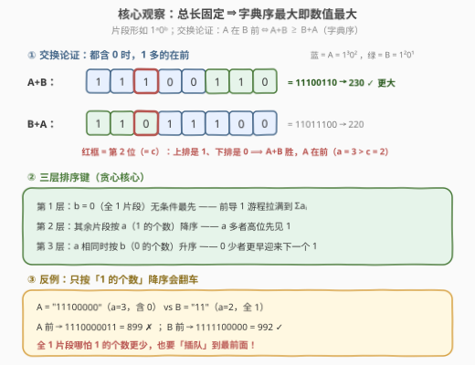
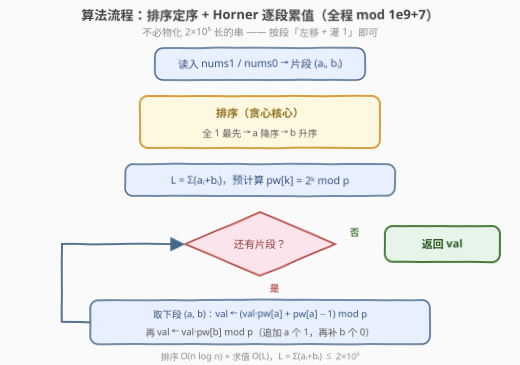

# 连接二进制片段得到的最大值

- **题目名称**：连接二进制片段得到的最大值
- **链接**：[3897. Maximum Value of Concatenated Binary Segments](https://leetcode.cn/problems/maximum-value-of-concatenated-binary-segments/)
- **难度**：困难
- **标签**：贪心、数组、排序

## 1. 题目概述

给你两个长度均为 $n$ 的整数数组 `nums1` 与 `nums0`。对每个下标 $i$，构造一个二进制片段：先写 `nums1[i]` 个 `'1'`，再跟 `nums0[i]` 个 `'0'`，即片段形如 $1^{a_i}0^{b_i}$。

你可以以任意顺序**重排**这 $n$ 个片段，再把它们**拼接**成一个完整的二进制字符串。返回拼接结果能表示的**最大整数值**；由于结果可能非常大，对 $10^9+7$ 取模后返回。

**示例 1**：

```text
输入：nums1 = [1,2], nums0 = [1,0]
输出：14
解释：片段分别为 "10" 与 "11"；排成 "11"+"10" = "1110" = 14，为可能的最大值。
```

**示例 2**：

```text
输入：nums1 = [3,1], nums0 = [0,3]
输出：120
解释：片段分别为 "111" 与 "1000"；排成 "111"+"1000" = "1111000" = 120，为可能的最大值。
```

**约束条件**：

- $1 \le n = \text{nums1.length} = \text{nums0.length} \le 10^5$
- $0 \le \text{nums1}[i], \text{nums0}[i] \le 10^4$，且 $\text{nums1}[i] + \text{nums0}[i] > 0$
- `nums1` 与 `nums0` 所有元素之和不超过 $2 \times 10^5$（即拼接串总长 $L \le 2\times10^5$）

> 💡 **审题关键**：① 每个片段结构**定型**——前半截全是 1、后半截全是 0，唯一的自由度是**片段的先后顺序**；② 无论怎么排，拼接串**总长 $L = \sum(a_i+b_i)$ 固定不变**；③ 结果要取模 $10^9+7$，说明真实数值大到没法直接比较——真正比的是**字符串字典序**，取模只是最后求值的例行公事。

---

## 2. 解题思路

### 2.1 暴力思路：枚举全排列

最直接的做法是枚举 $n$ 个片段的全部 $n!$ 种排列，逐种拼接求最大值。$n$ 上到 $10^5$，全排列显然不可行，但暴力帮我们看清一个本质：

> 总长 $L$ 固定 ⇒ 任意两个候选串**等长** ⇒ **字典序大小 ⇔ 数值大小**。

于是问题从「最大化数值」干净地转化为「拼出字典序最大的 01 串」——经典的**排序拼接**模型（同 179. 最大数）。

### 2.2 核心观察：交换论证定次序



**观察一（交换论证）。** 交换相邻的两个片段 A、B，不影响其余片段的位置，也不改变总长——其余每一位的权重都不动，两种摆法的高下完全由 $A+B$ 与 $B+A$ 的字典序决定。于是定义比较器：

$$A \text{ 应排在 } B \text{ 前} \iff A + B \ge B + A$$

只要该比较器是**全序**（可传递），按它排序即得全局最优——这正是 179. 最大数 的经典结论（把 $A+B$、$B+A$ 各自重复到公倍长度即可证传递性）。

**观察二（比较器在本题结构下的化简）。** 本题每个片段形如 $1^a0^b$（$a$ 个 1 接 $b$ 个 0），逐位推导 $A+B$ 与 $B+A$ 的大小，可把比较器化简成**三层排序键**：

| 层 | 情形 | 谁在前 | 一句话理由 |
|----|------|--------|------------|
| ① | $b = 0$（$A$ 全 1） | $A$（无论 $a,c$ 谁大） | 放最前可把前导 1 游程拉满到 $\sum a_i$ |
| ② | $b, d > 0$ 且 $a > c$ | $A$ | 第 $c$ 位：$A{+}B$ 是 1，$B{+}A$ 是 0 |
| ③ | $b, d > 0$ 且 $a = c$ | $b$ 小者 | 0 少的那个更早让下一个 1 落在更高位 |

推导细节（设 $A = 1^a0^b$，$B = 1^c0^d$）：

- **全 1 片段优先**：若 $b=0, d>0$，则 $A+B = 1^{a+c}0^d$，而 $B+A = 1^c0^d1^a$——第 $c$ 位上前者是 1、后者是 0，故 $A+B > B+A$；
- **$a$ 降序**：若 $a > c$ 且 $b, d > 0$，$A+B$ 的第 $c$ 位仍在 $A$ 的 1 游程内（是 1），而 $B+A$ 的第 $c$ 位已是 $B$ 的第一个 0，故 $A$ 在前；$a < c$ 对称；
- **$b$ 升序**：若 $a = c$，两串前 $a$ 位相同；从第 $a$ 位起一边是 $0^b1^a0^d$、另一边是 $0^d1^a0^b$，先结束 0 游程的一方（$b$ 小者）在第 $a+\min(b,d)$ 位抢先出现 1；$b=d$ 时两串相等，顺序随意。

> ⚠️ **别照字面理解「1 多的在前」**：官方提示说「按前缀中 1 的数量降序排」，这在存在**全 1 片段**时不成立。反例：$A = 11100000$（$a{=}3$）与 $B = 11$（$a{=}2$，全 1）——按 $a$ 降序得 $1110000011 = 899$，而让全 1 的 $B$ 插队得 $1111100000 = 992$。全 1 片段哪怕 1 的个数更少，也要排到最前面（见上图 ③）。

### 2.3 算法流程图



排序定序之后**不必真的拼出长串**。设当前已拼部分的值为 $\text{val}$，追加一个片段 $(a, b)$ 等价于两次「左移」：

$$\text{val} \leftarrow \text{val} \cdot 2^a + (2^a - 1), \qquad \text{val} \leftarrow \text{val} \cdot 2^b \pmod{10^9+7}$$

前者是「左移 $a$ 位再灌入 $a$ 个 1」（$2^a-1$ 正是 $a$ 个 1），后者是「左移 $b$ 位补 0」。预处理 $2^k \bmod p$ 的幂表后，整条求值链 $O(L)$ 收尾。

### 2.4 示例演算

以示例 2（`nums1 = [3,1]`, `nums0 = [0,3]`）走一遍全流程：

| 步骤 | 片段 $(a,b)$ | 全 1？ | 排序后位置 | val 更新（mod 前真值） |
|------|--------------|--------|------------|------------------------|
| 排序 | $(3,0)$ → "111" | ✓ | 第 1 | — |
| 排序 | $(1,3)$ → "1000" | ✗ | 第 2 | — |
| 求值 1 | $(3,0)$ | — | — | $0 \cdot 2^3 + 7 = 7$，再 $\times 2^0 = 7$ |
| 求值 2 | $(1,3)$ | — | — | $7 \cdot 2 + 1 = 15$，再 $\times 2^3 = \mathbf{120}$ ✓ |

反例再演算一遍（$A = (3,5)$，$B = (2,0)$）：全 1 的 $B$ 排最前 → 追加 $B$ 后 $\text{val} = 3$；追加 $A$：$3 \cdot 2^3 + 7 = 31$，再 $\times 2^5 = 992$ ✓，确实大于 $A$ 在前的 899。

---

## 3. 参考代码

### C++

```cpp
class Solution {
  public:
    int maxValue(vector<int>& nums1, vector<int>& nums0) {
        const long long MOD = 1'000'000'007LL;
        int n = nums1.size();
        vector<pair<int, int>> segs(n);                    // (a, b) = (1 的个数, 0 的个数)
        for (int i = 0; i < n; ++i) segs[i] = {nums1[i], nums0[i]};
        sort(segs.begin(), segs.end(), [](const auto& A, const auto& B) {
            if ((A.second == 0) != (B.second == 0)) return A.second == 0; // 全 1 片段最先
            if (A.first != B.first) return A.first > B.first;             // a 降序
            return A.second < B.second;                                   // b 升序
        });
        int L = 0;
        for (auto& s : segs) L += s.first + s.second;
        vector<long long> pw(L + 1);                      // pw[k] = 2^k mod p
        pw[0] = 1;
        for (int i = 1; i <= L; ++i) pw[i] = pw[i - 1] * 2 % MOD;
        long long val = 0;
        for (auto& [a, b] : segs) {
            val = (val * pw[a] + pw[a] - 1) % MOD;        // 追加 a 个 1
            val = val * pw[b] % MOD;                      // 追加 b 个 0
        }
        return (int)val;
    }
};
```

> 💡 **写法要点**：
> - 比较器第一行用 `(A.second == 0) != (B.second == 0)` 把「全 1 / 非全 1」分成两类，保证全 1 片段整体在前——这是与官方提示字面说法最大的差异点；
> - 三个分支合起来是严格全序（先类间、再类内字典序），`std::sort` 不会因非法比较器越界崩溃；
> - 全程 `long long`，最大中间乘积约 $10^9 \times 10^9 < 2^{63}$，无溢出。

### Python

```python
class Solution:
    def maxValue(self, nums1: list[int], nums0: list[int]) -> int:
        MOD = 10**9 + 7
        segs = [(nums1[i], nums0[i]) for i in range(len(nums1))]
        segs.sort(key=lambda s: (s[1] != 0, -s[0], s[1]))  # 全1最先 → a 降 → b 升
        L = sum(a + b for a, b in segs)
        pw = [1] * (L + 1)
        for i in range(1, L + 1):
            pw[i] = pw[i - 1] * 2 % MOD
        val = 0
        for a, b in segs:
            val = (val * pw[a] + pw[a] - 1) % MOD          # 追加 a 个 1
            val = val * pw[b] % MOD                        # 追加 b 个 0
        return val
```

> 💡 **写法要点**：
> - 排序键 `(s[1] != 0, -s[0], s[1])` 一行编码三层规则：布尔值 `False` 排前，恰好让全 1 片段「插队」；
> - 不必物化每个片段的字符串再用 `A+B >= B+A` 比较——那要 $O(L)$ 级内存且比较代价高，化简成整数键后单次比较 $O(1)$；
> - 幂表一次 $O(L)$ 预处理，比每段调用 `pow(2, k, MOD)` 更省。

---

## 4. 复杂度分析

| 维度 | 复杂度 | 说明 |
|------|--------|------|
| 时间 | $O(n \log n + L)$ | 排序 $O(n\log n)$；幂表与逐段求值各扫一遍 $O(L)$，$L = \sum(a_i+b_i) \le 2\times10^5$ |
| 空间 | $O(n + L)$ | 片段数组 $O(n)$、幂表 $O(L)$；改为逐位左移求值可省掉幂表，降为 $O(n)$ |
| 正确性 | 全序 + 交换论证 | 比较器为全序，排序后无相邻逆序对 ⇒ 全局字典序最大 ⇒ 数值最大 |

---

## 5. 扩展：任意字符串的拼接比较器

本题片段结构特殊（$1^a0^b$），比较器才能化简成 $O(1)$ 的三层整数键。对**任意**字符串的排序拼接问题，通用武器始终是：

$$A \text{ 在 } B \text{ 前} \iff A + B \ge B + A \quad (\text{字典序})$$

- 该比较器对任意字符串都是全序，排序后拼接即最优（179. 最大数 是模板题）；
- 761. 特殊的二进制序列 在递归拆分出「1 开头、0 收尾、前缀 1 不少于 0」的子串后，对子串用同款比较器排序拼接；
- 若题目改成「拼出最小值 / 字典序最小」，把比较器方向整个反过来即可——套路不变，方向别搞反；
- 本题的教训反过来也成立：**提示与直觉都可能出错，交换论证才是可证明的依据**——反例（全 1 片段插队）是面试中主动提出的加分点。

---

## 6. 面试要点

**Q1：为什么总长固定时「字典序最大」等价于「数值最大」？**

> 等长二进制串逐位比较字典序，等价于比较 $\sum_j b_j 2^{L-1-j}$：第一个不同的位上，为 1 的一方多出 $2^{L-1-j}$，而低位全部加起来也补不回这个差值，故高位胜负压倒一切。唯一退化情形是所有片段全 0，此时值为 0，算法自然返回 0。

**Q2：交换论证为什么能保证「排序 = 全局最优」？**

> 交换相邻两段 A、B 不改变总长与其余段位置，因此其余段每一位的权重不变，两种摆法优劣完全由 $A+B$ 与 $B+A$ 决定。若某排列存在相邻逆序对（按比较器本该在后的排在了前），交换它严格不亏；比较器又是全序，按它排序的排列不含任何逆序对，于是任何其它排列都可经一系列「消除逆序的相邻交换」变成它且每步不亏——故它最优。

**Q3：全 1 片段为什么无条件排最前？哪怕它 1 的个数很少？**

> 全 1 片段不含 0，放最前可与后面的 1 游程无缝相连，把前导 1 游程拉满到 $\sum a_i$——这是理论的上界。任何含 0 片段排在它前面都会提前截断游程。反例：$A = 11100000$（$a{=}3$）与 $B = 11$（$a{=}2$）：$B$ 在前得 $1111100000 = 992 > 899$。「按 1 的个数降序」的字面提示在此翻车，务必以交换论证为准。

**Q4：$a$ 相同时为什么 $b$ 越小越靠前？**

> 两片段 1 游程等长，拼接后前 $a$ 位相同；接下来 0 游程短的一方**更早迎来下一个 1**，让这个 1 落在更高的位上。例：$110 + 1100 = 1101100 \,(\,108\,) > 1100 + 110 = 1100110\,(\,102\,)$。

**Q5：为什么要取模？如何高效求值？**

> 总长 $L$ 可达 $2\times10^5$，真实数值约 $2^{2\times10^5}$，远超任何整型，题目因此要求 $\bmod\ 10^9+7$。求值用 Horner 思想逐段处理：`val = (val * pw[a] + pw[a] - 1) % MOD` 再 `val = val * pw[b] % MOD`，配合预计算幂表，$O(L)$ 完事，全程无需物化整个字符串。

> 💡 **一句话总结**：总长固定 ⇒ 拼字典序最大的串；交换论证给出三层排序键——**全 1 最先、$a$ 降序、$b$ 升序**；排完 Horner 逐段取模求值。

---

## 7. 同类练习题

- [179. 最大数](https://leetcode.cn/problems/largest-number/)：$A+B \ge B+A$ 比较器排序拼接的开山模板题
- [761. 特殊的二进制序列](https://leetcode.cn/problems/special-binary-string/)：递归拆分二进制子串后排序拼接，同款比较器思想的进阶应用
- [1754. 构造字典序最大的合并字符串](https://leetcode.cn/problems/largest-merge-of-two-strings/)：每步贪心取剩余前缀中字典序更大者，拼接贪心的另一形态
- [321. 拼接最大数](https://leetcode.cn/problems/create-maximum-number/)：从两个数组取 $k$ 个数拼最大数，贪心 + 单调栈的综合版
