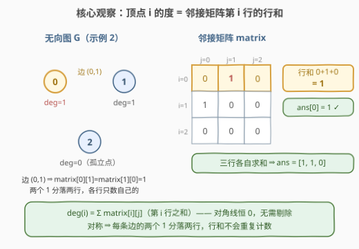
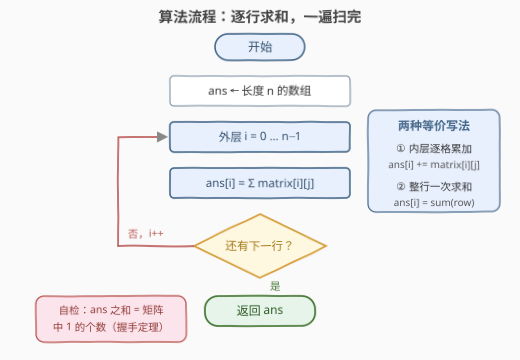

# LeetCode 统计每个顶点的度 题解

## 1. 题目概述

- **标题 / 题号**：统计每个顶点的度（#3898，easy）
- **链接**：https://leetcode.cn/problems/find-the-degree-of-each-vertex/
- **难度**：简单
- **标签**：图、数组、矩阵

**题意**：给定 $n \times n$ 的二维整数数组 `matrix`，以**邻接矩阵**形式表示一个含 $n$ 个顶点的**无向图**，顶点编号 $0$ 到 $n-1$：

- `matrix[i][j] = 1` 表示顶点 $i$ 与顶点 $j$ 之间有一条边；
- `matrix[i][j] = 0` 表示二者之间无边。

顶点的**度**（degree）定义为与该顶点相连的边的数量。返回长度为 $n$ 的数组 `ans`，其中 `ans[i]` 为顶点 $i$ 的度。

**示例 1**：

```text
输入：matrix = [[0,1,1],[1,0,1],[1,1,0]]
输出：[2,2,2]
解释：三角形，每个顶点都与其余两个顶点相连，度均为 2。
```

**示例 2**：

```text
输入：matrix = [[0,1,0],[1,0,0],[0,0,0]]
输出：[1,1,0]
解释：只有边 (0,1)；顶点 2 是孤立点，度为 0。
```

**示例 3**：

```text
输入：matrix = [[0]]
输出：[0]
解释：单顶点无边。
```

**约束**：$1 \le n \le 100$；`matrix[i][i] == 0`（无自环）；元素仅为 0/1；`matrix[i][j] == matrix[j][i]`（对称）。

> 💡 **审题关键**：三条约束各有含义——**对称**说明每条边 $(i,j)$ 在矩阵里出现两次（`matrix[i][j]` 与 `matrix[j][i]` 各一个 1），但它们**分落不同的行**；**对角线为 0** 说明没有自环，行内求和无需剔除 $j = i$ 项。两者合起来意味着：**第 $i$ 行的和就是顶点 $i$ 的度**。

## 2. 解题思路

### 2.1 暴力思路：先建邻接表再数度？

最朴素的念头是「先把图建出来再数」：扫一遍矩阵，把每条边 $(i,j)$ 插入邻接表，最后 `deg[i] = len(adj[i])`。结果正确，但纯属绕路——建表本身就要 $O(n^2)$，而度数信息**本来就躺在每一行里**，邻接表只是把它换个形态再读一次。

更本质地看下界：输入规模是 $n^2$ 个格子，任何算法至少要把矩阵读完（哪怕只读上三角也还有 $\Omega(n^2)$ 个格子），时间不可能低于 $O(n^2)$。既然逐行扫一遍就已经达到这个下界，「暴力」与「最优」在本题重合——剩下的只是**把行求和写得干净**。

### 2.2 核心观察：度 = 第 i 行的行和



**观察一（行内每个 1 恰好对应一条邻接边）**：第 $i$ 行第 $j$ 个 1 代表边 $(i,j)$；$j$ 不同则边不同，因此第 $i$ 行中 1 的个数 = 顶点 $i$ 的邻边数 = 度。

**观察二（不会重复计数）**：对称性让边 $(i,j)$ 在 `matrix[i][j]` 与 `matrix[j][i]` 各贡献一个 1，但它们**分落两行**——第 $i$ 行只数自己那一个，第 $j$ 行数它那一个，互不干扰。

**观察三（无需剔除对角线）**：`matrix[i][i] == 0`，自环贡献为零，行和不需要任何修正。

于是：

$$\mathrm{deg}(i) = \sum_{j=0}^{n-1} \text{matrix}[i][j]$$

### 2.3 算法流程图



| 步骤 | 操作 | 说明 |
|------|------|------|
| ① 初始化 | `ans` 为长度 $n$ 的数组 | 无需预填 0，逐行覆盖 |
| ② 外层 $i$ | 从 0 到 $n-1$ 逐行 | 各行独立，互不依赖 |
| ③ 行求和 | `ans[i] =` 第 $i$ 行元素和 | 逐格累加或整行 `sum` 均可 |
| ④ 返回 | 所有行处理完返回 `ans` | 一遍扫完，无回溯 |

### 2.4 示例演算（示例 2）

| 顶点 $i$ | 第 $i$ 行 | 求和 | `ans[i]` |
|---------|----------|------|----------|
| 0 | `[0, 1, 0]` | $0+1+0$ | $1$ |
| 1 | `[1, 0, 0]` | $1+0+0$ | $1$ |
| 2 | `[0, 0, 0]` | $0+0+0$ | $0$ |

返回 `[1, 1, 0]` ✓。顺手用**握手定理**自检：度数之和 $= 2$，为偶数，且恰为矩阵中 1 的总个数（4 个）的一半 ✓。

## 3. 参考代码

### C++

```cpp
class Solution {
public:
    vector<int> findDegrees(vector<vector<int>>& matrix) {
        int n = matrix.size();
        vector<int> ans(n);
        for (int i = 0; i < n; i++) {
            int d = 0;
            for (int j = 0; j < n; j++)
                d += matrix[i][j];
            ans[i] = d;
        }
        return ans;
    }
};
```

### Python

```python
class Solution:
    def findDegrees(self, matrix: list[list[int]]) -> list[int]:
        return [sum(row) for row in matrix]
```

> 💡 **写法要点**：① Python 一行列表推导即可，`sum(row)` 就是行和；② C++ 也可写成 `accumulate(matrix[i].begin(), matrix[i].end(), 0)`；③ 元素只有 0/1 且 $n \le 100$，最大度 $99$，`int` 无任何溢出风险。

## 4. 复杂度分析

| 维度 | 复杂度 | 说明 |
|------|--------|------|
| **时间** | $O(n^2)$ | 逐行求和；$n \le 100$ 时仅 $10^4$ 次加法 |
| **空间** | $O(1)$ | 仅返回数组（题目要求的输出不计入） |
| **量级判断** | 输入即 $n^2$ | 矩阵有 $n^2$ 个格子，读完输入即 $\Omega(n^2)$，行和法已触达理论下界 |

## 5. 扩展：入度 / 出度与握手定理

**有向图**：邻接矩阵不再对称，此时**行和 = 出度**（从 $i$ 发出的边数），**列和 = 入度**（指向 $i$ 的边数）。经典应用如 [997. 找到小镇的法官](https://leetcode.cn/problems/find-the-town-judge/)——法官即「入度 $n-1$、出度 0」的顶点。

**握手定理（Handshaking Lemma）**：无向图中 $\sum_i \mathrm{deg}(i) = 2m$（$m$ 为边数），因为每条边给两个端点各贡献 1 度。本题可顺手用它校验：`ans` 的元素和必为偶数，且等于矩阵中 1 的总个数（即 $2m$）。推论：度数为奇的顶点个数一定是偶数。

**存储选择**：邻接矩阵空间 $O(n^2)$、判断任意两点相邻 $O(1)$、遍历邻居 $O(n)$，适合**稠密图**；稀疏图（$m \ll n^2$）应改用邻接表，空间 $O(n+m)$、遍历邻居 $O(\mathrm{deg})$，此时度数就是 `len(adj[i])`。本题 $n \le 100$，矩阵毫无压力。

## 6. 面试要点

**Q1：为什么行和恰好等于度，不会多数也不会漏数？**

> 第 $i$ 行第 $j$ 个 1 严格对应边 $(i,j)$：$j$ 不同则边不同，故「行内 1 的个数 = 邻边数」。对称性带来的另一个 1（`matrix[j][i]`）落在**别的行**，不影响第 $i$ 行计数；对角线恒 0，自环贡献为零。

**Q2：时间复杂度能做到低于 $O(n^2)$ 吗？**

> 不可能。输入本身就有 $n^2$ 个格子，即使利用对称性只读上三角，也是 $\Omega(n^2)$。若面试官追问「再快」，正解是把**输入表示**换成边表/邻接表——度数直接是表长，优化的是表示而非算法。

**Q3：有向图版本怎么改？**

> 出度 = 行和，入度 = 列和。一次双循环同时累加：`out[i] += matrix[i][j]`、`in[j] += matrix[i][j]`。

**Q4：邻接矩阵和邻接表各自适合什么场景？**

> 矩阵：查任意两点相邻 $O(1)$、遍历邻居 $O(n)$、空间 $O(n^2)$，适合稠密图与小 $n$；邻接表：遍历邻居 $O(\mathrm{deg})$、空间 $O(n+m)$，适合稀疏图。本题 $n \le 100$ 且度就是行和，矩阵最顺手。

**Q5：如何快速自检答案？**

> 握手定理：`sum(ans)` 必须等于矩阵中 1 的总个数（每条边的两个 1 各归一行），且必为偶数。示例 1 中 1 有 6 个，度和 $2+2+2=6$ ✓。

> 💡 **一句话总结**：无向图 + 对称 + 无自环 ⇒ 度就是行和，`sum(row)` 一遍扫完，$O(n^2)$ 已触达输入规模下界。

## 同类练习题

| # | 题目 | 与本题的关联 |
|---|------|-------------|
| 997 | [找到小镇的法官](https://leetcode.cn/problems/find-the-town-judge/)（[题解](../0901-1000/997_找到小镇的法官.md)） | 有向图版度数——找入度 $n-1$ 且出度 0 的顶点 |
| 1791 | [找出星形图的中心节点](https://leetcode.cn/problems/find-center-of-star-graph/)（[题解](../1701-1800/1791_找到星形图的中心节点.md)） | 星形图中度数唯一为 $n-1$ 的点即中心 |
| 1971 | [寻找图中是否存在路径](https://leetcode.cn/problems/find-if-path-exists-in-graph/)（[题解](../1901-2000/1971_寻找图中是否存在路径.md)） | 边表输入建邻接表再遍历，练习图的另一种表示 |
| 2316 | [统计无向图中无法互相到达的点对数](https://leetcode.cn/problems/count-unreachable-pairs-of-nodes-in-an-undirected-graph/) | 无向图连通分量大小的应用，图论基本功进阶 |
| 1042 | [不邻接植花](https://leetcode.cn/problems/flower-planting-with-no-adjacent/)（[题解](../1001-1100/1042_不邻接植花.md)） | 邻接表 + 度数上界的贪心染色 |
