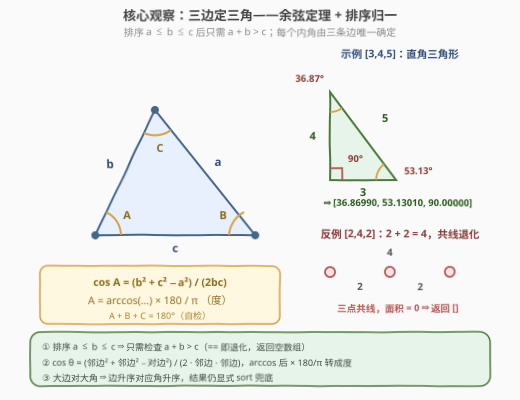
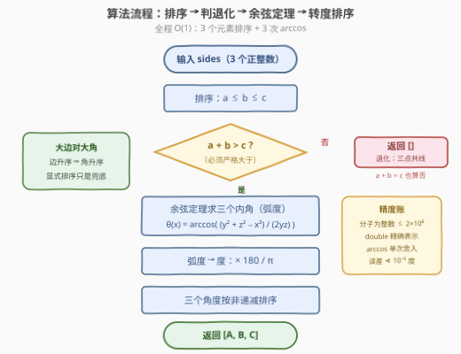

# 三角形的内角度数

- **题目名称**：三角形的内角度数
- **链接**：[3899. Angles of a Triangle](https://leetcode.cn/problems/angles-of-a-triangle/)
- **难度**：中等
- **标签**：几何、数组、数学

## 1. 题目概述

给你一个长度为 3 的正整数数组 `sides`。判断是否能够以 `sides` 中的三个元素作为边长，构成一个**面积为正**的三角形。

- 如果可以构成，返回一个包含 3 个浮点数的数组，表示该三角形的三个**内角**（单位为**度**），并按**非递减顺序**排序；
- 否则，返回一个空数组。

与真实答案的误差在 $10^{-5}$ 以内的结果都将被视为正确。

**示例 1**：

```text
输入：sides = [3,4,5]
输出：[36.86990,53.13010,90.00000]
解释：边长为 3、4、5 时可以构成一个直角三角形，
     三个内角分别约为 36.869897646°、53.130102354° 和 90°。
```

**示例 2**：

```text
输入：sides = [2,4,2]
输出：[]
解释：边长为 2、4、2 时无法构成一个面积为正的三角形。
```

**约束条件**：

- `sides.length == 3`
- $1 \le \text{sides}[i] \le 1000$

> 💡 **审题关键**：「面积为正」意味着三角形不等式必须**严格**成立——$a + b = c$ 时三边共线、面积为 $0$，要返回空数组（示例 2 正是 $2 + 2 = 4$）；另外返回的是**度**不是弧度，且三个角按非递减排序。

---

## 2. 解题思路

### 2.1 暴力思路：三条不等式全查 + 逐角套公式

$n$ 恒等于 3，没有任何复杂度可优化，暴力做法就是「照定义直译」：

1. 检查**全部三条**三角形不等式 $a+b > c$、$b+c > a$、$c+a > b$，任一不成立即返回 `[]`；
2. 对三个角分别套**余弦定理** $\cos\theta = \frac{y^2+z^2-x^2}{2yz}$（$x$ 为对边，$y$、$z$ 为邻边），`arccos` 求弧度再转成度；
3. 三个角度排序后返回。

这已经是 $O(1)$，但三条不等式是**冗余的**——排序后可以浓缩成一条；同时「逐角独立求值」还是「偷懒求两个角」也有精度上的讲究。下面逐一梳理。

### 2.2 核心观察：排序归一 + 余弦定理



**观察一（排序归一）。** 排序使得 $a \le b \le c$ 后，$b + c > a$ 与 $c + a > b$ **平凡成立**（$c \ge b$ 且 $a \ge 1$，故 $a + c \ge c + 1 > b$；$b + c \ge a + a > a$），三条不等式浓缩为一条：

$$a + b > c \iff \text{面积为正的三角形存在（严格不等，} a+b=c \text{ 即退化）}$$

**观察二（余弦定理，边定角）。** 三条边一旦确定，三个内角便唯一确定。对边为 $x$、邻边为 $y$、$z$ 的角：

$$\theta = \arccos\!\left(\frac{y^2 + z^2 - x^2}{2yz}\right) \times \frac{180}{\pi}$$

分子 $y^2+z^2-x^2$ 是不超过 $2 \times 10^6$ 的**整数**，在 `double` 中精确表示，除法只舍入一次，`arccos` 再舍入一次——误差远小于 $10^{-5}$ 度的容差。

**观察三（大边对大角）。** 非退化三角形中边与角的排序严格同向：$a \le b \le c \Rightarrow A \le B \le C$，所以边排序后角度**天然非递减**。但浮点计算不保证严格保序（等腰时两角理论上相等、舍入后可能差一个 ulp），最终仍**显式 `sort` 兜底**。

> 💡 **一句话总结**：排序后一条不等式 $a + b > c$ 判合法性，三次余弦定理 `arccos((邻边²+邻边²−对边²)/(2·邻边·邻边)) × 180/π` 独立求出三个角，再排序返回——注意 $a+b=c$ 是退化要返回空数组。

### 2.3 算法流程图



| 步骤 | 操作 | 说明 |
|------|------|------|
| ① | 排序得 $a \le b \le c$ | 3 个元素，常数时间 |
| ② | 判断 $a + b > c$ | **严格**大于；$a+b=c$ 走退化分支返回 `[]` |
| ③ | 余弦定理求三个角 | 每个角独立计算（弧度） |
| ④ | 弧度转度 × $180/\pi$ | `arccos` 返回弧度，别忘了转换 |
| ⑤ | 非递减排序后返回 | 大边对大角，理论上已有序，`sort` 兜底 |

### 2.4 示例演算

以 `sides = [3,4,5]` 为例（排序后 $a=3, b=4, c=5$），先验 $3 + 4 = 7 > 5$ ✓，再逐角套余弦定理：

| 对边 $x$ | 邻边 $y, z$ | $\cos\theta = \frac{y^2+z^2-x^2}{2yz}$ | $\theta$（度） |
|----------|-------------|----------------------------------------|----------------|
| 3 | 4, 5 | $\frac{16+25-9}{40} = 0.8$ | $36.86990$ |
| 4 | 3, 5 | $\frac{9+25-16}{30} = 0.6$ | $53.13010$ |
| 5 | 3, 4 | $\frac{9+16-25}{24} = 0$ | $90.00000$ |

三角和 $= 180^\circ$ ✓，返回 `[36.86990, 53.13010, 90.00000]`。

反例 `sides = [2,4,2]`：排序得 $a=2, b=2, c=4$，$a + b = 4 \le c$，三顶点共线、面积为 $0$，直接返回 `[]`。

---

## 3. 参考代码

### C++

```cpp
class Solution {
  public:
    vector<double> internalAngles(vector<int>& sides) {
        sort(sides.begin(), sides.end());
        double a = sides[0], b = sides[1], c = sides[2];
        if (a + b <= c) return {};                          // 退化：a+b==c 面积为 0
        const double PI = acos(-1.0);
        auto opposite = [&](double x, double y, double z) { // 边 x 的对角（度）
            return acos((y * y + z * z - x * x) / (2 * y * z)) * 180.0 / PI;
        };
        vector<double> res{opposite(a, b, c), opposite(b, a, c), opposite(c, a, b)};
        sort(res.begin(), res.end());                       // 大边对大角，排序兜底
        return res;
    }
};
```

> 💡 **写法要点**：
> - 判退化用 `a + b <= c`（**含等号**）：$a+b=c$ 时三点共线，不满足「面积为正」；
> - `M_PI` 不是标准 C++（属 POSIX 扩展），用 `acos(-1.0)` 自己定义 $\pi$ 最可移植；
> - 三个角**独立**计算，不要算两个、第三个用 $180 - A - B$ 顶替（误差会全部累积到第三个角上）。

### Python

```python
import math

class Solution:
    def internalAngles(self, sides: list[int]) -> list[float]:
        a, b, c = sorted(sides)
        if a + b <= c:
            return []
        def opposite(x, y, z):
            return math.degrees(math.acos((y * y + z * z - x * x) / (2 * y * z)))
        return sorted([opposite(a, b, c), opposite(b, a, c), opposite(c, a, b)])
```

> 💡 **写法要点**：
> - `math.degrees` 一步完成 弧度 → 度，比手写 `* 180 / math.pi` 更不易错；
> - `sorted(sides)` 返回新列表，不改动入参；`a, b, c = sorted(sides)` 是三元素解包的惯用写法；
> - 两个整数相除 `/` 在 Python 3 里天然得 `float`，无需显式转换。

---

## 4. 复杂度分析

| 维度 | 复杂度 | 说明 |
|------|--------|------|
| 时间 | $O(1)$ | 排序固定 3 个元素 + 3 次 `arccos`，均为常数操作 |
| 空间 | $O(1)$ | 只用常数个变量（返回数组长度恒为 3 或 0） |
| 精度 | $\ll 10^{-5}$ 度 | 分子为 $\le 2\times10^6$ 的精确整数，除法与 `arccos` 各舍入一次，误差约 $10^{-12}$ 度量级 |

---

## 5. 扩展：更稳的 `atan2` 求角与海伦公式

`arccos` 的数值条件数在 $\cos\theta \to \pm 1$（$\theta \to 0^\circ$ 或 $180^\circ$）时恶化——「细针形」三角形的最小角会被放大误差。本题边长为整数且容差 $10^{-5}$ 度，`arccos` 绰绰有余；但若写通用几何库（浮点输入、更严容差），更稳的做法是**同时利用 $\sin$ 与 $\cos$ 定角**：

$$\theta_{\text{对边 } x} = \operatorname{atan2}\!\left(4K,\; y^2 + z^2 - x^2\right)$$

其中 $K$ 为三角形面积（两参数同乘 $2yz > 0$ 不改变 `atan2` 结果，且 $\sin\theta = \frac{2K}{yz}$、$\cos\theta = \frac{y^2+z^2-x^2}{2yz}$）。面积 $K$ 可由海伦公式 $K = \sqrt{s(s-a)(s-b)(s-c)}$（$s = \frac{a+b+c}{2}$）求得；海伦公式本身在细针形下也有消去损失，Kahan 给出了更稳的排序变形 $\frac{1}{4}\sqrt{(a+(b+c))(c-(a-b))(c+(a-b))(a+(b-c))}$（要求 $a \ge b \ge c$）。

验证：$[3,4,5]$ 中 $K = 6$，对边为 5 的角 $= \operatorname{atan2}(24, 0) = 90^\circ$ ✓；对边为 3 的角 $= \operatorname{atan2}(24, 32) = 36.8699^\circ$ ✓。

---

## 6. 面试要点

**Q1：为什么排序后只需检查 $a + b > c$ 一条不等式？**

> 排序后 $a \le b \le c$：$a + c \ge c + 1 > b$ 与 $b + c \ge a + 1 > a$ 平凡成立，永远无需检查；唯一可能失败的是两短边之和 vs 最长边。这也是 976 题（最大周长三角形）贪心从大到小枚举的理论基础。

**Q2：$a + b = c$ 时返回什么？为什么？**

> 返回空数组。此时三点共线、面积为 $0$，不满足「面积为正」。这是本题最阴的边界：写成 `a + b < c` 判非法会把退化三角形误判为合法（示例 2 的 $2+2=4$ 正好卡住它），必须用 `a + b <= c`。

**Q3：能否只算两个角、第三个用 $180 - A - B$？**

> 数学上等价，但不推荐：$A$、$B$ 各自的舍入误差会**全部累积**到第三个角上，还可能出现 $C > 180^\circ$ 或 $C < 0$ 的脏值边界。三个角独立计算各担各的误差，反正代价只是多一次 `arccos`。

**Q4：`arccos` 有什么精度隐患？何时需要换 `atan2`？**

> $\cos\theta \to \pm 1$ 时 `arccos` 曲线极平，同样的输入误差会被放大成更大的角度误差（典型场景：细针形三角形的最小角）。本题整数边 ≤ 1000、容差 $10^{-5}$ 度，误差约 $10^{-12}$ 度，完全无碍；通用几何库建议用 $\operatorname{atan2}(4K, y^2+z^2-x^2)$（见第 5 节）。

**Q5：弧度和度怎么转换最容易写错？**

> `arccos`/`acos` 返回**弧度**，忘记乘 $180/\pi$ 是最常见错误（结果会小约 57 倍）。Python 用 `math.degrees` 一步到位；C++ 注意 `M_PI` 非 standard，用 `acos(-1.0)` 自定义。另注意题目容差是**度**上的 $10^{-5}$，精度预算要按度估算。

> 💡 **一句话总结**：排序 → 严格判 $a+b>c$ → 三次余弦定理独立求角 → 弧度转度 → 排序返回；边界在「$a+b=c$ 退化」与「弧度/度转换」，精度在 `arccos` 的条件数。

---

## 7. 同类练习题

- [976. 三角形的最大周长](https://leetcode.cn/problems/largest-perimeter-triangle/)：排序后从大到小找第一组 $a+b>c$，同款「排序浓缩三角形不等式」
- [812. 最大三角形面积](https://leetcode.cn/problems/largest-triangle-area/)：枚举点对 + 叉积/海伦公式求面积，平面几何计算基本功
- [1037. 有效的回旋镖](https://leetcode.cn/problems/valid-boomerang/)：判断三点是否共线，本质就是「退化三角形」判定
- [149. 直线上最多的点数](https://leetcode.cn/problems/max-points-on-a-line/)：共线判定的计数版，斜率/叉积的精度处理值得一练
- [587. 安装栅栏](https://leetcode.cn/problems/erect-the-fence/)：凸包（Andrew 单调链），几何进阶综合题
