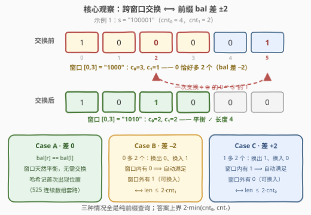
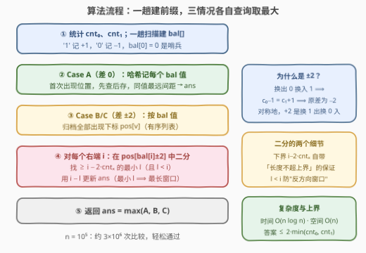

# LeetCode 一次交换后的最长平衡子串 题解

## 1. 题目概述

- **标题 / 题号**：一次交换后的最长平衡子串（#3900，medium）
- **链接**：https://leetcode.cn/problems/longest-balanced-substring-after-one-swap/
- **难度**：中等
- **标签**：哈希表、字符串、前缀和

**题意**：给你一个仅由字符 `'0'` 和 `'1'` 组成的二进制字符串 $s$。如果一个字符串中 $0$ 和 $1$ 的数量**相等**，则称其为**平衡**字符串。你最多可以让 $s$ 中任意两个字符进行**一次**交换，之后从 $s$ 中选出一个**平衡**子串，返回其最大长度。

**示例 1**：

```text
输入：s = "100001"
输出：4
解释：交换 "10[0]00[1]" 中标出的两个字符，字符串变为 "101000"，
      选择子串 "1010"，其中包含两个 '0' 和两个 '1'，是平衡的。
```

**示例 2**：

```text
输入：s = "111"
输出：0
解释：可以选择不进行任何交换，选择空子串——空子串也是平衡的。
```

**约束**：

- $1 \le s.length \le 10^5$
- $s$ 仅由字符 `'0'` 和 `'1'` 组成

> 💡 **审题关键**：① 交换是**可选**的（「最多一次」），且交换的是**任意两个位置**——这与「翻转某一位」有本质区别，位置可以离窗口任意远；② 空子串合法，答案下界为 $0$；③ 操作顺序是「先交换、后选子串」，但最优交换必然服务于所选窗口（见 2.2 的分类论证）。

## 2. 解题思路

### 2.1 暴力思路

枚举每一对交换位置（$O(n^2)$ 种，同字符交换无意义可略过一部分），交换后再枚举所有子串并数 $0/1$ 个数（$O(n^2)$），总代价 $O(n^4)$；即便用前缀和把判定降到 $O(1)$，也有 $O(n^2)$ 种交换对 × $O(n^2)$ 个窗口，$n = 10^5$ 下必然超时。必须先想清楚「一次交换到底能对窗口做什么」。

### 2.2 核心观察：一次交换 ⟺ 前缀差多 2，跨窗口换一个字符



把 $1$ 记为 $+1$、$0$ 记为 $-1$，定义前缀平衡度 $bal[i] = (\text{前 } i \text{ 个字符中 } 1 \text{ 的个数}) - (\text{0 的个数})$。子串 $[l, r]$ 中 $c_1 - c_0 = bal[r+1] - bal[l]$，于是「平衡」$\iff$ 两端 $bal$ 值相等——这正是经典题 525「连续数组」的套路。

**一次交换的完备分类**：设交换的位置是 $i, j$，所选窗口为 $W$，只有三种可能：

1. $i, j$ **都在 $W$ 内**或**都在 $W$ 外**：窗口内字符多重集不变，$W$ 平衡与否与交换无关 → 归结为**差 $0$**（Case A）；
2. **一内一外但两字符相同**：换完等于没换 → 仍是 Case A；
3. **一内一外且字符不同**：设窗口内是 $0$、窗口外是 $1$（换出 $0$、换入 $1$），窗口内 $c_0$ 减 $1$、$c_1$ 加 $1$。要使换后平衡需 $c_0 - 1 = c_1 + 1$，即 $c_0 = c_1 + 2$，对应 $bal$ 差为 $-2$（Case B）；对称地，换出 $1$ 换入 $0$ 需要 $c_1 = c_0 + 2$，即 $bal$ 差为 $+2$（Case C）。

三个关键化简，把所有位置条件统统消掉：

- **Case B 中「窗口内有 $0$ 可换出」自动满足**：$c_0 = c_1 + 2 \ge 2$；
- **Case B 中「窗口外有 $1$ 可换入」与长度上界等价**：窗口外有 $1 \iff c_1 < cnt_1$（全串 $1$ 的总数），而窗口长 $\text{len} = 2c_1 + 2$，故条件恰好等价于 $\text{len} \le 2 \cdot cnt_1$；
- **Case C 对称**：「窗口外有 $0$」$\iff \text{len} \le 2 \cdot cnt_0$。

> 💡 **一句话**：一次跨窗口交换只有「换出 $0$ 换入 $1$」和「换出 $1$ 换入 $0$」两种有效姿势，分别把窗口的 $bal$ 差从 $\mp 2$ 修成 $0$；可行性条件与位置无关，只与**长度上界** $2 \cdot cnt_0$ / $2 \cdot cnt_1$ 有关——这正是答案上界 $2\min(cnt_0, cnt_1)$ 的来源。

于是问题变成纯前缀和查询：对每个右端点 $i$（前缀下标），找最左的 $l$ 使 $bal[l] = bal[i]$（Case A）、$bal[l] = bal[i] + 2$ 且 $i - l \le 2 \cdot cnt_1$（Case B）、$bal[l] = bal[i] - 2$ 且 $i - l \le 2 \cdot cnt_0$（Case C）。

### 2.3 算法流程图



| 步骤 | 操作 | 说明 |
|------|------|------|
| ① 统计与建前缀 | 数出 $cnt_0, cnt_1$；扫一遍建 $bal[0..n]$（'1'→+1，'0'→−1） | $bal[0] = 0$ 是哨兵，允许窗口从下标 $0$ 开始 |
| ② Case A | 哈希表记每个 $bal$ 值**首次**出现位置；再扫一遍，同值间距即候选答案 | 经典「连续数组」模板，注意**先查再存**保证取到最左端 |
| ③ 建位置表 | 把每个 $bal$ 值的**所有**出现下标按序放入 $pos[v]$ | 供 Case B/C 二分 |
| ④ Case B/C | 对每个 $i$：在 $pos[bal[i]+2]$ 与 $pos[bal[i]-2]$ 中二分找 **$\ge i - 2 \cdot cnt_x$ 的最小下标** $l$（且 $l < i$），用 $i - l$ 更新答案 | 下界 $i - 2 \cdot cnt_x$ 保证长度不超上界；取最小 $l$ 即最长窗口 |
| ⑤ 汇总 | 返回三种情况的最大值 | 每种情况独立正确，取 max 即整体最优 |

### 2.4 示例演算

以示例 1 `s = "100001"`（$cnt_1 = 2$，$cnt_0 = 4$，上界 $2\min = 4$）为例，$bal$ 序列如下：

| $i$ | 0 | 1 | 2 | 3 | 4 | 5 | 6 |
|-----|---|---|---|---|---|---|---|
| $s[i-1]$ | — | 1 | 0 | 0 | 0 | 0 | 1 |
| $bal[i]$ | 0 | 1 | 0 | −1 | −2 | −3 | −2 |

- **Case A**：$bal = 0$ 出现于下标 $\{0, 2\}$，间距 $2$；$bal = -2$ 出现于 $\{4, 6\}$，间距 $2$ → 候选 $2$；
- **Case B**（差 $-2$，查 $bal[l] = bal[i] + 2$，长度 $\le 2 \cdot cnt_1 = 4$）：$i = 6$ 时目标值 $0$，出现下标 $\{0, 2\}$，$i - 4 = 2$，二分得最小合法 $l = 2$，长度 $6 - 2 = \mathbf{4}$ ✓ —— 对应窗口 $[2, 5]$ 即 `"0001"`：$c_0 = 3, c_1 = 1$（$0$ 恰好多 $2$ 个），窗口外 $s[0]$ 处有 $1$，换出窗口内一个 $0$、换入 $s[0]$ 的 $1$，窗口变平衡。等价地，官方解释交换下标 $2$ 与 $5$ 后取前缀 `"1010"`，两种视角殊途同归；
- **Case C**（差 $+2$）：串中 $bal$ 单调走低后再回升，无满足条件者。

三种情况取最大，答案 $4$。

## 3. 参考代码

### C++

```cpp
class Solution {
public:
    int longestBalancedSubstring(string s) {
        int n = s.size();
        int cnt1 = count(s.begin(), s.end(), '1');
        int cnt0 = n - cnt1;

        // bal[i]：前 i 个字符中 (1 的个数 − 0 的个数)
        vector<int> bal(n + 1, 0);
        for (int i = 0; i < n; ++i)
            bal[i + 1] = bal[i] + (s[i] == '1' ? 1 : -1);

        int ans = 0;

        // Case A：bal 差为 0，窗口天然平衡，无需交换
        unordered_map<int, int> first;
        for (int i = 0; i <= n; ++i) {
            auto it = first.find(bal[i]);
            if (it != first.end()) ans = max(ans, i - it->second);
            else first[bal[i]] = i;            // 只记首次出现，间距才能最大
        }

        // Case B/C：bal 差为 ±2，靠一次跨窗口交换修复
        unordered_map<int, vector<int>> pos;
        for (int i = 0; i <= n; ++i) pos[bal[i]].push_back(i);
        for (int i = 0; i <= n; ++i) {
            int targets[2] = {bal[i] + 2, bal[i] - 2};
            int limits[2]   = {2 * cnt1,  2 * cnt0};  // 差−2需窗口外有1；差+2需窗口外有0
            for (int k = 0; k < 2; ++k) {
                auto it = pos.find(targets[k]);
                if (it == pos.end()) continue;
                const vector<int>& v = it->second;
                // 最小 l ≥ i − limit（保证长度不超上界），且 l < i
                auto lb = lower_bound(v.begin(), v.end(), i - limits[k]);
                if (lb != v.end() && *lb < i) ans = max(ans, i - *lb);
            }
        }
        return ans;
    }
};
```

### Python

```python
from collections import defaultdict
from bisect import bisect_left

class Solution:
    def longestBalancedSubstring(self, s: str) -> int:
        n = len(s)
        cnt1 = s.count('1')
        cnt0 = n - cnt1

        bal = [0] * (n + 1)
        for i, ch in enumerate(s):
            bal[i + 1] = bal[i] + (1 if ch == '1' else -1)

        ans = 0

        # Case A：bal 差为 0，天然平衡
        first = {}
        for i, b in enumerate(bal):
            if b in first:
                ans = max(ans, i - first[b])
            else:
                first[b] = i

        # Case B/C：bal 差为 ±2，一次跨窗口交换修复
        pos = defaultdict(list)
        for i, b in enumerate(bal):
            pos[b].append(i)
        for i, b in enumerate(bal):
            # (目标 bal 值, 长度上界)：差 −2 需窗口外有 1，差 +2 需窗口外有 0
            for target, limit in ((b + 2, 2 * cnt1), (b - 2, 2 * cnt0)):
                v = pos.get(target)
                if not v:
                    continue
                lo = bisect_left(v, i - limit)     # 最小 l ≥ i − limit
                if lo < len(v) and v[lo] < i:
                    ans = max(ans, i - v[lo])
        return ans
```

> 💡 **写法要点**：① Case A 必须**先查后存**——把当前下标塞进表里再去查，会把长度为 $0$ 的窗口算进去（虽然不致出错但白做功），先查保证配到的是**最左**同值下标；② Case B/C 的二分下界是 $i - limit$ 而非 $0$：找到的最小 $l$ 自带「长度 $\le limit$」保证，无需查完再校验；③ `*lb < i` 不可省——$bal$ 值差 $2$ 的下标可能出现在 $i$ 右侧（反方向窗口），此时无窗口可言；④ 用 `pos.get` / `find` 预判存在性，避免 `defaultdict` 在查询时凭空建表膨胀内存。

## 4. 复杂度分析

| 维度 | 复杂度 | 说明 |
|------|--------|------|
| **时间** | $O(n \log n)$ | 建前缀 $O(n)$；Case A 一趟哈希 $O(n)$；Case B/C 每个下标两次二分 $O(\log n)$；$n = 10^5$ 时约 $3.4 \times 10^6$ 次比较，轻松通过 |
| **空间** | $O(n)$ | $bal$ 数组与位置表 $pos$ 共存 $2n + n$ 级条目；哈希表可用 `bal` 值域 $[-n, n]$ 压成数组进一步提速 |
| **量级判断** | $n \le 10^5$ | 暴力 $O(n^2) \approx 10^{10}$ 必超时；本题每个字符至少读一次，$O(n)$ 是下界，$O(n \log n)$ 已足够接近 |

## 5. 扩展：O(n) 归并指针与「k 次交换」的推广

- **去掉二分**：Case B/C 的查询呈单调性——$i$ 从左到右递增时，二分下界 $i - 2 \cdot cnt_x$ 也单调不减。于是按 $bal$ 值分组后，对值 $v$ 与值 $v \pm 2$ 的两个有序下标列表做**归并式双指针**：外层走 $v$ 的列表，内层指针在 $v \pm 2$ 的列表上只前进不回退，总移动量 $O(n)$，整体退化为严格线性。工程上二分版更短更稳，$n = 10^5$ 时两者实测差距可忽略；
- **推广到 $k$ 次交换**：差值条件从 $\{0, \pm 2\}$ 推广为 $\{-2k, \dots, 0, \dots, +2k\}$ 共 $2k+1$ 个目标值，每个目标值 $d$ 的长度上界为 $\min$ 形式的「窗口外还有 $\lvert d \rvert / 2$ 个可换字符」。但「$k$ 次交换」可以两两都在窗口同侧、甚至互相抵消，分类讨论急剧膨胀——更稳的推广框架是**至多 $k$ 个错误字符的最长窗口**（本题即 $k = 1$ 的换字符版），用滑动窗口 + 双指针维护窗口内错误字符个数；
- **为什么不能直接滑动窗口**：平衡窗口的判定条件（$bal$ 两端相等）不是「窗口扩张单调、收缩反向单调」的形式——扩张一步 $bal$ 差变化 $\pm 1$，越过 $0$ 后窗口不会自动变不合法（差 $+2$ 的窗口换一下又合法了），单调性断裂，滑窗失效，这正是本题比 525 多出来的那一层。

## 6. 面试要点

**Q1：为什么只考虑「跨窗口交换」？窗口内自己换自己不行吗？**

> 不行也不必。交换两个都在窗口内的字符，窗口的字符多重集不变，$c_0, c_1$ 原地踏步，平衡性不改变；两个都在窗口外同理与窗口无关。所以有效交换**必然一内一外**，且两字符不同时才有意义——这把 $O(n^2)$ 种交换对压缩成对窗口多重集的一次 $\pm 1$ 修正，是本题复杂度从平方降到线性对数的全部来源。

**Q2：「窗口外有 1 可换入」为什么等价于 $\text{len} \le 2 \cdot cnt_1$？**

> Case B 中窗口内 $c_0 = c_1 + 2$，长度 $\text{len} = 2c_1 + 2$。「窗口外有 1」即 $cnt_1 - c_1 \ge 1$，等价于 $c_1 \le cnt_1 - 1$，代入长度得 $\text{len} \le 2 \cdot cnt_1$。这个转化的价值在于把「依赖窗口具体内容的条件」变成「纯长度上界」，从而二分下界 $i - 2 \cdot cnt_1$ 一写就灵，不需要对每个候选窗口回头数字符。

**Q3：Case A 的哈希为什么只记「首次出现」？Case B/C 为什么反而要记「所有出现」？**

> Case A 没有长度限制，同值下标离得越远越好，首次出现即最左端点，一趟扫完。Case B/C 带长度上界：最左的 $l$ 可能太远（长度超限），需要在同值下标列表中找「不早于 $i - 2 \cdot cnt_x$ 的最左者」——这是一次下界查询，必须保留全部下标做二分。两个需求不同，表结构也不同。

**Q4：答案上界 $2 \min(cnt_0, cnt_1)$ 什么时候取不到？**

> 平衡窗口一半是 $0$ 一半是 $1$，长度自然不超过少数派的两倍。取不到的典型情形：字符分布太散，任何 $bal$ 差为 $\{0, \pm 2\}$ 的两端点都离得不够远。如 `"0101010"`（$cnt_1 = 3, cnt_0 = 4$，上界 $6$），$bal$ 序列 $0, -1, 0, -1, 0, -1, 0, -1$，Case A 最远间距 $2$，Case B 中长度 $\le 6$ 的差 $-2$ 对不存在——$bal[l] = bal[i] + 2$ 无解，答案只有 $2$。

**Q5：如果题目改成「必须恰好执行一次交换」呢？**

> 只需剔除 Case A 中「不依赖交换」的窗口：恰好一次交换时，差 $0$ 窗口若要靠交换保持平衡，交换必须完全发生在窗口同侧（同内或同外）且不破坏多重集——即要求串中存在一对可交换的位置（同字符任意距离，或不同字符但都落在窗口同侧）。讨论会琐碎很多，工程做法是分别算「不交换答案」与「跨窗口交换答案」，再按约束取交或并——本题「最多一次」的宽松设定恰好让三种情况直接取 max 即可。

> 💡 **一句话总结**：$bal$ 前缀把「平衡」变「同值」，一次交换把「同值」放宽到「差 $\pm 2$」，而交换可行性被长度上界 $2 \cdot cnt_0 / 2 \cdot cnt_1$ 一笔带过——三张哈希表加两次二分，就是本题的全部。

## 同类练习题

| # | 题目 | 与本题的关联 |
|---|------|-------------|
| 525 | [连续数组](https://leetcode.cn/problems/contiguous-array/)（[题解](../0501-0600/525_连续数组.md)） | 本题 Case A 的母题——$0$ 当 $-1$ 转换 + 哈希存最早下标 |
| 2609 | [最长平衡子字符串](https://leetcode.cn/problems/find-the-longest-balanced-substring-of-a-binary-string/)（[题解](../2601-2700/2609_最长平衡子字符串.md)） | 不允许交换的版本，且子串要求形如 `0...01...1`，定长枚举即可 |
| 560 | [和为 K 的子数组](https://leetcode.cn/problems/subarray-sum-equals-k/)（[题解](../0501-0600/560_和为K的子数组.md)） | 前缀和 + 哈希计数的最经典载体，理解「为什么不能滑窗要哈希」 |
| 974 | [和可被 K 整除的子数组](https://leetcode.cn/problems/subarray-sums-divisible-by-k/)（[题解](../0901-1000/974_和可被K整除的子数组.md)） | 前缀和按同余类归档，与本题「按 $bal$ 值归档位置表」同构 |
