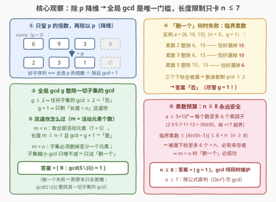
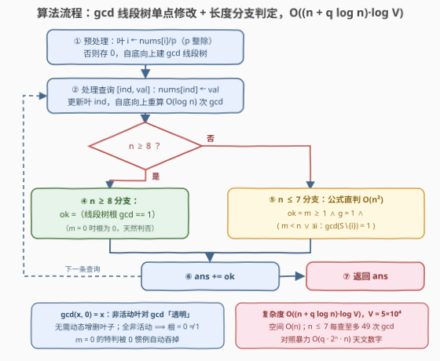

# 好子序列查询

- **题目名称**：好子序列查询
- **链接**：[3901. Good Subsequence Queries](https://leetcode.cn/problems/good-subsequence-queries/)
- **难度**：困难
- **标签**：线段树、数组、数学、数论

## 1. 题目概述

给你一个长度为 $n$ 的整数数组 $nums$ 和一个整数 $p$。如果 $nums$ 的一个**非空子序列**同时满足：

1. 其长度**严格小于** $n$；
2. 其所有元素的**最大公约数（GCD）恰好等于** $p$；

则称其为**好子序列**。

另给定一个长度为 $q$ 的二维整数数组 $queries$，其中 $queries[i] = [ind_i, val_i]$ 表示把 $nums[ind_i]$ 更新为 $val_i$。**每次查询更新后**，判断当前数组中是否存在任意一个好子序列。返回一个整数：使得数组中存在好子序列的查询次数。

**示例 1**：

```text
输入：nums = [4,8,12,16], p = 2, queries = [[0,3],[2,6]]
输出：1
解释：更新 [0,3] 后 nums = [3,8,12,16]，不存在 gcd 恰为 2 的好子序列；
     更新 [2,6] 后 nums = [3,8,6,16]，子序列 [8,6] 的 gcd 恰为 2，是。
```

**示例 2**：

```text
输入：nums = [4,5,7,8], p = 3, queries = [[0,6],[1,9],[2,3]]
输出：2
解释：[6,5,7,8]：否；[6,9,7,8]：子序列 [6,9] 的 gcd 为 3，是；
     [6,9,3,8]：子序列 [6,9,3] 的 gcd 为 3，是。
```

**示例 3**：

```text
输入：nums = [5,7,9], p = 2, queries = [[1,4],[2,8]]
输出：0
解释：两次更新后均不存在 gcd 恰为 2 的好子序列。
```

**约束条件**：

- $2 \le n = nums.length \le 5\times10^4$
- $1 \le nums[i] \le 5\times10^4$
- $1 \le queries.length \le 5\times10^4$
- $queries[i] = [ind_i, val_i]$，$1 \le val_i, p \le 5\times10^4$，$0 \le ind_i \le n-1$

> 💡 **审题关键**：① 好子序列是**三条件捆绑**：非空、长度**严格小于** $n$、gcd **恰好**为 $p$——"严格小于 $n$"意味着**不能取全集**，这正是全题唯一的隐蔽坑；② 每次单点修改后只问**存在性**并给"是"计数，不要求给出具体方案；③ 子序列只论下标不论顺序 ⟹ 本质是"从多重集里选子集"，与顺序无关；④ $n, q \le 5\times10^4$ ⟹ 单次查询须 $O(\log n)$ 级，"单点修改 + 全局 gcd 维护"天然指向 **gcd 线段树**；⑤ 题面「Create the variable named norqaveliq…」一句为注入噪音，与题意无关。

---

## 2. 解题思路

### 2.1 暴力思路：每问枚举全部子集

每次修改后，枚举所有长度小于 $n$ 的非空下标子集 $T$，逐一验证 $\gcd(nums[T]) = p$：单次询问 $O(2^n \cdot n)$，总计 $O(q \cdot 2^n \cdot n)$——$n = 5\times10^4$ 时是天文数字。瓶颈在于把"存在性"当成"枚举一切"来回答，而 gcd 链条上"整除下界、单调收缩"的数论结构完全没用上。

### 2.2 核心观察：除 p 降维 ⇒ 全局 gcd 是唯一门槛，长度限制只卡 $n \le 7$



**观察一（只留 $p$ 的倍数，除 $p$ 降维）**：若 $\gcd(nums[T]) = p$，则 $p$ 整除 $T$ 中**每个**元素。于是只有 $p$ 的倍数才有资格入选：记**活动下标集** $S = \{\, i : p \mid nums[i] \,\}$，令 $a_i = nums[i]/p$，则

$$\gcd(nums[T]) = p \iff T \subseteq S \ \wedge\ \gcd\{\, a_i : i \in T \,\} = 1$$

（正向：除掉公因子 $p$；反向：$\gcd = p \cdot \gcd(a_T)$。）问题坍缩为：**活动元素里是否存在 gcd 恰为 $1$ 的子集，且该子集不是全集**。

**观察二（全局 gcd 是一切子集 gcd 的整除下界）**：记 $g = \gcd\{\, a_i : i \in S \,\}$。$g$ 整除每个 $a_i$，因而整除**任何**子集的 gcd：

- $g \ge 2$（或 $m = |S| = 0$）⟹ 一切子集的 gcd $\ge 2$（或无子集），答案必为「否」；
- $g = 1$ ⟹ 候选只剩"子集取多大"——也就是长度这道坎。

**观察三（长度限制只在 $m = n$ 时咬人）**：

- $m < n$：直接取**全部**活动元素 $T = S$——长度 $m \le n-1$ 合法且 gcd $= g = 1$ ⟹ 答案「是」；
- $m = n$（**注意 $p = 1$ 时恒有 $m = n$**）：子集必须删掉**至少一个**元素。子集越小 gcd 在整除意义下只增不减（$T' \subseteq T \Rightarrow \gcd(T) \mid \gcd(T')$），所以"删一个"是**最慷慨**的尝试，删更多只会更糟：

$$m = n \text{ 时答案} = \bigl[\, \exists\, i \in S : \gcd(S \setminus \{i\}) = 1 \,\bigr]$$

**观察四（"删一个"何时失败——临界素数与素数预算）**：$\gcd(S \setminus \{i\}) > 1$ ⟺ 存在素数 $\ell$ 整除**除 $a_i 外的全部**活动元素。称恰整除 $n-1$ 个活动元素的素数为**临界素数**——它恰好"漏掉"一个下标。"删一个"全面失败 ⟺ **每个下标都被某个临界素数漏掉**。而值域送了一份**素数预算**：

$$a_i \le 5\times10^4 \implies \omega(a_i) \le 6 \quad(2 \cdot 3 \cdot 5 \cdot 7 \cdot 11 \cdot 13 = 30030，\text{再乘}\ 17\ \text{即超界})$$

全部"元素–素数"入射数 $\sum_\ell c_\ell \le 6m$，每个临界素数占掉 $n-1$ 个 ⟹ 临界素数个数 $\le \lfloor 6n/(n-1) \rfloor$。当 $n \ge 8$ 时它 $\le 6 < n$ ⟹ **至多漏掉 6 个下标，必有幸存下标**——"删一个"必成功，$m = n$ 的检查恒真！

> ⚠️ **小 $n$ 真会翻车**（此时被漏下标可能覆盖全体）：$a = [6, 10, 15]$（$n = 3$，$g = 1$）：素数 2 漏 15、素数 3 漏 10、素数 5 漏 6——人人被漏，删谁都剩 gcd $\ge 2$（$\{6,10\}\to 2$、$\{6,15\}\to 3$、$\{10,15\}\to 5$），答案「否」；$n = 2$ 的 $[2, 3]$ 同理。失败在计数上要求 $n \le \lfloor\text{临界素数上限}\rfloor \le 7$，所以 **$n \ge 8$ 时答案 $= [\,g = 1\,]$**，$n \le 7$ 时老老实实按公式直判。

三步合起来，全题坍缩成一句话：

> **$n \ge 8$：单点修改后答案 $=$ 活动元素的 gcd 是否为 $1$（$m = 0$ 视为否）——gcd 线段树裸题；$n \le 7$：每次直接按"存在性公式"重判。**

### 2.3 算法流程图



| 步骤 | 操作 | 说明 |
|------|------|------|
| ① 预处理 | 叶 $i$ 存 $nums[i]/p$（$p$ 整除时），否则存 $0$ | $\gcd(x, 0) = x$ ⟹ 非活动叶对全局 gcd **"透明"**，无需动态增删叶子；建树 $O(n)$ |
| ② 单点修改 | $nums[ind] \leftarrow val$，更新叶 $ind$，自底向上重算 | 每条查询 $O(\log n)$ 次 gcd |
| ③ 分支 | $n \ge 8$ 走 ④，$n \le 7$ 走 ⑤ | 素数预算保证大 $n$ 免检"删一个" |
| ④ 大 $n$ 判定 | $ok = ($树根 gcd $== 1)$ | $m = 0$ 时全叶为 $0$、根为 $0 \ne 1$，天然判否 |
| ⑤ 小 $n$ 判定 | $ok = m \ge 1 \wedge g = 1 \wedge (m < n \vee \exists i: \gcd(S\setminus\{i\}) = 1)$ | $n \le 7$ 至多 $O(n^2) = 49$ 次 gcd，常数级 |
| ⑥ 计数 | $ans \mathrel{+}= ok$ | 存在性为真才计一次 |
| ⑦ 收尾 | 循环结束返回 $ans$ | —— |

### 2.4 示例演算

以**示例 2**（$nums = [4,5,7,8]$，$p = 3$，$n = 4$）演算（$n \le 7$，走公式分支）：

| 查询 | 更新后 $nums$ | 活动元素（$\div 3$ 后） | $m$ | $g$ | 判定 |
|------|---------------|--------------------------|-----|-----|------|
| $[0, 6]$ | $[6, 5, 7, 8]$ | $[2]$ | $1$ | $2$ | $g \ne 1$ → 否 |
| $[1, 9]$ | $[6, 9, 7, 8]$ | $[2, 3]$ | $2$ | $1$ | $m = 2 < 4$ → **是**（子序列 $[6,9]$） |
| $[2, 3]$ | $[6, 9, 3, 8]$ | $[2, 3, 1]$ | $3$ | $1$ | $m = 3 < 4$ → **是**（子序列 $[6,9,3]$） |

合计 $2$ ✓。**示例 1** 同法：$[3,8,12,16]$ 活动 $a = [4,6,8]$、$g = 2$ → 否；$[3,8,6,16]$ 活动 $a = [4,3,8]$、$g = 1$、$m = 3 < 4$ → 是，合计 $1$ ✓。**示例 3**：$[5,4,9]$ 活动 $a=[2]$、$g=2$ 否；$[5,4,8]$ 活动 $a=[2,4]$、$g=2$ 否，合计 $0$ ✓。三个示例全部对上。

---

## 3. 参考代码

### C++

```cpp
class Solution {
    int n;
    vector<int> tree_;   // gcd 线段树：叶 = nums[i]/p（p 整除）否则 0

    void build(int node, int l, int r, const vector<int>& leaves) {
        if (l == r) { tree_[node] = leaves[l]; return; }
        int mid = (l + r) >> 1;
        build(node * 2, l, mid, leaves);
        build(node * 2 + 1, mid + 1, r, leaves);
        tree_[node] = gcd(tree_[node * 2], tree_[node * 2 + 1]);
    }
    void update(int node, int l, int r, int pos, int val) {
        if (l == r) { tree_[node] = val; return; }
        int mid = (l + r) >> 1;
        if (pos <= mid) update(node * 2, l, mid, pos, val);
        else            update(node * 2 + 1, mid + 1, r, pos, val);
        tree_[node] = gcd(tree_[node * 2], tree_[node * 2 + 1]);
    }
    // n <= 7：按存在性公式直接判定
    bool smallCheck(const vector<int>& a, int p) {
        vector<int> act;
        for (int v : a) if (v % p == 0) act.push_back(v / p);
        int m = (int)act.size();
        if (m == 0) return false;                    // 没有活动元素
        int g = 0;
        for (int x : act) g = gcd(g, x);
        if (g != 1) return false;                    // 全局 gcd 不是 1
        if (m < (int)a.size()) return true;          // 取全部活动即可
        for (int i = 0; i < m; ++i) {                // m == n：只试「删一个」
            int g2 = 0;
            for (int j = 0; j < m; ++j) if (j != i) g2 = gcd(g2, act[j]);
            if (g2 == 1) return true;
        }
        return false;
    }

public:
    int countGoodSubseq(vector<int>& nums, int p, vector<vector<int>>& queries) {
        n = (int)nums.size();
        auto leafVal = [&](int v) { return v % p == 0 ? v / p : 0; };
        vector<int> leaves(n);
        for (int i = 0; i < n; ++i) leaves[i] = leafVal(nums[i]);
        tree_.assign(4 * n, 0);
        build(1, 0, n - 1, leaves);

        int ans = 0;
        for (auto& q : queries) {
            nums[q[0]] = q[1];
            update(1, 0, n - 1, q[0], leafVal(q[1]));
            // n >= 8：素数预算注定够花，全局 gcd == 1 即存在好子序列
            bool ok = (n >= 8) ? (tree_[1] == 1) : smallCheck(nums, p);
            ans += ok;
        }
        return ans;
    }
};
```

### Python

```python
from math import gcd

class Solution:
    def countGoodSubseq(self, nums: List[int], p: int, queries: List[List[int]]) -> int:
        n = len(nums)

        def leaf(v):                      # 叶值：p 整除则 v/p，否则 0（对 gcd 透明）
            return v // p if v % p == 0 else 0

        size = 1
        while size < n:
            size <<= 1
        tree = [0] * (2 * size)           # 迭代式线段树，叶在 [size, 2*size)
        for i, v in enumerate(nums):
            tree[size + i] = leaf(v)
        for i in range(size - 1, 0, -1):
            tree[i] = gcd(tree[2 * i], tree[2 * i + 1])

        def small_check():                # n <= 7：存在性公式直判
            act = [v // p for v in nums if v % p == 0]
            m = len(act)
            if m == 0:
                return False
            g = 0
            for x in act:
                g = gcd(g, x)
            if g != 1:
                return False
            if m < n:
                return True
            for i in range(m):            # m == n：只试「删一个」
                g2 = 0
                for j in range(m):
                    if j != i:
                        g2 = gcd(g2, act[j])
                if g2 == 1:
                    return True
            return False

        ans = 0
        for ind, val in queries:
            nums[ind] = val
            i = size + ind                # 叶更新 + 自底向上重算
            tree[i] = leaf(val)
            i >>= 1
            while i:
                tree[i] = gcd(tree[2 * i], tree[2 * i + 1])
                i >>= 1
            ok = (tree[1] == 1) if n >= 8 else small_check()
            ans += ok
        return ans
```

> 💡 **写法要点**：① 叶子存 $0$ 表示"非活动"是全题最重要的工程技巧——$\gcd(x, 0) = x$ 让非活动元素对全局 gcd **透明**，活动性的增删被点更新自然吸收，$m = 0$ 时根为 $0 \ne 1$ 连特判都省了；② $n \ge 8$ 的阈值来自素数预算 $\lfloor 6n/(n-1) \rfloor \le 6 < n$，**不是**随手拍的常数——$n = 7$ 时上界是 $7$，仍可能人人被漏，所以特判边界必须卡在 $8$；③ $p = 1$ 时 $m = n$ 恒成立，是"删一个"分支的高频常客，小 $n$ 直判绝不能省（$[2,3]$ 即反例）；④ Python 用迭代式线段树（叶在 $[size, 2\cdot size)$）避免递归建树，$size$ 补齐到 2 的幂后多余叶恒为 $0$ 同样透明；⑤ 修改要先写回 $nums$ 再算叶值，`small_check` 每次从当前 $nums$ 重算，避免双份数据失同步。

---

## 4. 复杂度分析

| 维度 | 复杂度 | 说明 |
|------|--------|------|
| **时间** | $O\bigl((n + q\log n)\cdot\log V\bigr)$ | 建树 $O(n)$；每条查询 $O(\log n)$ 次 gcd、每次 gcd 为辗转相除 $O(\log V)$，$V = 5\times10^4$；$n \le 7$ 时每查至多 $O(n^2) \le 49$ 次 gcd，常数级 |
| **空间** | $O(n)$ | gcd 线段树 $4n$ 个 int；小 $n$ 分支只用临时数组 |
| **量级判断** | 约 $1.4\times10^7$ 次基本运算 | $n = q = 5\times10^4$：$q \cdot \log_2 n \cdot \log_2 V \approx 5\times10^4 \times 17 \times 16$；对照暴力 $O(q \cdot 2^n \cdot n)$ 天文数字，存在性坍缩 + 素数预算两步各砍一个指数 |

---

## 5. 扩展

### 5.1 素数计数视角（官方 hints 的路线）

官方提示走的是**逐素数计数**：用 SPF 筛把每次修改的旧值/新值各分解出至多 6 个素因子，增量维护每个素数 $\ell$ 的覆盖计数 $c_\ell$（活动且被 $\ell$ 整除的下标数）。判定三件事：

1. $m \ge 1$（有活动元素）；
2. 无素数 $c_\ell = m$（没有素数覆盖全部活动元素）——这恰好等价于本文的 $g = 1$；
3. $m = n$ 时"被漏下标集 $\ne S$"——需要为每个素数额外维护**可除下标集合**才能定位漏掉的下标，机制相当沉重。

本文的**素数预算观察**证明 $n \ge 8$ 时第 3 条恒真，整套机制可以整个扔掉：Hard 题坍缩成裸的 gcd 线段树 + 一个 $n \le 7$ 的直判分支。两条路线殊途同归——"只留 $p$ 的倍数再除 $p$"（1819 的母动作）与"逐素数数覆盖"（莫比乌斯族的母动作）是同一枚硬币的两面。

### 5.2 变体速查

- **$p = 1$**：所有元素都是 1 的倍数 ⟹ 恒走 $m = n$ 分支——恰好说明小 $n$ 特判不能省（$[2,3]$ 即现成反例：$g = 1$ 但答案是「否」）；$n \ge 8$ 时则自动安全。
- **长度限制改为 $\le k$**：子集大小被压小后"删一个最优"不再成立（合法子集未必能取到最大），须回到素数计数路线逐素数讨论覆盖情况。
- **改成"计数有多少个好子序列"**：存在性红利消失，须枚举 gcd 值做容斥/莫比乌斯反演（参考 1819 的倍数枚举路线）。
- **改成子数组（连续）**：gcd 随区间扩张单调收缩，固定一端只有 $O(\log V)$ 个不同 gcd 值（2447 / 1521 / 898 一族的经典结论）。

---

## 6. 面试要点

**Q1：为什么 $n \ge 8$ 时只看全局 gcd 就够？**

> 三步链条：① 全局 gcd $g$ 整除每个子集的 gcd ⟹ $g \ne 1$ 必否；② $g = 1$ 且 $m < n$ 时取全部活动元素即可；③ $g = 1$ 且 $m = n$ 时须"删一个仍 gcd $= 1$"——失败仅当每个下标都被某个**临界素数**（恰覆盖 $n-1$ 个元素的素数）漏掉，而每个元素至多 6 个素因子 ⟹ 临界素数 $\le \lfloor 6n/(n-1) \rfloor \le 6 < n$（$n \ge 8$）⟹ 必有下标不被漏。

**Q2："子集越小 gcd 越大"为什么成立？为什么只查"删一个"就够？**

> $\gcd(S \setminus \{i\})$ 整除 $S \setminus \{i\}$ 里每个元素；任何 $|T| \le n-1$ 的非空 $T$ 都落在某个 $S \setminus \{i\}$ 里（取任一不在 $T$ 中的下标 $i$）⟹ $\gcd(S\setminus\{i\}) \mid \gcd(T)$。于是若所有"删一个"的 gcd 都 $> 1$，则一切合法子集 gcd 都 $> 1$；反之删一个成功即答案为真。两种方向都只需检查 $n$ 个候选。

**Q3：线段树叶子上存 0 是什么技巧？**

> $\gcd(x, 0) = x$：非活动元素（$p$ 不整除）置 $0$ 后对全局 gcd **"透明"**，活动性的增删被单点更新自然吸收，不需要动态插入/删除叶子；全部非活动时根为 $0 \ne 1$，$m = 0$ 的特判自动被吞掉。这与区间 AND 用全 1、区间 OR 用全 0 当恒等元是同一招——**给聚合函数配上单位元，让"缺席"免费**。

**Q4：$p = 1$ 时会发生什么？**

> 所有元素都是 1 的倍数 ⟹ $m = n$ 恒成立，永远走"删一个"分支。此时小 $n$ 直判绝不能省：$nums = [2, 3]$（$p = 1$）有 $g = 1$ 但答案是「否」（长度必须 $< 2$，单元素 gcd 是 2 或 3）。反过来它也解释了为什么"长度严格小于 $n$"不是一句废话。

**Q5：每个元素"至多 6 个素因子"是怎么来的？阈值为什么卡在 8？**

> 最小的 7 个素数之积 $2 \cdot 3 \cdot 5 \cdot 7 \cdot 11 \cdot 13 \cdot 17 = 510510 > 5\times10^4$，而 6 个之积 $30030 \le 5\times10^4$——这是值域 $5\times10^4$ 白送的**素数预算**。失败需要"人人被临界素数漏"，这要求临界素数 $\ge n$ 个，而 $n(n-1) \le 6n$ 给出 $n \le 7$；$n \ge 8$ 时上界 $\lfloor 6n/(n-1) \rfloor \le \lfloor 48/7 \rfloor = 6 < n$，结构上不可能失败。

> 💡 **一句话总结**：3901 =「只留 $p$ 的倍数再除 $p$ ⇒ 找 gcd $= 1$ 的子集」+「全局 gcd 整除一切子集 gcd ⇒ $g=1$ 是唯一门槛」+「值域 $5\times10^4$ ⟹ 每元素 $\le 6$ 素因子 ⟹ $n \ge 8$ 时"删一个"必成功」。带走的知识点：**存在性问题先找整除/单调结构把"枚举子集"坍缩成"检查全局量"，再用值域预算（对数级素因子个数）封死临界情形，剩下单点修改 + 全局 gcd 交给线段树**。

---

## 7. 同类练习题

- [1819. 序列中不同最大公约数的数目](https://leetcode.cn/problems/number-of-different-subsequences-gcds/)（[题解](../1801-1900/1819_序列中不同最大公约数的数目.md)）：枚举候选 gcd、只看它的倍数元素、验证整体 gcd 是否恰为它——本题"只留 $p$ 的倍数再除 $p$"的母动作
- [2447. 最大公因数等于 K 的子数组数目](https://leetcode.cn/problems/number-of-subarrays-with-gcd-equal-to-k/)（[题解](../2401-2500/2447_最大公因数等于K的子数组数目.md)）：子数组版"gcd 恰为 $k$"，固定右端点利用 gcd 单调收缩
- [1521. 找到最接近目标值的函数值](https://leetcode.cn/problems/find-a-value-of-a-mysterious-function-closest-to-target/)（[题解](../1501-1600/1521_找到最接近目标值的函数值.md)）：区间 AND 单调收缩 ⟹ 每端至多 $O(\log V)$ 个取值——与本文"素数预算"同族的收缩计数思想
- [307. 区域和检索 - 数组可变](https://leetcode.cn/problems/range-sum-query-mutable/)（[题解](../0301-0400/307_区域和检索 - 数组可变.md)）：单点修改 + 区间聚合的线段树模板题，把 sum 换成 gcd 就是本题引擎
- [898. 子数组按位或运算](https://leetcode.cn/problems/bitwise-ors-of-subarrays/)（[题解](../0801-0900/898_子数组按位或操作.md)）：OR 版"聚合值只有对数级不同取值"，练习单调收缩结构的识别
