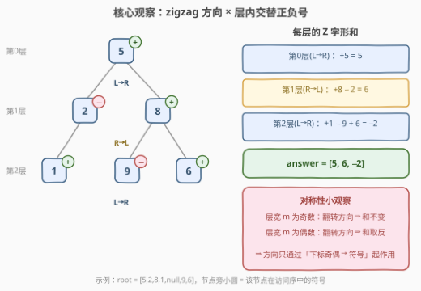
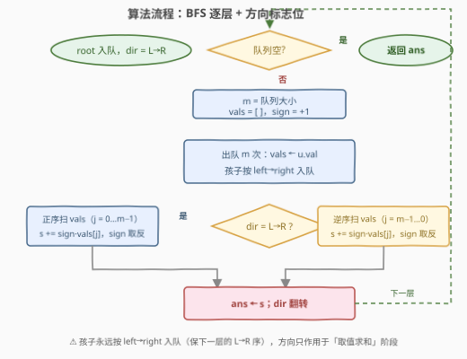

# LeetCode 二叉树的 Z 字形层级和 题解

## 1. 题目概述

- **标题 / 题号**：二叉树的 Z 字形层级和（#3902，medium）
- **链接**：https://leetcode.cn/problems/zigzag-level-sum-of-binary-tree/
- **难度**：中等
- **标签**：树、广度优先搜索、二叉树

> ⚠️ 本题为 LeetCode 付费题（Plus 会员专享），题意描述根据官方示例用例与 hints 重建，可能与官方题面有出入。官方三条 hints：① 用层序遍历（BFS）逐层处理；② 维护当前层的节点列表（或队列）；③ 用一个标志位（奇数层 vs 偶数层）**交替遍历方向**。

**题意（重建）**：给定一棵二叉树的根节点 `root`，返回数组 `answer`，其长度等于树的层数。`answer[i]` 是第 $i$ 层的「**Z 字形层级和**」：第 $i$ 层的节点按 Z 字形（锯齿形）顺序访问——**偶数层（含根的第 0 层）从左到右、奇数层从右到左**——层内第 1 个访问的节点值取 $+$ 号、第 2 个取 $-$ 号、第 3 个取 $+$ 号……如此**交替正负号**求和。

**示例 1**（官方示例用例，输出为按重建题意推演所得）：

```text
输入：root = [5,2,8,1,null,9,6]
输出：[5, 6, -2]
解释：第 0 层(L→R)：+5 = 5
      第 1 层(R→L)：+8 − 2 = 6
      第 2 层(L→R)：+1 − 9 + 6 = −2
```

**示例 2**（官方示例用例，输出为按重建题意推演所得）：

```text
输入：root = [1,2,3,4,5,null,7]
输出：[1, 1, 6]
解释：第 0 层(L→R)：+1 = 1
      第 1 层(R→L)：+3 − 2 = 1
      第 2 层(L→R)：+4 − 5 + 7 = 6
```

**约束条件**（官方约束未公开，按同类题推测）：

- 树中节点数目在 $[1, 10^4]$ 范围内
- $-10^5 \le \text{Node.val} \le 10^5$

> 💡 **审题关键**：① 这**不是**普通「层和」——若只是每层求和，左右方向根本不影响结果，官方 hint ③「Alternate traversal direction using a flag」就毫无意义了。**方向必须通过某种方式影响答案**，结合题名 "Zigzag Level Sum"，最自然的口径就是**层内按 zigzag 访问序交替正负号**；② 方向约定与 [103. 二叉树的锯齿形层序遍历](../0101-0200/103_二叉树的锯齿形层序遍历.md) 一致：根层从左到右，逐层交替；③ 也要与「偶数层整层加、奇数层整层减」的变体区分开——那是**整层一个符号**，本题是**层内逐个交替**（见 6. Q3 的辨析）；④ 节点值可为负、层宽可达 $10^4$，交替和的绝对值上界约 $10^9$，贴着 `int` 上限，稳妥起见用 64 位累加。

## 2. 解题思路

### 2.1 暴力思路

「按定义直译」的暴力：对每个层号 $d$，从根出发重新跑一次 BFS 下潜 $d$ 层，取出第 $d$ 层节点（按该层应有的 zigzag 方向排列），再交替正负号求和。每层一趟 $O(n)$、共 $h$ 层，总计 $O(n \cdot h)$，最坏（链状树）$O(n^2)$。

常规改进：一趟 DFS/BFS 按「从左到右」的自然顺序把每层节点值收进 `levels[d]`，然后对第 $i$ 层分两步处理——若 $i$ 为奇数先 `reverse(levels[i])`，再从头到尾 `+ − + −` 累加。这已经是 $O(n)$，但每层要多扫一遍（翻转），且「收集」与「求和」两个阶段割裂。下面把它压成一趟。

### 2.2 核心观察：方向只通过「交替符号」起作用



**观察一（方向的代数化）**：zigzag 方向对答案的**唯一影响**是改变层内节点的访问顺序；而交替 $\pm$ 只取决于「访问下标的奇偶」。设第 $i$ 层从左到右为 $a_0, a_1, \dots, a_{m-1}$，则该层的 Z 字形和为：

$$
\text{answer}[i] = \begin{cases} \displaystyle\sum_{j=0}^{m-1} (-1)^j \, a_j & i \text{ 为偶数（L→R）} \\[2ex] \displaystyle\sum_{j=0}^{m-1} (-1)^{m-1-j} \, a_j & i \text{ 为奇数（R→L）} \end{cases}
$$

于是「方向」被完全代数化：偶数层正着扫、奇数层**倒着扫**，每层从头起 `sign = +1`、逐项取反即可——**不需要真的翻转列表**，倒序遍历下标 `m-1-j` 就够了。

**观察二（对称性，调试利器）**：当层宽 $m$ 为**奇数**时，$(-1)^{m-1-j} = (-1)^j$，两种方向算出的和**相等**——奇数宽度的层上方向「不可见」；当 $m$ 为**偶数**时两者互为相反数。这个对称性有两个用处：

- **调试定位**：若方向标志搞反了，**只有偶数宽度的层**会出错（和恰好取反），奇数宽度的层安然无恙——对着错误输出一眼就能看出病灶；
- **免翻转推论**：奇数层的和 $= (-1)^{m+1} \times$（正序交替和），即「先按正序算交替和，再按层宽奇偶决定乘不乘 $-1$」——全程连倒序都免了（见第 5 节）。主解法仍选「倒序下标」，直白不易错。

**观察三（入队顺序与方向解耦）**：BFS 中孩子的入队顺序**永远是 left 在前、right 在后**——这保证队列里下一层天然保持「从左到右」序；方向标志**只作用于取值求和阶段**，绝不作用入队阶段。

> ⚠️ **常见翻车**：在奇数层让孩子按 right→left 入队「配合方向」。这会连带破坏**下一层**的左右序——第 $i+2$ 层（方向又翻回来了）的序列已经乱了。方向是「读法」，不是「写法」。

### 2.3 算法流程图



| 步骤 | 操作 | 说明 |
|------|------|------|
| ① 初始化 | `root` 入队，`leftToRight = true` | 第 0 层从左到右 |
| ② 层判断 | 队列空则结束，返回 `ans` | 每轮处理完整一层 |
| ③ 取层宽 | `m = len(q)`；`vals = []` | 本层恰好 `m` 个节点在队首 |
| ④ 收集 | 出队 `m` 次：`vals` 追加 `u.val`；`u` 的孩子按 **left→right** 入队 | 孩子入队顺序与方向无关（观察三） |
| ⑤ 求和 | `leftToRight` 为真：正序 `j = 0…m−1`；为假：逆序 `j = m−1…0`。`s += sign · vals[j]`，`sign` 逐项取反 | 每层 `sign` 重置为 $+1$ |
| ⑥ 收尾 | `ans` 追加 `s`；`leftToRight` 取反 | hint ③ 的方向标志位 |

### 2.4 示例演算：root = [5,2,8,1,null,9,6]

```text
        5            ← 第 0 层
       / \
      2   8          ← 第 1 层
     /   / \
    1   9   6        ← 第 2 层
```

| 层号 | 方向 | 访问序 | 算式 | 结果 |
|------|------|--------|------|------|
| 0 | L→R | 5 | $+5$ | 5 |
| 1 | R→L | 8, 2 | $+8 - 2$ | 6 |
| 2 | L→R | 1, 9, 6 | $+1 - 9 + 6$ | $-2$ |

汇总得 `answer = [5, 6, -2]`。示例 2 同法：$[1]$、$[3,2]$（R→L）、$[4,5,7]$（L→R）三层的交替和分别为 $1, 1, 6$，得 `[1, 1, 6]`。注意第 1 层宽为 2（偶数）——若方向标志写反，这一层会从 $6$ 变成 $-6$；而第 2 层宽为 3（奇数），方向反了结果也是 $-2$ 不变（观察二的直接体现）。

## 3. 参考代码

### C++

```cpp
class Solution {
public:
    vector<long long> zigzagLevelSum(TreeNode* root) {
        vector<long long> ans;
        queue<TreeNode*> q;
        q.push(root);
        bool leftToRight = true;                  // 第 0 层：从左到右
        while (!q.empty()) {
            int m = q.size();
            vector<int> vals;                     // 本层值，天然 L→R 序
            for (int i = 0; i < m; i++) {
                TreeNode* u = q.front(); q.pop();
                vals.push_back(u->val);
                if (u->left)  q.push(u->left);    // 孩子永远按 left→right 入队
                if (u->right) q.push(u->right);
            }
            long long s = 0, sign = 1;
            for (int j = 0; j < m; j++) {         // 偶层正序、奇层逆序，统一成下标映射
                long long v = leftToRight ? vals[j] : vals[m - 1 - j];
                s += sign * v;
                sign = -sign;
            }
            ans.push_back(s);
            leftToRight = !leftToRight;           // 方向标志逐层翻转
        }
        return ans;
    }
};
```

### Python

```python
class Solution:
    def zigzagLevelSum(self, root: Optional[TreeNode]) -> List[int]:
        ans, left_to_right = [], True
        q = deque([root])
        while q:
            m = len(q)
            vals = []
            for _ in range(m):
                u = q.popleft()
                vals.append(u.val)
                if u.left:  q.append(u.left)     # 孩子永远按 left→right 入队
                if u.right: q.append(u.right)
            if not left_to_right:
                vals.reverse()                   # 奇数层：按 R→L 访问
            s, sign = 0, 1
            for v in vals:                       # 每层 sign 重置为 +1
                s += sign * v
                sign = -sign
            ans.append(s)
            left_to_right = not left_to_right
        return ans
```

> 💡 **写法要点**：① 函数签名按题名重建（`zigzagLevelSum`），提交时以实际签名为准；② C++ 版用下标映射 `vals[m-1-j]` 统一正逆序，免 `reverse`；Python 版直接 `reverse` 更 Pythonic，代价是每层多扫一遍（仍 $O(n)$）；③ 官方约束未公开，交替和上界 $\approx m_{\max} \cdot \max|val| = 10^4 \times 10^5 = 10^9$ 贴 `int` 上限，C++ 累加器用 `long long` 防溢出。

## 4. 复杂度分析

| 维度 | 复杂度 | 说明 |
|------|--------|------|
| **时间** | $O(n)$ | 每个节点恰好进出队一次；每层值序列收集一遍、求和一遍（Python 版再加翻转一遍，仍为 $O(n)$ 总计） |
| **空间** | $O(w)$ | 队列 + 本层值列表，$w$ 为最大层宽（最坏 $n$）；输出数组不计入 |
| **对比暴力** | $O(n)$ vs $O(n \cdot h)$ | 「每层重跑一遍 BFS」的直译暴力最坏 $O(n^2)$；逐层处理一遍流式产出，每个节点只碰常数次 |

## 5. 扩展：免倒序的一趟写法与方向变体

**代数版（连倒序都免掉）**：由 2.2 观察二的推论，奇数层的 Z 字形和 $= (-1)^{m+1} \times$ 正序交替和（$m$ 为层宽：$m$ 偶时取负、$m$ 奇时不变）。于是收集阶段完全不必理会方向，全部按正序算交替和，最后按「层号奇偶 × 层宽奇偶」补一个 $\pm 1$ 系数。正序交替和本身还有一行式写法：`sum((-1)**j * v for j, v in enumerate(vals))`。工程上更推荐主解法的「倒序下标」——逻辑直白、不易在系数上翻车，代数版作为验证手段正好（两版对拍能快速暴露方向 bug）。

**DFS 版**：递归携带层号 `d`，`levels[d].append(val)`。由于 DFS 先访问左子树，`levels[d]` 中的追加顺序同样是「从左到右」序，遍历结束后按层号奇偶统一做正序/逆序交替和即可。复杂度同阶，但「收齐再算」不如 BFS「产出一层立刻算一层」贴合层的流式语义。

**与两道 zigzag 亲戚的对比**：[103. 二叉树的锯齿形层序遍历](../0101-0200/103_二叉树的锯齿形层序遍历.md) 中方向决定**整个输出序列**的顺序（信息一点不丢）；[2415. 反转二叉树的奇数层](../2401-2500/2415_反转二叉树的奇数层.md) 是**真的交换节点值**（动数据）；本题方向被交替符号「**吸收**」进一个标量，且在奇数宽度的层上完全不可见（和不变）。「同一个方向标志位，三种不同的作用位置」——遍历顺序、数据本身、聚合符号——放在一起体会，zigzag 家族就通透了。

## 6. 面试要点

**Q1：为什么方向只在「偶数宽度」的层上影响结果？**

> 设层宽 $m$。L→R 的交替和是 $\sum (-1)^j a_j$，R→L 是 $\sum (-1)^{m-1-j} a_j$。当 $m$ 为奇数时 $m-1-j$ 与 $j$ 同奇偶，两式逐项相等；当 $m$ 为偶数时 $m-1-j$ 与 $j$ 异奇偶，两式互为相反数。直觉版：序列两端对称配对 $a_0 \leftrightarrow a_{m-1}$，$m$ 奇时正中间那个自己配自己，符号翻转两次等于没翻。

**Q2：孩子的入队顺序能不能随方向标志翻转？**

> 不能。方向标志只作用于「取值求和」阶段；队列必须始终按 left→right 收纳孩子，才能保证**下一层**在队列中保持从左到右的自然序。若在奇数层按 right→left 入队，被破坏的是第 $i+1$ 层的序列（而它求和时自己又会按标志倒序）——隔一层错一层。（103 题的另一种写法用双端队列「哪端进哪端出」来吸收方向，那是另一套对应关系，别混到普通队列 BFS 里。）

**Q3：如果把「层内逐个交替 ±」改成「偶数层整层加、奇数层整层减」，代码怎么改？还有别的口径吗？**

> 只需把逆序分支改成「正序求普通和后乘 $(-1)$」。三种口径要分清：**普通层和**（方向无关，hint ③ 直接失效）、**整层 ±**（层号决定一个符号）、**层内交替 ±**（本题口径，访问顺序决定符号）。三者在示例 1 上的输出分别是 $[5, 10, 16]$、$[5, -10, 16]$、$[5, 6, -2]$，完全不同——付费题题面看不全时，hints 是裁决口径的唯一依据。

**Q4：累加器需要 64 位吗？**

> 官方约束未公开，按同类题上界估：$m_{\max} \cdot \max|val| \approx 10^4 \times 10^5 = 10^9$，贴着 `INT_MAX ≈ 2.1 \times 10^9`。单看本题大概率不溢，但约束一旦放宽（如 $10^5$ 节点）立刻翻车——C++ 用 `long long` 是零成本的保险；Python 无此虑。

**Q5：BFS 和 DFS 各自的优势？**

> 都是 $O(n)$。BFS 按层流式产出：处理完一层立刻能算出该层的和并释放 `vals`，空间只需当前层宽度；DFS 的 `levels[d]` 收集顺序虽然也是 L→R（先递归左子树），但必须等整棵树遍历完才能开始求和，且要存下全部层。层语义的题目，BFS 是第一反应。

## 同类练习题

| # | 题目 | 与本题的关联 |
|---|------|-------------|
| 102 | [二叉树的层序遍历](https://leetcode.cn/problems/binary-tree-level-order-traversal/)（[题解](../0101-0200/102_二叉树的层序遍历.md)） | BFS「取层宽、逐层收集」的祖师爷模板，本题的地基 |
| 103 | [二叉树的锯齿形层序遍历](https://leetcode.cn/problems/binary-tree-zigzag-level-order-traversal/)（[题解](../0101-0200/103_二叉树的锯齿形层序遍历.md)） | 同款奇偶层方向标志位，但输出整个序列——方向决定输出顺序；本题方向被交替符号吸收成标量 |
| 637 | [二叉树的层平均值](https://leetcode.cn/problems/average-of-levels-in-binary-tree/)（[题解](../0601-0700/637_二叉树的层平均值.md)） | 逐层聚合的姐妹题（求平均），体会「聚合函数换了，BFS 骨架不变」 |
| 1161 | [最大层内元素和](https://leetcode.cn/problems/maximum-level-sum-of-a-binary-tree/)（[题解](../1101-1200/1161_最大层内元素和.md)） | 普通层和 + 在层间挑选最大——恰好是「方向无关版层和」的用武之地，对照理解方向为何在本题必须起作用 |
| 2415 | [反转二叉树的奇数层](https://leetcode.cn/problems/reverse-odd-levels-of-binary-tree/)（[题解](../2401-2500/2415_反转二叉树的奇数层.md)） | 奇数层真正交换节点值——「动数据」与本题「只动读法」的镜像对照 |
