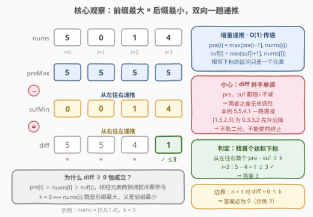
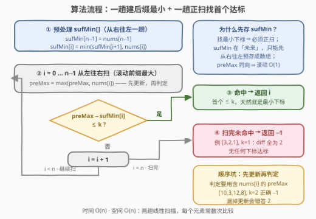

# 最小稳定下标 I

- **题目名称**：最小稳定下标 I
- **链接**：[3903. 最小稳定下标 I](https://leetcode.cn/problems/smallest-stable-index-i/)
- **难度**：简单
- **标签**：数组、前缀最值

## 1. 题目概述

**题意**：给定长度为 $n$ 的整数数组 `nums` 与整数 $k$。对每个下标 $i$ 定义**不稳定值**为

$$\text{unstable}(i) = \max(\text{nums}[0..i]) - \min(\text{nums}[i..n-1])$$

即「前缀闭区间最大值」减「后缀闭区间最小值」——两段共享枢纽元素 `nums[i]`。若 $\text{unstable}(i) \le k$ 则称 $i$ 为**稳定下标**，返回**最小**的稳定下标；不存在则返回 $-1$。

**示例 1**：

```text
输入：nums = [5,0,1,4], k = 3
输出：3
解释：i=0..3 的不稳定值分别为 5, 5, 4, 1，首个 ≤ 3 的是 i=3。
```

**示例 2**：

```text
输入：nums = [3,2,1], k = 1
输出：-1
解释：三个下标的不稳定值都是 3 − 1 = 2 > 1。
```

**示例 3**：

```text
输入：nums = [0], k = 0
输出：0
解释：max([0]) − min([0]) = 0 ≤ 0。
```

**约束条件**：

- $1 \le \text{nums.length} \le 100$
- $0 \le \text{nums}[i] \le 10^9$
- $0 \le k \le 10^9$

> 💡 **审题关键**：① 两个区间都是**闭区间且共享枢纽元素** `nums[i]`：$i=0$ 时前缀只有 `nums[0]`、后缀是整个数组；$i=n-1$ 时前缀是整个数组、后缀只有 `nums[n-1]`；② 求**最小**下标 ⇒ 从左往右第一个命中即返回；③ $n=1$ 时不稳定值恒为 $0 \le k$（$k \ge 0$），答案必为 $0$。

---

## 2. 解题思路

### 2.1 暴力思路

按定义直译：对每个 $i$ 从 $0$ 到 $n-1$，内层重扫 $[0..i]$ 求 max、重扫 $[i..n-1]$ 求 min，算出不稳定值，第一个 $\le k$ 的返回。双重循环 $O(n^2)$，$n \le 100$ 时约 $10^4$ 次操作完全能过——但毫无营养：相邻下标的两个区间各自只差一个元素，每个 $i$ 却都从头重算，重复计算被白白浪费。

### 2.2 核心观察：前缀最大 × 后缀最小的增量递推



**观察一（区间增量，max/min 的结合律）**：$i \to i+1$ 时，$[0..i+1]$ 只比 $[0..i]$ 多一个元素，$[i+1..n-1]$ 只比 $[i..n-1]$ 少一个元素，而 max/min 对「添/删一个元素」就是打擂台：

$$\text{pre}[i] = \max(\text{pre}[i-1],\ \text{nums}[i]), \qquad \text{suf}[i] = \min(\text{suf}[i+1],\ \text{nums}[i])$$

于是 $\text{pre}$ 从左往右、$\text{suf}$ 从右往左各跑一趟线性扫描，之后**每个下标的判定都是 $O(1)$**。这正是「前缀和」思想在最值上的对应物——**前缀最值**。

**观察二（两个单调性，但差没有）**：$\text{pre}[i]$ 随 $i$ **不减**（前缀只会变长）；$\text{suf}[i]$ 随 $i$ 也**不减**（区间右端不动、左端右移，min 只会变大或不变）。但两者之差 $\text{diff}[i] = \text{pre}[i] - \text{suf}[i]$ **不单调**：示例 1 是 $5,5,4,1$ 一路递减；换 $[1,5,2,3]$ 则是 $0,3,3,2$ 先升后降——$k=2$ 时稳定下标集为 $\{0, 3\}$，甚至不连续。

> ⚠️ **反直觉陷阱**：看到两个单调量就想二分或「一旦达标就停」？差的符号没有任何保证，稳定下标集既非前缀也非区间，二分与提前终止全部失效。老实从左往右逐个判定——$O(n)$ 本来就够快。

**观察三（非负性）**：枢纽元素两侧都参与 ⇒ $\text{pre}[i] \ge \text{nums}[i] \ge \text{suf}[i]$，故 $\text{diff}[i] \ge 0$ 恒成立。取等 ⟺ $\text{pre}[i] = \text{nums}[i] = \text{suf}[i]$，即「左边没有更大的、右边没有更小的」——$k=0$ 时找的就是这种「完美枢纽」。

**观察四（数据范围）**：$\text{diff} \le \max(\text{nums}) - \min(\text{nums}) \le 10^9 < 2^{31}-1$，`int` 承载无压力（Python 无此虑）。

### 2.3 算法流程图



| 步骤 | 操作 | 说明 |
|------|------|------|
| ① 预处理 | 从右往左一趟建 `sufMin[]` | `sufMin[n-1] = nums[n-1]`，倒序递推 |
| ② 正扫 | `i = 0 … n-1`，滚动维护 `preMax = max(preMax, nums[i])` | 与扫描同向，一个变量就够；**先更新再判定**（判定用的前缀必须含 `nums[i]`） |
| ③ 判定 | `preMax - sufMin[i] <= k`？命中立即返回 `i` | 从左往右首个命中即最小稳定下标 |
| ④ 收尾 | 扫完未命中返回 `-1` | 如示例 2 |

**为什么 `sufMin` 必须先存成数组、`preMax` 却能滚动？** 扫描方向说了算：找**最小**下标必须从左往右扫，`preMax` 与扫描同向、边走边打擂台即可；`sufMin` 的信息在扫描方向的「未来」，只能先花 $O(n)$ 空间从右往左预存。

### 2.4 示例演算：nums = [5,0,1,4], k = 3

| $i$ | $\text{pre}[i]$ | $\text{suf}[i]$ | $\text{diff}$ | $\le 3$？ |
|---|---|---|---|---|
| 0 | 5 | 0 | 5 | ✗ |
| 1 | 5 | 0 | 5 | ✗ |
| 2 | 5 | 1 | 4 | ✗ |
| 3 | 5 | 4 | 1 | ✓ → **返回 3** |

示例 2（`[3,2,1]`, $k=1$）：`pre = [3,3,3]`，`suf = [1,1,1]`，diff 全为 2，无一达标，返回 $-1$。示例 3（`[0]`, $k=0$）：单元素枢纽两侧都是自己，diff = 0，返回 0。

---

## 3. 参考代码

### C++

```cpp
class Solution {
public:
    int firstStableIndex(vector<int>& nums, int k) {
        int n = nums.size();
        vector<int> sufMin(n);
        sufMin[n - 1] = nums[n - 1];
        for (int i = n - 2; i >= 0; i--)            // ① 后缀最小：从右往左一趟
            sufMin[i] = min(sufMin[i + 1], nums[i]);

        int preMax = nums[0];                        // ② 前缀最大：滚动变量
        for (int i = 0; i < n; i++) {
            preMax = max(preMax, nums[i]);           // 先更新——判定必须含枢纽 nums[i]
            if (preMax - sufMin[i] <= k) return i;   // ③ 首个命中即最小
        }
        return -1;                                   // ④ 全程未达标
    }
};
```

### Python

```python
class Solution:
    def firstStableIndex(self, nums: List[int], k: int) -> int:
        n = len(nums)
        suf_min = [0] * n
        suf_min[-1] = nums[-1]
        for i in range(n - 2, -1, -1):              # ① 后缀最小：从右往左一趟
            suf_min[i] = min(suf_min[i + 1], nums[i])

        pre_max = nums[0]                            # ② 前缀最大：滚动变量
        for i, x in enumerate(nums):
            pre_max = max(pre_max, x)                # 先更新——判定必须含枢纽 nums[i]
            if pre_max - suf_min[i] <= k:            # ③ 首个命中即最小
                return i
        return -1                                    # ④ 全程未达标
```

> 💡 **写法要点**：① `preMax` 初始化为 `nums[0]`，循环内先 `max` 再判定——$i=0$ 时打擂台结果不变，天然正确；② Python 可用 `list(accumulate(reversed(nums), min))[::-1]` 一行建后缀最小数组；③ 判定与更新的**顺序**是本题最隐蔽的坑，反例见 6. Q4。

---

## 4. 复杂度分析

| 维度 | 复杂度 | 说明 |
|------|--------|------|
| **时间** | $O(n)$ | 从右往左、从左往右各一趟，每个元素常数次比较 |
| **空间** | $O(n)$ | `sufMin` 数组；`preMax` 滚动变量 $O(1)$（两趟模板下省不掉；单趟贪心可压 $O(1)$，见第 5 节） |
| **对比暴力** | $O(n)$ vs $O(n^2)$ | 暴力每个下标重扫两个区间；增量递推把「区间聚合」变成「相邻传递」，单次判定 $O(n) \to O(1)$ |

---

## 5. 扩展：聚合可逆性、原地覆写陷阱与 O(1) 贪心

「前缀聚合 vs 后缀聚合」这一族题的解法形态，由**聚合函数能否差分逆推**决定（下表均指两趟前后缀模板）：

| 聚合 | 可逆性 | 代表题 | 两趟模板空间 |
|------|--------|--------|------|
| 和 | 可逆：后缀和 = 总和 − 前缀和 − `nums[i]` | [724. 寻找数组的中心下标](https://leetcode.cn/problems/find-pivot-index/) | $O(1)$（总和 + 滚动左和） |
| 积 | 可逆但除法有零值坑 | [238. 除自身以外数组的乘积](https://leetcode.cn/problems/product-of-array-except-self/) | 禁除法 ⇒ 退回 $O(n)$ |
| 最值 | **不可逆** | 本题、[42. 接雨水](https://leetcode.cn/problems/trapping-rain-water/) | $O(n)$（必须存一边的表） |

**原地覆写为什么救不回来**：一个诱人的想法是第一趟把 `sufMin` 直接写进 `nums`、只留 $O(1)$ 额外空间。但第二趟正扫维护 `preMax` 需要**原始的** `nums[i]`，它们已在第一趟被覆盖；反过来先存 `pre` 也一样毁掉右侧原值。和可以靠「总和 − 左边」把右边差分回来，最值没有这样的逆运算——这是 724 的两趟模板能 $O(1)$ 而本题不能的根本原因。

**但 O(1) 空间并非绝路——单趟「推迟候选」贪心**：维护候选答案 $a$ 与 $\text{pm} = \max(0..a)$（一个变量）。正扫 $j$，一旦 $\text{nums}[j] + k < \text{pm}$，则 $[a, j]$ 内**所有**候选一起死刑——它们的 $\text{pre}$ 只会 $\ge \text{pm}$，而 $\text{suf} \le \text{nums}[j]$——候选推迟到 $a = j+1$；幸存到末尾的 $a$ 即答案（此时两侧聚合都已看全）。正确性论证比两趟版微妙，完整展开与对拍见 [3904. 最小稳定下标 II](https://leetcode.cn/problems/smallest-stable-index-ii/)（[题解](3904_最小稳定下标II.md)）第 5 节；同族 [915. 分割数组](https://leetcode.cn/problems/partition-array-into-disjoint-intervals/) 是这一贪心的祖师爷。顺带一提，42 接雨水也有异曲同工的双指针 $O(1)$ 版——「不可逆」只封死差分一条路，不封死一切 $O(1)$ 路。

**I / II 兄弟题**：[3904. 最小稳定下标 II](https://leetcode.cn/problems/smallest-stable-index-ii/)（中等）同题面加强，$O(n)$ 模板零改动平移——这正是「$n \le 100$ 也写 $O(n)$」的意义：约束一放大（如 $n \to 10^5$），$O(n^2)$ 立刻超时。

---

## 6. 面试要点

**Q1：`pre` 和 `suf` 都随 $i$ 不减，`diff` 是不是也单调？能不能二分？**

> 不能。$\text{diff} = \text{pre} - \text{suf}$，两个非减量之差没有符号保证：`[5,0,1,4]` 的 diff = 5,5,4,1 递减；`[1,5,2,3]` 的 diff = 0,3,3,2 先升后降，$k=2$ 时稳定下标集 $\{0,3\}$ 不连续——既非前缀也非区间。二分与「一旦达标/超标就停」全部失效，线性扫描 $O(n)$ 是正解。

**Q2：`diff ≥ 0` 为什么恒成立？**

> 枢纽元素 `nums[i]` 同时属于两个闭区间：`pre[i] ≥ nums[i]`（它在前缀里）、`suf[i] ≤ nums[i]`（它在后缀里），相减即得 $\text{diff} \ge \text{nums}[i] - \text{nums}[i] = 0$。取等 ⟺ `nums[i]` 既是前缀最大又是后缀最小（左边没有更大的、右边没有更小的）。

**Q3：$n \le 100$ 暴力能过，为什么面试还要写 $O(n)$？**

> 考的是「区间聚合 → 相邻增量递推」的模板意识（前缀和的 max/min 版）。同题面的 II 版 [3904](https://leetcode.cn/problems/smallest-stable-index-ii/)（中等）真实存在，约束一放大 $O(n^2)$ 立刻超时；同一模板零改动平移。数据规模小时写 $O(n)$ 是白送的防御。

**Q4：循环里「先更新 `preMax` 再判定」能不能反过来？**

> 不能。判定用的 `pre` 必须含枢纽 `nums[i]`（闭区间 $[0..i]$）。若先判后更，$i$ 处用的是 `pre[i-1]`，把 diff 算小了。反例 `nums = [10,3,12,8], k = 2`：正确 diff = [7,7,4,4] 全部 > 2，答案 $-1$；先判后更版在 $i=2$ 处用旧值算出 $10 - 8 = 2 \le 2$，错答 2。

**Q5：`preMax` 可以滚动，`sufMin` 为什么不行？**

> 方向决定。找最小下标 ⇒ 主循环必须从左往右；`preMax` 与扫描同向，边走边打擂台一个变量就够；`sufMin` 的信息在「未来」，只能先从右往左预存成数组（$O(n)$ 空间）。若反过来找**最大**稳定下标，则 `sufMin` 滚动、`pre` 存数组——完全对称。

---

## 7. 同类练习题

- [42. 接雨水](https://leetcode.cn/problems/trapping-rain-water/)（[题解](../0001-0100/42_接雨水.md)）：同为 leftMax/rightMax 双向预处理的地基，那边取「两墙较矮 − 柱高」，这边直接作差——同一地基两栋楼
- [238. 除自身以外数组的乘积](https://leetcode.cn/problems/product-of-array-except-self/)（[题解](../0201-0300/238_除自身以外数组的乘积.md)）：前后缀聚合换成「乘积」，展示了「禁除法 ⇒ 可逆性失效 ⇒ O(n) 空间」的取舍，与第 5 节对照
- [724. 寻找数组的中心下标](https://leetcode.cn/problems/find-pivot-index/)（[题解](../0701-0800/724_寻找数组的中心下标.md)）：同为「最小下标 + 左右区间聚合」，但和可差分 ⇒ 总和 + 滚动左和 $O(1)$ 空间，与本题最值不可逆形成镜像
- [915. 分割数组](https://leetcode.cn/problems/partition-array-into-disjoint-intervals/)（[题解](../0901-1000/915_分割数组.md)）：最近的亲——同是「前缀 max × 后缀 min」找最小分割点，只是右段开区间且无 $k$ 容忍；其「推迟候选」贪心正是 3904 的 O(1) 模板来源
- [3862. 找出最小平衡下标](https://leetcode.cn/problems/find-the-smallest-balanced-index/)（[题解](../3801-3900/3862_找出最小平衡下标.md)）：同族「最小 XX 下标」，那边是前缀和 vs 后缀积，还有乘积爆炸的封顶技巧
