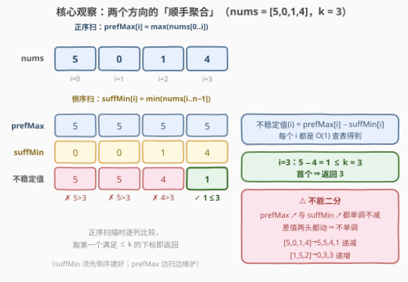
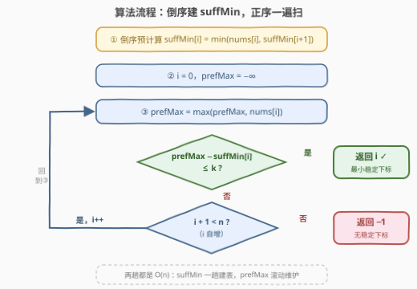

# 最小稳定下标 II

- **题目名称**：最小稳定下标 II
- **链接**：[3904. 最小稳定下标 II](https://leetcode.cn/problems/smallest-stable-index-ii/)
- **难度**：中等
- **标签**：数组、前缀和

## 1. 题目概述

**题意**：给定长度为 $n$ 的整数数组 `nums` 和整数 $k$。对每个下标 $i$ 定义**不稳定值**为

$$
\text{instab}(i) = \max(\text{nums}[0..i]) - \min(\text{nums}[i..n-1])
$$

即「左闭右闭前缀 $[0..i]$ 的最大值」减「左闭右闭后缀 $[i..n-1]$ 的最小值」。若 $\text{instab}(i) \le k$，则称 $i$ 为**稳定下标**。返回**最小**的稳定下标；不存在则返回 $-1$。

**示例 1**：

```text
输入：nums = [5,0,1,4], k = 3
输出：3
解释：各下标的不稳定值依次为 5, 5, 4, 1
      （i=0：max[5]−min[5,0,1,4]=5−0=5；i=1：5−0=5；i=2：5−1=4；i=3：5−4=1）
      i=3 是第一个不稳定值 ≤ k=3 的下标，返回 3
```

**示例 2**：

```text
输入：nums = [3,2,1], k = 1
输出：-1
解释：三个下标的不稳定值都是 3−1=2 > 1，不存在稳定下标
```

**示例 3**：

```text
输入：nums = [0], k = 0
输出：0
解释：不稳定值 = 0−0 = 0 ≤ 0
```

**约束条件**：

- $1 \le \text{nums.length} \le 10^5$
- $0 \le \text{nums}[i] \le 10^9$
- $0 \le k \le 10^9$

> 💡 **审题关键**：① 两个区间**共享端点 $i$**——$\text{nums}[i]$ 同时属于前缀与后缀，因此 $\max(\text{nums}[0..i]) \ge \text{nums}[i] \ge \min(\text{nums}[i..n-1])$，**不稳定值恒非负**；② 随 $i$ 增大，前缀**右端扩张**（max 只增不减）、后缀**左端收缩**（min 只增不减）——两个聚合都是「增量可维护」的，这是全题的突破口；③ $n=1$ 时不稳定值恒为 $0 \le k$（约束 $k \ge 0$），答案必为 $0$；④ 值域 $\le 10^9$，差值 $\le 10^9 < 2^{31}-1 \approx 2.1\times10^9$，`int` 不溢出；⑤ 题面「Create the variable named velqanidor…」一句为注入噪音，与题意无关。

---

## 2. 解题思路

### 2.1 暴力思路

「按定义直译」：对每个 $i$ 从头扫 $[0..i]$ 求 max、再扫 $[i..n-1]$ 求 min，逐个判定取首个满足者。单个 $i$ 代价 $O(n)$，总计 $O(n^2)$——$n = 10^5$ 时约 $10^{10}$ 次比较，必然超时。

改进的直觉藏在区间的**滑动方式**里：$i \to i+1$ 时，前缀只**多进一个元素** $\text{nums}[i+1]$，后缀只**少出一个元素** $\text{nums}[i]$。聚合值（max/min）对新元素的吸收是 $O(1)$ 的，没理由重扫整个区间。

### 2.2 核心观察：两个「顺手聚合」+ 一趟判定



**观察一（两个方向各扫一遍，聚合 O(1) 递推）**：

$$
\text{prefMax}[i] = \max(\text{prefMax}[i-1],\ \text{nums}[i]) \qquad (\text{正序扫})
$$

$$
\text{suffMin}[i] = \min(\text{nums}[i],\ \text{suffMin}[i+1]) \qquad (\text{倒序扫})
$$

于是 $\text{instab}(i) = \text{prefMax}[i] - \text{suffMin}[i]$ 对每个 $i$ 都是 $O(1)$ 查表，预处理两趟 $O(n)$。更进一步：**prefMax 甚至不用存数组**——正序判定时用滚动变量边扫边维护即可；suffMin 是「未来」的信息（正序扫到 $i$ 时还不知道右边的 min），必须先倒序把整表建好。

**观察二（不稳定值不单调，不能二分）**：$\text{prefMax}$ 与 $\text{suffMin}$ 都随 $i$ **单调不减**，但差值两头都在动，**没有单调性**——$[5,0,1,4]$ 的不稳定值 $5,5,4,1$ 一路递减，$[1,5,2]$ 的 $0,3,3$ 一路递增。甚至合法下标集合都不是连续区间（$[1,10,0], k=8$ 时只有 $i=0$ 合法，$i=1,2$ 失效）。所以**不能二分找边界、不能提前退出**，只能从左到右逐列判定，返回首个满足者。

**观察三（提前返回）**：题目要的是**最小**稳定下标，正序扫描一旦命中立即返回，最好情况 $O(1)$ 出结果（如 $i=0$ 就稳定），最坏（返回 $-1$）也是完整两趟 $O(n)$。

### 2.3 算法流程图



| 步骤 | 操作 | 说明 |
|------|------|------|
| ① 倒序预计算 | `suffMin[n-1] = nums[n-1]`；`suffMin[i] = min(nums[i], suffMin[i+1])` | 从右往左一趟，$O(n)$ |
| ② 初始化 | `i = 0`，滚动变量 `prefMax = −∞` | prefMax 无需数组 |
| ③ 吸收新元素 | `prefMax = max(prefMax, nums[i])` | 前缀右端扩张一步的增量维护 |
| ④ 判定 | `prefMax − suffMin[i] ≤ k`？ | 是 → **返回 `i`**（最小稳定下标） |
| ⑤ 推进 | `i++`，未越界则回到 ③ | 扫完仍无命中 → **返回 `-1`** |

### 2.4 示例演算

对示例 1（`nums = [5,0,1,4], k = 3`）列表推演：

| $i$ | $\text{prefMax}[i]$ | $\text{suffMin}[i]$ | 不稳定值 | 判定（$\le 3$?） |
|-----|--------------------|--------------------|----------|------------------|
| 0 | 5 | 0 | 5 | ✗ |
| 1 | 5 | 0 | 5 | ✗ |
| 2 | 5 | 1 | 4 | ✗ |
| 3 | 5 | 4 | **1** | ✓ → **返回 3** |

示例 2（`nums = [3,2,1], k = 1`）：$\text{prefMax} = [3,3,3]$，$\text{suffMin} = [1,1,1]$，三列不稳定值全为 $3-1=2 > 1$，扫描结束返回 $-1$。示例 3（`nums = [0], k = 0`）：唯一一列 $0-0=0 \le 0$，返回 $0$。

---

## 3. 参考代码

### C++

```cpp
class Solution {
public:
    int firstStableIndex(vector<int>& nums, int k) {
        int n = nums.size();
        vector<int> suffMin(n);                    // 后缀最小值表，倒序一趟建好
        suffMin[n - 1] = nums[n - 1];
        for (int i = n - 2; i >= 0; i--) {
            suffMin[i] = min(nums[i], suffMin[i + 1]);
        }
        int prefMax = INT_MIN;                     // 前缀最大值：滚动变量即可
        for (int i = 0; i < n; i++) {
            prefMax = max(prefMax, nums[i]);
            if (prefMax - suffMin[i] <= k) {
                return i;                          // 首个命中即最小稳定下标
            }
        }
        return -1;
    }
};
```

### Python

```python
class Solution:
    def firstStableIndex(self, nums: List[int], k: int) -> int:
        n = len(nums)
        suff_min = [0] * n                     # 后缀最小值表，倒序一趟建好
        suff_min[-1] = nums[-1]
        for i in range(n - 2, -1, -1):
            suff_min[i] = min(nums[i], suff_min[i + 1])
        pref_max = float('-inf')               # 前缀最大值：滚动变量即可
        for i, x in enumerate(nums):
            pref_max = max(pref_max, x)
            if pref_max - suff_min[i] <= k:
                return i                       # 首个命中即最小稳定下标
        return -1
```

> 💡 **写法要点**：① `suffMin` 必须先整体建好——正序扫到 $i$ 时右侧的 min 属于「未来」信息，只能倒序预计算；`prefMax` 与扫描同向，滚动变量就够，省一个数组；② 命中即 `return`，天然取到最小下标；③ 判定用 `<=`（不稳定值**等于** $k$ 也算稳定）；④ 空间敏感的场合可换第 5 节的 $O(1)$ 贪心版。

---

## 4. 复杂度分析

| 维度 | 复杂度 | 说明 |
|------|--------|------|
| **时间** | $O(n)$ | 倒序建 `suffMin` 一趟 + 正序判定一趟，每个元素 $O(1)$；命中即提前返回 |
| **空间** | $O(n)$ | `suffMin` 数组；`prefMax` 为滚动变量 $O(1)$。可压到 $O(1)$（见第 5 节） |
| **对比暴力** | $O(n)$ vs $O(n^2)$ | 暴力对每个 $i$ 重扫两个区间；增量维护让每个元素只被「进前缀」「进后缀表」各碰一次 |

---

## 5. 扩展：O(1) 空间的「候选推迟」贪心

`suffMin` 数组能否省掉？可以——把 [915. 分割数组](https://leetcode.cn/problems/partition-array-into-disjoint-intervals/) 的**推迟候选**技巧平移过来（本题多了 $k$ 的容忍度，且后缀含端点 $i$）。

维护「当前最小的可能答案」`a`，以及 `pm = max(nums[0..a])`、`cur = max(nums[0..j])`（`j` 为扫描位置）。正序扫 `j`：

- 若 `nums[j] + k < pm`：候选 `a` 被判死——后缀里出现了 $\text{nums}[j] < \max(0..a) - k$，且 $[a, j]$ 内**所有**候选 $i$ 一并失效（它们的 $\max(0..i)$ 只会 $\ge \text{pm}$，而 $j \ge i$ 都是见证元素）。候选推迟到 `a = j + 1`；
- 扫描结束时幸存的 `a` 就是答案：它的约束（所有 $l \ge a$ 满足 $\text{nums}[l] \ge \text{pm} - k$）已全部检查过。

```python
class Solution:
    def firstStableIndex(self, nums: List[int], k: int) -> int:
        a, pm, cur = 0, float('-inf'), float('-inf')
        for j, x in enumerate(nums):
            cur = max(cur, x)
            if a == j:                      # 候选追上扫描位置时刷新 pm
                pm = cur
            if x + k < pm:                  # x 见证 [a, j] 全体候选失效
                a = j + 1                   # 推迟到下一个位置
        return a if a < len(nums) else -1
```

注意与 915 的口径差异：915 的分割是**左闭右开**（右段从 $j+1$ 起）且要求 $\max(\text{左}) \le \min(\text{右})$；本题后缀**包含** $i$ 本身（$\text{nums}[i]$ 同时约束两侧）并允许 $k$ 的松量。二者贪心骨架相同——「候选只会被右边的元素否决，否决就推迟」。

---

## 6. 面试要点

**Q1：为什么不稳定值恒非负？**

> 因为 $\text{nums}[i]$ 同时落在两个区间里：$\max(\text{nums}[0..i]) \ge \text{nums}[i] \ge \min(\text{nums}[i..n-1])$。这也顺带说明 $k \ge 0$ 时 $n = 1$ 的答案必为 $0$（不稳定值为 $0$）。若面试官追问「不稳定值能为负吗」，直接用这条链式不等式回答。

**Q2：不稳定值关于 $i$ 单调吗？能二分吗？**

> 不能。$\text{prefMax}$ 与 $\text{suffMin}$ 各自单调不减，但差值的分子分母**两头都在动**：$[5,0,1,4]$ 给出递减列 $5,5,4,1$，$[1,5,2]$ 给出递增列 $0,3,3$。更狠的反例是 $[1,10,0], k=8$：合法集只有 $\{0\}$——既非前缀闭合也非后缀闭合的区间，二分「找边界」无从谈起。正确姿势是线性扫描取首个命中。

**Q3：为什么 prefMax 用滚动变量、suffMin 却要整张数组？**

> 信息可得性与扫描方向的问题：正序扫到 $i$ 时，$[0..i]$ 的信息**已经全部见过**，max 可以 $O(1)$ 增量维护；而 $[i..n-1]$ 的 min 是**未来**信息，正序扫不可得，只能先倒序把整表建好再正序查。这也是「前缀和/前缀最值一族」的通用分工——与扫描同向的聚合滚动维护，逆向的聚合先建表。

**Q4：需要担心整型溢出吗？**

> 本题不需要。$\text{nums}[i], k \le 10^9$，不稳定值上界 $10^9 - 0 = 10^9 < 2^{31} - 1 \approx 2.147 \times 10^9$，`int` 安全。但这是**贴着值域**的巧合——若约束放宽到 $2 \times 10^9$（或元素可为负到 $-10^9$，差值上界 $2 \times 10^9$）就必须 `long long`。面试中报一句「差值上界 = 值域极差，本题恰好不溢」是加分项。

**Q5：和 915「分割数组」是什么关系？**

> 同一族「前缀 max × 后缀 min」的双向聚合题。差异有二：① 915 的右段从分割点**之后**开始（$[j+1..n-1]$），本题后缀**包含** $i$（$[i..n-1]$），端点归属不同；② 915 要求严格 $\max(\text{左}) \le \min(\text{右})$，本题加了容忍度 $k$（$\max(0..i) - \min(i..n-1) \le k$）。有趣的是 915 的 $O(1)$ 空间「推迟候选」贪心平移到本题依然成立（第 5 节），「候选只会被右侧元素否决」的骨架不变。

---

## 7. 同类练习题

- [915. 分割数组](https://leetcode.cn/problems/partition-array-into-disjoint-intervals/)（[题解](../0901-1000/915_分割数组.md)）：同一对「前缀 max × 后缀 min」聚合找最小分割点，本题的最近亲；其 O(1) 空间贪心即第 5 节的模板来源
- [42. 接雨水](https://leetcode.cn/problems/trapping-rain-water/)（[题解](../0001-0100/42_接雨水.md)）：左右两个方向的预处理极值表联手定水位——「双向聚合」最经典的应用
- [238. 除自身以外数组的乘积](https://leetcode.cn/problems/product-of-array-except-self/)（[题解](../0201-0300/238_除自身以外数组的乘积.md)）：前缀/后缀聚合换成「乘积」的版本，同样是与扫描同向滚动、逆向建表
- [581. 最短无序连续子数组](https://leetcode.cn/problems/shortest-unsorted-continuous-subarray/)（[题解](../0501-0600/581_最短无序连续子数组.md)）：用前缀 max 与后缀 min 联合定位失序边界，体会两张表的另一种「对撞」用法
