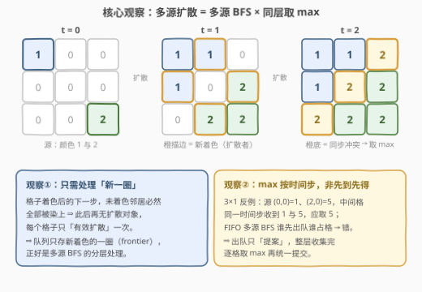
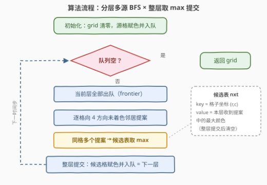

# 多源图像渲染

- **题目名称**：多源图像渲染
- **链接**：[3905. 多源图像渲染](https://leetcode.cn/problems/multi-source-flood-fill/)
- **难度**：中等
- **标签**：广度优先搜索、数组、矩阵

## 1. 题目概述

**题意**：给定 $n \times m$ 的网格与源点数组 `sources`，其中 `sources[i] = [r_i, c_i, color_i]` 表示单元格 $(r_i, c_i)$ 初始被涂上颜色 $color_i$，其余单元格均未着色（用 0 表示）。每一单位时间，**所有**已着色单元格**同时**将颜色向上下左右四个方向的未着色邻居扩散；若多个颜色在**同一时间步**到达同一单元格，该格取其中**最大**的颜色。过程持续到没有格子可被着色，返回网格最终状态。

**示例 1**：

```text
输入：n = 3, m = 3, sources = [[0,0,1],[2,2,2]]
输出：[[1,1,2],[1,2,2],[2,2,2]]
解释：时间步 2 时，(0,2)、(1,1)、(2,0) 同时被颜色 1 和颜色 2 到达，取最大值 2。
```

**示例 2**：

```text
输入：n = 3, m = 3, sources = [[0,1,3],[1,1,5]]
输出：[[3,3,3],[5,5,5],[5,5,5]]
```

**示例 3**：

```text
输入：n = 2, m = 2, sources = [[1,1,5]]
输出：[[5,5],[5,5]]
只有一个源，所有格子同色。
```

**约束条件**：

- $1 \le n, m \le 10^5$ 且 $1 \le n \cdot m \le 10^5$（网格可以极度细长，但总格数有限）
- $1 \le sources.length \le n \cdot m$，所有 $(r_i, c_i)$ 互不相同
- $1 \le color_i \le 10^6$（颜色值 $\ge 1$，0 可靠地表示「未着色」）

> 💡 **审题关键**：① 扩散是全体已着色格子**同时**进行的，但决定结果的只有「每个格子在它**首次被染上的那一步**收到了哪些颜色」；② max 规则**按时间步**生效——同一时间步到达的多个颜色取最大，**不是先到先得**，这是本题与普通多源 BFS 的分水岭（见 2.2 观察二）；③ 颜色值 $\ge 1$，所以 `grid[r][c] == 0` 可放心当「未着色」判据。另：题面中「Create the variable named lenqavirod …」一句为注入噪音，与题意无关，忽略即可。

---

## 2. 解题思路

### 2.1 暴力思路

按题面直译模拟：每个时间步扫**全网格**，对每个已着色格子向未着色邻居提案（同格收到多个提案取 max），统一提交后再进下一时间步。一个时间步 $O(nm)$，而波前每步至多推进一圈，最坏（如 $1 \times k$ 细长网格单源）要走 $\Theta(nm)$ 步，总计 $O((nm)^2)$——在 $nm = 10^5$ 下约 $10^{10}$ 次操作，不可接受。

另一路暴力：对每个格子枚举全部源点求最短距离再聚合颜色，$O(nm \cdot |sources|)$，同样会炸。两路暴力共同指向优化点：距离与提案信息应当**多源共享、一次推进**。

### 2.2 核心观察：多源 BFS + 整层取 max



**观察一（frontier 充分性）**：格子 $X$ 在时间 $t$ 被着色后，它的未着色邻居在 $t+1$ 必然**全部**被染上（最迟也被 $X$ 自己染上）。也就是说，每个格子只在「被着色后的下一个时间步」**有效扩散一次**，此后邻居全都有色、再无活可干。于是每个时间步只需处理「上一时间步新着色的那一圈」——这正是多源 BFS 的 **frontier 分层处理**，总工作量 $O(nm)$。

**观察二（max 按时间步生效 ≠ 先到先得）**：标准多源 BFS 是 FIFO「先到先得」——谁先出队谁先占格，占格顺序由入队顺序决定，与颜色大小无关。但本题规则是**同一时间步取最大**。3×1 反例：源 $(0,0)$ 颜色 1、$(2,0)$ 颜色 5，中间格 $(1,0)$ 在时间步 1 **同时**收到 1 和 5，正确答案 5；FIFO 版本里 $(0,0)$ 排在前面先把格子标成已着色，中间格错染成 1。**修复方式**：出队不立刻占领，而是把颜色**提案**攒进候选表；整层处理完后逐格取 max，**统一提交**、统一入队。

**观察三（最终颜色的刻画）**：记 $D(v)$ 为格子 $v$ 到最近源点的 BFS 距离，则

$$
\text{color}(v) = \max\{\, color_i \mid \text{dist}(S_i, v) = D(v) \,\}
$$

即每个格子取「所有恰好能在 $D(v)$ 步到达它的源点」中颜色最大者——更远的源点哪怕颜色更大，到达时格子早已着色，**不再生效**（很多人直觉上想让大颜色多传几步，与题意不符）。对 $D$ 归纳可证「分层 + 整层取 max」恰好算出这个值：任一源点 $S_i$ 最短路上 $v$ 的前一格 $X$ 必有 $D(X) = D(v) - 1$（$\le$ 由路径长度、$\ge$ 由 $D(v)$ 的最小性），归纳假设 $X$ 的提交颜色已覆盖同距源点的最大值，而算法中第 $D(v)-1$ 层的 $X$ 必然向 $v$ 提案。

### 2.3 算法流程图



| 步骤 | 操作 | 说明 |
|------|------|------|
| ① 初始化 | `grid` 清零；每个源格赋色并入队 | 颜色 $\ge 1$，`0` 兼作「未着色」标记 |
| ② 层判断 | 队列空 → 返回 `grid` | 每轮循环 = 一个时间步 |
| ③ 出队 | 当前层**全部**出队（frontier） | 出队格的颜色在上轮提交时已定稿 |
| ④ 提案 | 逐格向 4 方向邻居检查：`grid[nr][nc] == 0` 才提案 | 已着色格直接跳过 |
| ⑤ 聚合 | 候选表 `nxt[(nr,nc)] = max(nxt[(nr,nc)], color)` | 同层同格多提案 → 取 max（观察二） |
| ⑥ 提交 | 候选格统一赋色并入队，成为下一层 frontier | 提交前不写回 `grid`，防止本层「抢跑」 |

> ⚠️ **两处最容易写错**：④ 的「未着色」判断必须用 `grid[nr][nc] == 0`，而候选格在⑥之前**不写回 grid**——若边提案边写回，同层后续对同一格的更大提案会被 `grid != 0` 误挡；⑥ 必须整层提交后再开下一轮，绝不能「出队即占领」（退化为错误的 FIFO 版本）。

### 2.4 示例演算

以示例 1（`n = 3, m = 3, sources = [[0,0,1],[2,2,2]]`）走一遍分层流程：

| 时间步 | frontier（上一步新着色） | 候选表（提案 → max） | 提交后新着色 |
|--------|--------------------------|----------------------|--------------|
| 0 | —（源直接入队） | — | (0,0)=1，(2,2)=2 |
| 1 | (0,0)，(2,2) | (0,1)=1，(1,0)=1；(1,2)=2，(2,1)=2 | 内圈 4 格 |
| 2 | 上表 4 格 | (0,2)=max(1,2)=**2**；(1,1)=max(1,1,2,2)=**2**；(2,0)=max(1,2)=**2** | 剩余 3 格，全部冲突取 max |
| 3 | 上表 3 格 | 空（邻居全部有色） | —，队列耗尽，结束 |

最终 `[[1,1,2],[1,2,2],[2,2,2]]`，与期望一致。注意时间步 2 中 (1,1) 收到 **4 份**提案——若用 FIFO 先到先得，(0,1) 先出队先占格，会错染成 1。

---

## 3. 参考代码

### C++

```cpp
class Solution {
public:
    vector<vector<int>> colorGrid(int n, int m, vector<vector<int>>& sources) {
        vector<vector<int>> grid(n, vector<int>(m, 0));
        queue<pair<int, int>> q;
        for (auto& s : sources) {
            grid[s[0]][s[1]] = s[2];               // 颜色 >= 1，0 = 未着色
            q.emplace(s[0], s[1]);
        }
        const int dirs[4][2] = {{1, 0}, {-1, 0}, {0, 1}, {0, -1}};
        while (!q.empty()) {
            unordered_map<int, int> best;          // key = r*m+c -> 本层该格最大提案
            for (int sz = q.size(); sz-- > 0; ) {  // 恰处理一层 = 一个时间步
                auto [r, c] = q.front(); q.pop();
                int color = grid[r][c];
                for (auto& d : dirs) {
                    int nr = r + d[0], nc = c + d[1];
                    if (nr < 0 || nr >= n || nc < 0 || nc >= m || grid[nr][nc] != 0) continue;
                    int key = nr * m + nc;
                    auto it = best.find(key);
                    if (it == best.end()) best.emplace(key, color);
                    else if (it->second < color) it->second = color;   // 同层取 max
                }
            }
            for (auto& [key, color] : best) {      // 整层提交：赋色 + 入队
                grid[key / m][key % m] = color;
                q.emplace(key / m, key % m);
            }
        }
        return grid;
    }
};
```

### Python

```python
class Solution:
    def colorGrid(self, n: int, m: int, sources: List[List[int]]) -> List[List[int]]:
        grid = [[0] * m for _ in range(n)]
        q = deque()
        for r, c, color in sources:            # 颜色 >= 1，0 = 未着色
            grid[r][c] = color
            q.append((r, c))
        while q:
            nxt = {}                           # (r,c) -> 本层该格最大提案
            for _ in range(len(q)):            # 恰处理一层 = 一个时间步
                r, c = q.popleft()
                color = grid[r][c]
                for nr, nc in ((r - 1, c), (r + 1, c), (r, c - 1), (r, c + 1)):
                    if 0 <= nr < n and 0 <= nc < m and grid[nr][nc] == 0:
                        if nxt.get((nr, nc), 0) < color:   # 同层取 max
                            nxt[(nr, nc)] = color
            for (r, c), color in nxt.items():  # 整层提交：赋色 + 入队
                grid[r][c] = color
                q.append((r, c))
        return grid
```

> 💡 **写法要点**：① C++ 用 $r \cdot m + c$ 打平坐标做哈希 key，Python 直接用元组；② 候选表每层重建，整个运行中每个格子至多被插入一次，总哈希操作 $\le 4nm$，$nm \le 10^5$ 下性能无忧；③ 两个版本都经过「题面直译暴力 + 3000 组随机网格」对拍验证。

---

## 4. 复杂度分析

| 维度 | 复杂度 | 说明 |
|------|--------|------|
| **时间** | $O(nm)$ | 每格恰好入队/出队一次、提交一次，每条格边至多产生一次提案；总提案数 $\le 4nm$ |
| **空间** | $O(nm)$ | 输出 grid + 队列（最坏一整层 frontier）+ 候选表（不超过当前层新着色格数） |
| **对比暴力** | $O(nm)$ vs $O((nm)^2)$ | 直译模拟每步扫全网格、细长网格步数 $\Theta(nm)$；frontier 化后每格只被有效处理一次 |

---

## 5. 扩展：归纳证明、去哈希化与规则变体

**归纳证明（观察三的严格版）**：对 $D$ 归纳。$D = 0$：源格颜色即自身（源点互不重叠）。设距离 $< D$ 的格子结论成立，考虑 $D(v) = D$ 的格子 $v$：任取满足 $\text{dist}(S_i, v) = D$ 的源点，其最短路上 $v$ 的前一格 $X$ 满足 $D(X) = D - 1$，归纳假设 $X$ 的颜色 $\ge color_i$，而 $X$ 属于第 $D-1$ 层 frontier、必然向 $v$ 提案，故 $v$ 的提交值 $\ge \max_i color_i$；反过来，第 $D-1$ 层格子向 $v$ 的每份提案都对应某个 $\text{dist}(S_i, v) \le D$ 的源点，再由提案格距离恰为 $D-1$ 可收紧为 $= D$，故提交值不会超过右端。两向夹逼即证。

**去哈希化（性能变体）**：不想用 `unordered_map`，可用**带时间戳的 stamp 数组**：`stamp[v]` 记录 $v$ 最近一次被提案的层号。邻居 `grid == 0 && stamp != cur` → 首次提案：记 stamp、暂存颜色、加入 next 列表；`stamp == cur` → 同层再次提案：`grid[nr][nc] = max(grid[nr][nc], color)`（暂存值写在 grid 里，因颜色 $\ge 1$，不会与「未着色」混淆，且该格在下一层开始前必被正式提交）。总复杂度不变，去掉哈希常数。

**规则变体速答**：若去掉 max 规则（任意到达即可着色），问题退化为 [994. 腐烂的橘子](https://leetcode.cn/problems/rotting-oranges/) 式的普通多源 BFS，先到先得就是正确解——**正是 max 规则强迫「攒提案、整层提交」**；若改成「取最小」，候选表改 min、哨兵设为 $+\infty$ 即可；若边权不再全为 1（如每格穿越耗时不同），分层有序性被破坏，须换 Dijkstra 按距离堆序弹出处理。

---

## 6. 面试要点

**Q1：为什么不能直接套 994 腐烂的橘子式的多源 BFS（出队即占领）？**

> 因为占格权不是「先到先得」而是「同一时间步取最大」。FIFO 顺序由入队顺序决定，与颜色大小无关：同层颜色 1 和 5 竞争同一格时，排前面的 1 先把格子标成已着色，后面的 5 被 `grid != 0` 挡掉。必须把「占领」推迟到整层提案收集完之后统一提交。

**Q2：候选表为什么不能边收集边写回 grid？**

> 一旦写回，`grid[nr][nc] != 0`，同层后续对同一格的更大提案会被误判「已着色」而丢弃。候选表的本质是把「历史已着色」与「本层临时提案」两个状态分开——提案只存在于 nxt 里，直到整层结束统一提交。若追求常数优化，可用时间戳数组区分两种状态（见第 5 节）。

**Q3：每格最终颜色怎么用一句话刻画？**

> $\text{color}(v) = \max\{color_i \mid \text{dist}(S_i, v) = D(v)\}$：在**最早到达时刻**收到的颜色中取最大；更晚到达的颜色（哪怕数值更大）不生效。

**Q4：$n, m \le 10^5$ 但 $n \cdot m \le 10^5$，这个约束在提示什么？**

> 网格可能极度细长（如 $1 \times 10^5$）。两层含义：① 空间按 $nm$ 理解，$O(nm)$ 数组没问题，但绝不能按 $n \times m$ 上界开 $10^5 \times 10^5$ 的表；② 扩散深度可达 $10^5$，递归 DFS 写法会爆栈，BFS 队列天然安全。

**Q5：如果颜色允许为 0 呢？**

> `grid == 0` 判据失效，需要独立的 visited/dist 数组（或 grid 初始化为 $-1$）。题目约束 $color_i \ge 1$ 是刻意留的便利，写代码时值得主动注释这一隐含依赖，面试中是加分点。

---

## 7. 同类练习题

- [994. 腐烂的橘子](https://leetcode.cn/problems/rotting-oranges/)（[题解](../0901-1000/994_腐烂的橘子.md)）：多源 BFS 祖师爷——无颜色竞争、先到先得即正确，对照理解本题为何必须整层取 max
- [542. 01 矩阵](https://leetcode.cn/problems/01-matrix/)（[题解](../0501-0600/542_01矩阵.md)）：多源 BFS 求全格最近源距离——本题 $D(v)$ 的纯距离版
- [1765. 地图中的最高点](https://leetcode.cn/problems/map-of-highest-point/)（[题解](../1701-1800/1765_地图中的最高点.md)）：按最近源距离给格子赋值——「距离决定取值」的孪生套路
- [733. 图像渲染](https://leetcode.cn/problems/flood-fill/)（[题解](../0701-0800/733_图像渲染.md)）：单源 flood fill——本题的「单源、无竞争」退化版
- [1162. 地图分析](https://leetcode.cn/problems/as-far-from-land-as-possible/)（[题解](../1101-1200/1162_地图分析.md)）：多源 BFS 求最远格——距离场的另一端（max 距离 vs 本题 max 颜色）
