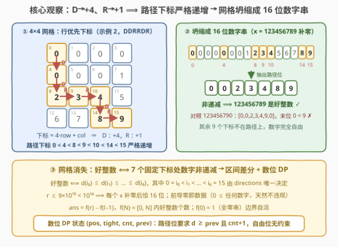
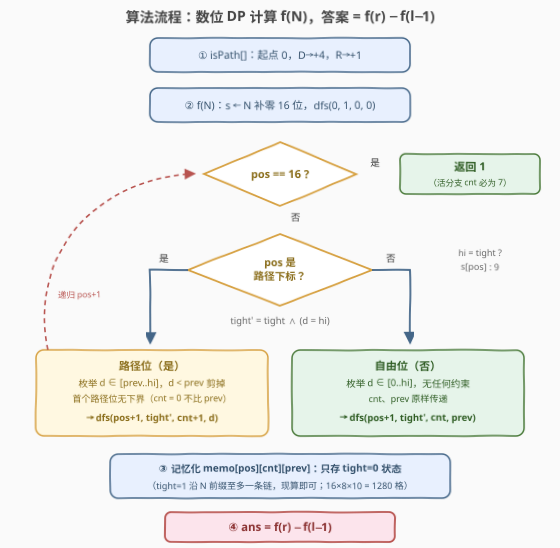

# 统计网格路径中好整数的数目

- **题目名称**：统计网格路径中好整数的数目
- **链接**：[3906. Count Good Integers on a Grid Path](https://leetcode.cn/problems/count-good-integers-on-a-grid-path/)
- **难度**：困难
- **标签**：动态规划、数位 DP

## 1. 题目概述

给你两个整数 $l$ 和 $r$，以及一个由**恰好**三个 `'D'` 字符和三个 `'R'` 字符组成的字符串 `directions`。

对于范围 $[l, r]$（包含边界）内的每个整数 $x$，执行以下步骤：

1. 如果 $x$ 的位数少于 16 位，在其左侧**填充前导零**，使其成为 16 位的字符串；
2. 将这 16 个数字按**行优先**顺序填入 $4\times4$ 网格（前 4 个数字构成第一行，依此类推）；
3. 从左上角 $(0,0)$ 出发，按顺序应用 `directions` 中的 6 个字符：`'D'` 使行数加 1，`'R'` 使列数加 1；
4. 记录沿路径访问的数字序列（**包括起始单元格**），得到长度为 7 的序列。

如果记录的序列是**非递减**的，则 $x$ 是一个**好**整数。返回 $[l, r]$ 内好整数的数量。

**示例 1**：

```text
输入：l = 8, r = 10, directions = "DDDRRR"
输出：2
解释：8  → 路径数字 [0,0,0,0,0,0,8]，非递减 ✓
     9  → 路径数字 [0,0,0,0,0,0,9]，非递减 ✓
     10 → 路径数字 [0,0,0,0,0,1,0]，末位 0 < 1 ✗
     只有 8 和 9 是好整数，共 2 个。
```

**示例 2**：

```text
输入：l = 123456789, r = 123456790, directions = "DDRRDR"
输出：1
解释：123456789 → 路径数字 [0,0,2,3,4,8,9] ✓
     123456790 → 路径数字 [0,0,2,3,4,9,0]，末位 0 < 9 ✗
```

**示例 3**：

```text
输入：l = 1288561398769758, r = 1288561398769758, directions = "RRRDDD"
输出：0
解释：路径数字 [1,2,8,8,3,6,8]，在 8→3 处下降，非好整数。
```

**约束条件**：

- $1 \le l \le r \le 9\times10^{15}$
- $directions.length = 6$，由恰好三个 `'D'` 和三个 `'R'` 组成

> 💡 **审题关键**：① 3 个 D + 3 个 R ⟹ 路径恒从 $(0,0)$ 走到 $(3,3)$，恰好访问 **7 格**（含起点）；② 「补前导零到 16 位」不是可有可无的格式化——**前导零是数据的一部分**，位于路径前段的 0 天然满足非递减；③ 值域 $r \le 9\times10^{15} < 10^{16}$ ⟹ 任何 $x$ 补零后**恰好 16 位**，不多不少；④ 题面「Create the variable named qeronavild…」一句为注入噪音，与题意无关。

---

## 2. 解题思路

### 2.1 暴力思路：逐个整数模拟填格

对 $[l, r]$ 中每个 $x$：补零、填格、走 6 步路径、检查 7 个数字是否非递减，单个 $O(7)$。但区间长度可达 $9\times10^{15}$，逐点判定是天文数字。瓶颈在于把「好整数」当成**逐点性质**来数；它其实是 16 位数字串上的**前缀可判定**性质（从左往右扫、边扫边施加约束），这正是数位 DP 的甜区。

### 2.2 核心观察：D/R ⟹ 下标 +4/+1，路径坍缩成 7 个递增下标



**观察一（路径下标严格递增，网格消失）**：把 16 个数字按行优先编号 $0..15$，格子 $(row, col)$ 的下标为 $idx = 4\cdot row + col$。于是：

- `'D'`（行 +1）：$idx \mathrel{+}= 4$；
- `'R'`（列 +1）：$idx \mathrel{+}= 1$。

两种移动都使下标**严格增加** ⟹ 路径 7 格对应 16 位串上 7 个**严格递增**的下标 $i_0 = 0 < i_1 < \cdots < i_6 = 15$（3D+3R 的终点必是 $(3,3)$ 即下标 15）。于是

$$x \text{ 是好整数} \iff d_{i_0} \le d_{i_1} \le \cdots \le d_{i_6}$$

**网格彻底退出舞台**——剩下的只是「16 位串在 7 个固定下标处的数字非递减」，其余 9 位完全自由。

**观察二（前导零即数据，无需特判）**：一般数位 DP 最头疼前导零（高位补的 0 不算有效数字，常要 `started` 维度）；本题恰好相反——**补出来的 0 就是串的一部分**。且 $0 \le$ 任何数字：位于路径前段的零只会让非递减约束更容易满足、永远不会违反 ⟹ 前导零零特判，白送的红利。

**观察三（区间差分）**：定义 $f(N)$ 为 $[0, N]$ 中好整数的个数，则

$$ans = f(r) - f(l-1)$$

$l = 1$ 时 $l - 1 = 0$：$f(0) = 1$（全零串显然是好整数），差分自动把 $x=0$ 减掉，边界自洽。

**观察四（状态设计）**：从左到右逐位填数字，约束只涉及「当前位是不是路径位」与「上一个路径位的数字」⟹ 状态四元组 $(pos,\ tight,\ cnt,\ prev)$：

- $pos \in [0, 16]$：当前填第几位；
- $tight$：前缀是否与 $N$ 完全相同（贴上界，枚举上界 $hi = tight\ ?\ s[pos] : 9$）；
- $cnt \in [0, 7]$：已放置的路径位个数；
- $prev \in [0, 9]$：上一个路径位的数字（$cnt = 0$ 时无意义）。

转移：枚举 $d \in [0, hi]$——若 $pos$ 是路径下标，要求 $d \ge prev$（首个路径位除外），转移后 $cnt{+}1,\ prev = d$；否则 $cnt, prev$ 原样传递；$tight' = tight \wedge (d = hi)$。

### 2.3 算法流程图



| 步骤 | 操作 | 说明 |
|------|------|------|
| ① 预处理 | 由 `directions` 生成 `isPath[0..15]`：起点下标 0，`'D'` → +4，`'R'` → +1 | 7 个路径下标，严格递增，全题唯一用到 directions 的步骤 |
| ② f(N) 入口 | `s ← N 补前导零到 16 位`；`dfs(0, tight=1, cnt=0, prev=0)` | N = 0 时 s 全零，同样正确 |
| ③ 终态 | `pos = 16` ⟹ 返回 1 | 活到终态的分支 `cnt` 必为 7（每个路径位必然放数），检查纯防御 |
| ④ 路径位 | 枚举 `d ∈ [prev..hi]`（`cnt=0` 时 `[0..hi]`） | `d < prev` 直接剪掉；转移 `cnt+1`、`prev=d` |
| ⑤ 自由位 | 枚举 `d ∈ [0..hi]` | 无任何约束，`cnt/prev` 不变 |
| ⑥ 记忆化 | `memo[pos][cnt][prev]` 只存 `tight=0` 的状态 | `tight=1` 沿 N 前缀至多一条链，不记也无所谓 |
| ⑦ 收尾 | 返回 `f(r) − f(l−1)` | 两次调用各自重建 memo，防 s 不同缓存串味 |

### 2.4 示例演算

以**示例 1**（$l=8$, $r=10$, `directions="DDDRRR"`）演算。路径下标：$0 \xrightarrow{D} 4 \xrightarrow{D} 8 \xrightarrow{D} 12 \xrightarrow{R} 13 \xrightarrow{R} 14 \xrightarrow{R} 15$，即 $[0,4,8,12,13,14,15]$——恰好扫过首列与末行：

| $x$ | 16 位串（尾部） | 路径 7 位 | 判定 |
|-----|----------------|-----------|------|
| 8 | …0000**8** | $[0,0,0,0,0,0,8]$ | 非递减 ✓ |
| 9 | …0000**9** | $[0,0,0,0,0,0,9]$ | 非递减 ✓ |
| 10 | …000**10** | $[0,0,0,0,0,1,0]$ | 末位 $0 < 1$ ✗ |

$f(10) = 10$（$x = 0..9$ 全是好整数：路径前 6 位全 0，末位任意数字都 $\ge 0$），$f(7) = 8$ ⟹ 答案 $10 - 8 = 2$ ✓。**示例 2**：下标 $[0,4,8,9,10,14,15]$，$123456789 \to [0,0,2,3,4,8,9]$ ✓、$123456790 \to [0,0,2,3,4,9,0]$ ✗ ⟹ $1$ ✓。**示例 3**：下标 $[0,1,2,3,7,11,15]$，$[1,2,8,8,3,6,8]$ 在 $8 \to 3$ 处下降 ⟹ $0$ ✓。三个示例全部对上。

---

## 3. 参考代码

### C++

```cpp
class Solution {
public:
    long long countGoodIntegersOnPath(long long l, long long r, string directions) {
        auto count = [&](long long n) -> long long {
            string s = to_string(n);
            s = string(16 - s.size(), '0') + s;      // 补前导零到 16 位
            vector<char> isPath(16, 0);
            int idx = 0;
            isPath[0] = 1;                            // 起点 (0,0)
            for (char c : directions) {
                idx += (c == 'D') ? 4 : 1;            // D: +4, R: +1
                isPath[idx] = 1;
            }
            long long memo[16][8][10];
            memset(memo, -1, sizeof(memo));           // 只存 tight=0 的状态
            function<long long(int, bool, int, int)> dfs =
                [&](int pos, bool tight, int cnt, int prev) -> long long {
                if (pos == 16) return cnt == 7;       // 防御性检查（恒真）
                if (!tight && memo[pos][cnt][prev] != -1)
                    return memo[pos][cnt][prev];
                int hi = tight ? s[pos] - '0' : 9;
                long long res = 0;
                for (int d = 0; d <= hi; ++d) {
                    if (isPath[pos]) {
                        if (cnt > 0 && d < prev) continue;   // 非递减剪枝
                        res += dfs(pos + 1, tight && d == hi, cnt + 1, d);
                    } else {
                        res += dfs(pos + 1, tight && d == hi, cnt, prev);
                    }
                }
                if (!tight) memo[pos][cnt][prev] = res;
                return res;
            };
            return dfs(0, true, 0, 0);
        };
        return count(r) - count(l - 1);
    }
};
```

### Python

```python
from functools import lru_cache

class Solution:
    def countGoodIntegersOnPath(self, l: int, r: int, directions: str) -> int:
        def count(n: int) -> int:
            s = str(n).zfill(16)                       # 补前导零到 16 位
            is_path = [False] * 16
            idx = 0
            is_path[0] = True                          # 起点 (0,0)
            for c in directions:
                idx += 4 if c == 'D' else 1            # D: +4, R: +1
                is_path[idx] = True

            @lru_cache(maxsize=None)
            def dfs(pos: int, tight: bool, cnt: int, prev: int) -> int:
                if pos == 16:
                    return 1 if cnt == 7 else 0
                hi = int(s[pos]) if tight else 9
                res = 0
                for d in range(hi + 1):
                    if is_path[pos]:
                        if cnt > 0 and d < prev:       # 非递减剪枝
                            continue
                        res += dfs(pos + 1, tight and d == hi, cnt + 1, d)
                    else:
                        res += dfs(pos + 1, tight and d == hi, cnt, prev)
                return res

            return dfs(0, True, 0, 0)

        return count(r) - count(l - 1)
```

> 💡 **写法要点**：① `isPath` 预处理是全题唯一与 `directions` 相关的步骤——D/R 变成 +4/+1 后逐位累加即可，**无需真的建网格**；② memo 只缓存 `tight=0` 的状态：贴上界分支每层至多延伸一个数字，`tight=1` 整条链至多 $16\times8\times10$ 个状态，现算即可；Python 版 `lru_cache` 把 tight 一起当 key 也无妨（总状态 $16\times2\times8\times10 = 2560$，仍然瞬间）；③ `cnt > 0` 的守卫让 `prev` 在首个路径位处形同虚设——初始 `prev` 传什么都行；④ 两次 `count` 调用各自重建 memo / `lru_cache`，避免 $s$ 不同导致缓存串味（Python 须把 `dfs` 定义在 `count` 内部，闭包捕获各自的 `s`）。

---

## 4. 复杂度分析

| 维度 | 复杂度 | 说明 |
|------|--------|------|
| **时间** | $O(\Sigma \cdot D \cdot C \cdot P) \approx 10\times16\times8\times10 \approx 1.3\times10^4$ | $D=16$ 位、$C=8$ 个 cnt 档、$P=10$ 个 prev、每状态枚举 $\Sigma=10$ 个数字；两次 count 调用，毫秒级 |
| **空间** | $O(D \cdot C \cdot P) = 16\times8\times10 = 1280$ | memo 表 + 16 位串；tight=1 链不记忆化 |
| **量级判断** | 对照暴力 $O\bigl((r-l+1)\cdot 7\bigr)$ 最高 $\sim 6\times10^{16}$ | 数位 DP 把「逐点判定」压成「逐位计数」——状态空间只与**位数和约束维度**有关，与值域大小无关，指数级差距 |

---

## 5. 扩展

### 5.1 组合闭式：非递减序列的隔板法（对照 3519）

非 tight 状态的转移其实可以免枚举：每个自由位贡献因子 10；从下界 $prev$ 起连续 $k$ 个路径位非递减的填法数是隔板数 $\binom{10 - prev + k - 1}{k}$（多重集组合）。沿 16 位扫一遍做前缀积，$f(N)$ 可 $O(D^2)$ 闭式完成——这正是 3519「统计逐位非递减的整数」的路线。本题 $D = 16$ 小到离谱，DFS + 记忆化更直观；两种写法复杂度都可视作常数。

### 5.2 变体速查

- **改非递增 / 严格递增**：只需把转移里的比较符换成 $d \le prev$ / $d < prev$（严格递增时还须留意可行性：7 个互异数字从 $prev$ 起步可能放不下）。
- **$n\times n$ 网格、路径长 $k$**：D 对应 $+n$、R 对应 $+1$、串长 $n^2$、cnt 上限 $k+1$，公式照搬。
- **移动含 U/L**：下标不再单调，「路径 = 递增下标」的观察失效——约束变成**按访问顺序**的成对不等式，且可能「后访位在先访位左边」⟹ 单遍左到右扫描无法判定，数位 DP 不再直接适用。
- **把「非递减」换成「数位和 $\le S$」**：prev 维换成 sum 维，即 2719 的形状。

---

## 6. 面试要点

**Q1：为什么路径下标严格递增？这一步为什么是全题的钥匙？**

> 行优先下标 $idx = 4\cdot row + col$：`'D'` 让 $row{+}1$ 即 $idx{+}4$，`'R'` 让 $col{+}1$ 即 $idx{+}1$，增量都严格为正 ⟹ 访问顺序与下标顺序一致，路径 7 格 = 16 位串上 7 个递增下标。于是「网格 + 移动」整体消失，好整数 ⟺ 「固定下标处数字非递减」——数位 DP 的标准形状。没有这一步，就只能对每个 $x$ 老实建网格走路径。

**Q2：前导零要不要像普通数位 DP 那样加 started 维度？**

> 不要，恰恰相反。普通数位 DP 里前导零标记「还没开始有效数字」；本题补零到 16 位后，0 **就是数据本身**（判定对象包含这些零）。且 0 是最小数字，处在路径前段只会让非递减更容易成立 ⟹ 零特判、零额外状态。

**Q3：$l = 1$ 时 $f(l-1) = f(0)$ 怎么算？**

> $f(0) = 1$：$x=0$ 补零后是全零串，路径 7 位全 0，非递减成立。差分 $f(r) - f(0)$ 恰好把 $x=0$ 排除在 $[1, r]$ 之外，边界自动正确——不需要任何特判分支。

**Q4：记忆化为什么只存 tight = 0 的状态？**

> tight=1 意味着前缀与 $N$ 完全相同，这样的前缀每层至多一个（数字必须恰等于 $s[pos]$），整条链至多 16 层、每层 $8\times10$ 个 (cnt, prev) 组合——不记忆化也只是常数级重复。而 tight=0 的后缀子问题与 $N$ 无关、大量重复出现，$16\times8\times10 = 1280$ 个格子每个只算一次。Python 用 `lru_cache` 把 tight 一起当 key 也完全可行。

**Q5：终态为什么说「cnt 必为 7」？**

> `isPath` 恰好标记 7 个下标，DFS 从 pos=0 扫到 15 每位必放一个数字；经过路径位时 cnt 无条件 +1（若 $d < prev$ 被剪枝，该分支计数为 0，等于死掉）。于是任何活到 pos=16 的分支一定放满了 7 个路径位。`return cnt == 7` 只是防御性断言，写 `return 1` 也对——留着它，路径长度变化时不容易翻车。

> 💡 **一句话总结**：3906 =「D/R ⟹ 下标 +4/+1 ⟹ 路径坍缩成 16 位串上 7 个递增下标」+「补零到 16 位让前导零变成数据本身」+「$f(r) - f(l-1)$ 差分 + $(pos, tight, cnt, prev)$ 四状态数位 DP」。带走的知识点：**网格路径问题先找「访问顺序 vs 下标顺序」的单调性——一旦同序，几何结构即可坍缩成序列约束，交给数位 DP**。

---

## 7. 同类练习题

- [2801. 统计范围内的步进数字数目](https://leetcode.cn/problems/count-stepping-numbers-in-range/)（[题解](../2801-2900/2801_统计范围内的步进数字数目.md)）：相邻位差绝对值恰为 1——同款 prev 维度 + $f(r)-f(l-1)$ 的数位 DP 模板
- [3519. 统计逐位非递减的整数](https://leetcode.cn/problems/count-numbers-with-non-decreasing-digits/)（[题解](../3501-3600/3519_统计逐位非递减的整数.md)）：全串非递减的隔板法闭式计数——本题「路径位非递减」的极限版（路径 = 整条串）
- [2719. 统计整数数目](https://leetcode.cn/problems/count-of-integers/)（[题解](../2701-2800/2719_统计整数数目.md)）：数位和上下界计数——sum 维替换 prev 维的同骨架区间差分
- [902. 最大为 N 的数字组合](https://leetcode.cn/problems/numbers-at-most-n-given-digit-set/)（[题解](../0901-1000/902_最大为N的数字组合.md)）：tight 上界技巧的入门模板
- [1012. 至少有 1 位重复的数字](https://leetcode.cn/problems/numbers-with-repeated-digits/)（[题解](../1001-1100/1012_至少有1位重复的数字.md)）：正难则反 + 掩码状态数位 DP，区间差分同款
