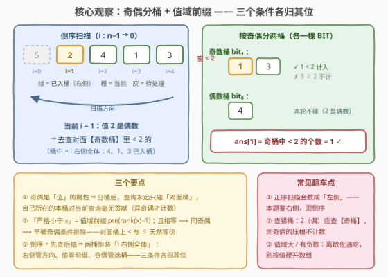
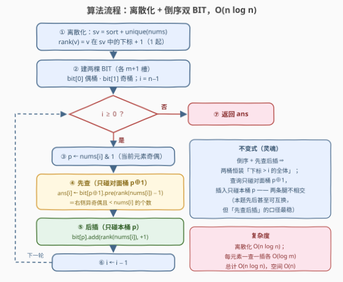

# LeetCode 统计具有相反奇偶性的较小元素 题解

## 1. 题目概述

- **标题 / 题号**：统计具有相反奇偶性的较小元素（#3907，medium）
- **链接**：https://leetcode.cn/problems/count-smaller-elements-with-opposite-parity/
- **难度**：中等
- **标签**：树状数组、数组、离散化、归并排序

> ⚠️ 本题为 LeetCode 付费题，题意描述根据官方示例用例与 hints 重建，可能与官方题面有出入；示例输出与参考代码已用自洽暴力对拍验证。

**题意**：给你一个长度为 $n$ 的整数数组 $nums$。对每个下标 $i$，统计同时满足以下三个条件的下标 $j$ 的个数：

1. $j > i$（位于 $i$ **右侧**）；
2. $nums[j] < nums[i]$（值**严格小于**）；
3. $nums[j]$ 与 $nums[i]$ **奇偶性相反**（一奇一偶）。

返回数组 $ans$，$ans[i]$ 即上述个数。

**示例 1**：

```text
输入：nums = [5,2,4,1,3]
输出：[2,1,2,0,0]
解释：i=0（5 奇）：右侧更小的偶数有 2、4 → 2；
     i=1（2 偶）：右侧更小的奇数有 1 → 1；
     i=2（4 偶）：右侧更小的奇数有 1、3 → 2；
     i=3（1 奇）：右侧无比 1 小的偶数 → 0；
     i=4：右侧无元素 → 0。
```

**示例 2**：

```text
输入：nums = [4,4,1]
输出：[1,1,0]
解释：两个 4（偶）的右侧都恰有一个更小的奇数 1。
```

**示例 3**：

```text
输入：nums = [7]
输出：[0]
```

**约束条件**（付费题，按同类题惯例重建，以官方为准）：

- $1 \le n \le 10^5$
- $1 \le nums[i] \le 10^5$（本文离散化写法对任意值域、含负数均成立）

> 💡 **审题关键**：① 三个条件**各管一件事**：「右侧」管**扫描方向**、「严格小于」管**值域前缀**、「奇偶相反」管**选哪只桶**——把它们拆开喂给不同机制，就是本题的全部；② 本题是 [315. 计算右侧小于当前元素的个数](https://leetcode.cn/problems/count-of-smaller-numbers-after-self/) 的**奇偶分桶版**，315 会做本题就会；③ 奇偶相反 ⟹ **相等值永远不计数**（相等必同奇偶），所以「严格小于」在这个口径下其实是被奇偶条件"顺带"保证的——一个可爱的冷知识，见 2.2。

## 2. 解题思路

### 2.1 暴力思路：每个 i 扫一遍右侧

对每个 $i$ 枚举所有 $j > i$ 做三条件判定，总复杂度 $O(n^2)$。$n = 10^5$ 时约 $5\times10^9$ 次判定，必然超时。瓶颈在于：指针每左移一格，「右侧元素的奇偶 × 值分布」只变化**一个元素**，暴力却把整个分布从头重数一遍——应该**增量维护**，而不是反复全量扫描。

### 2.2 核心观察：奇偶分桶 + 值域前缀（倒序双 BIT）



**观察一（奇偶是「值」的属性 ⇒ 分桶）**：一个元素的奇偶只由它的**值**决定，与下标、与谁来查询都无关。于是把"已见过的右侧元素"按奇偶分成两只多重集合桶：**偶桶**与**奇桶**。对查询 $i$ 而言，"奇偶相反"就此坍缩成一次 **O(1) 的选桶动作**——$nums[i]$ 是偶数就只碰奇桶，是奇数就只碰偶桶；**自己所在的桶对当前查询毫无贡献**。

**观察二（「严格小于」是值域前缀 ⇒ 树状数组）**：桶内要回答"有多少个值 $< x$"——经典的**值域前缀计数**：单点插入 $+1$、前缀求和，树状数组（BIT）$O(\log m)$ 一发入魂。值域大就先**离散化**。

**观察三（「右侧」= 时间倒流的「已见」⇒ 倒序先查后插）**：从 $n-1$ 往左扫。处理 $i$ 时，两桶里装的恰好是**下标 $> i$ 的全体元素**。记 $p_i = nums[i] \bmod 2$，$\text{rank}(v)$ 为离散化后 $v$ 的排名（1 起），则

$$ans[i] = \mathrm{BIT}[\,p_i \oplus 1\,].\mathrm{pre}\bigl(\text{rank}(nums[i]) - 1\bigr)$$

查完再把 $nums[i]$ 插进自己奇偶的桶，指针左移，不变式「桶 = 右侧全体」保持到最后一格。

> 💡 **冷知识一：本题的「严格小于」是白送的**。相等 $\Rightarrow$ 同奇偶 $\Rightarrow$ 早被奇偶条件排除，所以**对面桶里根本不存在等于 $nums[i]$ 的值**——前缀查到 $\text{rank}(nums[i])-1$（严格 $<$）与查到 $\text{rank}(nums[i])$（$\le$）结果恒相同（已对拍 5000 组验证）。
>
> **冷知识二：连「先查后插」的次序都可以换**。查询打的是对面桶 $p \oplus 1$、插入打的是本桶 $p$——**两条腿永不相交**，先后无所谓（同样对拍验证）。但保留「先查后插」的口径是在维护不变式「桶 = 右侧全体」，条件一改（如同奇偶版）也不会翻车，建议默认这么写。

三句话合起来：

> **奇偶选桶、值选前缀、倒序保「右侧」——每个元素一次对面桶前缀查询 + 一次本桶插入，两棵 BIT 各司其职。**

### 2.3 算法流程图



| 步骤 | 操作 | 说明 |
|------|------|------|
| ① 离散化 | $sv \leftarrow$ sort + unique(nums)，$\text{rank}(v)$ = 下标 + 1 | 值域任意大 / 含负数通吃；$m = |sv| \le n$ |
| ② 初始化 | bit[0]（偶桶）、bit[1]（奇桶）各 $m+1$ 槽；$i = n-1$ | 两棵 BIT 互相独立 |
| ③ 判奇偶 | $p \leftarrow nums[i] \,\&\, 1$ | 选定"对面桶" $p \oplus 1$ |
| ④ 先查 | $ans[i] \leftarrow \mathrm{bit}[p \oplus 1].\mathrm{pre}(\text{rank}(nums[i]) - 1)$ | 对面桶中值 $< nums[i]$ 的个数，$O(\log m)$ |
| ⑤ 后插 | $\mathrm{bit}[p].\mathrm{add}(\text{rank}(nums[i]), +1)$ | 自己进本桶，$O(\log m)$ |
| ⑥ 左移 | $i \leftarrow i - 1$，回到 ③ | $i < 0$ 时循环结束 |
| ⑦ 收尾 | 返回 $ans$ | —— |

### 2.4 示例演算

以**示例 1**（$nums = [5,2,4,1,3]$）演算（倒序，桶内容列出**已插入**的值）：

| $i$ | $nums[i]$ | 奇偶 $p$ | 奇桶内容 | 偶桶内容 | 查询（对面桶中 $< nums[i]$） | $ans[i]$ |
|-----|-----------|----------|----------|----------|------------------------------|----------|
| 4 | 3 | 奇 | $\varnothing$ | $\varnothing$ | 偶桶空 → 0 | 0 |
| 3 | 1 | 奇 | $\{3\}$ | $\varnothing$ | 偶桶空 → 0 | 0 |
| 2 | 4 | 偶 | $\{1,3\}$ | $\varnothing$ | 奇桶 $<4$：$1,3$ | 2 |
| 1 | 2 | 偶 | $\{1,3\}$ | $\{4\}$ | 奇桶 $<2$：$1$ | 1 |
| 0 | 5 | 奇 | $\{1,3\}$ | $\{2,4\}$ | 偶桶 $<5$：$2,4$ | 2 |

得 $ans = [2,1,2,0,0]$ ✓。**示例 2**：$i=2$（1 奇）两桶空 → 0；$i=1$（4 偶）查奇桶 $\{1\}$ 中 $<4$ → 1；$i=0$ 同理 → 1，得 $[1,1,0]$ ✓。**示例 3** 单元素 → $[0]$ ✓。

## 3. 参考代码

### C++

```cpp
class Solution {
public:
    vector<int> countSmallerElements(vector<int>& nums) {
        int n = nums.size();
        vector<int> sv(nums);                        // 离散化：值 -> 排名（1 起）
        sort(sv.begin(), sv.end());
        sv.erase(unique(sv.begin(), sv.end()), sv.end());
        int m = sv.size();
        auto rk = [&](int v) {
            return int(lower_bound(sv.begin(), sv.end(), v) - sv.begin()) + 1;
        };

        vector<int> bit[2] = {vector<int>(m + 1), vector<int>(m + 1)};  // [偶桶, 奇桶]
        auto add = [&](int p, int i) {
            for (; i <= m; i += i & -i) bit[p][i] += 1;
        };
        auto pre = [&](int p, int i) {               // 排名前缀 [1, i]
            int s = 0;
            for (; i > 0; i -= i & -i) s += bit[p][i];
            return s;
        };

        vector<int> ans(n);
        for (int i = n - 1; i >= 0; --i) {
            int p = nums[i] & 1;
            ans[i] = pre(p ^ 1, rk(nums[i]) - 1);    // 先查：对面桶中严格小于的
            add(p, rk(nums[i]));                     // 后插：自己进本桶
        }
        return ans;
    }
};
```

### Python

```python
class Solution:
    def countSmallerElements(self, nums: List[int]) -> List[int]:
        sv = sorted(set(nums))                        # 离散化：值 -> 排名（1 起）
        rank = {v: i + 1 for i, v in enumerate(sv)}
        m = len(sv)
        bit = [[0] * (m + 1) for _ in range(2)]       # [偶桶, 奇桶]

        def add(p: int, i: int) -> None:
            while i <= m:
                bit[p][i] += 1
                i += i & -i

        def pre(p: int, i: int) -> int:               # 排名前缀 [1, i]
            s = 0
            while i > 0:
                s += bit[p][i]
                i -= i & -i
            return s

        ans = [0] * len(nums)
        for i in range(len(nums) - 1, -1, -1):
            p = nums[i] & 1
            ans[i] = pre(p ^ 1, rank[nums[i]] - 1)    # 先查：对面桶
            add(p, rank[nums[i]])                     # 后插：本桶
        return ans
```

> 💡 **写法要点**：① `p ^ 1` 是"对面桶"的全部秘密——奇偶只有两类，异或 1 即取另一类；若过滤条件有 $k$ 类（如按模 $k$ 余数、按颜色），推广为 $k$ 棵 BIT、查询累加 $k-1$ 个"非本类"桶；② 前缀查到 `rank - 1` 表"严格小于"，由冷知识一查到 `rank` 也对，但别养成依赖——换成同奇偶口径就露馅；③ 离散化让代码对 $10^9$ 值域、负数全部免疫（C++ 版已用含负数用例对拍）；若确知 $nums[i] \le 10^5$ 可直接用值当 BIT 下标，省掉排序；④ 本题为付费题，函数签名 `countSmallerElements` 按题意推定（官方无代码模板），以实际提交页为准；⑤ `nums[i] & 1` 对负数同样给出正确奇偶（补码表示）。

## 4. 复杂度分析

| 维度 | 复杂度 | 说明 |
|------|--------|------|
| **时间** | $O(n \log n)$ | 离散化排序 $O(n\log n)$；每元素一次前缀查询 + 一次单点插入各 $O(\log m)$，$m \le n$ |
| **空间** | $O(n)$ | 两棵 BIT 共 $2(m+1)$ 个计数槽；离散化数组与排名结构 $O(n)$ |
| **量级判断** | 约 $3.4\times10^6$ 次 BIT 节点访问 | $n = 10^5$：$2n\log_2 m \approx 2\times10^5\times17$；对照暴力 $O(n^2) = 10^{10}$ 次判定，快三个数量级 |

## 5. 扩展

### 5.1 归并排序计数版

「$j > i$ 且 $nums[j] < nums[i]$」正是**逆序对**的口径，本题即逆序对的**奇偶过滤版**，可用归并排序统计：两半各自排好序后按值升序归并，右半元素在被左半当前元素吸收之前先被弹出——**已弹出的右半元素都小于当前左半元素**且下标必在其右侧。于是维护 `popOdd / popEven` 两个计数器（右半已弹出元素的奇偶计数），左半元素 $x$ 出队时，它的跨半贡献就是 $\text{pop}[p_x \oplus 1]$；同半内的对递归解决。总复杂度同为 $O(n\log n)$，胜在**无需离散化、值域天然免疫**（直接比较原始值）；工程上 BIT 版代码更短更稳，两套都值得会。

### 5.2 变体速查

- **改「左侧」**（= 315 原版加奇偶过滤）：正序扫描、先查后插，其余一字不改。
- **改「大于」**：前缀改后缀，$\mathrm{pre}(m) - \mathrm{pre}(\text{rank})$。
- **改「同奇偶」**：查询打**本桶** `pre(p, rank(nums[i])−1)`——注意此时 `<` 与 `≤` **有区别了**（相等值全在本桶）；若口径是 `≤`（前缀查到 rank），先插后查会把自己数进去，**必须先查后插**。
- **改「计数对总数」而非逐下标**：对 $ans$ 求和即可，别另写一套。
- **$k$ 类过滤推广**（模 $k$ 余数不同 / 颜色不同……）：$k$ 棵 BIT，查询 = 非本类桶前缀之和；或单棵 BIT 以（类, 值）复合键压平。

## 6. 面试要点

**Q1：为什么拆两只桶，而不是一只 BIT 里同时存奇偶？**

> 奇偶条件的作用是"筛掉同奇偶的"——分桶后这次筛选变成 **O(1) 选桶**（$p \oplus 1$），桶内 BIT 只管纯值域问题，职责单一。单桶也能做（键压平成 $2m$ 个槽，查询拼两段前缀），但不如两棵树直白。本质：**值域条件交给 BIT、类别条件交给选桶**，各得其所。

**Q2：倒序扫描里「先查后插」能换吗？**

> 本题能——查询打 $p\oplus1$ 桶、插入打 $p$ 桶，两条腿永不相交（对拍验证过）。但一旦口径改成"同奇偶 + $\le$"，先插就会把自己数进去。保持"先查后插"是在维护不变式「桶中 = 下标 $> i$ 的全体」，这个口径对任何变体都不破。

**Q3：离散化怎么落位？「严格小于」怎么体现？**

> 排序 + 去重后排名从 1 起；"严格小于 $x$" = 前缀查到 $\text{rank}(x)-1$。本题对面桶不含等值（相等必同奇偶），查到 rank 也对——但这是奇偶口径的白送，不是通例，换口径前先想清楚。

**Q4：和 315 题的关系？本题还能怎么退化 / 推广？**

> 315 是去掉奇偶条件的母题（单桶 BIT / 归并 / 平衡树均可）。本题是"带类别过滤的 count smaller"的最小变体：类别数 2、查询只碰非本类。类别数推到 $k$ 就是 $k$ 桶 BIT；再叠加区间查询就走线段树套桶 / 离线扫描一族。

**Q5：暴力为什么死、BIT 为什么活？**

> 暴力对每个 $i$ 重新扫描整个右侧，$O(n^2)$；BIT 把"右侧的奇偶 × 值分布"**增量维护**——指针每左移一格只发生一次插入，"分布"到"答案"的转化是一次 $O(\log m)$ 前缀查询。信息不重复计算，这是整个 count-smaller 族共同的省时逻辑。

> 💡 **一句话总结**：3907 = 315 的奇偶分桶版——「右侧」交给倒序扫描、「严格小于」交给值域前缀、「奇偶相反」交给选桶 $p \oplus 1$，两棵 BIT 各司其职 $O(n\log n)$ 收工。带走的知识点：**带类别过滤的统计问题，先把条件拆成"方向 / 值域 / 类别"三件套，再各自交给最便宜的机制**。

## 同类练习题

| # | 题目 | 与本题的关联 |
|---|------|-------------|
| 315 | [计算右侧小于当前元素的个数](https://leetcode.cn/problems/count-of-smaller-numbers-after-self/)（[题解](../0301-0400/315_计算右侧小于当前元素的个数.md)） | 本题去掉奇偶过滤的母题，倒序 BIT 模板出处 |
| 493 | [翻转对](https://leetcode.cn/problems/reverse-pairs/)（[题解](../0401-0500/493_翻转对.md)） | count-smaller 的"翻倍比较"变体，归并 / BIT 双解对照 |
| 327 | [区间和的个数](https://leetcode.cn/problems/count-of-range-sum/)（[题解](../0301-0400/327_区间和的个数.md)） | 前缀和 + 离散化 + 树状数组计数组合拳，练习离散化落位 |
| 922 | [按奇偶排序数组 II](https://leetcode.cn/problems/sort-array-by-parity-ii/)（[题解](../0901-1000/922_按奇偶排序数组II.md)） | 奇偶分桶的退化版——只分桶不计数，体会"奇偶是值的属性" |
| 1512 | [好数对的数目](https://leetcode.cn/problems/number-of-good-pairs/)（[题解](../1501-1600/1512_好数对的数目.md)） | 正序「先查后插」的一趟哈希计数，与本题互为方向镜像 |
