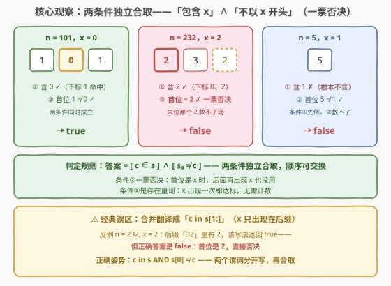
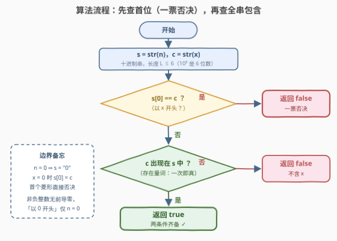

# 有效数字整数

- **题目名称**：有效数字整数
- **链接**：[3908. Valid Digit Number](https://leetcode.cn/problems/valid-digit-number/)
- **难度**：简单
- **标签**：数学、字符串

## 1. 题目概述

给你一个整数 `n` 和一个数字 `x`。如果一个数字满足以下条件，则认为它是**有效**的：

- 它包含**至少一个**数字 `x`，并且
- 它**不以**数字 `x` **开头**。

如果 `n` 是有效的，请返回 `true`，否则返回 `false`。

**示例 1**：

```text
输入：n = 101, x = 0
输出：true
解释：该数字在下标 1 处包含数字 0。它不以 0 开头，因此满足两个条件。
```

**示例 2**：

```text
输入：n = 232, x = 2
输出：false
解释：该数字以 2 开头，违反了条件。
```

**示例 3**：

```text
输入：n = 5, x = 1
输出：false
解释：该数字不包含数字 1。
```

**约束条件**：

- $0 \le n \le 10^5$
- $0 \le x \le 9$

> 💡 **审题关键**：两个条件是**独立的合取关系**——同时成立才返回 `true`，任一不成立即 `false`。尤其注意示例 2：`232` 中的 `2` **既在首位又在末位**，「包含 2」成立，但「以 2 开头」这条**一票否决**——不要把条件②偷换成「`x` 也出现在后缀」。另外 `n = 0` 是边界：`"0"` 是非负整数十进制表示中唯一「以 0 开头」的情形。

---

## 2. 解题思路

### 2.1 暴力思路：按定义直译

把 `n` 转成十进制字符串 `s`，维护两个布尔量——`contains`（是否出现过数字 `x`）与 `first`（`s[0]` 是否等于 `x`），返回 `contains and not first`。一遍扫描 $O(L)$（$L$ 为位数，本题至多 6），这已经是渐近最优——数据规模 $n \le 10^5$ 本没有复杂度压力，本题的考点在**条件翻译是否准确**与**边界是否踩全**。

### 2.2 核心观察：两个条件的合取 + 两个雷区



**观察一（合取 + 一票否决）。** 答案就是两个独立判定的**逻辑与**：

$$\text{valid}(n, x) \;=\; \big[\, \text{str}(x) \in s \,\big] \;\wedge\; \big[\, s_0 \ne \text{str}(x) \,\big]$$

两条判断互不依赖、可任意交换顺序（交换只影响常数次字符比较）。任一条不满足直接 `false`：

- **条件②一票否决**：只要首位是 `x`，后面有没有 `x` 都无所谓（示例 2 的 `232`：末位也是 `2`，照样 `false`）；
- **条件①是存在量词**：`x` 出现**一次**即达标，无需计数。

**观察二（前导零只在 n = 0 出现）。** 非负整数的十进制表示**没有前导零**——「以 `0` 开头」当且仅当 `n = 0`。当 `x = 0` 时条件②几乎恒成立，唯一雷点是 `n = 0` 本身：`s = "0"` 首位即 `0`，返回 `false`。

> ⚠️ **经典误区**：把两条条件「合并」成 `c in s[1:]`（即「`x` 出现在去掉首位的后缀里」）。反例正是 `n = 232, x = 2`：后缀 `"32"` 含 `2`，该写法返回 `true`，而正确答案是 `false`。根源在于：「不以 `x` 开头」**不是**「`x` 不出现在首位」，而是对整个数首位的独立约束；条件①的「包含」考察的是**全串**（含首位）。

**观察三（算术版同样一遍循环）。** 不转字符串也可做：反复 ÷10 求首位，`%10` 逐位判等判包含。注意判包含的循环要用 **do-while 语义**——`n = 0` 时循环体也要执行一次（`0 % 10 == 0`）。详见第 5 节。

### 2.3 算法流程图



| 步骤 | 操作 | 说明 |
|------|------|------|
| ① | `s = str(n)`，`c = str(x)` | 十进制串，$L \le 6$（$10^5$ 是 6 位数） |
| ② | 判断 `s[0] == c` | 是 → 直接 `false`（一票否决，顺带覆盖 `n=0, x=0` 边界） |
| ③ | 判断 `c` 是否出现在 `s` 中 | `find` / `in`，存在量词，出现一次即真 |
| ④ | 返回 ③ 的结果 | ②已排除首位命中，③为真即两条件齐备 |

### 2.4 示例演算

| `n` | `x` | `s` | 首位 = x？ | 含 x？ | 结论 |
|-----|-----|------|-----------|--------|------|
| 101 | 0 | `"101"` | `'1' ≠ '0'` ✓ | ✓（下标 1） | `true` |
| 232 | 2 | `"232"` | `'2' == '2'` ✗ | ✓（下标 0、2） | `false` |
| 5 | 1 | `"5"` | `'5' ≠ '1'` ✓ | ✗ | `false` |
| 0 | 0 | `"0"` | `'0' == '0'` ✗ | ✓ | `false`（边界） |
| 10 | 0 | `"10"` | `'1' ≠ '0'` ✓ | ✓（下标 1） | `true` |

最后一行是 `x = 0` 时最典型的正例；倒数第二行是 `n = 0` 的边界反例。

---

## 3. 参考代码

### C++

```cpp
class Solution {
public:
    bool validDigit(int n, int x) {
        string s = to_string(n);
        char c = '0' + x;
        return s[0] != c && s.find(c) != string::npos;  // 一票否决 + 存在判定
    }
};
```

> 💡 **写法要点**：
> - `s.find(c) != string::npos` 是 C++ 里「存在」判定的标准写法；`string::npos` 是无符号最大值，不要写成 `!= -1`（有符号/无符号比较告警）；
> - 两个判断用 `&&` 串联，靠短路先做 $O(1)$ 的首位比较——对本题规模无所谓，纯属顺手。

### Python

```python
class Solution:
    def validDigit(self, n: int, x: int) -> bool:
        s, c = str(n), str(x)
        return s[0] != c and c in s
```

> 💡 **写法要点**：
> - `c in s` 是子串存在判定，`c` 为单字符时即「数字出现至少一次」；
> - 若写成 `c in s[1:]` 就踩了 2.2 的经典误区——`n=232, x=2` 会误判 `True`。

---

## 4. 复杂度分析

| 维度 | 复杂度 | 说明 |
|------|--------|------|
| 时间 | $O(L)$，$L \le 6$ | 首位比较 $O(1)$ + 全串查找一遍，$L = \lfloor \log_{10} n \rfloor + 1$ |
| 空间 | $O(L)$ | `to_string` / `str()` 的临时串；用第 5 节算术版可降到 $O(1)$ |

---

## 5. 扩展：不转字符串的纯算术版

面试若被追问「不用字符串怎么做」，用除法和取模一遍搞定，空间 $O(1)$：

```cpp
class Solution {
public:
    bool validDigit(int n, int x) {
        int first = n;
        while (first >= 10) first /= 10;          // 求首位；n=0 时循环不执行，first=0
        if (first == x) return false;             // 一票否决：以 x 开头
        int t = n;
        do {                                      // do-while：保证 n=0 也检查一次
            if (t % 10 == x) return true;         // 存在判定：出现一次即真
        } while ((t /= 10) > 0);
        return false;
    }
};
```

两个细节：① 求首位时 `n = 0` 循环体不执行、`first = 0`，恰好正确；② 判包含建议用 **do-while**——`n = 0` 时若写成 `while (t > 0)` 循环一次都不进，本题碰巧仍是 `false`（`x=0` 已被首位否决、`x≠0` 本就不含），但「**0 也要参与一次数位枚举**」这个意识在 258 题（各位相加）等场景是硬性要求，模式要按稳的写。

---

## 6. 面试要点

**Q1：为什么 `c in s[1:]` 是错的？**

> 它把「不以 x 开头」翻译成了「x 只出现在后缀」，顺手把条件①的搜索范围从全串缩到了后缀。反例 `n=232, x=2`：`x` 在首位和末位都出现，正确答案是 `false`（首位一票否决），而 `c in s[1:]` 看到 `"32"` 里有 `2` 返回 `true`。正确写法是两个独立判定的合取：`c in s and s[0] != c`。

**Q2：`n = 0, x = 0` 输出什么？**

> `false`。`str(0) = "0"`，首位就是 `0`，条件②不满足。这也是非负整数十进制表示中**唯一**「以 0 开头」的情形——除此之外没有前导零。

**Q3：两个条件的判断顺序重要吗？**

> 逻辑上是合取、可交换；工程上把 $O(1)$ 的首位比较放前面靠短路省几次字符比较，纯属常数优化。本题规模下两种顺序都对。

**Q4：不用字符串如何求「首位」和「包含」？**

> 首位：`while (t >= 10) t /= 10`；包含：do-while 里 `t % 10 == x` 逐位判等。注意 do-while 保证 `n = 0` 时数位枚举也执行一次（见第 5 节）。

**Q5：这题有什么可推广的套路？**

> 「整数 → 十进制字符串 → 数位层面做判定」是数位题的万能第一步；条件翻译时**逐条独立成谓词再合取**，比「一句话合并」更不易错——本题的 `s[1:]` 误区就是合并翻译的典型翻车。

> 💡 **一句话总结**：`s = str(n)`，返回 `s[0] != c and c in s`；雷区有二——`c in s[1:]` 的错误合并、`n = 0` 的前导零边界。

---

## 7. 同类练习题

- [258. 各位相加](https://leetcode.cn/problems/add-digits/)：反复数位求和，同款「整数 → 数位枚举」基本功（同样要小心 0）
- [9. 回文数](https://leetcode.cn/problems/palindrome-number/)：数位正反对称判定，练习不转字符串的取模/除法数位操作
- [2520. 统计能整除数字的位数](https://leetcode.cn/problems/count-the-digits-that-divide-a-number/)：逐位取模统计，数位枚举 + 条件计数的直接练习
- [2843. 统计对称整数的数目](https://leetcode.cn/problems/count-symmetric-integers/)：把本题风格的「单数判定」套上外层枚举，变成区间计数
- [2310. 个位数字为 K 的整数之和](https://leetcode.cn/problems/sum-of-numbers-with-units-digit-k/)：按「个位数字」这一数位属性构造整数，数位约束的构造向变体
