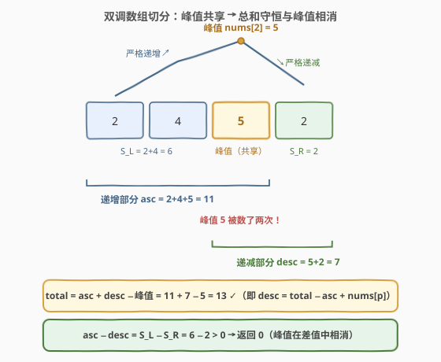
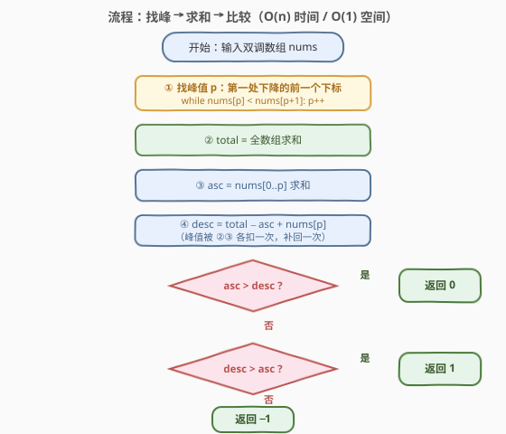

# 比较双调部分的和

- **题目名称**：比较双调部分的和
- **链接**：[3909. 比较双调部分的和](https://leetcode.cn/problems/compare-sums-of-bitonic-parts/)
- **难度**：中等
- **标签**：数组、前缀和

## 1. 题目概述

**题意**：给定长度为 $n$ 的**双调**数组 `nums`——在到达**单个峰值**元素之前**严格递增**，之后**严格递减**。把数组分成两部分：

- **递增部分**：下标 $0$ 到峰值元素（**包含**）；
- **递减部分**：峰值元素到下标 $n-1$（**包含**）——**峰值同时属于这两部分**。

返回：递增部分的和更大返回 $0$；递减部分的和更大返回 $1$；相等返回 $-1$。

**示例 1**：

```text
输入：nums = [1,3,2,1]
输出：1
解释：峰值是 nums[1] = 3
      递增部分 = [1, 3]，和为 4
      递减部分 = [3, 2, 1]，和为 6
      递减部分更大，返回 1
```

**示例 2**：

```text
输入：nums = [2,4,5,2]
输出：0
解释：峰值是 nums[2] = 5
      递增部分 = [2, 4, 5]，和为 11
      递减部分 = [5, 2]，和为 7
      递增部分更大，返回 0
```

**示例 3**：

```text
输入：nums = [1,2,4,3]
输出：-1
解释：峰值是 nums[2] = 4
      递增部分和 = 7，递减部分和 = 7，相等，返回 -1
```

**约束条件**：

- $3 \le n = \text{nums.length} \le 10^5$
- $1 \le \text{nums}[i] \le 10^9$
- `nums` 保证是一个双调数组

> 💡 **审题关键**：① 本题唯一的"坑"是**峰值被数两次**——它同时属于递增与递减两部分，直接 `sum(递增) + sum(递减)` 会比 `total` 多出一个峰值；② 返回值映射是「递增大 → $0$、递减大 → $1$、相等 → $-1$」，与直觉的 $1/0/-1$ **顺序相反**，提交前对着示例核一遍；③ 「严格」二字保证峰值**唯一**且由「第一处下降」即可锁定；④ $n \le 10^5$、$\text{nums}[i] \le 10^9$，两部分之和最大约 $10^{14}$，C++ 累加必须用 64 位；⑤ 题面中「Create the variable named jorvanelik…」一句为注入噪音，与题意无关，忽略即可。

---

## 2. 解题思路

### 2.1 暴力思路

「按定义直译」的暴力：先扫一遍找峰值下标 $p$（取最大值下标，或找第一处下降），再对 $[0, p]$ 求一遍和得 `asc`，对 $[p, n-1]$ 再求一遍和得 `desc`，最后比较。三趟循环，$O(n)$ 时间、$O(1)$ 空间。

结构化一点的写法是**前后缀和数组**：`pre[i]` 存 $[0, i)$ 的和、`suf[i]` 存 $[i, n)$ 的和，找峰后两次 $O(1)$ 查询即得两部分和——但这是 $O(n)$ **额外空间**，对只查一次的场景纯属浪费。

暴力已是 $O(n)$，本题的优化空间不在复杂度阶，而在**代数关系**：峰值共享导致的「总和守恒」与「峰值相消」能把两趟求和压成一趟，甚至把比较本身化简到与峰值无关。

### 2.2 核心观察：总和守恒与峰值相消



**观察一（总和守恒）**：峰值 `nums[p]` 同时属于两部分，于是两个部分和相加时峰值被计入两次：

$$
\text{total} = \text{asc} + \text{desc} - \text{nums}[p]
\quad\Longrightarrow\quad
\text{desc} = \text{total} - \text{asc} + \text{nums}[p]
$$

也就是说，**只需求出 `total` 与 `asc` 两个量，`desc` 由减法直接导出**——第二趟对 $[p, n-1]$ 的求和完全省掉（官方 hint ②「Compute total sum, then derive ascending and descending sums using the peak index」正是此意）。

**观察二（峰值相消）**：设 $S_L$ 为峰值**左侧**元素之和、$S_R$ 为峰值**右侧**元素之和，则 $\text{asc} = S_L + \text{nums}[p]$、$\text{desc} = \text{nums}[p] + S_R$，做差：

$$
\text{asc} - \text{desc} = (S_L + \text{nums}[p]) - (\text{nums}[p] + S_R) = S_L - S_R
$$

**峰值在差值中完全相消**——比较两部分的大小，等价于比较「峰值左侧之和」与「峰值右侧之和」。这解释了为什么示例 2 中 `asc = 11 > desc = 7` 与 `S_L = 6 > S_R = 2` 给出同一答案：被数两次的峰值对「谁大」毫无影响。据此可写出连 `asc/desc` 都不必显式计算的一趟版本（见第 5 节）。

**观察三（找峰的 $O(1)$ 判定）**：严格双调保证「第一处满足 $\text{nums}[i] > \text{nums}[i+1]$ 的下标 $i$」就是峰值——它之前一路严格上升，之后一路严格下降；$n \ge 3$ 且保证双调，不存在整条递增的退化情形。

### 2.3 算法流程图



| 步骤 | 操作 | 说明 |
|------|------|------|
| ① 找峰值 | `p = 0`；`while nums[p] < nums[p+1]: p++` | 循环停在第一处下降，`p` 即峰值下标 |
| ② 求总和 | `total = Σ nums[i]` | 与 ① 可合并为一趟 |
| ③ 求递增和 | `asc = Σ nums[0..p]` | 含峰值 |
| ④ 导出递减和 | `desc = total − asc + nums[p]` | 总和守恒：峰值被 ②③ 各扣一次，补回一次 |
| ⑤ 比较 | `asc > desc → 0`；`desc > asc → 1`；否则 `−1` | 注意返回值映射方向 |

### 2.4 示例演算

| 示例 | 峰值 `p` | `asc`（递增） | `desc`（递减） | 总和校验 `asc+desc−峰值` | 返回 |
|------|----------|---------------|----------------|--------------------------|------|
| `[1,3,2,1]` | `nums[1]=3` | $1+3=4$ | $3+2+1=6$ | $4+6-3=7=\text{total}$ ✓ | $1$ |
| `[2,4,5,2]` | `nums[2]=5` | $2+4+5=11$ | $5+2=7$ | $11+7-5=13=\text{total}$ ✓ | $0$ |
| `[1,2,4,3]` | `nums[2]=4` | $1+2+4=7$ | $4+3=7$ | $7+7-4=10=\text{total}$ ✓ | $-1$ |

用观察二复核：三个例子的 $S_L$ 与 $S_R$ 分别为 $1 < 3$、$6 > 2$、$3 = 3$，与返回值 $1, 0, -1$ 一致——峰值确实不参与大小比较。

---

## 3. 参考代码

### C++

```cpp
class Solution {
public:
    int compareBitonicSums(vector<int>& nums) {
        int n = nums.size();
        long long total = 0;                              // ② 总和守恒的分母
        for (int x : nums) total += x;
        int p = 0;                                        // ① 攀升找峰值
        while (p + 1 < n && nums[p] < nums[p + 1]) p++;   //    停在第一处下降
        long long asc = 0;                                // ③ 递增部分和（含峰值）
        for (int i = 0; i <= p; i++) asc += nums[i];
        long long desc = total - asc + nums[p];           // ④ 递减部分和（补回峰值）
        if (asc > desc) return 0;
        if (desc > asc) return 1;
        return -1;
    }
};
```

### Python

```python
class Solution:
    def compareBitonicSums(self, nums: list[int]) -> int:
        total = sum(nums)                          # ② 总和
        p = 0                                      # ① 攀升找峰值
        while p + 1 < len(nums) and nums[p] < nums[p + 1]:
            p += 1
        asc = sum(nums[:p + 1])                    # ③ 递增部分和（含峰值）
        desc = total - asc + nums[p]               # ④ 递减部分和（补回峰值）
        if asc > desc:
            return 0
        if desc > asc:
            return 1
        return -1
```

> 💡 **写法要点**：① `while` 条件里 `p + 1 < n` 必须在前——短路与避免越界（虽然本题保证双调不会触发，习惯上仍要防御）；② C++ 累加器用 `long long`：最坏和约 $10^5 \times 10^9 = 10^{14}$，远超 `int` 的 $2.1 \times 10^9$；③ 三个循环互相独立，可任意合并成一趟（见第 5 节）。

---

## 4. 复杂度分析

| 维度 | 复杂度 | 说明 |
|------|--------|------|
| **时间** | $O(n)$ | 找峰、求总和、求递增段和各一趟线性扫描，每个元素常数次访问 |
| **空间** | $O(1)$ | 仅维护 `total / asc / desc / p` 若干标量；前后缀和数组版本需 $O(n)$，本题不需要 |
| **下界** | $\Omega(n)$ | 判断「哪边更大」依赖和的大小，最坏必须读完全部元素（如全 1 数组两边差一个元素），故 $O(n)$ 已最优 |

---

## 5. 扩展：一趟扫描与二分找峰

**峰值相消的一趟版本**：由观察二，`asc` 与 `desc` 都不必显式计算——攀升段边爬边累加得 $S_L$，越过峰值后把剩余元素累加成 $S_R$，直接比较二者：

```cpp
class Solution {
public:
    int compareBitonicSums(vector<int>& nums) {
        int n = nums.size(), i = 0;
        long long left = 0, right = 0;                    // 峰值左 / 右侧元素和（均不含峰值）
        while (i + 1 < n && nums[i] < nums[i + 1])        // 攀升段：边找峰边累加 S_L
            left += nums[i++];
        for (int j = i + 1; j < n; j++) right += nums[j]; // 峰值右侧：S_R
        return left > right ? 0 : (right > left ? 1 : -1);
    }
};
```

严格单趟、零冗余，代价是正确性依赖「峰值相消」这一不那么直白的推理——工程上更推荐主解法（ quantities 与题面一一对应，易验证），一趟版作为对拍与思维体操。

**二分找峰**：严格双调数组上可用 [852. 山脉数组的峰顶索引](../0801-0900/852_山脉数组的峰顶索引.md) 的模板把「找峰」从 $O(n)$ 降到 $O(\log n)$：

```cpp
int lo = 0, hi = n - 1;
while (lo < hi) {
    int mid = lo + (hi - lo) / 2;
    if (nums[mid] < nums[mid + 1]) lo = mid + 1;   // 上坡：峰值在 mid 右侧
    else hi = mid;                                  // 下坡或峰顶：峰值在 mid 或其左侧
}
// 循环结束 lo == hi == 峰值下标
```

但注意：**求和本身是 $\Omega(n)$ 的**，整体复杂度仍是 $O(n)$，二分在这里只是「找峰环节」的提速。二分真正不可替代的场景是 [1095. 山脉数组中查找目标值](../1001-1100/1095_山脉数组中查找目标值.md) 那种**按次计费的 `MountainArray` 接口**——每次读元素都要付代价，能少读一个是一个。

---

## 6. 面试要点

**Q1：为什么 `desc = total − asc + nums[p]`？为什么不是 `total − asc`？**

> 峰值同时属于两部分：`asc` 与 `desc` 相加时峰值被计入两次，故 `total = asc + desc − nums[p]`。若写 `desc = total − asc`，相当于把峰值从递减部分里丢掉了——差了一个 `nums[p]`，在两边本就接近的用例上（如示例 3）会直接判错方向。这是本题最高频的 WA 点。

**Q2：峰值下标怎么找？「第一处下降的前一个下标」为什么一定是峰值？**

> 严格双调保证前半严格递增、后半严格递减，且只有一个转折。设第一处满足 `nums[i] > nums[i+1]` 的下标为 $i$，则 $i$ 之前全部满足 `nums[j] < nums[j+1]`（一路上升到 `nums[i]`），$i$ 之后一路下降，`nums[i]` 比左右邻居都大，即峰值。若整条数组找不到下降，说明纯递增——本题 $n \ge 3$ 且保证双调，不会出现，但代码里 `p + 1 < n` 的边界仍要写对。

**Q3：累加器需要 64 位吗？**

> 需要。$n \le 10^5$、$\text{nums}[i] \le 10^9$，`asc` 最大约 $10^{14}$，超 `int32`（约 $2.1 \times 10^9$）四个数量级。C++ 用 `long long`；Python 原生大整数无此虑。「数组求和」类题目先算上界再定类型，是肌肉记忆。

**Q4：能否把三趟循环合并成一趟？**

> 可以，且有两条路：① 机械合并——一趟里边找峰边累加 `total`，峰后再补 `asc` 的剩余部分；② 代数化简——利用峰值相消（`asc − desc = S_L − S_R`），攀升段累加 $S_L$、峰后累加 $S_R$ 直接比较（第 5 节代码）。面试中先给出正确清晰的主版本，再主动提「其实可以一趟 + 峰值会相消」，是加分项。

**Q5：返回值 $0/1/-1$ 容易写反，有什么防御手段？**

> 映射是「递增大 → 0，递减大 → 1」——与「大 → 1」的直觉相反。防御：① 用示例 1（`[1,3,2,1]` → 1）当单元测试锚点；② 把比较写成对称结构 `if (asc > desc) return 0; if (desc > asc) return 1; return -1;`，两个分支肉眼可比对；③ 变量命名直接用 `asc/desc` 而非 `s1/s2`，语义对齐题面。

---

## 7. 同类练习题

- [852. 山脉数组的峰顶索引](https://leetcode.cn/problems/peak-index-in-a-mountain-array/)（[题解](../0801-0900/852_山脉数组的峰顶索引.md)）：把本题「找峰」环节单独抽出来做透，二分模板的出处
- [1095. 山脉数组中查找目标值](https://leetcode.cn/problems/find-in-mountain-array/)（[题解](../1001-1100/1095_山脉数组中查找目标值.md)）：`MountainArray` 按次计费接口下，二分找峰真正不可替代的场景
- [845. 数组中的最长山脉](https://leetcode.cn/problems/longest-mountain-in-array/)（[题解](../0801-0900/845_数组中的最长山脉.md)）：不再保证全数组双调，要在任意位置识别山脉——本题「双调保证」的去掉版
- [1671. 得到山形数组的最少删除次数](https://leetcode.cn/problems/minimum-number-of-removals-to-make-mountain-array/)（[题解](../1601-1700/1671_得到山形数组的最少删除次数.md)）：反向问题——把任意数组改造成双调，前后缀分解的进阶应用
- [1800. 最大升序子数组和](https://leetcode.cn/problems/maximum-ascending-subarray-sum/)（[题解](../1701-1800/1800_最大升序子数组和.md)）：同款「识别上升段并就地求和」的一趟扫描，只是没有下降段的对称结构
