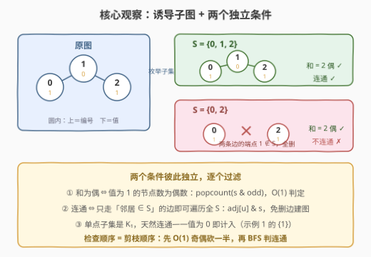
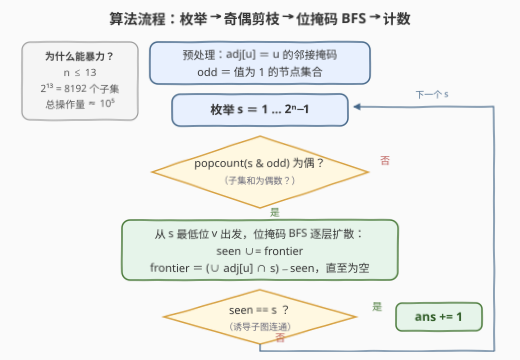

# LeetCode 统计节点和为偶数的连通子图 题解

## 1. 题目概述

- **标题 / 题号**：统计节点和为偶数的连通子图（#3910，hard）
- **链接**：https://leetcode.cn/problems/count-connected-subgraphs-with-even-node-sum/
- **难度**：困难
- **标签**：位运算、深度优先搜索、广度优先搜索、并查集、图、枚举

**题意**：给定一个 $n$ 个节点（编号 $0 \sim n-1$）的无向图，节点 $i$ 的值为 $\text{nums}[i] \in \{0, 1\}$，边由 `edges` 给出。对节点的**非空子集** $s$，其「**诱导子图**」按下述规则生成：只保留 $s$ 中的节点；只保留**两个端点都在 $s$ 中**的边。统计同时满足以下条件的非空子集数量：

1. $s$ 的诱导子图是**连通**的；
2. $s$ 中节点值的**总和为偶数**。

**示例 1**：

```text
输入：nums = [1,0,1], edges = [[0,1],[1,2]]
输出：2
解释：7 个非空子集中，{1}（和 0，单点连通）与 {0,1,2}（和 2，路径连通）满足条件；
      {0,2} 虽然和为 2（偶数），但节点 0 与 2 之间没有边（两条边的端点 1 都不在子集内，
      全被删掉），诱导子图是两个孤立点，不连通，不计入。
```

**示例 2**：

```text
输入：nums = [1], edges = []
输出：0
解释：唯一的非空子集 {0} 和为 1（奇数），不满足。
```

**约束**：

- $1 \le n = \text{nums.length} \le 13$
- $\text{nums}[i] \in \{0, 1\}$
- $0 \le \text{edges.length} \le \frac{n(n-1)}{2}$，所有边互不相同

> 💡 **审题关键**：① 「连通」指**诱导子图**连通——判连通时只能使用两端都在 $s$ 内的边，这正是题目埋的坑（示例 1 的 $\{0,2\}$）；② **单点子集是 $K_1$，平凡连通**，只要该点值为 0 就计入（示例 1 的 $\{1\}$）；③ 值只有 0/1 ⇒ 「和为偶」等价于「值为 1 的节点个数是偶数」，与 0 值节点完全无关；④ $n \le 13$ 是明示「指数级枚举可行」的信号——$2^{13} = 8192$。

## 2. 解题思路

### 2.1 暴力思路

按定义直译：枚举全部 $2^n - 1$ 个非空子集；对每个子集，先筛出两端都在子集内的边重建邻接表，再跑一遍普通 DFS/BFS 判连通，顺便累加值判奇偶。每个子集 $O(n + m)$，总计 $O(2^n \cdot (n + m))$，$n = 13$ 时约 $8192 \times 85 \approx 7 \times 10^5$——本身已经能过。

但它有浪费：每个子集都「删边重建邻接表」重复劳动；且把「和为奇」与「不连通」两种失败一视同仁地全量检查。两个条件**彼此独立**，应当按检查成本排序——先做 $O(1)$ 的奇偶判定，用它砍掉一半子集，再对幸存者判连通。

### 2.2 核心观察：条件解耦 + 位掩码三件套



**观察一（奇偶性 O(1) 化）**：值只取 0/1，和的奇偶完全由「值为 1 的节点」个数决定。预处理 `odd` = 值为 1 的节点位掩码，则子集 $s$ 的和为偶 $\iff$ $\text{popcount}(s \,\&\, \text{odd})$ 为偶——一次按位与 + 一次 popcount，把一半子集在碰图之前剪掉。

**观察二（诱导子图免构造）**：判连通不需要真的删边重建图。BFS/DFS 时从点 $u$ 只允许走向「邻居 $\in s$」的边，效果上就等价于只在诱导子图上遍历——「删边」被「与运算」吸收。把邻接表压成位掩码 `adj[u]`，则「$u$ 在 $s$ 内的邻居」= `adj[u] & s`，一次与运算得到一整层邻居，BFS 内层从逐边扫描变成逐位剥离。

**观察三（连通性与起点无关）**：诱导子图连通 $\iff$ 从 $s$ 中任意一点出发可达 $s$ 内全部点。取最低位（`s & -s`）当起点即可；单点子集是 $K_1$，天然连通，起点即终点。

> ⚠️ **常见翻车**：① 判连通时直接用原图邻接表而不与 $s$ 求交，把「跨出子集的边」也算进路径——$\{0,2\}$ 会被误判连通；② 用并查集合并子集内的边后，忘了孤立点（无边可并）也各自是一个连通块；③ 只枚举 $\ge 2$ 个点的子集，漏掉值为 0 的单点子集。

### 2.3 算法流程图



| 步骤 | 操作 | 说明 |
|------|------|------|
| ① 预处理 | `adj[u]` = $u$ 的邻居位掩码；`odd` = 值为 1 的点集 | 各 $O(n + m)$，全程复用 |
| ② 枚举 | `for s = 1 … 2ⁿ−1` | 每个非空子集对应一个位掩码 |
| ③ 奇偶剪枝 | `popcount(s & odd)` 为奇 → 跳过 | $O(1)$，滤掉一半子集 |
| ④ 位掩码 BFS | 从最低位 $v$ 出发：`frontier = adj[v] & s`；逐层 `seen |= frontier`，`frontier = (∪ adj[u] & s) − seen` | 只在 $s$ 内扩散，直至 frontier 为空 |
| ⑤ 判连通计数 | `seen == s` ? 是 → `ans++` | 可达集等于整个子集 ⟺ 连通 |

### 2.4 示例演算：nums = [1,0,1], edges = [[0,1],[1,2]]

| 子集 $s$ | 值和 | 奇偶（步骤③） | BFS 可达集（步骤④，从最低位起） | 连通？ | 计入 |
|----------|------|----------------|----------------------------------|--------|------|
| {0} | 1 | 奇 ✗ | — | — | 否 |
| {1} | 0 | 偶 ✓ | $\{1\} = s$ ✓ | ✓ | **是** |
| {2} | 1 | 奇 ✗ | — | — | 否 |
| {0,1} | 1 | 奇 ✗ | — | — | 否 |
| {0,2} | 2 | 偶 ✓ | $\{0\} \ne s$（0 与 2 无边） | ✗ | 否 |
| {1,2} | 1 | 奇 ✗ | — | — | 否 |
| {0,1,2} | 2 | 偶 ✓ | $\{0\} \to \{0,1\} \to \{0,1,2\} = s$ ✓ | ✓ | **是** |

答案 = **2**，与示例一致。注意 $\{0,2\}$ 恰好演示了「奇偶过关但连通性翻车」——两个条件缺一不可，也说明步骤③的剪枝只是加速、不会漏解。

## 3. 参考代码

### C++

```cpp
class Solution {
public:
    int evenSumSubgraphs(vector<int>& nums, vector<vector<int>>& edges) {
        int n = nums.size();
        vector<int> adj(n, 0);                  // adj[u]：u 的邻居位掩码
        for (auto& e : edges) {
            adj[e[0]] |= 1 << e[1];
            adj[e[1]] |= 1 << e[0];
        }
        int odd = 0;                            // 值为 1 的节点集合
        for (int i = 0; i < n; i++)
            if (nums[i] & 1) odd |= 1 << i;

        int ans = 0;
        for (int s = 1; s < (1 << n); s++) {    // 枚举所有非空子集
            if (__builtin_popcount(s & odd) & 1) continue;   // 和为奇数，剪枝
            int start = __builtin_ctz(s);       // 任取集合内一点（最低位）
            int seen = 1 << start;
            int frontier = adj[start] & s;      // 只走两端都在 s 内的边
            while (frontier) {
                seen |= frontier;
                int nxt = 0;
                for (int m = frontier; m; m &= m - 1)        // 逐位剥离 frontier
                    nxt |= adj[__builtin_ctz(m)] & s;
                frontier = nxt & ~seen;
            }
            if (seen == s) ans++;               // 可达集 = 整个子集 → 连通
        }
        return ans;
    }
};
```

### Python

```python
class Solution:
    def evenSumSubgraphs(self, nums: List[int], edges: List[List[int]]) -> int:
        n = len(nums)
        adj = [0] * n                            # adj[u]：u 的邻居位掩码
        for u, v in edges:
            adj[u] |= 1 << v
            adj[v] |= 1 << u
        odd = 0                                  # 值为 1 的节点集合
        for i, x in enumerate(nums):
            if x & 1:
                odd |= 1 << i

        ans = 0
        for s in range(1, 1 << n):               # 枚举所有非空子集
            if (s & odd).bit_count() & 1:        # 和为奇数，剪枝
                continue
            start = (s & -s).bit_length() - 1    # 任取集合内一点（最低位）
            seen = 1 << start
            frontier = adj[start] & s            # 只走两端都在 s 内的边
            while frontier:
                seen |= frontier
                nxt = 0
                m = frontier
                while m:                         # 逐位剥离 frontier
                    b = m & -m
                    m ^= b
                    nxt |= adj[b.bit_length() - 1] & s
                frontier = nxt & ~seen
            if seen == s:                        # 可达集 = 整个子集 → 连通
                ans += 1
        return ans
```

> 💡 **写法要点**：① 奇偶判定用 `__builtin_popcount` / `int.bit_count()`（Python 3.10+；低版本可用 `bin(x).count('1')`）；② BFS 外层 `while` 每轮把一整层 `frontier` 并入 `seen`，内层 `m &= m - 1`（或 `m ^= m & -m`）逐位剥离；③ 连通性检查也可写成递归 DFS 或并查集，但位掩码层进层出代码最短、常数最小；④ `(s & -s)` 取最低位 1，`bit_length() - 1` / `__builtin_ctz` 得到其下标。

## 4. 复杂度分析

| 维度 | 复杂度 | 说明 |
|------|--------|------|
| **时间** | $O(2^n \cdot n)$ | 每个子集：奇偶 $O(1)$；BFS 中每个点至多进入一次 frontier，逐位剥离共 $O(n)$。$n = 13$ 时约 $10^5$ 次位运算 |
| **空间** | $O(n)$ | 邻接位掩码 `adj` 与 `odd` 共 $O(n)$ 个机器字，其余滚动变量 $O(1)$ |
| **对比暴力** | 省掉每子集 $O(m)$ 的删边重建 | 邻接信息预压缩成 $n$ 个掩码全程复用；奇偶预检再砍一半子集的 BFS 成本 |

## 5. 扩展：更省的枚举与更大的 n

**按连通分量分解**：横跨原图多个连通分量的子集必不连通。对每个大小为 $c_i$ 的分量单独枚举，总量 $\sum 2^{c_i} \le 2^n$——原图不连通时（尤其存在大量孤立点，孤立 0 值点每个贡献 +1）收益巨大。实现上按分量分批枚举后把各分量答案相加即可（0 值孤立点直接 +1）。

**只枚举偶校验子集**：奇偶条件可以「枚举时绕开」——对 `odd` 内 popcount 为偶数的每个子集与 `zeros` 内任意子集做笛卡尔积，用 Gosper hack（`c = x & -x; r = x + c; r ^= (r ^ x) / c >> 2` 一类位技巧）直接生成「下一个同 popcount 的子集」，从源头跳过所有奇校验子集，省掉一半迭代。

**直接枚举连通诱导子图（growth 算法）**：不再「枚举全部子集再验证」，而是从每个点 $v$ 出发只**生成**连通子集——维护「当前集合的邻居中 $> v$ 的点」作候选 frontier，按递增顺序选择加入，保证每个连通子集恰好生成一次（以最小点 $v$ 为根）。$n \le 13$ 时 $2^n$ 枚举更简单直接；$n$ 到 20+ 时验证式枚举失效，这套生成式枚举才是正解。

## 6. 面试要点

**Q1：为什么 $n \le 13$ 意味着指数枚举可行？**

> $2^{13} = 8192$ 个子集，每个 $O(n)$ 检查，总量约 $10^5$，远低于一秒 $10^8 \sim 10^9$ 的操作预算。经验法则：$2^n$ 枚举在 $n \le 20$ 左右（约 $10^6$）都可接受；$n \le 13$ 时连「枚举子集的子集」$O(3^n) \approx 1.6 \times 10^6$ 都能承受——如果本题改成要在子集上再DP，也有余地。

**Q2：判连通为什么不用真的构造诱导子图？**

> 诱导子图的边集 = 原图边集 $\cap\ (S \times S)$。BFS 只走 `adj[u] & s` 就等价于只走两端都在 $S$ 内的边——「删边」被一次按位与吸收，无需重建任何结构。这是位掩码处理诱导子图的标准姿势，同款套路见 1617。

**Q3：单点子集 $\{v\}$ 算连通吗？什么时候计入答案？**

> 算，$K_1$ 是连通图。$\text{nums}[v] = 0$ 时计入（和为偶）；值为 1 时不计入。示例 1 的 $\{1\}$ 正是此类。常见错误是「只枚举 $\ge 2$ 个点的子集」把它漏掉。

**Q4：奇偶预检为什么恰好剪掉一半？**

> `odd` 非空时，全体子集按「$s \cap \text{odd}$ 的 popcount 奇偶」严格对半分（二项式系数的对称性 $\sum_k \binom{m}{k}$ 奇偶各半）。`odd` 为空（全 0 图）时所有子集奇偶合法，问题退化为「数连通子集」。

**Q5：如果 $n$ 放大到 40 怎么办？**

> 一般图上统计连通诱导子图是 #P-hard，$2^{40}$ 直接枚举更不可行，只能靠图结构救：若图是树（或 treewidth 很小），用树形 DP $O(n)$ 统计「带奇偶状态的连通子树」个数；一般稀疏图用 growth 生成式枚举 + 分量分解 + 剪枝。本题 $n \le 13$ 就是把赛道钉死在验证式枚举上。

## 同类练习题

| # | 题目 | 与本题的关联 |
|---|------|-------------|
| 78 | [子集](https://leetcode.cn/problems/subsets/)（[题解](../0001-0100/78_子集.md)） | 位掩码枚举全部子集的祖师爷模板，本题的地基 |
| 1617 | [统计子树中城市之间最大距离](https://leetcode.cn/problems/count-subtrees-with-max-distance-between-cities/)（[题解](../1601-1700/1617_统计子树中城市之间最大距离.md)） | 同款「枚举子集 + 诱导子图连通性检查」的姐妹题，把本题的连通检查换成直径计算 |
| 1494 | [并行课程 II](https://leetcode.cn/problems/parallel-courses-ii/)（[题解](../1401-1500/1494_并行课程II.md)） | $n \le 15$ 的子集枚举 + 子集上建依赖图，位掩码状态设计进阶 |
| 1986 | [完成任务的最少工作时间段](https://leetcode.cn/problems/minimum-number-of-work-sessions-to-finish-the-tasks/)（[题解](../1901-2000/1986_完成任务的最少工作时间段.md)） | 同量级 $n \le 14$ 的位掩码枚举/DP，体会 $2^n$ 规模的手感 |
| 3108 | [带权图里旅途的最小代价](https://leetcode.cn/problems/minimum-cost-walk-in-weighted-graph/)（[题解](../3101-3200/3108_带权图里旅途的最小代价.md)） | 连通分量内聚合节点权值（异或/奇偶）的近亲思想 |
