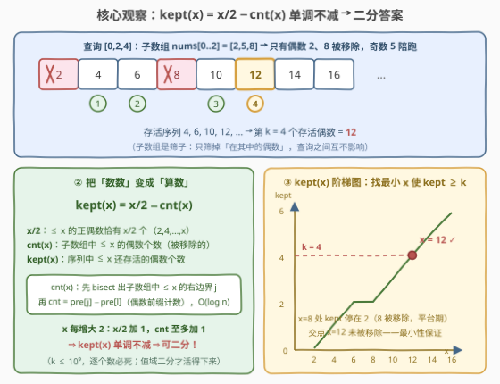
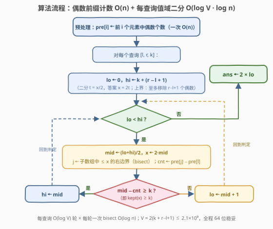

# 移除子数组元素后第 K 小偶数

- **题目名称**：移除子数组元素后第 K 小偶数
- **链接**：[3911. K-th Smallest Remaining Even Integer in Subarray Queries](https://leetcode.cn/problems/k-th-smallest-remaining-even-integer-in-subarray-queries/)
- **难度**：困难
- **标签**：二分查找、二分答案、前缀和、数组

## 1. 题目概述

给你一个**严格递增**的整数数组 $nums$，以及二维整数数组 $queries$，其中 $queries[i] = [l_i, r_i, k_i]$。

对每个查询 $[l_i, r_i, k_i]$：

1. 考虑**子数组** $nums[l_i..r_i]$；
2. 从**无限**的正偶数序列 $2, 4, 6, 8, 10, \dots$ 中，移除**所有出现在该子数组中的元素**；
3. 找出移除后序列中剩余的**第 $k_i$ 小**整数。

返回数组 $ans$，$ans[i]$ 为第 $i$ 个查询的结果。

**示例 1**：

```text
输入：nums = [1,4,7], queries = [[0,2,1],[1,1,2],[0,0,3]]
输出：[2,6,6]
解释：查询 0：子数组 [1,4,7] 移除 4 → 剩 2,6,8,… 第 1 个 = 2；
     查询 1：子数组 [4]    移除 4 → 剩 2,6,8,… 第 2 个 = 6；
     查询 2：子数组 [1]    无偶数可移除 → 剩 2,4,6,… 第 3 个 = 6。
```

**示例 2**：

```text
输入：nums = [2,5,8], queries = [[0,1,2],[1,2,1],[0,2,4]]
输出：[6,2,12]
解释：查询 0：子数组 [2,5]   移除 2   → 剩 4,6,8,…   第 2 个 = 6；
     查询 1：子数组 [5,8]   移除 8   → 剩 2,4,6,…   第 1 个 = 2；
     查询 2：子数组 [2,5,8] 移除 2,8 → 剩 4,6,10,12,… 第 4 个 = 12。
```

**示例 3**：

```text
输入：nums = [3,6], queries = [[0,1,1],[1,1,3]]
输出：[2,8]
解释：查询 0：子数组 [3,6] 移除 6 → 剩 2,4,8,… 第 1 个 = 2；
     查询 1：子数组 [6]    移除 6 → 剩 2,4,8,… 第 3 个 = 8。
```

**约束条件**：

- $1 \le nums.length \le 10^5$
- $1 \le nums[i] \le 10^9$，$nums$ **严格递增**
- $1 \le queries.length \le 10^5$
- $0 \le l_i \le r_i < nums.length$，$1 \le k_i \le 10^9$

> 💡 **审题关键**：① 无限序列里**只有偶数**——子数组中的奇数一个也"移除不掉"，纯属陪跑，只有子数组中的**偶数集合**有"移除力"；② 每个查询的子数组只是当"筛子"用，**不修改数组**，查询之间彼此独立；③ $k_i$ 高达 $10^9$，答案可到 $2\times(10^9+10^5) \approx 2\times10^9$ 量级——**绝不能逐个数**，必须把"数数"变成"算数"（值域思考）。

---

## 2. 解题思路

### 2.1 暴力思路：从 2 开始逐个过筛

对每个查询，把子数组元素丢进哈希集合，然后从 $x = 2$ 开始每次前进 2：$x$ 在集合里就跳过，否则计数加一，数到第 $k$ 个为止。单次查询 $O(\text{答案} + n)$，而答案可达 $\approx 2\times10^9$——$10^5$ 个查询直接爆炸。

瓶颈显而易见：**存活个数是随着 $x$ 增长"一段一段"长出来的**，暴力却一格一格地爬。破解之道是把"数到第 $k$ 个"改写成一个关于 $x$ 的**计数不等式**，用二分一步跳到位。

### 2.2 核心观察：kept(x) 单调不减 ⇒ 二分答案



**观察一（奇数陪跑）**：无限序列只含偶数，能被移除的只有子数组中的偶数。记子数组内的偶数从小到大为 $E = \{e_1 < e_2 < \dots < e_m\}$——$nums$ 严格递增，子数组的偶数**天然有序**，这是后面一切 $O(\log)$ 操作的根基。

**观察二（"数数"变"算数"）**：不大于 $x$ 的正偶数**恰好有 $x/2$ 个**（即 $2, 4, \dots, x$）。这不是数出来的，是**直接算出来的**——无限序列第一次变得"可计算"。

**观察三（计数函数单调）**：定义

$$\mathrm{kept}(x) \;=\; \underbrace{x/2}_{\le x\ 的偶数总数} \;-\; \underbrace{\mathrm{cnt}(x)}_{\text{子数组中}\ \le x\ \text{的偶数个数}} \;=\; \text{序列中}\ \le x\ \text{的存活偶数个数}$$

$x$ 每增大 2：$x/2$ 恰好加 1，而 $\mathrm{cnt}(x)$ 至多加 1（新纳入的至多一个偶数），所以 **$\mathrm{kept}(x)$ 关于 $x$ 单调不减**。单调 ⇒ 可二分：

$$\boxed{\;\text{答案} = \text{最小的偶数 } x \text{ 使得 } \mathrm{kept}(x) \ge k\;}$$

**为什么这个最小 $x$ 一定没被移除？** 反证：若 $x \in E$（被移除），则 $\mathrm{cnt}(x) = \mathrm{cnt}(x-2) + 1$，于是 $\mathrm{kept}(x-2) = (x/2 - 1) - (\mathrm{cnt}(x)-1) = \mathrm{kept}(x) \ge k$，与 $x$ 的最小性矛盾。∎ 所以二分找出的 $x$ 必然存活，正是第 $k$ 个存活偶数。

**$\mathrm{cnt}(x)$ 怎么 $O(\log n)$ 算？** $nums$ 严格递增 ⇒ 子数组中 $\le x$ 的元素恰为 $nums[l..j-1]$，其中 $j = \mathrm{bisect\_right}(nums, x,\ l,\ r{+}1)$。预处理**偶数前缀计数** $pre[i] = nums[0..i-1]$ 中偶数个数，则 $\mathrm{cnt}(x) = pre[j] - pre[l]$——一次二分 + 一次减法。

**二分上下界**：二分 $t = x/2$，$lo = 0$，$hi = k + (r - l + 1)$。上界的道理：子数组至多移除 $r-l+1$ 个偶数，$\mathrm{kept}\bigl(2(k + r - l + 1)\bigr) \ge (k + r - l + 1) - (r - l + 1) = k$，必然够到 $k$。

三句话合起来：

> **序列用 $x/2$ 算、移除用前缀计数查、单调性保二分——每个查询一次值域二分，每轮 $O(\log n)$ 计数。**

### 2.3 算法流程图



| 步骤 | 操作 | 说明 |
|------|------|------|
| ① 预处理 | $pre[i] \leftarrow pre[i-1] + [nums[i-1]\ \text{为偶}]$ | 全局一次 $O(n)$，偶数前缀计数 |
| ② 初始化 | $lo \leftarrow 0$，$hi \leftarrow k + (r - l + 1)$ | 二分 $t = x/2$；上界 = "至多移除 $r-l+1$ 个偶数" |
| ③ 取中 | $mid \leftarrow \lfloor(lo+hi)/2\rfloor$，$x \leftarrow 2\,mid$ | 候选偶数 $x$ |
| ④ 计数 | $j \leftarrow \mathrm{bisect\_right}(nums, x,\ l,\ r{+}1)$；$\mathrm{cnt} \leftarrow pre[j] - pre[l]$ | 子数组中 $\le x$ 的偶数个数，$O(\log n)$ |
| ⑤ 判定 | $mid - \mathrm{cnt} \ge k$ ？（即 $\mathrm{kept}(x) \ge k$） | 是 → $hi \leftarrow mid$；否 → $lo \leftarrow mid + 1$ |
| ⑥ 收敛 | 循环至 $lo = hi$，$ans \leftarrow 2 \cdot lo$ | 每查询 $O(\log V \cdot \log n)$，$V \approx 2(k + n)$ |

### 2.4 示例演算

以**示例 2** 的查询 $[0, 2, 4]$（$nums = [2,5,8]$，$l=0, r=2, k=4$）演算二分过程。$pre = [0, 1, 1, 2]$（前 0/1/2/3 个元素中偶数个数），二分 $t \in [0,\ 4+3] = [0, 7]$：

| 轮次 | 区间 $[lo, hi]$ | $mid$ | $x = 2\,mid$ | $j$（子数组 $\le x$ 的右边界） | $\mathrm{cnt} = pre[j]$ | $\mathrm{kept} = mid - \mathrm{cnt}$ | 判定 | 动作 |
|------|----------------|-------|--------------|------------------------------|------------------------|-----------------------------------|------|------|
| 1 | $[0, 7]$ | 3 | 6 | 2（$\le 6$：2,5） | 1（仅 2） | $3 - 1 = 2 < 4$ | 否 | $lo \leftarrow 4$ |
| 2 | $[4, 7]$ | 5 | 10 | 3（2,5,8） | 2（2,8） | $5 - 2 = 3 < 4$ | 否 | $lo \leftarrow 6$ |
| 3 | $[6, 7]$ | 6 | 12 | 3（2,5,8） | 2（2,8） | $6 - 2 = 4 \ge 4$ | 是 | $hi \leftarrow 6$ |

收敛 $lo = hi = 6$，答案 $x = 2 \times 6 = \mathbf{12}$ ✓。存活序列确为 $4, 6, 10, 12, \dots$，第 4 个正是 12。**示例 1 / 3** 同理得 $[2,6,6]$、$[2,8]$ ✓（已用自洽暴力对拍 3000 组随机用例验证）。

---

## 3. 参考代码

### C++

```cpp
class Solution {
public:
    vector<int> kthRemainingInteger(vector<int>& nums, vector<vector<int>>& queries) {
        int n = nums.size();
        vector<int> pre(n + 1);                        // pre[i] = 前 i 个元素中偶数个数
        for (int i = 0; i < n; ++i)
            pre[i + 1] = pre[i] + (nums[i] % 2 == 0);

        vector<int> ans;
        ans.reserve(queries.size());
        for (auto& q : queries) {
            int l = q[0], r = q[1];
            long long k = q[2];
            long long lo = 0, hi = k + (r - l + 1);    // 二分 t = x/2
            while (lo < hi) {
                long long mid = lo + (hi - lo) / 2;
                int x = (int)(2 * mid);                // 候选偶数，最大约 2.0e9，long long 转换防贴边
                int j = int(upper_bound(nums.begin() + l, nums.begin() + r + 1, x)
                            - nums.begin());           // 子数组中 ≤ x 的右边界
                long long cnt = pre[j] - pre[l];       // 其中偶数个数
                if (mid - cnt >= k) hi = mid;          // kept(x) ≥ k：答案至多 2·mid
                else lo = mid + 1;
            }
            ans.push_back(int(2 * lo));
        }
        return ans;
    }
};
```

### Python

```python
class Solution:
    def kthRemainingInteger(self, nums: List[int], queries: List[List[int]]) -> List[int]:
        pre = [0] * (len(nums) + 1)                    # pre[i] = 前 i 个元素中偶数个数
        for i, v in enumerate(nums):
            pre[i + 1] = pre[i] + (v % 2 == 0)

        ans = []
        for l, r, k in queries:
            lo, hi = 0, k + (r - l + 1)                # 二分 t = x/2，答案 x = 2t
            while lo < hi:
                mid = (lo + hi) // 2
                j = bisect_right(nums, 2 * mid, l, r + 1)   # 子数组中 ≤ x 的右边界
                if mid - (pre[j] - pre[l]) >= k:            # kept(x) ≥ k
                    hi = mid
                else:
                    lo = mid + 1
            ans.append(2 * lo)
        return ans
```

> 💡 **写法要点**：① 二分对象是 $t = x/2$ 而非 $x$ 本身，省去偶偶判断；② `bisect_right` 带 `lo=l, hi=r+1` 参数直接限定在子数组内搜，无需拷贝切片；③ 答案上界 $2(k + r - l + 1) \le 2.0000002\times10^9$，**贴着 `INT_MAX` 的脸**——C++ 中间量用 `long long` 最稳；④ 判定式 `mid - cnt >= k` 中 `mid` 就是 $x/2$，不用除回去。

---

## 4. 复杂度分析

| 维度 | 复杂度 | 说明 |
|------|--------|------|
| **时间** | $O\bigl(n + q \log V \log n\bigr)$ | 预处理 $O(n)$；每查询 $\log V \approx 31$ 轮二分（$V \approx 2.1\times10^9$），每轮一次 bisect $O(\log n)$ |
| **空间** | $O(n)$ | 偶数前缀计数数组 $pre$（不计输出） |
| **量级判断** | 约 $5\times10^7$ 次基本操作 | $q = 10^5$、$\log V \approx 31$、$\log n \approx 17$；对照暴力 $O(q \cdot k) \approx 10^{14+}$，快七个数量级；Python 实测（bisect 为 C 实现）$10^5$ 查询约 1.4s 可过 |

---

## 5. 扩展：下标二分——把 $\log V \log n$ 磨成单个 $\log n$

值域二分每轮还要一次 bisect 定位 $\mathrm{cnt}$，其实还能再省：**直接对"子数组内偶数个数 $j$"二分**，单查询 $O(\log n)$。

设子数组内偶数为 $e_1 < e_2 < \dots < e_m$（预存偶数下标列表 $evenIdx$，两次 bisect 切出子数组的偶数段）。**结论**：

$$\text{答案} = 2(k + j^*)，\quad j^* = \max\{\, j \ge 0 : e_j < 2(k + j) \,\}$$

**为什么能对 $j$ 二分？** 考察 $h(j) = e_j - 2(k+j)$：偶数序列中 $e_{j+1} \ge e_j + 2$（严格递增且都是偶数），而 $2(k+j+1) = 2(k+j) + 2$ 恰好也加 2，故 $h(j+1) \ge h(j)$——**$h$ 非降**，"$e_j < 2(k+j)$"即 $h(j) < 0$，满足的 $j$ 恰是一段前缀，可二分求边界。

**为什么 $j^*$ 恰是正确值？** 设真实答案为 $x$（第 $k$ 个存活偶数），记 $c$ = 子数组中 $< x$ 的偶数个数。由 $\mathrm{kept}(x) = k$ 且 $x$ 存活：$x = 2(k + c)$。于是两头夹逼：

- $e_c < x = 2(k + c)$ → $c$ 满足条件，$j^* \ge c$；
- $e_{c+1} > x$ 且同为偶数 → $e_{c+1} \ge x + 2 = 2(k + c + 1)$ → $c + 1$ 不满足，$j^* \le c$。

故 $j^* = c$，输出 $2(k + c) = x$。∎

```python
class Solution:
    def kthRemainingInteger(self, nums: List[int], queries: List[List[int]]) -> List[int]:
        even_idx = [i for i, v in enumerate(nums) if v % 2 == 0]
        ans = []
        for l, r, k in queries:
            a = bisect_left(even_idx, l)      # 子数组内偶数 = even_idx[a:b] 对应的值
            b = bisect_right(even_idx, r)
            lo, hi = 0, b - a                 # 二分最大的 j 使 e_j < 2(k+j)
            while lo < hi:
                mid = (lo + hi + 1) // 2      # 上取整防死循环
                if nums[even_idx[a + mid - 1]] < 2 * (k + mid):
                    lo = mid
                else:
                    hi = mid - 1
            ans.append(2 * (k + lo))
        return ans
```

总复杂度 $O\bigl((n + q)\log n\bigr)$；$10^5$ 查询 Python 实测约 0.6s，比值域二分版再快一倍多。两版都值得掌握：**值域二分是"二分答案 + 计数"的通式**（不依赖偶数结构），**下标二分吃透了"偶数间隔 $\ge 2$"的结构红利**，面试中先讲前者、再用后者收尾，层次感立刻拉满。

---

## 6. 面试要点

**Q1：为什么二分出来的最小 $x$ 一定没被子数组移除？**

> 反证：若 $x$ 被移除，则 $\mathrm{cnt}(x) = \mathrm{cnt}(x-2) + 1$，$\mathrm{kept}(x - 2) = (x/2 - 1) - (\mathrm{cnt}(x) - 1) = \mathrm{kept}(x) \ge k$，说明 $x - 2$ 更早就满足了条件，与 $x$ 的最小性矛盾。这也解释了阶梯图上的"平台期"（如 $x = 8$ 处 kept 停在 2）——平台正中央必有被移除的偶数。

**Q2：上界为什么取 $2(k + (r - l + 1))$ 就够？**

> 子数组长度 $r - l + 1$，其中偶数至多这么多个。不大于 $2(k + r - l + 1)$ 的偶数共 $k + r - l + 1$ 个，哪怕全部被移除也还剩 $\ge k$ 个存活。取更松的 $2 \times 10^{9} + \delta$ 也能过，但**紧上界让 $\log V$ 小一点**，也体现对题目的把握。

**Q3：$\mathrm{cnt}(x)$ 为什么能 $O(\log n)$ 算？严格递增在其中扮演什么角色？**

> 严格递增 ⇒ 子数组天然有序 ⇒ "$\le x$ 的元素"是子数组的一段**前缀**，bisect 一次定位边界 $j$；再配合全局偶数前缀计数 $pre$，$\mathrm{cnt} = pre[j] - pre[l]$。若数组无序，这条链路全断，得先排序/离线处理——**有序性是本题所有 $O(\log)$ 的总开关**。

**Q4：扩展解法里 $h(j) = e_j - 2(k+j)$ 为什么非降？**

> 两条腿同时走：$e_{j+1} \ge e_j + 2$（偶数序列严格递增，间距至少 2），右端 $2(k+j+1) = 2(k+j) + 2$。同增 2，差值不动或变大。"偶数"这个身份在此处第二次立功——第一次是 $x/2$ 计数，第二次是间距 $\ge 2$。

**Q5：暴力为什么死、二分为什么活？**

> 暴力把"找第 $k$ 个"当成 $k$ 次 $O(1)$ 步进，$k \le 10^9$ 直接判死刑；二分把同一个问题改写成单调计数函数 $\mathrm{kept}(x) \ge k$ 的**最小可行解**，每轮判定只需 $O(\log n)$——信息没变多，只是把"逐格爬"换成"对半砍"，这是**二分答案**族（410、1011、1201……）共同的省时逻辑。

> 💡 **一句话总结**：无限偶数序列用 $x/2$ **算**出总数、子数组偶数用前缀计数 **查**出移除数、二者之差 $\mathrm{kept}(x)$ 单调 ⇒ 二分答案；进阶版再吃一口"偶数间距 $\ge 2$"的结构红利，对下标 $j$ 二分把复杂度磨到单个 $\log$。

---

## 7. 同类练习题

- [1201. 丑数 III](https://leetcode.cn/problems/ugly-number-iii/)（[题解](../1201-1300/1201_丑数III.md)）：值域二分"第 $k$ 个**在**集合中的数"（容斥计数），与本题"第 $k$ 个**不在**集合中的数"互为镜像
- [2195. 向数组中追加 K 个整数](https://leetcode.cn/problems/append-k-integers-with-minimal-sum/)（[题解](../2101-2200/2195_向数组中追加K个整数.md)）：求不在 $nums$ 中的前 $k$ 个最小正整数之和——本题的"求和版"近亲
- [378. 有序矩阵中第 K 小的元素](https://leetcode.cn/problems/kth-smallest-element-in-a-sorted-matrix/)（[题解](../0301-0400/378_有序矩阵中第K小的元素.md)）："二分答案 + 计数判定"求第 $k$ 小的开山模板
- [1011. 在 D 天内送达包裹的能力](https://leetcode.cn/problems/capacity-to-ship-packages-within-d-days/)（[题解](../1001-1100/1011_在D天内送达包裹的能力.md)）：二分答案入门，体会"判定比求解便宜"
- [410. 分割数组的最大值](https://leetcode.cn/problems/split-array-largest-sum/)（[题解](../0401-0500/410_分割数组的最大值.md)）：二分答案进阶，单调判定函数的构造范式
