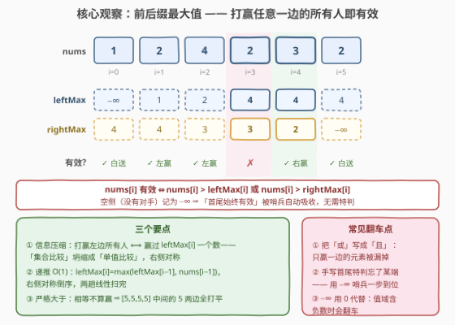
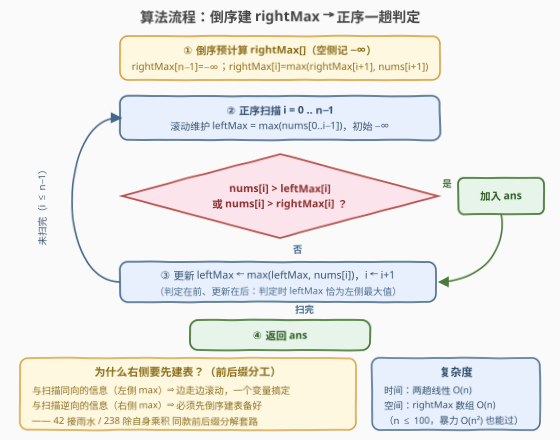

# LeetCode 数组中的有效元素 题解

## 1. 题目概述

- **标题 / 题号**：数组中的有效元素（#3912，easy）
- **链接**：https://leetcode.cn/problems/valid-elements-in-an-array/
- **难度**：简单
- **标签**：数组、前缀和

**题意**：给你一个整数数组 `nums`。如果元素 `nums[i]` 满足以下**至少一个**条件，则认为它是**有效**元素：

1. 它**严格大于**其左侧的所有元素；
2. 它**严格大于**其右侧的所有元素。

第一个元素和最后一个元素始终有效。返回所有有效元素组成的数组，顺序与它们在 `nums` 中出现的顺序相同。

**示例 1**：

```text
输入：nums = [1,2,4,2,3,2]
输出：[1,2,4,3,2]
解释：nums[0] 和 nums[5] 始终有效；
     nums[1] 和 nums[2] 严格大于其左侧的所有元素；
     nums[4] 严格大于其右侧的所有元素；
     nums[3]（值为 2）既没赢过左边的 4，也没赢过右边的 3，无效。
```

**示例 2**：

```text
输入：nums = [5,5,5,5]
输出：[5,5]
解释：中间两个 5 左右两侧都各有一个相等的 5——「严格大于」下打平不算赢，双双无效。
```

**示例 3**：

```text
输入：nums = [1]
输出：[1]
```

**约束**：

- $1 \le \text{nums.length} \le 100$
- $1 \le \text{nums}[i] \le 100$

> 💡 **审题关键**：① 是「严格大于」——**打平不算赢**（示例 2 的中间两个 5 正是被这条卡死的）；② 两个条件用「**或**」连接——**打赢任意一边的所有人**即可，不必两边全赢；③ 首尾「始终有效」是因为某一侧**根本没有对手**——把空侧的最大值记为 $-\infty$，这条规则可以被哨兵自动吸收，无需特判。

## 2. 解题思路

### 2.1 暴力思路：逐元素扫两侧

照定义直译：对每个 $i$，向左扫一遍看是否存在 $j < i$ 使 $nums[j] \ge nums[i]$，再向右扫一遍看是否存在 $j > i$ 使 $nums[j] \ge nums[i]$；两侧都遇到「打不过的对手」才无效。总复杂度 $O(n^2)$。

$n \le 100$ 时至多 $10^4$ 次比较，轻松通过。但它有明显的浪费：「我左侧（右侧）所有人的最大值」这个信息在相邻下标之间只变化**一个元素**，暴力却每个 $i$ 都把两侧从头重扫一遍——应该**增量传递**，而不是反复全量计算。

### 2.2 核心观察：前后缀最大值



**观察一（信息压缩：集合比较 → 单值比较）**。「打赢左边所有人」⟺ 赢过**左边所有人的最大值**一个数。记

$$\text{leftMax}[i] = \max(nums[0..i-1]), \qquad \text{rightMax}[i] = \max(nums[i+1..n-1])$$

则判定式坍缩为单值比较：

$$nums[i]\ \text{有效} \iff nums[i] > \text{leftMax}[i]\ \lor\ nums[i] > \text{rightMax}[i]$$

两侧的**完整分布**都用不上，各压缩成一个数就够了。

**观察二（递推 $O(1)$ 转移）**。最大值满足结合律，相邻下标之间只差一个元素：

$$\text{leftMax}[i] = \max(\text{leftMax}[i-1],\ nums[i-1]), \qquad \text{rightMax}[i] = \max(\text{rightMax}[i+1],\ nums[i+1])$$

前者正序一趟、后者倒序一趟，每步 $O(1)$，整体 $O(n)$。

**观察三（空侧 = $-\infty$，首尾白送）**。$i=0$ 左侧没有元素，记 $\text{leftMax}[0] = -\infty$，则 $nums[0] > -\infty$ 恒真；尾部对称。题目那句「首尾始终有效」不是需要特判的边界条件，而是**空侧语义的自然推论**——哨兵一到，特判全消。

**记录视角（换个说法加深理解）**：左条件成立 ⟺ $nums[i]$ 是**严格前缀最大记录**（左侧没人不小于它），右条件 ⟺ **严格后缀记录**。答案 = 两类记录按原下标归并。前缀记录按下标升序**严格递增**，后缀记录按下标升序**严格递减**；全局最大值的**首次出现**必是前缀记录、**末次出现**必是后缀记录，所以 $n \ge 2$ 时答案至少 2 个（首、尾各保底一个）。

> 💡 **一句话总结**：每个元素只需赢过「一边的最大值」——把两侧各压缩成 leftMax / rightMax 两个数，递推预处理后逐个判定，空侧记 $-\infty$ 让首尾白送。

### 2.3 算法流程图



| 步骤 | 操作 | 说明 |
|------|------|------|
| ① 倒序建表 | $\text{rightMax}[n-1] = -\infty$；$i$ 从 $n-2$ 往 $0$：$\text{rightMax}[i] = \max(\text{rightMax}[i+1],\ nums[i+1])$ | 右侧信息与正序扫描逆向，必须先备好 |
| ② 正序扫描 | $i$ 从 $0$ 到 $n-1$，滚动维护 $\text{leftMax}$（初始 $-\infty$） | 左侧信息与扫描同向，一个变量即可，无需数组 |
| ③ 判定收集 | 若 $nums[i] > \text{leftMax}$ 或 $nums[i] > \text{rightMax}[i]$，收入答案 | **先判后更新**：判定时 leftMax 恰为 $\max(nums[0..i-1])$ |
| ④ 收尾 | 更新 $\text{leftMax} \leftarrow \max(\text{leftMax},\ nums[i])$，扫完返回 | 判定与更新一前一后，顺序不能反 |

### 2.4 示例演算

以**示例 1**（$nums = [1,2,4,2,3,2]$）演算：

| $i$ | $nums[i]$ | leftMax | rightMax | 左边全赢？ | 右边全赢？ | 收入答案 |
|-----|-----------|---------|----------|-----------|-----------|----------|
| 0 | 1 | $-\infty$ | 4 | ✓（白送） | ✗ | 1 |
| 1 | 2 | 1 | 4 | ✓ | ✗ | 2 |
| 2 | 4 | 2 | 3 | ✓ | ✓（其实双记录） | 4 |
| 3 | 2 | 4 | 3 | ✗（2 ≤ 4） | ✗（2 ≤ 3） | — |
| 4 | 3 | 4 | 2 | ✗（3 ≤ 4） | ✓（3 > 2） | 3 |
| 5 | 2 | 4 | $-\infty$ | ✗ | ✓（白送） | 2 |

得 $[1,2,4,3,2]$ ✓。**示例 2**（$[5,5,5,5]$）：中间两个 5 的 leftMax 与 rightMax 均为 5，$5 > 5$ 不成立，两边皆败 → 只有首尾 → $[5,5]$ ✓。**示例 3**（$[1]$）：唯一元素左签 $-\infty$ 直接收编 → $[1]$ ✓。

## 3. 参考代码

### C++

```cpp
class Solution {
  public:
    vector<int> findValidElements(vector<int>& nums) {
        int n = nums.size();
        vector<int> rightMax(n, INT_MIN);            // 空侧哨兵 −∞（尾部）
        for (int i = n - 2; i >= 0; --i)
            rightMax[i] = max(rightMax[i + 1], nums[i + 1]);

        vector<int> ans;
        int leftMax = INT_MIN;                       // 滚动维护 max(nums[0..i-1])
        for (int i = 0; i < n; ++i) {
            if (nums[i] > leftMax || nums[i] > rightMax[i])
                ans.push_back(nums[i]);
            leftMax = max(leftMax, nums[i]);         // 先判后更新
        }
        return ans;
    }
};
```

### Python

```python
class Solution:
    def findValidElements(self, nums: list[int]) -> list[int]:
        n = len(nums)
        right_max = [float('-inf')] * n               # 空侧哨兵 −∞（尾部）
        for i in range(n - 2, -1, -1):
            right_max[i] = max(right_max[i + 1], nums[i + 1])

        ans, left_max = [], float('-inf')             # 滚动维护 max(nums[0..i-1])
        for i, x in enumerate(nums):
            if x > left_max or x > right_max[i]:
                ans.append(x)
            left_max = max(left_max, x)               # 先判后更新
        return ans
```

> 💡 **写法要点**：
> - 哨兵取 $-\infty$ 万无一失；本题值域 $\ge 1$，用 `0` 当哨兵也恰好安全，但值域含负数时会翻车，养成 $-\infty$ 习惯更稳；
> - 左侧条件用**一个滚动变量**即可——与扫描同向的信息边走边维护；右侧信息逆向，才需要数组（或改成倒序扫描，见 5.1）；
> - **先判后更新**：若先 `leftMax = max(leftMax, nums[i])` 再判定，等于默许自己和自己打（$nums[i] > nums[i]$ 恒假倒不出错，但口径已变成「≥ 左侧含自己」，逻辑上就脏了）。

## 4. 复杂度分析

| 维度 | 复杂度 | 说明 |
|------|--------|------|
| **时间** | $O(n)$ | 倒序建 rightMax 一趟 + 正序判定一趟，每步 $O(1)$ |
| **空间** | $O(n)$ | rightMax 数组（不计输出）；左侧只需 $O(1)$ 滚动变量 |
| **对照暴力** | $O(n^2)$ / $O(1)$ | $n \le 100$ 时约 $10^4$ 次比较也能过；$n$ 放大到 $10^5$ 即差三个数量级（$10^{10}$），前后缀分解是必须的 |

## 5. 扩展

### 5.1 O(1) 额外空间：双指针版（接雨水同款）

仿 [42. 接雨水](https://leetcode.cn/problems/trapping-rain-water/) 的 $O(1)$ 双指针：双指针 $i$（从左）、$j$（从右）各自维护本侧已扫最大值 $lmax$、$rmax$，**每次只推进「本侧最大值较小」的那一侧**——该侧若发现新记录（$nums > $ 本侧 max），则不仅赢过本侧（真记录），且另一侧的 $rmax \ge lmax$ 恰是右侧某个「打不过的证人」，反之亦然，判定照样精确。前缀记录从前往后填、后缀记录从后往前填，两段天然不重叠（左右指针恰好划分全体下标）：

```cpp
vector<int> findValidElements(vector<int>& nums) {
    int n = nums.size(), i = 0, j = n - 1, l = 0, r = n - 1;
    int lmax = INT_MIN, rmax = INT_MIN;
    vector<int> ans(n);
    while (i <= j) {
        if (lmax <= rmax) {                       // 左侧较弱，左指针推进
            if (nums[i] > lmax) ans[l++] = nums[i];   // 前缀记录，前填
            lmax = max(lmax, nums[i++]);
        } else {                                  // 右侧较弱，右指针推进
            if (nums[j] > rmax) ans[r--] = nums[j];   // 后缀记录，后填
            rmax = max(rmax, nums[j--]);
        }
    }
    ans.erase(ans.begin() + l, ans.begin() + r + 1);  // 挖掉中间空洞 [l, r]
    return ans;
}
```

辅助空间仅 $O(1)$（答案数组不算额外空间）。要点有二：① 前缀记录从前往后填进 $[0, l)$、后缀记录从后往前填进 $(r, n)$，左右指针恰好划分全体下标，两段**永不重叠**（有效元素个数 $\le n$）；② 中间 $[l, r]$ 是两指针都判「无效」而**没填的空洞**，最后要 erase/拼接掉——这是该写法最易翻车的点（如 $[3,1,1]$：前段 $[3]$、后段 $[1]$、空洞 $[1]$，不挖洞会多出一个 0）。已对拍 10 万组随机用例验证。验证示例 1：左指针收 $1,2,4$，右指针收 $2,3$，得 $[1,2,4,3,2]$ ✓。

### 5.2 变体速查

- **改「大于等于」**（平局也算赢）：判定改 $\ge$ 即可，$[5,5,5,5]$ 全员有效；哨兵仍用 $-\infty$，首尾依旧白送。
- **改「且」**（两边都要赢）：答案 = 前缀记录 ∩ 后缀记录 = **严格大于其余所有元素**者，至多 1 个（唯一全局最大值）；一个「或」一个「且」，答案规模从 $\ge 2$ 掉到 $\le 1$，很能考察审题。
- **只要个数 / 只要下标**：判定式一字不动，把「收集」换成计数或记下标。
- **数据放大到 $10^5$+**：$O(n)$ 前后缀版直接扛住；值域多大都无所谓（只做比较，不建值域数组）。

## 6. 面试要点

**Q1：为什么判定只需要两侧的「最大值」这一个数？**

> 「严格大于左侧所有元素」⟺ 「严格大于左侧元素的最大值」—— ∀ 比较 ⟺ 与最值比较。这是「集合谓词 ⟺ 极值谓词」的最简形态：分布细节全部无关，两侧各压缩成一个标量，空间从「记住两侧」降到「记住两个数」。

**Q2：首尾「始终有效」怎么优雅处理？−∞ 哨兵有什么坑？**

> 把空侧最大值记为 $-\infty$，则首元素 $> -\infty$ 恒真，规则统一、特判全消。坑在哨兵取值：本题值域 $\ge 1$，用 `0` 也能过，但值域含负数或 0 时 `0` 哨兵会误杀/误放——用 `INT_MIN` / `float('-inf')` 才是免检写法。

**Q3：为什么 leftMax 用滚动变量、rightMax 却要数组？**

> 正序扫到 $i$ 时，左侧信息「已经全部见过」→ 与扫描同向，边走边 max 即可，$O(1)$ 变量；右侧信息「还没见过」→ 与扫描逆向，要么先倒序建表备好，要么把整个扫描改成倒序（此时左右角色互换）。「同向滚动、逆向建表」是前后缀分解的标准分工，42 接雨水、238 除自身乘积全是这个骨架。

**Q4：n ≤ 100 暴力就能过，为什么还写 O(n)？**

> 一是题面 hint 明示 precompute，考察点就在前后缀分解；二是技能可迁移——同样的骨架在 $n = 10^5$ 的 42/238/739 里是唯一可行解，$O(n^2)$ 会直接超时。面试里写出 $O(n)$ 并讲清「信息在相邻下标间增量传递」才算到位。

**Q5：双指针 O(1) 版为什么每次只推进 max 较小的一侧？**

> 关键不变式：推进较弱侧时，若 $nums[i] > lmax$（本侧新记录）它必有效（赢过左侧全体）；若 $nums[i] \le lmax \le rmax$，则右侧已扫部分存在证人 $\ge nums[i]$，它必无效——一侧较弱恰保证「另一侧的 max 是可信证人」。这与接雨水双指针「短板决定水位」是同一个不变式。

> 💡 **一句话总结**：把「打赢一边所有人」压缩成「赢过那一边的最大值」，前后缀最大值各一趟线性递推，$-\infty$ 哨兵吃掉首尾特判——前后缀分解家族的入门打卡题。

## 同类练习题

| # | 题目 | 与本题的关联 |
|---|------|-------------|
| 42 | [接雨水](https://leetcode.cn/problems/trapping-rain-water/)（[题解](../0001-0100/42_接雨水.md)） | 前后缀最大值分解的祖师爷，O(1) 双指针版与 5.1 同款不变式 |
| 238 | [除自身以外数组的乘积](https://leetcode.cn/problems/product-of-array-except-self/)（[题解](../0201-0300/238_除自身以外数组的乘积.md)） | 前后缀分解换成乘积，同向滚动 + 逆向建表的标准分工 |
| 739 | [每日温度](https://leetcode.cn/problems/daily-temperatures/)（[题解](../0701-0800/739_每日温度.md)） | 右侧信息的倒序维护（或单调栈），与本题 rightMax 建表同源 |
| 496 | [下一个更大元素 I](https://leetcode.cn/problems/next-greater-element-i/)（[题解](../0401-0500/496_下一个更大元素 I.md)） | 从「右侧整体最大」细化到「右侧第一个更大」，单调栈入门 |
| 2016 | [增量元素之间的最大差值](https://leetcode.cn/problems/maximum-difference-between-increasing-elements/)（[题解](../2001-2100/2016_增量元素之间的最大差值.md)） | 前缀**最小**值一趟维护，与本题互为 max/min 镜像 |
