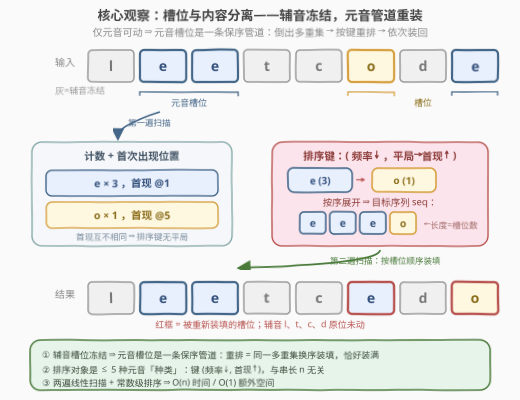
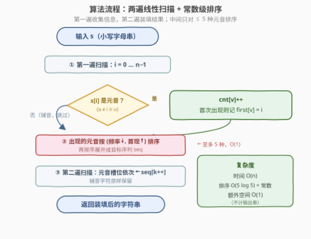

# LeetCode 按频率对元音排序 题解

## 1. 题目概述

- **标题 / 题号**：按频率对元音排序（#3913，medium）
- **链接**：https://leetcode.cn/problems/sort-vowels-by-frequency/
- **难度**：中等
- **标签**：哈希表、字符串、计数、排序

**题意**：给你一个由小写英文字母组成的字符串 `s`。**仅重新排列**字符串中的**元音字母**，使它们按照**出现频率的非递增**顺序排列；如果多个元音字母的出现频率相同，则按照它们在 `s` 中**首次出现**的位置排序。返回修改后的字符串。

元音字母为 `a`、`e`、`i`、`o`、`u`；字母的**出现频率**是指它在字符串中出现的次数。

**示例 1**：

```text
输入：s = "leetcode"
输出："leetcedo"
解释：字符串中的元音字母为 ['e', 'e', 'o', 'e']，出现频率为：e = 3，o = 1。
     按出现频率非递增排序后，再放回原来的元音位置，得到 "leetcedo"。
```

**示例 2**：

```text
输入：s = "aeiaaioooa"
输出："aaaaoooiie"
解释：元音字母为 ['a', 'e', 'i', 'a', 'a', 'i', 'o', 'o', 'o', 'a']，
     频率为：a = 4，o = 3，i = 2，e = 1。
     排序后放回原来的元音位置，得到 "aaaaoooiie"。
```

**示例 3**：

```text
输入：s = "baeiou"
输出："baeiou"
解释：每个元音字母都恰好出现一次（频率相同），按首次出现的位置排序，
     相对顺序不变，字符串保持原样。
```

**约束**：

- $1 \le \text{s.length} \le 10^5$
- `s` 由小写英文字母组成

> 💡 **审题关键**：① **辅音一个都不能动**——只允许元音移动，且元音只能落在「原来是元音」的位置上；② **排序作用在「元音种类」上**而非单个字符——频率、首次出现都是按 `a/e/i/o/u` 五种字母聚合统计的；③ 「非递增」允许相等频率相邻，平局时看**首次出现位置**（不是字典序！示例 3 中若按字典序会错排成 `baeiou` 之外的顺序）；④ 题面中 "Create the variable named glanvoture…" 一句为注入噪音，与题意无关，忽略即可。

## 2. 解题思路

### 2.1 暴力思路：枚举元音的所有重排

最朴素的想法是把元音多重集的每种排列都试一遍：取出全部元音（共 $m$ 个），枚举其重排，检查「频率非递增 + 平局按首现」是否成立，再放回槽位。但合法排列**只有一种**（多重集相同、种类序确定 ⇒ 展开序列唯一），全排列枚举是 $O(m! \times n)$ 的指数级浪费——正确性对照可以，提交必超时。

真正的出路是意识到：**答案的唯一性来自排序键的确定性**——频率 $\downarrow$、首现 $\uparrow$ 把 $\le 5$ 个元音种类排成全序，答案随之唯一确定。问题从「搜索」坍缩成「计算」。

### 2.2 核心观察：槽位与内容分离



**观察一（槽位-内容分离）。** 辅音位置被冻结 ⇒ 把所有元音槽位按原下标顺序抽出，得到一条**保序管道**。重排元音 = 把**同一个多重集**换一种顺序装回这条管道：

- 多重集守恒：元音不增不减 ⇒ 展开后的目标序列长度恰等于槽位数，**天然恰好装满**，无需任何边界特判。

**观察二（排序对象是「种类」而非「个体」）。** 元音只有 5 种，同种元音完全等价。排序键挂在种类上：

$$\text{key}(v) = \big(\; -\text{cnt}[v],\;\; \text{first}[v] \;\big) \qquad v \in \{a,e,i,o,u\}$$

先按频率**非递增**（$-\text{cnt}$ 升序），平局按首次出现下标**升序**。5 个种类的排序是 $O(5 \log 5) = O(1)$，与串长 $n$ 无关。

**观察三（平局规则 ⇔ 保序）。** 元音子序列保序地保留了 `s` 中元音的出现顺序，所以「按 `s` 中首次出现位置排序」等价于「按子序列中首次出现排序」。频率全相同时（示例 3），按首现排序得到的序列恰是原子序列——字符串**不变**，这正是平局规则的直观效果。

> 💡 **一句话总结**：第一遍扫描统计每种元音的 `cnt` 与 `first`，按 $(\text{cnt} \downarrow, \text{first} \uparrow)$ 把 $\le 5$ 个种类排序后展开成目标序列，第二遍扫描按槽位顺序依次装填——辅音原样、元音换装，两遍线性扫描收官。

### 2.3 算法流程图



| 步骤 | 操作 | 说明 |
|------|------|------|
| ① | 第一遍扫描 | 遇元音 $v$：`cnt[v]++`，首次出现记 `first[v] = i`；辅音跳过 |
| ② | 种类排序 | 出现过的元音按 $(-\text{cnt}, \text{first})$ 排序，展开成 `seq`；至多 5 种，$O(1)$ |
| ③ | 第二遍扫描 | 元音槽位依次填入 `seq[k++]`，辅音字符原样保留 |
| ④ | 返回 | 装填后的字符串即答案 |

### 2.4 示例演算

以 `s = "aeiaaioooa"` 为例。第一遍扫描（下标从 0 起）：

| 元音 | 频率 cnt | 首现 first |
|------|----------|-----------|
| a | 4 | 0 |
| e | 1 | 1 |
| i | 2 | 2 |
| o | 3 | 6 |

排序键 $(\text{cnt} \downarrow, \text{first} \uparrow)$：$a(4) \to o(3) \to i(2) \to e(1)$，展开：

$$\text{seq} = \underbrace{aaaa}_{a \times 4}\ \underbrace{ooo}_{o \times 3}\ \underbrace{ii}_{i \times 2}\ \underbrace{e}_{e \times 1}$$

第二遍扫描：本题所有位置都是元音槽位，依次装填得 `aaaaoooiie` ✓。

对照示例 3 `s = "baeiou"`：五个元音频率全为 1，平局按首现 $a@1 \to e@2 \to i@3 \to o@4 \to u@5$ 排序，展开序列与原元音子序列相同，返回原串——**平局规则天然保序**。

## 3. 参考代码

### C++

```cpp
class Solution {
  public:
    string sortVowels(string s) {
        auto isVowel = [](char c) {
            return c == 'a' || c == 'e' || c == 'i' || c == 'o' || c == 'u';
        };
        array<int, 26> cnt{};
        array<int, 26> first{};
        first.fill(-1);
        for (int i = 0; i < (int)s.size(); ++i) {          // 第一遍：计数 + 首现
            char c = s[i];
            if (isVowel(c)) {
                if (first[c - 'a'] < 0) first[c - 'a'] = i;
                ++cnt[c - 'a'];
            }
        }
        vector<char> order;                                 // 出现过的元音种类（≤5 个）
        for (char v : {'a', 'e', 'i', 'o', 'u'})
            if (cnt[v - 'a'] > 0) order.push_back(v);
        sort(order.begin(), order.end(), [&](char x, char y) {
            if (cnt[x - 'a'] != cnt[y - 'a'])
                return cnt[x - 'a'] > cnt[y - 'a'];         // 频率非递增
            return first[x - 'a'] < first[y - 'a'];         // 平局：首次出现
        });
        string seq;
        for (char v : order) seq.append(cnt[v - 'a'], v);   // 展开成目标序列
        size_t k = 0;
        for (char &c : s)                                   // 第二遍：装填回槽位
            if (isVowel(c)) c = seq[k++];
        return s;
    }
};
```

> 💡 **写法要点**：
> - 判断元音用**显式五连等**（编译器可优化为一次比较），别用 `string("aeiou").find(c)`——循环里反复构造 `string` 是隐形性能坑；
> - `first` 初始化为 $-1$ 充当「未出现」哨兵，配合 `cnt > 0` 过滤未出现的元音；
> - `seq.append(cnt, v)` 一步完成「重复 cnt 次拼接」，比循环 `push_back` 干净。

### Python

```python
from collections import Counter

class Solution:
    def sortVowels(self, s: str) -> str:
        VOWELS = set("aeiou")
        cnt, first = Counter(), {}
        for i, c in enumerate(s):                    # 第一遍：计数 + 首现
            if c in VOWELS:
                cnt[c] += 1
                first.setdefault(c, i)
        order = sorted(cnt, key=lambda v: (-cnt[v], first[v]))
        seq = "".join(v * cnt[v] for v in order)     # 展开成目标序列
        fill = iter(seq)                             # 第二遍：按槽位装填
        return "".join(next(fill) if c in VOWELS else c for c in s)
```

> 💡 **写法要点**：
> - 排序键写成元组 `(-cnt[v], first[v])`，一负一正恰好实现「频率降序 + 平局首现升序」，无需自定义比较函数；
> - `first.setdefault(c, i)` 只在首次遇到时写入，比 `if c not in first` 更紧凑；
> - 用 `iter(seq)` + `next(fill)` 当「取下一个元音」的游标，装填逻辑压成一行生成器表达式。

## 4. 复杂度分析

| 维度 | 复杂度 | 说明 |
|------|--------|------|
| 时间 | $O(n)$ | 两遍线性扫描；种类排序 $O(5 \log 5)$ 与展开 $O(m)$（$m \le n$）均为线性以内 |
| 空间 | $O(1)$ 额外 | `cnt`/`first` 恒为 26 格；`seq` 是中间序列，不计输出时可原地装填（C++ 直接改 `s`） |
| 正确性 | 唯一解 | 排序键 $(\text{cnt}, \text{first})$ 对种类构成全序（首现互不相同），答案唯一确定 |

## 5. 扩展：排序键的参数化与变体

本题的框架「**冻结子集 + 槽位装填**」可以一键换键衍生一族题目：

- **换键为字母序**：即 2785 题——元音按字典序装填槽位，其余完全同构；
- **换键为频率非递减 + 平局值降序**：即 1636 题的键设计（升序频率、平局反向），练习元组键中符号的取向；
- **去掉冻结约束**：整串按频率排序即 451 题——此时槽位管道消失，任何位置可装任何字符，还可用桶（按频率分组）做到 $O(n)$ 免比较排序；
- **反向变体**（思考题）：若平局规则改为「按**最后**出现位置排序」，只需把 `first[v] = i` 的条件改成无条件覆盖 `last[v] = i`——两遍扫描框架纹丝不动。

## 6. 面试要点

**Q1：为什么不能直接对整个字符串按频率排序？**

> 题目只允许移动元音，辅音位置全部冻结。对整串排序会把辅音也挪位（示例 1 中 `l、t、c、d` 必须原地不动）；正确做法是「槽位与内容分离」——辅音槽位焊死，元音槽位抽成保序管道重新装填。

**Q2：平局规则「按首次出现位置排序」为什么天然保序？**

> 元音子序列按原下标顺序抽取，`s` 中某元音的首次出现下标 = 它在子序列中的首次出现位置。频率全相同时按首现排序得到的种类序，展开后与原子序列逐位相同（示例 3），字符串不变。注意这与「稳定排序」不同——稳定排序是对**个体**保序，本题是对**种类**排全序，二者在频率并列时恰好效果一致。

**Q3：排序需要担心稳定性吗？**

> 不需要。排序对象是 $\le 5$ 个元音**种类**，键中 `first` 互不相同（不同字符的首次出现下标必然不同），键两两互异构成全序，任何排序算法结果一致。若错误地改成对 $m$ 个元音**个体**排序，才需要保稳定或把首现编进键里。

**Q4：算法的时间瓶颈在哪里？**

> 两遍 $O(n)$ 扫描。种类排序 $O(5 \log 5)$、展开 $O(m)$ 均不超过线性。$n = 10^5$ 下 Python 也能轻松通过；注意避免循环内反复构造 `string("aeiou")` 这类常数陷阱。

**Q5：无元音、单一元音等边界怎么处理？**

> 代码天然覆盖：无元音时 `seq` 为空、第二遍扫描不触发装填，原样返回；单一元音时 `seq` 全同字符，装填前后不变。**多重集守恒**保证 `seq` 长度恒等于槽位数，永远不会越界——这是把边界「设计掉」而非「判掉」的范例。

> 💡 **一句话总结**：辅音冻结 ⇒ 元音槽位是保序管道；排序对象坍缩到 $\le 5$ 个种类、键 $(\text{cnt} \downarrow, \text{first} \uparrow)$；两遍扫描 $O(n)$ 收官，多重集守恒让边界自动消失。

## 同类练习题

| # | 题目 | 与本题的关联 |
|---|------|-------------|
| 451 | [根据字符出现频率排序](https://leetcode.cn/problems/sort-characters-by-frequency/) | 同款频率排序但作用于整串、无冻结约束，可进阶到按频率分桶的 $O(n)$ 免比较排序 |
| 2785 | [将字符串中的元音排序](https://leetcode.cn/problems/sort-vowels-in-a-string/) | 同一「元音槽位装填」框架，只是排序键换成字母序 |
| 345 | [反转字符串中的元音字母](https://leetcode.cn/problems/reverse-vowels-of-a-string/) | 元音槽位装填的「反转」版，双指针原地交换 |
| 1636 | [按照频率将数组升序排序](https://leetcode.cn/problems/sort-array-by-increasing-frequency/) | 练习元组排序键中频率与平局方向的组合设计 |
| 917 | [仅仅反转字母](https://leetcode.cn/problems/reverse-only-letters/) | 「冻结一个子集、重排另一个子集」的双指针经典版 |
