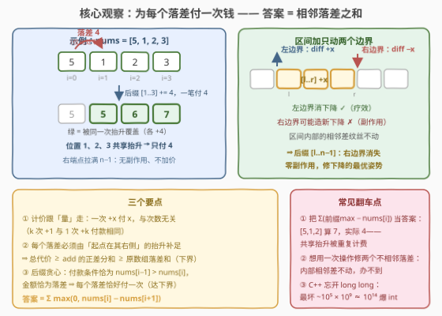
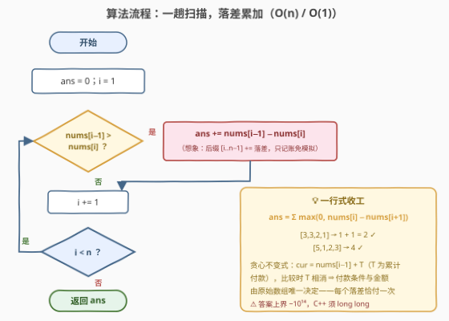

# LeetCode 使数组非递减需要的最小累计值 题解

## 1. 题目概述

- **标题 / 题号**：使数组非递减需要的最小累计值（#3914，medium）
- **链接**：https://leetcode.cn/problems/minimum-operations-to-make-array-non-decreasing/
- **难度**：中等
- **标签**：贪心、数组

**题意**：给你一个长度为 $n$ 的整数数组 $nums$。

一次操作中，你可以选择任意一个**子数组** $nums[l..r]$，并将该子数组中的每个元素都增加 $x$，其中 $x$ 可以是任意**正整数**。

返回使数组变为**非递减**所需的操作中，所选 $x$ 的值之和可能达到的**最小值**。

如果对于所有 $0 \le i < n - 1$，都有 $nums[i] \le nums[i + 1]$，则称数组是**非递减**的。

**示例 1**：

```text
输入：nums = [3,3,2,1]
输出：2
解释：一种最优操作方案为：
  选择子数组 [2..3]，增加 x = 1，得到 [3, 3, 3, 2]
  选择子数组 [3..3]，增加 x = 1，得到 [3, 3, 3, 3]
所选 x 的总和为 1 + 1 = 2。
```

**示例 2**：

```text
输入：nums = [5,1,2,3]
输出：4
解释：一种最优操作方案为：
  选择子数组 [1..3]，增加 x = 4，得到 [5, 5, 6, 7]
所选 x 的总和为 4。
```

**约束**：

- $1 \le n = nums.length \le 10^5$
- $1 \le nums[i] \le 10^9$

> 💡 **审题关键**：① 计价对象是 **$x$ 的累加值**而非操作次数——一次「$+7$」付 7，七次「$+1$」也付 7，付钱跟着**抬升的量**走，不跟着次数走；② 子数组右端点可以一路拉到数组末尾，**拉满不额外收费**——这个自由度正是解题钥匙；③ 只能加不能减，「高个子」削不动，一切修复都靠抬「矮个子」。

## 2. 解题思路

### 2.1 暴力思路：先钉死最终形态，再谈计价

操作空间是无限的：起点 $l$、终点 $r$、增量 $x$ 全是自由变量，「枚举所有操作序列」没有穷举的锚点。先抓住确定的一半——**只能加** ⇒ 最终形态 $b[i] = nums[i] + add[i]$，其中抬升量 $add[i] \ge 0$；要让 $b$ 非递减且抬得尽量少，显然取 $b[i] = \max(nums[0..i])$（前缀最大值）。

剩下真正的问题是：**如何用「区间加 $x$、付 $x$」的操作拼出这个 $add$ 最便宜？** 逐位置单点抬一定可行，代价 $\sum add[i]$，但会高估——$[5,1,2]$ 的 $add = [0,4,3]$，单点抬要付 $7$；而后缀 $[1..2]$ 整体 $+4$ 一笔就同时修好两个位置，只付 $4$。**一次操作可以让多个位置共享抬升**，按「受益位置」求和会重复计费。瓶颈归结为一句话：没算清区间加操作的**计价结构**。

### 2.2 核心观察：为每个落差付一次钱



**观察一（区间加不动内部，只动两个边界）**：把子数组 $[l..r]$ 整体 $+x$ 后，区间**内部**的一切相邻差 $b[i+1] - b[i]$（$l \le i < r$）纹丝不动；真正被改变的只有两个**边界**处的相邻差——

- 左边界（若 $l > 0$）：$b[l] - b[l-1]$ **增大** $x$——消除一个下降，是「疗效」；
- 右边界（若 $r < n-1$）：$b[r+1] - b[r]$ **减小** $x$——可能制造新的下降，是「副作用」。

> 💡 推论：把右端点拉满成**后缀操作** $[l..n-1]$，副作用凭空消失、代价不变——**修一个下降，最便宜的姿势必然是「从下降点右侧一路加到底」**。回看官方示例的操作序列（$[2..3]{+}1$、$[3..3]{+}1$ 与 $[1..3]{+}4$）恰好全是后缀操作，正是这个原因。

**观察二（计价的差分骨架）**：一次操作 $[l..r]$ $+x$ 对抬升量 $add$ 的**差分数组**的影响是「$l$ 处 $+x$、$r{+}1$ 处 $-x$」；跨过 $(j{-}1, j)$ 边界的操作对两侧 $add$ 贡献相同，在差分中相消。于是对每个位置 $j$：

$$add[j] - add[j-1] \;\le\; L[j] \;\triangleq\; \text{起点恰为 } j \text{ 的操作之 } x \text{ 总和} \;\ge 0$$

两边取正部求和，得到计价的**硬下界**：

$$\text{总代价} \;=\; \sum_j L[j] \;\ge\; \sum_j \max\bigl(0,\; add[j] - add[j-1]\bigr) \;=\; add \text{ 的总上升量}$$

**观察三（下界落到原数组的落差上）**：由 $b$ 非递减，记 $a = b[j] - b[j-1] \ge 0$、$c = nums[j] - nums[j-1]$，则 $add[j] - add[j-1] = a - c$；而 $a \ge 0$ 时恒有 $\max(0, a - c) \ge \max(0, -c)$（若 $a - c \ge 0$ 则 $a - c \ge -c$；否则 $c > a \ge 0$，两边都是 $0$）。逐项求和：

$$\text{总代价} \;\ge\; \sum_{j=1}^{n-1} \max\bigl(0,\; nums[j-1] - nums[j]\bigr) \;\triangleq\; D \;(\textbf{相邻落差之和})$$

**构造（上界）——后缀贪心，每个落差恰好付一次钱**：从左到右扫描，维护 $T$（累计付款）与不变式 $\text{cur} = nums[i-1] + T$（前一位置的当前有效值——此前所有操作都是覆盖当前位置的后缀）。到位置 $i$ 时有效值 $v = nums[i] + T$：

- $v < \text{cur}$：执行后缀 $[i..n-1]$ 加 $x = \text{cur} - v$，付款 $T \mathrel{+}= x$，$v$ 被精确抬到 $\text{cur}$；
- $v \ge \text{cur}$：不付款，$\text{cur} \leftarrow v$。

由不变式 $\text{cur} - v = nums[i-1] - nums[i]$，$T$ 相消——**付款条件与金额完全由原始数组决定**：当且仅当 $nums[i-1] > nums[i]$，付 $nums[i-1] - nums[i]$。总付款 $= D$，与下界严丝合缝。

> 💡 **一句话**：下界说「每个落差至少要付一次钱」，构造说「每个落差恰好付一次钱」——**答案就是相邻落差之和** $\sum_{i=0}^{n-2} \max(0,\, nums[i] - nums[i+1])$。

### 2.3 算法流程图



| 步骤 | 操作 | 说明 |
|------|------|------|
| ① 初始化 | $ans \leftarrow 0$，$i \leftarrow 1$ | $n = 1$ 无相邻对，自然返回 0 |
| ② 判下降 | $nums[i-1] > nums[i]$ ？ | 全算法唯一的判断 |
| ③ 付款 | 是 ⇒ $ans \mathrel{+}= nums[i-1] - nums[i]$ | 想象执行后缀 $[i..n-1]\ {+}{=}\ \text{落差}$，只记账免模拟 |
| ④ 右移 | $i \mathrel{+}= 1$，回到 ② | $i = n$ 时循环结束 |
| ⑤ 收尾 | 返回 $ans$ | —— |

### 2.4 示例演算

以**示例 1**（$nums = [3,3,2,1]$）演算（$T$ = 累计付款，cur = 前一位置有效值）：

| $i$ | $nums[i]$ | 有效值 $v = nums[i] + T$ | 与 cur 比较 | 付款 $x$ | 操作后数组 |
|-----|-----------|--------------------------|-------------|----------|------------|
| 0 | 3 | 3 | —（cur = 3） | — | $[3,3,2,1]$ |
| 1 | 3 | 3 | $3 \ge 3$ ✓ | 0 | $[3,3,2,1]$ |
| 2 | 2 | 2 | $2 < 3$ ✗ | 1 | 后缀 $[2..3]{+}1 \to [3,3,3,2]$ |
| 3 | 1 | $1 + 1 = 2$ | $2 < 3$ ✗ | 1 | 后缀 $[3..3]{+}1 \to [3,3,3,3]$ |

总付款 $1 + 1 = 2$ ✓，与公式 $D = \max(0,3{-}3) + \max(0,3{-}2) + \max(0,2{-}1) = 2$ 一致。

**示例 2**（$nums = [5,1,2,3]$）：$i=1$ 时 $1 < 5$ 付 4，后缀 $[1..3]{+}4 \to [5,5,6,7]$；此后 $6 \ge 5$、$7 \ge 6$ 均免付款，总付款 $4$ ✓（$D = \max(0, 5{-}1) = 4$）。

## 3. 参考代码

### C++

```cpp
class Solution {
public:
    long long minOperations(vector<int>& nums) {
        long long ans = 0;
        for (int i = 1; i < (int)nums.size(); ++i)
            if (nums[i - 1] > nums[i])
                ans += (long long)nums[i - 1] - nums[i];
        return ans;
    }
};
```

### Python

```python
class Solution:
    def minOperations(self, nums: List[int]) -> int:
        return sum(max(0, a - b) for a, b in zip(nums, nums[1:]))
```

> 💡 **写法要点**：① 答案上界 $\approx 10^5 \times 10^9 = 10^{14}$，**C++ 必须开 `long long`**（`nums[i-1] - nums[i]` 是 `int` 运算，累加前先转型防溢）；② $n = 1$ 无相邻对，循环不进、返回 0，无需特判；③ 函数签名是 `minOperations`、返回 `long long`，别按题面英文名想当然写成别的；④ 2.2 的后缀贪心与一行式数值恒等——要输出操作方案就按 2.4 模拟，只求答案则一行收工。

## 4. 复杂度分析

| 维度 | 复杂度 | 说明 |
|------|--------|------|
| **时间** | $O(n)$ | 一趟扫描，每个相邻对一次比较 |
| **空间** | $O(1)$ | 只维护一个累加变量 |
| **量级判断** | $10^5$ 次比较 | 题面 $n \le 10^5$ 配 $O(1)$ 转移，「证明难、实现易」的典型一眼公式题——难点全在 2.2 的计价论证上 |

## 5. 扩展：同一套差分计价的一族题

### 5.1 「计次数」与「计量」的对照

- **[1526]**（从全 0 构造 `target`，子数组 $+1$，**计次数**）：答案 $= \sum \max(0, target[j] - target[j-1])$。本题相当于把 $k$ 次「$+1$」合并成 1 次「$+k$」——计价从「次数」换成「量」，但 $k$ 次 $+1$ 与 1 次 $+k$ 付款同为 $k$，两题公式同构不是巧合，而是同一套「正差分求和」骨架。
- **[3229]**（`nums` → `target`，子数组 $\pm 1$，计次数）：差分数组有正有负时，答案 $= \max(\sum \text{正部}, \sum \lvert\text{负部}\rvert)$——付费方向确定后，另一方向搭同一批操作的便车。本题只有加方向，便只剩正部。

### 5.2 变体速查

- **改「非递增」**：把数组 `reverse` 即化回非递减（落差序列镜像，答案不变）。
- **改「严格递增」**：每对相邻还要至少垫 1，答案 $= \sum \max\bigl(0,\, 1 - (nums[i] - nums[i+1])\bigr)$（如 $[2,2]$ 付 1；下界论证中 $a \ge 0$ 换成 $a \ge 1$ 即可，其余一字不改）。

## 6. 面试要点

**Q1：为什么答案是落差和，而不是 $\sum(\text{前缀max} - nums[i])$？**

> 后者是「每个位置各自被抬的量」之和，把**共享抬升重复计费**：$[5,1,2]$ 中后缀 $+4$ 同时修好位置 1、2，只付 4，按位置求和却得 $4 + 3 = 7$。计价跟着**操作**走（付 $x$），不跟着**受益位置**走。

**Q2：下界怎么严格证明？**

> 差分计价：操作 $[l..r]{+}x$ 使 $add$ 的差分在 $l$ 处 $+x$、$r{+}1$ 处 $-x$，故 $add[j] - add[j-1] \le L[j]$（起点恰为 $j$ 的操作 $x$ 之和），总代价 $= \sum L[j] \ge \sum \max(0, add[j] - add[j-1])$；再用 $b$ 非递减（$a \ge 0$）放缩 $\max(0, a - c) \ge \max(0, -c)$，落到原数组落差上。

**Q3：为什么后缀操作是最优姿势？**

> 区间加只改两个边界处的相邻差：左边界是「疗效」（消下降），右边界是「副作用」（造下降）。右端点拉满 $n-1$ 后副作用消失、代价不变——没有任何理由留下一个会制造新下降的右边界。

**Q4：贪心的不变式是什么？付款额为什么与历史操作无关？**

> 「前一位置有效值 cur $= nums[i-1] + T$（累计付款）」。比较 cur 与 $v = nums[i] + T$ 时 $T$ 相消：付款条件化简为 $nums[i-1] > nums[i]$、金额恰为 $nums[i-1] - nums[i]$——**每个决策都由原始数组唯一决定**，这正是贪心可证的本质。

**Q5：实现上最容易翻车的点？**

> C++ 溢出：$10^5$ 对、每对落差至多 $10^9 - 1$，答案上界约 $10^{14}$，`int` 累加必炸，用 `long long`；其次别把函数名写错（`minOperations`）。

## 同类练习题

| # | 题目 | 与本题的关联 |
|---|------|-------------|
| 1526 | [形成目标数组的子数组最少增加次数](https://leetcode.cn/problems/minimum-number-of-increments-on-subarrays-to-form-a-target-array/)（[题解](../1501-1600/1526_形成目标数组的子数组最少增加次数.md)） | 「计次数」版——同一套正差分求和骨架，$k$ 次 $+1$ 与 1 次 $+k$ 计价相同的由来 |
| 3229 | [使数组等于目标数组所需的最少操作次数](https://leetcode.cn/problems/minimum-operations-to-make-array-equal-to-target/)（[题解](../3201-3300/3229_使数组等于目标数组所需的最少操作次数.md)） | 区间 $\pm 1$ 双向版——正负差分取 $\max$，体会「另一方向免费搭车」 |
| 1827 | [最少操作使数组递增](https://leetcode.cn/problems/minimum-operations-to-make-the-array-increasing/)（[题解](../1801-1900/1827_最少操作使数组递增.md)） | 单点 $+1$ 的相邻修复——没有区间共享，只能逐对付钱 |
| 665 | [非递减数组](https://leetcode.cn/problems/non-decreasing-array/)（[题解](../0601-0700/665_非递减数组.md)） | 判定型姊妹题——改一个元素能否非递减，贪心取舍「削峰还是垫谷」 |
