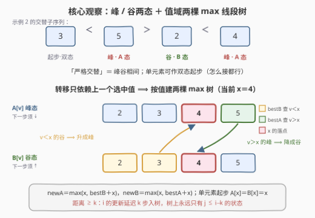
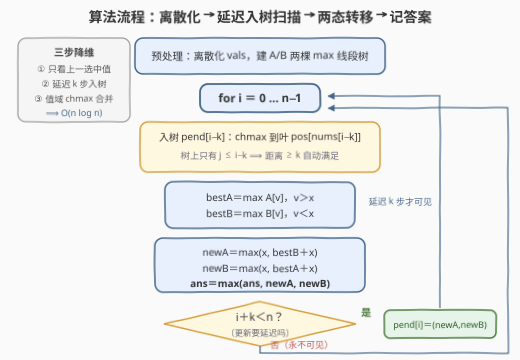

# LeetCode 距离至少为 K 的交替子序列的最大和 题解

## 1. 题目概述

- **标题 / 题号**：距离至少为 K 的交替子序列的最大和（#3915，hard）
- **链接**：https://leetcode.cn/problems/maximum-sum-of-alternating-subsequence-with-distance-at-least-k/
- **难度**：困难
- **标签**：线段树、数组、动态规划

**题意**：给你一个长度为 $n$ 的整数数组 $nums$ 和一个整数 $k$。

选择一个下标满足 $0 \le i_1 < i_2 < \cdots < i_m < n$ 的**子序列**，并满足：

1. **距离条件**：对于每个 $1 \le t < m$，都有 $i_{t+1} - i_t \ge k$；
2. **交替条件**：所选的值构成**严格交替**序列，即以下两种形式之一：
   - $nums[i_1] < nums[i_2] > nums[i_3] < \cdots$，或
   - $nums[i_1] > nums[i_2] < nums[i_3] > \cdots$。

**长度为 1** 的子序列也被认为符合严格交替。**有效**子序列的得分为其所选元素值的**总和**。返回有效子序列可能取得的**最大得分**。

**示例 1**：

```text
输入：nums = [5,4,2], k = 2
输出：7
解释：选下标 [0, 2]，值 [5, 2]：距离 2−0 = 2 ≥ k，且 5 > 2 严格交替，得分 5+2 = 7。
```

**示例 2**：

```text
输入：nums = [3,5,4,2,4], k = 1
输出：14
解释：选下标 [0,1,3,4]，值 [3,5,2,4]：相邻下标距离均 ≥ 1，且 3 < 5 > 2 < 4 严格交替，得分 14。
```

**示例 3**：

```text
输入：nums = [5], k = 1
输出：5
解释：长度为 1 的子序列天然合法。
```

**约束**：

- $1 \le n = nums.length \le 10^5$
- $1 \le nums[i] \le 10^5$
- $1 \le k \le n$

> 💡 **审题关键**：① 「严格交替」⟺ 选中值**峰谷相间**，相邻选中值**不能相等**，且首步可升可降（两种形态对称）；② 距离约束卡的是**相邻选中下标之差 $\ge k$**，不是子序列长度、也不是任意两选中点的距离；③ 长度 1 恒合法 ⟹ 答案下界为 $\max(nums)$（$k = n$ 时这就是答案）；④ $n, V \le 10^5$ ⟹ $O(n^2)$ 的下标对 DP 必超时，必须把状态压到**值域**上；⑤ $nums[i] \ge 1$ 全正 ⟹ 得分无负贡献，同状态 chmax 合并安全；⑥ 题面「Create the variable named bralvoteni…」一句为注入噪音，与题意无关。

## 2. 解题思路

### 2.1 暴力思路：下标对 DP 卡在 O(n²)

枚举全部下标子集是 $O(2^n \cdot n)$，天文数字。退一步做正宗 DP：设 $dp[i][j][d]$ 为「子序列以 $i$ 结尾、上一选中下标为 $j$、结尾方向为 $d$」的最大得分——状态数 $O(n^2) = 10^{10}$，$n = 10^5$ 直接爆炸。瓶颈在于：状态里记着**上一个下标 $j$**，但转移真正用到的只有两件事——「上一选中值与当前值的**大小关系**」和「下标差是否 $\ge k$」。前者只依赖值，后者可以在按下标扫描时统一解决。把这两个信息从状态里拆走，就是本题全部的优化空间。

### 2.2 核心观察：峰/谷两态 + 值域两棵 max 线段树 + 延迟 k 步入树



**观察一（方向坍缩成「峰 / 谷」两态）**：严格交替序列的任何一个前缀，下一步该升该降由**结尾元素的形态**唯一决定。按「结尾值 $v$ + 结尾形态」定义两个状态族：

- $A[v]$（**峰态**）：以值 $v$ 结尾、上一步**上升**（前一选中值 $< v$）的最大得分——下一步必须选**更小**的值；
- $B[v]$（**谷态**）：以值 $v$ 结尾、上一步**下降**（前一选中值 $> v$）的最大得分——下一步必须选**更大**的值。

**单元素是「双态」**：长度为 1 的子序列下一步升、降皆可，所以它同时给 $A[v]$ 与 $B[v]$ 贡献 $v$。于是处理当前值 $x$ 时转移只有三条——「谷接大值升成峰、峰接小值降成谷、单开双态」：

$$A[x] \;=\; \max\Bigl(x,\;\; \max_{v<x} B[v] + x\Bigr), \qquad B[x] \;=\; \max\Bigl(x,\;\; \max_{v>x} A[v] + x\Bigr)$$

状态族至此与**下标**彻底解耦，只剩「值 + 方向」两个维度。

**观察二（值域线段树承接 $\max_{v<x}$ / $\max_{v>x}$）**：转移需要的是「值小于 $x$ 的 $B$ 最大」与「值大于 $x$ 的 $A$ 最大」——标准的**前缀 / 后缀最值查询**。把 $A$、$B$ 各建一棵以离散化值为下标的 **max 线段树**，单次转移 $O(\log n)$；查询区间 $[0, pos_x)$ 与 $(pos_x, m)$ 均为半开区间，**天然排除相等值**，「严格」二字不靠任何特判。

**观察三（距离约束 = 延迟 $k$ 步入树）**：从左到右扫描下标 $i$。下标 $i$ 算出的两个候选 $(newA, newB)$ **不立即入树**，先存进 $pend[i]$；等扫描推进到 $i+k$ 时才把它 chmax 进树。于是处理任意下标 $i$ 时，树上**永远只有 $j \le i-k$ 的状态**——任何一次「查询 → 接续」都天然满足 $i - j \ge k$。距离约束被「可见时间平移 $k$」一步消化，DP 里不再需要任何下标信息。

> ⚠️ **为什么 chmax 合并不丢解**：$nums[i] \ge 1$ 全正，接上任何历史只会让得分更大；后续转移只读 $A[v]$ / $B[v]$ 的最大值，同值同态下「更优的历史」必然导出「不劣的未来」（最优子结构）。所以每个 (值, 态) 只需保留最大得分，一维「得分」被 max 吸收。

### 2.3 算法流程图



| 步骤 | 操作 | 说明 |
|------|------|------|
| ① 预处理 | $nums$ 排序去重得 $vals$，建 $A$ / $B$ 两棵 $2\cdot size$ 的 max 线段树（全 0） | 0 兼任「无状态」哨兵，与全正得分兼容 |
| ② 延迟入树 | 处理 $i$ 前先把 $pend[i-k]$ chmax 到叶 $pos[nums[i-k]]$ | 树上只剩 $j \le i-k$ ⟹ 距离自动 $\ge k$ |
| ③ 查询 | $bestA = \max_{v>x} A[v]$（区间 $(pos_x, m)$），$bestB = \max_{v<x} B[v]$（区间 $[0, pos_x)$） | 半开区间排除相等值 ⟹ 严格交替自动成立 |
| ④ 转移 | $newA = \max(x,\ bestB + x)$，$newB = \max(x,\ bestA + x)$ | 谷升成峰 / 峰降成谷 / 单开双态三合一 |
| ⑤ 记答案 | $ans = \max(ans,\ newA,\ newB)$ | 每个下标的两种结尾形态都参与 |
| ⑥ 排程 | 若 $i+k < n$：$pend[i] = (newA, newB)$ | $i+k \ge n$ 时更新永不可见，直接丢弃 |
| ⑦ 收尾 | 扫描结束返回 $ans$ | —— |

### 2.4 示例演算

以**示例 2**（$nums = [3,5,4,2,4]$，$k = 1$）演算（$vals = [2,3,4,5]$，$k=1$ 即「处理 $i$ 前先入树 $pend[i-1]$」）：

| $i$ | $x$ | 入树 $pend[i-1]$ | $bestA=\max_{v>x}A[v]$ | $bestB=\max_{v<x}B[v]$ | $newA$ | $newB$ | $ans$ |
|-----|-----|------------------|------------------------|------------------------|--------|--------|-------|
| 0 | 3 | — | 0 | 0 | 3 | 3 | 3 |
| 1 | 5 | $A[3]{=}3,\ B[3]{=}3$ | 0（无 $v>5$） | 3（$B[3]$） | $3+5=8$ | 5 | 8 |
| 2 | 4 | $A[5]{=}8,\ B[5]{=}5$ | 8（$A[5]$） | 3（$B[3]$） | $3+4=7$ | $8+4=12$ | 12 |
| 3 | 2 | $A[4]{=}7,\ B[4]{=}12$ | 8（$A[5]$） | 0（无 $v<2$） | 2 | $8+2=10$ | 12 |
| 4 | 4 | $A[2]{=}2,\ B[2]{=}10$ | 8（$A[5]$） | 10（$B[2]$） | $10+4=\mathbf{14}$ | 12 | **14** |

返回 $14$ ✓——最优解正是 $3<5>2<4$（下标 $[0,1,3,4]$）：$i=4$ 处从谷态 $B[2]=10$（对应前缀 $3<5>2$）升成峰，接上 4。**示例 1**（$k=2$）：$i=2$ 处理值 2 时树上只有 $j=0$ 的 $A[5]=B[5]=5$，$newB = 5+2 = 7$ ✓。**示例 3**：单元素 $newA = newB = 5$ ✓。三个示例全部对上。

## 3. 参考代码

### C++

```cpp
class Solution {
public:
    long long maxAlternatingSum(vector<int>& nums, int k) {
        int n = nums.size();
        vector<int> vals(nums);                        // 值域离散化
        sort(vals.begin(), vals.end());
        vals.erase(unique(vals.begin(), vals.end()), vals.end());
        int m = vals.size();
        int size = 1;
        while (size < m) size <<= 1;
        vector<long long> ta(2 * size, 0), tb(2 * size, 0);  // A 峰态 / B 谷态两棵 max 树

        auto chmaxTree = [&](vector<long long>& t, int p, long long v) {
            for (p += size; p && t[p] < v; p >>= 1) t[p] = v;  // 叶上取 max，沿父链传播
        };
        auto query = [&](vector<long long>& t, int l, int r) { // [l, r) 区间 max，0＝无状态
            long long res = 0;
            for (l += size, r += size; l < r; l >>= 1, r >>= 1) {
                if (l & 1) res = max(res, t[l++]);
                if (r & 1) res = max(res, t[--r]);
            }
            return res;
        };

        vector<array<long long, 2>> pend(n);           // pend[i]＝{newA,newB}，i+k 时刻入树
        vector<char> has(n, 0);
        long long ans = 0;
        for (int i = 0; i < n; i++) {
            int j = i - k;
            if (j >= 0 && has[j]) {                    // 延迟 k 步：现在才让 j 的状态可见
                int pj = lower_bound(vals.begin(), vals.end(), nums[j]) - vals.begin();
                chmaxTree(ta, pj, pend[j][0]);
                chmaxTree(tb, pj, pend[j][1]);
            }
            int px = lower_bound(vals.begin(), vals.end(), nums[i]) - vals.begin();
            long long x = nums[i];
            long long bestA = query(ta, px + 1, m);    // max A[v]，v＞x（峰在高处）
            long long bestB = query(tb, 0, px);        // max B[v]，v＜x（谷在低处）
            long long newA = max(x, bestB + x);        // 谷 ⇒ 升成峰
            long long newB = max(x, bestA + x);        // 峰 ⇒ 降成谷
            ans = max({ans, newA, newB});
            if (i + k < n) { pend[i] = {newA, newB}; has[i] = 1; }
        }
        return ans;
    }
};
```

### Python

```python
class Solution:
    def maxAlternatingSum(self, nums: List[int], k: int) -> int:
        n = len(nums)
        vals = sorted(set(nums))                # 值域离散化
        m = len(vals)
        pos = {v: i for i, v in enumerate(vals)}
        size = 1
        while size < m:
            size <<= 1
        ta = [0] * (2 * size)                   # A 树：峰态，下一步须更小
        tb = [0] * (2 * size)                   # B 树：谷态，下一步须更大

        def chmax(t, p, v):                     # 叶 p 上取 max，沿父链只升不降地传播
            p += size
            while p and t[p] < v:
                t[p] = v
                p >>= 1

        def query(t, l, r):                     # [l, r) 区间最大，0 表示「无状态」
            res = 0
            l += size
            r += size
            while l < r:
                if l & 1:
                    if t[l] > res:
                        res = t[l]
                    l += 1
                if r & 1:
                    r -= 1
                    if t[r] > res:
                        res = t[r]
                l >>= 1
                r >>= 1
            return res

        pend = [None] * n                       # pend[i]＝(newA,newB)，i+k 时刻入树
        ans = 0
        for i, x in enumerate(nums):
            j = i - k
            if j >= 0 and pend[j] is not None:  # 延迟 k 步：现在才让 j 的状态可见
                pj = pos[nums[j]]
                chmax(ta, pj, pend[j][0])
                chmax(tb, pj, pend[j][1])
            px = pos[x]
            best_a = query(ta, px + 1, m)       # max A[v]，v＞x（峰在高处）
            best_b = query(tb, 0, px)           # max B[v]，v＜x（谷在低处）
            new_a = max(x, best_b + x)          # 谷 ⇒ 升成峰
            new_b = max(x, best_a + x)          # 峰 ⇒ 降成谷
            ans = max(ans, new_a, new_b)
            if i + k < n:
                pend[i] = (new_a, new_b)
        return ans
```

> 💡 **写法要点**：① 查询区间用半开 $[l, r)$ 配离散化下标，$[0, px)$ 与 $(px, m)$ **天然排除相等值**——「严格交替」不靠任何 if；② `pend[j]` 在 $j+k$ 时刻「补票入树」，$i+k \ge n$ 的更新永远等不到可见时刻，直接不存；③ chmax 沿父链**只升不降**（`t[p] < v` 才写），max 的单调性保证父结点始终等于子结点之最；④ 树初值 0 兼任「无状态」哨兵——全正得分下任何真实状态都 $> 0$，查询得 0 即「接不上、单开」，`max(x, best+x)` 自动在「接历史 / 不接」里取优；⑤ Python 迭代式线段树叶在 $[size, 2\cdot size)$，$size$ 补齐 2 的幂，多余叶恒 0 不影响 max。

## 4. 复杂度分析

| 维度 | 复杂度 | 说明 |
|------|--------|------|
| **时间** | $O(n \log n)$ | 离散化排序 $O(n\log n)$；每个下标 2 次区间查询 + 至多 2 次 chmax，各 $O(\log n)$ |
| **空间** | $O(n)$ | 两棵线段树共 $2 \times 2\cdot size$ 个 long long（$size \le 2^{17}$，约 4 MB）+ $pend$ 数组 $O(n)$ |
| **量级判断** | 约 $7\times10^6$ 次树结点访问 | $n = 10^5$：$4\times10^5$ 次树操作 $\times\ \log_2 n \approx 17$；对照下标对 DP 的 $O(n^2) = 10^{10}$，砍掉三个数量级 |

## 5. 扩展

### 5.1 与 376 摆动序列的分野：为什么那题 O(n)、这题要线段树

376 求**最长**摆动子序列：长度转移是「$+1$」，与结尾**具体值**无关，双变量状态机 DP $O(n)$ 足矣。本题求**最大和**：转移权重是「$+x$」，与结尾值强耦合，必须把「值」带进状态——而值域 $10^5$ 压不掉，只能上数据结构把「按值查前缀 / 后缀 max」做到 $O(\log n)$。**「计数 / 长度型 DP 免值、最优化带权和 DP 需值」**是识别这类题的第一信号；2407（LIS II）是同一模板的单态版，本题再叠加「距离 $\ge k$ 的延迟入树」。

### 5.2 变体速查

- **值可为负**：本文代码几乎原样可用——树初值 0 恰好表示「不接历史、单开」，`max(x, best+x)` 已自动在「接 / 不接」里取优；唯一要改的是 $ans$ 初值须为 $-\infty$（必须至少选一个元素，不能让 0 白嫖）。
- **距离改为「相邻选中值差至少 $d$」**（值域距离约束）：查询区间从 $[0, px)$ / $(px, m)$ 平移成 $[0, pos_{x-d}]$ / $[pos_{x+d}, m)$ 即可——仍是区间 max，模板零改动，本题最自然的姊妹变体。
- **距离改为「相邻下标差 $\le k$」（近邻约束）**：延迟入树失效——需要「最近 $k$ 个下标窗口」内的值域 max，且元素会**过期撤销**；须按值维护带过期时间的滑动窗口 max（离线分块定期重建 / 平衡树按值拉链），实现难度上一档。
- **改成连续子数组**：交替 + 求和退化为 978 湍流子数组的「和」版，端点状态机 DP $O(n)$，不需要任何数据结构。

## 6. 面试要点

**Q1：为什么状态不需要记「上一个选中下标」？**

> 转移条件 = 大小关系（只依赖**上一个选中值**）＋ 距离 $\ge k$（只依赖**下标差**）。前者把状态压到值域；后者不进状态，而是在按下标从左到右扫描时用「延迟 $k$ 步入树」消化——处理 $i$ 时树上只有 $j \le i-k$ 的状态，距离约束变成结构性成立。两件事拆开各消化一半，三维状态 $(i, j, d)$ 塌缩成两棵线段树。

**Q2：延迟入树为什么恰好等价于距离 ≥ k？会不会漏或多？**

> $i$ 的状态在时刻 $i+k$ 入树：更早的时刻 $i' < i+k$（即 $i'-i < k$）查询看不到它 ⟹ 不会「多」；从 $i+k$ 起永远可见 ⟹ 不会「漏」。等价于给每个状态的**可见时间**做了 $+k$ 平移。注意 $i+k \ge n$ 时直接丢弃——它对任何后续下标都不可见。

**Q3：为什么要两棵树？一棵行不行？**

> 峰 / 谷两态的查询区间**方向相反**：升到 $x$ 要查谷态里 $v < x$ 的 max，降到 $x$ 要查峰态里 $v > x$ 的 max。混在一棵树里无法区分「值 $v$ 处存的是峰态还是谷态」。可以建一棵下标为 (态, 值) 的 $2m$ 叶树——本质还是两棵，只是物理合并，两棵分开可读性更好。

**Q4：「严格交替」里的严格性如何被代码保证？**

> 两条查询区间 $[0, pos_x)$ 与 $(pos_x, m)$ 都是**半开区间**，天然排除 $v = x$：相等值互相不可接续。离散化 + 半开区间的写法让「严格」不靠任何 if 特判，这也是值域数据结构题的通用卫生习惯。

**Q5：什么样的 DP 应该想到值域线段树优化？**

> 信号是「转移 = 按值的前缀 / 后缀最值」：LIS 族（2407 把每个元素的 $O(n)$ 候选前驱压成一次区间 max）、本题的峰谷两态，以及一切「上一个选中值需满足某大小关系」的子序列 DP。值域大也无妨——离散化后叶数 = 不同值个数 $\le n$，$O(n\log n)$ 总是成立。

> 💡 **一句话总结**：3915 =「交替 ⟹ 峰 / 谷两态」+「转移只看上一选中值 ⟹ 值域两棵 max 线段树」+「距离 $\ge k$ ⟹ 延迟 $k$ 步入树」。带走的知识点：**把 DP 状态里的冗余维度拆出来——用「扫描顺序 + 延迟可见性」消化下标维，用「值域数据结构」承接值维，三维状态塌缩成两棵线段树。**

## 同类练习题

| # | 题目 | 与本题的关联 |
|---|------|-------------|
| 376 | [摆动序列](https://leetcode.cn/problems/wiggle-subsequence/)（[题解](../0301-0400/376_摆动序列.md)） | 本题去掉距离约束、把「最大和」换成「最长长度」的版本——长度转移免值，$O(n)$ 状态机即可，对照理解「为什么求和必须带值」 |
| 2407 | [最长递增子序列 II](https://leetcode.cn/problems/longest-increasing-subsequence-ii/)（[题解](../2401-2500/2407_最长递增子序列II.md)） | 值域线段树优化子序列 DP 的模板题（单态 + 差值约束），本题的机制近亲 |
| 978 | [最长湍流子数组](https://leetcode.cn/problems/longest-turbulent-subarray/)（[题解](../0901-1000/978_最长湍流子数组.md)） | 交替形态的**连续子数组**版，峰谷状态机的入门题 |
| 1911 | [最大交替子序列和](https://leetcode.cn/problems/maximum-alternating-subsequence-sum/)（[题解](../1901-2000/1911_最大交替子序列和.md)） | 名字最像、语义不同——「± 交替加权求和」而非「交替选取」，辨析防面试张冠李戴 |
