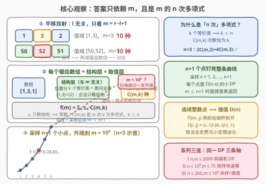
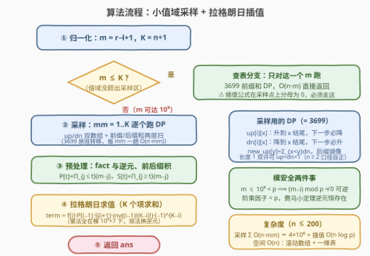

# LeetCode 锯齿形数组的总数III 题解

## 1. 题目概述

- **标题 / 题号**：锯齿形数组的总数III（#3916，hard）
- **链接**：https://leetcode.cn/problems/number-of-zigzag-arrays-iii/
- **难度**：困难
- **标签**：数学、动态规划、前缀和、拉格朗日插值

> ⚠️ 本题为 LeetCode 付费题，题面与约束依据官方 hints、同系列免费题 [3699](https://leetcode.cn/problems/number-of-zigzag-arrays-i/)/[3700](https://leetcode.cn/problems/number-of-zigzag-arrays-ii/) 及第三方镜像重建核对，可能与官方题面有细微出入。

**题意**：给你三个整数 $n$、$l$、$r$。长度为 $n$ 的**锯齿形数组**需同时满足：

1. 每个元素的取值范围为 $[l, r]$；
2. 任意**两个相邻**的元素都不相等；
3. 任意**三个连续**的元素不能构成一个**严格递增**或**严格递减**的序列。

返回满足条件的锯齿形数组总数。由于答案可能很大，将结果对 $10^9+7$ 取余数。

**示例 1**：

```text
输入：n = 3, l = 4, r = 5
输出：2
解释：取值范围 [4,5] 内只有 [4,5,4] 和 [5,4,5] 两种
```

**示例 2**：

```text
输入：n = 3, l = 1, r = 3
输出：10
解释：[1,2,1],[1,3,1],[1,3,2],[2,1,2],[2,1,3],[2,3,1],
      [2,3,2],[3,1,2],[3,1,3],[3,2,3]
```

**约束**：

- $3 \le n \le 200$
- $1 \le l < r \le 10^9$（即值域大小 $m = r-l+1$ 可达 $10^9$）

> 💡 **审题关键**：① 与 I/II 题面完全相同，换的是**爆炸轴**——I 是 $n, m \le 2000$（前缀和 DP 舒适区）、II 是 $n \le 10^9, m \le 75$（矩阵快速幂甜区）、III 是 $n \le 200$ 但 $m \le 10^9$：**值域爆炸**，任何把 $m$ 当状态维的算法当场死亡；② 「相邻不等 + 无三连单调」⟺ **方向严格交替**（见 [3699 题解](../3601-3700/3699_锯齿形数组的总数I.md) 2.2 节）；③ 答案只依赖 $n$ 与 $m = r-l+1$，$l$ 无关；④ 破局点是官方 hint 点破的性质：**答案是关于 $m$ 的次数 $\le n$ 的多项式**——$n \le 200$ 很小 ⟹ 采 $n+1$ 个小值域的样点，拉格朗日插值一发外插到 $10^9$。

## 2. 解题思路

### 2.1 暴力思路：三条老路全被 $m = 10^9$ 堵死

- **枚举**：值域 $m$ 种取值、长度 $n$，全体数组 $m^n$ 个——天文数字；
- **I 的前缀和 DP** $O(n \cdot m)$：$200 \times 10^9 = 2 \times 10^{11}$ 次运算，超时三个数量级；
- **II 的矩阵快速幂** $O((2m)^3 \log n)$：$m = 10^9$ 时矩阵规模 $2 \times 10^9$，连矩阵都存不下。

三条路的共性是**把 $m$ 当作状态维度/规模参数直接参与计算**。出路是一次视角转换：不再「对给定的 $m$ 算答案」，而是把 $m$ 看成**自变量** $x$，研究答案函数 $f(x)$ 的形状——证出它是低次多项式后，小样点即可拼出大处的取值。

### 2.2 核心观察：$f(m)$ 是 $m$ 的 $n$ 次多项式



**观察一（答案只依赖 $m = r-l+1$）**：平移映射 $v \mapsto v - l + 1$ 是 $[l, r] \to [1, m]$ 的双射，且保持所有 $=, <, >$ 关系——锯齿三条件只比较相邻元素的大小，$[l, r]$ 与 $[1, m]$ 上的锯齿数组一一对应。故 $f$ 只由 $n$ 和 $m$ 决定，$l$ 全程不参与。

**观察二（$f(m) = \sum_k c_k \binom{m}{k}$，次数 $\le n$）**：把每个数组拆成互不干扰的两层：

- **结构层**：把 $n$ 个位置按「取值相等」划分成 $k$ 个等价类，再带上类与类之间的大小全序（即**有序集合划分**）。「相邻不等」⟺ 相邻位置不同类；「无三连单调」⟺ 三个连续位置的类序不构成严格升降——**合法性完全由结构层决定，与 $m$ 无关**；
- **取值层**：$k$ 个类按从小到大的顺序取 $k$ 个**互不相同**的值 $v_1 < v_2 < \cdots < v_k \in [1, m]$——恰有 $\binom{m}{k}$ 种（组合数：从 $[1,m]$ 里选 $k$ 个值的集合，类序与值序天然对应）。

于是

$$f(m) \;=\; \sum_{k=1}^{n} c_k \binom{m}{k}$$

其中 $c_k$ = 恰含 $k$ 个等价类的**合法结构**个数，是与 $m$ 无关的常数。$\binom{m}{k} = \frac{m(m-1)\cdots(m-k+1)}{k!}$ 是 $m$ 的 $k$ 次多项式且 $k \le n$，故 $f(m)$ 是**次数 $\le n$ 的多项式**。

> 💡 **$n=3$ 实例校验**：合法结构里 $k=2$ 的有 2 个（划分 $\{1,3\}|\{2\}$ 配「谷-峰 / 峰-谷」两种序），$k=3$ 的有 4 个（三个单元素类的 $3!=6$ 种全序去掉纯升、纯降）⟹ $f_3(m) = 2\binom{m}{2} + 4\binom{m}{3} = \frac{m(m-1)(2m-1)}{3}$。代入 $m=2$ 得 $2$ ✓、$m=3$ 得 $10$ ✓——与两个示例严丝合缝。

**观察三（$n+1$ 个样点钉死整条曲线）**：次数 $\le n$ 的多项式由任意 $n+1$ 个横坐标不同的点唯一确定。所以只需用 I 的 $O(n \cdot m)$ DP 算出 $f(1), f(2), \ldots, f(n+1)$（样点值域 $\le n+1 \le 201$，全部是小 DP），再用**拉格朗日插值**在真实 $m$ 处求值。若 $m \le n+1$ 落在采样区间内，直接查表，无需插值。

### 2.3 算法流程图



采样阶段对每个 $\text{mm} = 1..K$（$K = n+1$）原样复用 [3699](../3601-3700/3699_锯齿形数组的总数I.md) 的前缀和 DP；插值阶段利用**样点是连续整数** $1..K$ 的事实把公式拆成乘积：

| 步骤 | 操作 | 说明 |
|------|------|------|
| ① 归一化 | $m = r-l+1$，$K = n+1$ | $l$ 只定 $m$ |
| ② 查表分支 | 若 $m \le K$：只对这一个 $m$ 跑 DP 直接返回 | ⚠️ 插值公式在样点上分母为 0，必须走此分支 |
| ③ 采样 | $\text{mm}=1..K$ 各跑一遍 $O(n \cdot \text{mm})$ 前缀和 DP | 得 $f[1..K]$，总量 $\sum_{\text{mm}} n\cdot\text{mm} = O(n^3)$ |
| ④ 预处理 | $P[t] = \prod_{j \le t}(m-j)$、$S[t] = \prod_{j \ge t}(m-j)$、阶乘表 | 前后缀积各一趟，$O(n)$ |
| ⑤ 拉格朗日求值 | 见下式，逐项累加 | $O(n \log p)$（$K$ 次逆元快速幂） |

连续整数点 $1..K$ 上的拉格朗日公式（分子拆前后缀积、分母坍缩成阶乘）：

$$f(m) \;=\; \sum_{i=1}^{K} f(i)\cdot \underbrace{P[i-1]\cdot S[i+1]}_{\prod_{j \ne i}(m-j)} \cdot \frac{1}{(i-1)!\,(K-i)!}\cdot(-1)^{K-i}$$

> ⚠️ **模运算安全性**：除法全部换成乘逆元（费马小定理，$p = 10^9+7$ 为素数）。分母 $(i-1)!(K-i)!$ 的因子全 $< p$ 可逆；分子的 $m - j$ 满足 $0 < m - j < p$（本题 $m \le 10^9 < p$ 且 $m > K \ge j$）⟹ $\bmod\ p$ 非 0 可逆。若题目把 $r$ 放大到 $\ge 10^9+7$，还需按 $m \bmod p$ 平移处理，本题无需。

### 2.4 示例演算

以 $n = 3$（$K = 4$）走完全流程，采样得：

```text
f(1)=0   f(2)=2   f(3)=10   f(4)=28
```

$m=2, m=3$ 正是示例 1/2，当场对上。**外插验证 $m=5$**：

$$f(5) = 0 + 2\cdot\frac{(4)(3)(1)}{(1)(-1)(-2)} + 10\cdot\frac{(4)(3)(1)}{(2)(1)(-1)} + 28\cdot\frac{(4)(3)(2)}{(3)(2)(1)} = 8 - 60 + 112 = 60$$

闭式核对 $\frac{5 \cdot 4 \cdot 9}{3} = 60$ ✓——三次多项式被 4 个点精确重建，连插值点右侧的开区间都不在话下。继续外插到 $m = 10^9$ 得 $999999727 \pmod{10^9+7}$。整个过程只有「4 个小 DP + 4 项求和」。

## 3. 参考代码

### C++

```cpp
class Solution {
  public:
    int zigZagArrays(int n, int l, int r) {
        const long long MOD = 1'000'000'007LL;
        long long m = (long long)r - l + 1;   // 唯一真正的规模参数
        int K = n + 1;                        // 采样点 x = 1..K

        // 采样：f[mm] = 值域大小为 mm 时的答案（3699 的 O(n·mm) 前缀和 DP）
        vector<long long> f(K + 1, 0);
        for (int mm = 1; mm <= K; ++mm) {
            vector<long long> up(mm + 1, 1), dn(mm + 1, 1);  // 长度 1 双许可
            for (int i = 2; i <= n; ++i) {
                vector<long long> nup(mm + 1), ndn(mm + 1);
                long long pre = 0;                        // new_up[y] = Σ dn[x], x < y
                for (int y = 1; y <= mm; ++y) { nup[y] = pre; pre = (pre + dn[y]) % MOD; }
                long long suf = 0;                        // new_dn[y] = Σ up[x], x > y
                for (int y = mm; y >= 1; --y) { ndn[y] = suf; suf = (suf + up[y]) % MOD; }
                swap(up, nup);
                swap(dn, ndn);
            }
            long long tot = 0;
            for (int y = 1; y <= mm; ++y) tot = (tot + up[y] + dn[y]) % MOD;
            f[mm] = tot;
        }
        if (m <= K) return (int)f[m];        // 值域落在采样区内：直接查表

        // 拉格朗日插值：P[t]=Π_{j≤t}(m−j)，S[t]=Π_{j≥t}(m−j)
        vector<long long> P(K + 2, 1), S(K + 2, 1);
        for (int t = 1; t <= K; ++t) P[t] = P[t - 1] * ((m - t) % MOD) % MOD;
        for (int t = K; t >= 1; --t) S[t] = S[t + 1] * ((m - t) % MOD) % MOD;

        vector<long long> fact(K + 1, 1);
        for (int i = 1; i <= K; ++i) fact[i] = fact[i - 1] * i % MOD;
        auto power = [&](long long a, long long b) {
            long long res = 1;
            for (; b; b >>= 1, a = a * a % MOD)
                if (b & 1) res = res * a % MOD;
            return res;
        };

        long long ans = 0;
        for (int i = 1; i <= K; ++i) {
            long long num = P[i - 1] * S[i + 1] % MOD;       // Π_{j≠i}(m−j)
            long long den = fact[i - 1] * fact[K - i] % MOD; // |Π_{j≠i}(i−j)|
            long long term = f[i] * num % MOD * power(den, MOD - 2) % MOD;
            ans = ((K - i) & 1) ? (ans - term + MOD) % MOD : (ans + term) % MOD;
        }
        return (int)ans;
    }
};
```

### Python

```python
class Solution:
    def zigZagArrays(self, n: int, l: int, r: int) -> int:
        MOD = 10**9 + 7
        m = r - l + 1                 # 唯一真正的规模参数
        K = n + 1                     # 采样点 x = 1..K

        # 采样：f[mm] = 值域大小为 mm 的答案（3699 的 O(n·mm) 前缀和 DP）
        f = [0] * (K + 1)
        for mm in range(1, K + 1):
            up = [1] * (mm + 1)       # 长度 1 双许可（升/降各记一份）
            dn = [1] * (mm + 1)
            for _ in range(2, n + 1):
                nup, pre = [0] * (mm + 1), 0
                for y in range(1, mm + 1):      # new_up[y] = Σ dn[x], x < y
                    nup[y] = pre
                    pre = (pre + dn[y]) % MOD
                ndn, suf = [0] * (mm + 1), 0
                for y in range(mm, 0, -1):      # new_dn[y] = Σ up[x], x > y
                    ndn[y] = suf
                    suf = (suf + up[y]) % MOD
                up, dn = nup, ndn
            f[mm] = (sum(up[1:]) + sum(dn[1:])) % MOD
        if m <= K:
            return f[m]              # 值域落在采样区内：直接查表

        P = [1] * (K + 2)            # P[t] = Π_{j≤t}(m−j)
        S = [1] * (K + 2)            # S[t] = Π_{j≥t}(m−j)
        for t in range(1, K + 1):
            P[t] = P[t - 1] * ((m - t) % MOD) % MOD
        for t in range(K, 0, -1):
            S[t] = S[t + 1] * ((m - t) % MOD) % MOD
        fact = [1] * (K + 1)
        for i in range(1, K + 1):
            fact[i] = fact[i - 1] * i % MOD

        ans = 0
        for i in range(1, K + 1):
            num = P[i - 1] * S[i + 1] % MOD              # Π_{j≠i}(m−j)
            den = fact[i - 1] * fact[K - i] % MOD        # |Π_{j≠i}(i−j)|
            term = f[i] * num % MOD * pow(den, MOD - 2, MOD) % MOD
            ans = (ans - term) % MOD if (K - i) & 1 else (ans + term) % MOD
        return ans
```

> 💡 **写法要点**：① 采样 DP 与 3699 的代码几乎逐行相同，只是外面包了一层 `for mm`——系列的延续性让「背模板」直接变现；② DP 的下标从 1 起（`up[0]` 是废位），求和记得跳过 0 号位；③ 插值的 `ans - term` 要 `+ MOD` 防负数（Python 天然大整数无此忧）；④ $m \le K$ 的查表分支不是优化而是**正确性必需**——插值公式里 $\prod_{j \ne i}(m-j)$ 的拆分在 $m = j$ 时分母为 0。

## 4. 复杂度分析

| 维度 | 复杂度 | 说明 |
|------|--------|------|
| **时间** | $O(n^3 + n \log p)$ | 采样 $\sum_{\text{mm}=1}^{n+1} O(n \cdot \text{mm}) = O(n^3)$；插值 $K$ 次逆元快速幂。$n = 200$ 时约 $4 \times 10^6$ 次乘加——毫秒级 |
| **空间** | $O(n)$ | 采样 DP 滚动数组 $O(\text{mm}) \le O(n)$；$f/P/S/fact$ 均一维 $O(n)$ |
| **量级判断** | 对照三条死路 | 直接 DP $O(nm) = 2\times10^{11}$、矩阵幂 $(2m)^3$ 连存储都炸、枚举 $m^n$ 天文数字——「$m$ 当自变量」的视角转换一次清零 |

## 5. 扩展：同一条 DP 的三条爆炸轴（I / II / III）

三道题题面逐字相同，规模参数此消彼长，恰好构成**一个转移系统的三个投影**：

| 题号 | $n$ | $m$ | 爆炸的维度 | 武器 | 复杂度 |
|------|-----|-----|-----------|------|--------|
| [3699](../3601-3700/3699_锯齿形数组的总数I.md) | $\le 2000$ | $\le 2000$ | 无 | 前缀和优化逐层 DP | $O(nm) \approx 4\times10^6$ |
| [3700](../3601-3700/3700_锯齿形数组的总数II.md) | $\le 10^9$ | $\le 75$ | $n$（转移次数） | 转移线性 ⟹ 封装 $2m$ 维矩阵快速幂 $T^{n-1}$ | $O((2m)^3 \log n)$ |
| 3916 | $\le 200$ | $\le 10^9$ | $m$（状态维度） | 答案是 $m$ 的 $n$ 次多项式 ⟹ 采样 + 拉格朗日插值 | $O(n^3)$ |

> 💡 **方法论**：爆炸的维度必须从「状态空间 / 时间轴」里**移走**——II 把 $n$ 从「转移次数」压成「幂指数」（线性递推 ⟹ 矩阵幂）；III 把 $m$ 从「状态维」升格为「多项式自变量」（低次 ⟹ 少量样点确定）。同一套 $up/dn$ 转移，三个方向各救一次场。

**拉格朗日插值的适用信号**（带走可复用的判断法）：答案 $f(x)$ 关于某个大参数 $x$ 是低次多项式，且次数由另一个小参数控制。**探测手段**：小规模打表后做**差分**——$k$ 阶差分恒为 0 ⟹ 次数 $\le k$（本题 $f_3$ 差分三次归零）。一个细节：本题的多项式恒等式对一切 $m \ge 0$ 成立；一般计数题里可能是「$m \ge$ 阈值后才多项式」（如带 $\min/\max$ 截断的题），此时采样点必须取在阈值右侧的连续整数上。

## 6. 面试要点

**Q1：为什么答案与 $l$ 无关、只依赖 $m = r-l+1$？**

> 平移映射 $v \mapsto v - l + 1$ 是 $[l,r] \to [1,m]$ 的双射，且完全保持 $=, <, >$ 关系；锯齿三条件只涉及相邻元素的大小比较，不涉及绝对数值。两个同宽值域上的锯齿数组一一对应，计数相同。面试时主动说出这一点等于白送的分。

**Q2：怎么证明 $f(m)$ 是次数 $\le n$ 的多项式？**

> 每个数组拆成「结构层 + 取值层」：结构层是位置集合的**有序划分**（等价类 + 类间全序），锯齿合法性只由结构层决定、与 $m$ 无关；取值层是 $k$ 个类按序取互异常，恰 $\binom{m}{k}$ 种。求和得 $f(m) = \sum_k c_k \binom{m}{k}$，$\binom{m}{k}$ 是 $m$ 的 $k \le n$ 次多项式，故 $f$ 次数 $\le n$。关键是「合法性只看相对结构」这一步把 $m$ 从计数结构里彻底剥离。

**Q3：为什么采样点取 $1..n+1$？$m \le n+1$ 时为什么必须查表？**

> 次数 $\le n$ 的多项式被 $n+1$ 个点唯一确定，$1..n+1$ 是最顺手的一组连续整数（分母能坍缩成阶乘）。$m \le n+1$ 时 $m$ 本身就是样点：插值公式的分母 $\prod_{j \ne i}(i - j)$ 在 $m = j$ 处为 0，公式失效，直接返回采样值 $f[m]$。这一步是正确性分支，不是可选优化。

**Q4：模意义下做插值有哪些坑？**

> ① 除法必须换逆元——$p$ 素数用费马小定理 $a^{-1} \equiv a^{p-2}$；② 谨防「整数为零、模 $p$ 非零」与「整数非零、模 $p$ 为零」两种错位：前者（样点重复）靠查表分支规避，后者（$m - i \equiv 0 \pmod p$ 但 $m \ne i$）要求 $m < p$——本题 $m \le 10^9 < 10^9+7$ 天然安全，若 $r$ 上界更大需把 $m$ 先取模再判；③ 减法项记得 `+ MOD` 防负。

**Q5：什么信号提示「该想到插值」而不是硬算？**

> 「一大一小」的双参数格局：一个参数大到无法枚举（$10^9$），另一个小到可控（$\le 200$），且答案随大参数**平滑增长**。先用小规模打表 + 差分探测多项式性（$k$ 阶差分归零 ⟹ 次数 $\le k$），一旦坐实，样点数 = 次数 + 1。这招与矩阵快速幂是「大参数计数题」的两把互补武器：前者吃「多项式性」，后者吃「线性递推性」。

> 💡 **一句话总结**：3916 =「答案只依赖 $m$」+「$f(m) = \sum_k c_k\binom{m}{k}$ 是 $m$ 的 $n$ 次多项式」+「$n+1$ 个小值域采样点 + 拉格朗日插值外插到 $10^9$」。带走的知识点：**当某个参数大到无法枚举时，试着证明答案是它的低次多项式——用小参数个采样点钉死曲线，一发外插。**

## 同类练习题

| # | 题目 | 与本题的关联 |
|---|------|-------------|
| 3699 | [锯齿形数组的总数I](https://leetcode.cn/problems/number-of-zigzag-arrays-i/)（[题解](../3601-3700/3699_锯齿形数组的总数I.md)） | 同一题的小规模版，本文采样阶段复用的前缀和 DP 模板 |
| 3700 | [锯齿形数组的总数II](https://leetcode.cn/problems/number-of-zigzag-arrays-ii/)（[题解](../3601-3700/3700_锯齿形数组的总数II.md)） | $n$ 爆炸轴的姊妹篇，矩阵快速幂与本文插值法互为镜像 |
| 376 | [摆动序列](https://leetcode.cn/problems/wiggle-subsequence/)（[题解](../0301-0400/376_摆动序列.md)） | 同一「方向交替」定义的最优化版，对照理解「计数 vs 最长」的状态设计 |
| 2222 | [选择建筑的方案数](https://leetcode.cn/problems/number-of-ways-to-select-buildings/)（[题解](../2201-2300/2222_选择建筑的方案数.md)） | `010/101` 交替模式计数，「方向交替」在字符串上的化身 |
| 790 | [多米诺和托米诺平铺](https://leetcode.cn/problems/domino-and-tromino-tiling/)（[题解](../0701-0800/790_多米诺和托米诺平铺.md)） | 大 $n$ 计数的线性递推 + 矩阵快速幂族，与 3700 同谱系、与本文的插值路线互补 |
