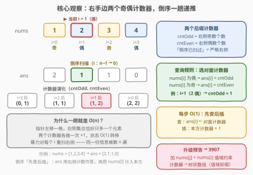
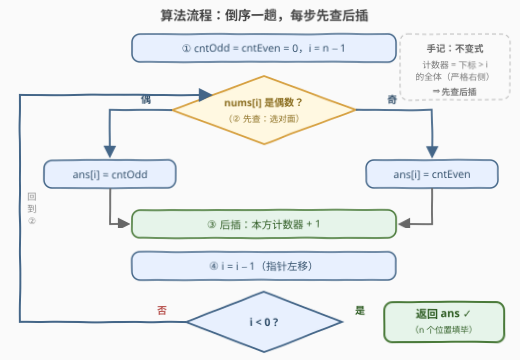

# 统计下标的相反奇偶性得分

- **题目名称**：统计下标的相反奇偶性得分
- **链接**：[3917. Count Indices with Opposite Parity](https://leetcode.cn/problems/count-indices-with-opposite-parity/)
- **难度**：简单
- **标签**：数组

## 1. 题目概述

给你一个长度为 $n$ 的整数数组 $nums$。下标 $i$ 的**分数**定义为满足以下条件的下标 $j$ 的数量：

1. $i < j < n$（$j$ 位于 $i$ **右侧**）；
2. $nums[i]$ 与 $nums[j]$ **奇偶性不同**（一奇一偶）。

返回长度为 $n$ 的整数数组 $answer$，其中 $answer[i]$ 表示下标 $i$ 的分数。

**示例 1**：

```text
输入：nums = [1,2,3,4]
输出：[2,1,1,0]
解释：i=0（1 奇）：右侧偶数有 2、4 → 2；
     i=1（2 偶）：右侧奇数有 3 → 1；
     i=2（3 奇）：右侧偶数有 4 → 1；
     i=3：右侧无元素 → 0。
```

**示例 2**：

```text
输入：nums = [1]
输出：[0]
```

**约束条件**：

- $1 \le n \le 100$
- $1 \le nums[i] \le 100$

> 💡 **审题关键**：本题与 [3907. 统计具有相反奇偶性的较小元素](https://leetcode.cn/problems/count-smaller-elements-with-opposite-parity/)（[题解](3907_统计具有相反奇偶性的较小元素.md)）同族，但**少一个约束**——只问"右侧有多少个奇偶相反的"，完全不关心 $nums[j]$ 与 $nums[i]$ 的大小关系。$n \le 100$ 暴力双循环稳过；但这题真正的教学点是：**去掉值域约束后连树状数组都不需要，两个计数器倒序一趟就是理论最优**。

---

## 2. 解题思路

### 2.1 暴力思路：每个 i 重扫一遍右侧

对每个 $i$ 枚举所有 $j > i$，判定两者奇偶是否相反，总复杂度 $O(n^2)$。$n = 100$ 时至多约 $5\times10^3$ 次判定，轻松通过。

但换个角度看：**指针从 $i+1$ 移到 $i$ 时，"右侧元素的奇偶分布"只变化一个元素**（右侧集合恰好新增 $nums[i+1]$）。暴力却为每个 $i$ 把整个右侧从头重扫一遍——同一份奇偶分布被重复统计了 $n$ 遍。信息几乎不变，就该**增量维护**，而不是反复全量计算。

### 2.2 核心观察：后缀奇偶计数（倒序一趟 O(n)）



**观察一（奇偶只有两类 ⇒ 两个计数器足够）**：$answer[i]$ 的取值只依赖两个数——右侧奇数的个数 $\text{cntOdd}$ 与右侧偶数的个数 $\text{cntEven}$：

$$answer[i] = \begin{cases} \text{cntOdd}, & nums[i] \text{ 为偶数} \\[2pt] \text{cntEven}, & nums[i] \text{ 为奇数} \end{cases}$$

"奇偶相反"就此坍缩成一次 **O(1) 的选对面计数器**动作。3907 里选完桶之后还要做值域前缀查询（树状数组）；本题选完就结束了——**约束越少，结构越轻**。

**观察二（「右侧」= 倒序已扫过 ⇒ 增量维护）**：从 $n-1$ 向左扫。处理 $i$ 时，两个计数器装的恰好是**下标 $> i$ 的全体**——这就是不变式。作答后把 $nums[i]$ 计入**本方**计数器，指针左移；此时右侧集合恰好新增一个元素，计数器只做一次 $+1$。

**先查后插**：查询打**对面**计数器、插入打**本方**计数器，次序在"严格右侧"这个口径下天然安全（见面试要点 Q2）。

三句话合起来：

> **右侧信息 = 两个标量；奇偶相反 = 选对面计数器；倒序扫描 = 一趟先查后插，O(n) 收工。**

### 2.3 算法流程图



| 步骤 | 操作 | 说明 |
|------|------|------|
| ① 初始化 | $\text{cntOdd} = \text{cntEven} = 0$，$i = n-1$ | 计数器为空（初始右侧无元素） |
| ② 先查 | $nums[i]$ 偶 → $ans[i] = \text{cntOdd}$；奇 → $ans[i] = \text{cntEven}$ | 选**对面**计数器，O(1) |
| ③ 后插 | $nums[i]$ 偶 → $\text{cntEven}{+}{+}$；奇 → $\text{cntOdd}{+}{+}$ | 把自己计入**本方** |
| ④ 左移 | $i \leftarrow i - 1$ | 右侧集合恰好多一个元素 |
| ⑤ 终止 | $i < 0$ 时返回 $ans$ | $n$ 个位置全部作答 |

### 2.4 示例演算

以**示例 1**（$nums = [1,2,3,4]$）倒序演算，$(\text{cntOdd}, \text{cntEven})$ 表示计数器状态：

| $i$ | $nums[i]$ | 奇偶 | 查前 (奇, 偶) | 查对面计数器 | $ans[i]$ | 插后 (奇, 偶) |
|-----|-----------|------|----------------|----------------|----------|----------------|
| 3 | 4 | 偶 | $(0, 0)$ | $\text{cntOdd} = 0$ | 0 | $(0, 1)$ |
| 2 | 3 | 奇 | $(0, 1)$ | $\text{cntEven} = 1$ | 1 | $(1, 1)$ |
| 1 | 2 | 偶 | $(1, 1)$ | $\text{cntOdd} = 1$ | 1 | $(1, 2)$ |
| 0 | 1 | 奇 | $(1, 2)$ | $\text{cntEven} = 2$ | 2 | $(2, 2)$ |

得 $ans = [2,1,1,0]$ ✓。**示例 2** 单元素：$i=0$ 时两计数器均为 0 → $[0]$ ✓。

---

## 3. 参考代码

### C++

```cpp
class Solution {
public:
    vector<int> countOppositeParity(vector<int>& nums) {
        int n = nums.size();
        vector<int> ans(n);
        int cntOdd = 0, cntEven = 0;               // 不变式：恰为下标 > i 的奇/偶个数
        for (int i = n - 1; i >= 0; --i) {
            if (nums[i] % 2 == 0) {
                ans[i] = cntOdd;                   // 先查：偶数问奇数个数
                ++cntEven;                         // 后插：计入本方
            } else {
                ans[i] = cntEven;
                ++cntOdd;
            }
        }
        return ans;
    }
};
```

### Python

```python
class Solution:
    def countOppositeParity(self, nums: list[int]) -> list[int]:
        cnt_odd = cnt_even = 0                      # 不变式：恰为下标 > i 的奇/偶个数
        ans = [0] * len(nums)
        for i in range(len(nums) - 1, -1, -1):
            if nums[i] % 2 == 0:
                ans[i] = cnt_odd                    # 先查：偶数问奇数个数
                cnt_even += 1                       # 后插：计入本方
            else:
                ans[i] = cnt_even
                cnt_odd += 1
        return ans
```

> 💡 **写法要点**：① 奇偶判定用 `nums[i] % 2`（负数用 `& 1` 也正确，本题值域为正无差异）；② "先查后插"顺序写死，不变式「计数器 = 严格右侧」全程成立；③ 对 $n \le 100$ 的数据，两份代码都是零思考成本的线性解。

---

## 4. 复杂度分析

| 维度 | 复杂度 | 说明 |
|------|--------|------|
| **时间** | $O(n)$ | 倒序一趟，每步 1 次查询 + 1 次插入，均为 O(1) |
| **空间** | $O(1)$ | 两个整型计数器（返回数组不计入） |
| **量级判断** | $n=100$：暴力 $O(n^2) = 10^4$ 也能过；计数器版对 $n = 10^6$ 甚至更大依然线性 | 无排序、无哈希、无值域结构；读入本身就是 $\Omega(n)$，此解已触及下界 |

---

## 5. 扩展

### 5.1 正序版：先扣后查

若不习惯倒序，可正序等价实现：先全量统计 $\text{odd} / \text{even}$，正序扫到 $i$ 时**先把自己扣掉**再作答——扣掉后计数器语义恰好回到"严格右侧"：

```python
odd = sum(x & 1 for x in nums)
even = len(nums) - odd
for i, x in enumerate(nums):
    if x & 1:
        odd -= 1
        ans[i] = even
    else:
        even -= 1
        ans[i] = odd
```

两版都是 $O(n)/O(1)$；倒序"先查后插"与 315/3907 一脉相承，可平滑升级到需要数据结构的变体。

### 5.2 升级路径：3917 → 3907

本题正是 3907 的**教学前置题**。一旦加上 $nums[j] < nums[i]$ 的值域约束，"右侧奇数的个数"就升级为"右侧**值小于 $nums[i]$** 的奇数个数"——标量计数器答不了值域前缀问题，需要离散化 + 分桶树状数组，复杂度从 $O(n)$ 升到 $O(n\log n)$。方法论：**先写清查询的精确语义，再按信息量选数据结构**——两类奇偶 → 2 个计数器；奇偶 × 值域 → 双桶 BIT。

---

## 6. 面试要点

**Q1：为什么两个计数器就够，不需要记住右侧具体是哪些值？**

> 查询只问**个数**，且过滤条件只有奇偶——奇偶把全体元素分成两类，每类的个数是一个标量。信息需求 = 2 个标量 ⇒ 维护 2 个计数器即可。一旦查询带上值域/区间条件，标量就不够了（见 Q5）。

**Q2：「先查后插」的次序能换吗？**

> 本题能：查询打**对面**计数器、插入打**本方**计数器，两条腿永不相交（3907 同款结论）。但保持"先查后插"是在维护不变式「计数器 = 严格右侧全体」——一旦口径改成"同奇偶"或 "$\le$"（如 1512 的正序版），先插就会把自己数进去。默认先查后插最稳。

**Q3：倒序先查后插与正序先扣后查，哪种更好？**

> 都是 $O(n)/O(1)$。倒序版与 315/3907 的"右侧统计"模板一致，可平滑升级；正序版要多扫一遍统计总量。面试中两种都说得出、并讲清各自的计数器语义，是加分项。

**Q4：暴力 $O(n^2)$ 与计数器 $O(n)$ 的本质差异？**

> **增量维护 vs 重复计算**。指针左移一格，右侧集合只新增一个元素；暴力却把整个右侧重扫一遍——同一份奇偶分布被数了 $n$ 遍。计数器把"分布"压缩成两个标量，状态转移 O(1)，这是所有 count-smaller / 右侧统计题共同的省时逻辑。

**Q5：什么时候计数器方案失效？**

> 只要查询不再是"整侧全局个数"：加值域约束（$nums[j] < nums[i]$，即 3907）→ 值域前缀计数 → 树状数组/线段树；改成区间 $[l, r]$ 内计数、或要求在线插删，同样要上值域结构。口诀：**先写查询的精确语义，再估它需要多少信息量，最后选恰好装得下这些信息的结构**。

> 💡 **一句话总结**：右侧的奇偶分布 = 两个标量——倒序一趟，偶数问奇计数、奇数问偶计数，先查后插 $O(n)$ 收工；加值域约束即升级为 3907 的双桶 BIT。

---

## 7. 同类练习题

- [3907. 统计具有相反奇偶性的较小元素](https://leetcode.cn/problems/count-smaller-elements-with-opposite-parity/)（[题解](3907_统计具有相反奇偶性的较小元素.md)）：本题加值域约束的升级版，计数器升级为倒序双树状数组
- [315. 计算右侧小于当前元素的个数](https://leetcode.cn/problems/count-of-smaller-numbers-after-self/)（[题解](../0301-0400/315_计算右侧小于当前元素的个数.md)）：count-smaller 母题，倒序"先查后插"思想的出处
- [1512. 好数对的数目](https://leetcode.cn/problems/number-of-good-pairs/)（[题解](../1501-1600/1512_好数对的数目.md)）：正序「先查后插」的一趟哈希计数，与本题互为方向镜像
- [238. 除自身以外数组的乘积](https://leetcode.cn/problems/product-of-array-except-self/)（[题解](../0201-0300/238_除自身以外数组的乘积.md)）：同为"右侧信息的倒序增量维护"，练习前后缀分解
- [922. 按奇偶排序数组 II](https://leetcode.cn/problems/sort-array-by-parity-ii/)（[题解](../0901-1000/922_按奇偶排序数组II.md)）：奇偶分桶的退化版，体会"奇偶是值的属性"
