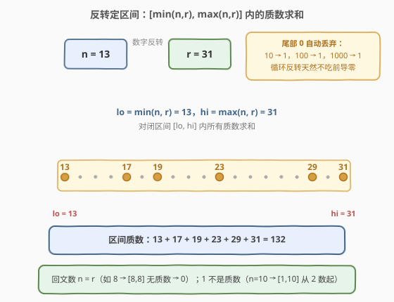
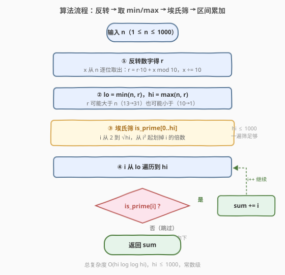

# 数与其逆序数之间的质数和

- **题目名称**：数与其逆序数之间的质数和
- **链接**：[3918. Sum of Primes Between Number and its Reverse](https://leetcode.cn/problems/sum-of-primes-between-number-and-its-reverse/)
- **难度**：中等
- **标签**：数学、数论

## 1. 题目概述

给你一个整数 `n`。令 `r` 为将 `n` 的**数字反转**后得到的整数。返回从 $\min(n, r)$ 到 $\max(n, r)$（**包含两端**）之间所有**质数**的总和。

**示例 1**：

```text
输入：n = 13
输出：132
解释：13 反转后为 31，范围为 [13, 31]。
     区间内质数有 13、17、19、23、29、31，总和为 13+17+19+23+29+31 = 132。
```

**示例 2**：

```text
输入：n = 10
输出：17
解释：10 反转后为 1，范围为 [1, 10]。
     区间内质数有 2、3、5、7，总和为 2+3+5+7 = 17。
```

**示例 3**：

```text
输入：n = 8
输出：0
解释：8 反转后仍为 8，范围为 [8, 8]，没有质数，返回 0。
```

**约束条件**：

- $1 \le n \le 1000$

> 💡 **审题关键**：三个易错点——①**区间方向不定**：$r$ 可能大于 $n$（13→31）也可能小于 $n$（10→1），必须用 $\min/\max$ 归一；②**尾部零**：`10` 反转是 `1` 而不是 `01`，前导零天然丢弃；③**1 不是质数**：`n = 10` 时区间从 1 开始，求和应从 2 起算。

---

## 2. 解题思路

### 2.1 暴力思路：反转 + 逐个试除

先按定义反转数字得到 $r$，再对 $[\min(n,r), \max(n,r)]$ 中每个数 $x$ 用**试除法**判质数（检查 $2 \sim \sqrt{x}$ 内有无因子）。由于 $n \le 1000$，反转值 $r \le 999$（1000 反转是 1），区间长度至多约 1000，单次判质最多 $\sqrt{1000} \approx 32$ 次除法，总计约 $3 \times 10^4$ 次操作，完全可以通过。

但试除写法细节多（$x < 2$ 要排除、边界用 $\le \sqrt{x}$ 还是 $< \sqrt{x}$ 容易错），而且**区间内每个数独立判质，存在大量重复劳动**——判 14、15、16 时其实早已知道 2、3 的倍数都不是质数。把这些信息**一次筛出来、反复使用**，就是标准做法。

### 2.2 核心观察：一次埃氏筛 + 区间累加



**观察一（反转的循环写法天然处理尾部零）。** 逐位反转：

$$r \leftarrow 0;\quad \text{while } x > 0:\ r \leftarrow 10r + x \bmod 10,\ x \leftarrow \lfloor x/10 \rfloor$$

`10` 反转时：取出个位 `0`（$r$ 仍为 0），再取出 `1`，得 $r = 1$——**尾部零在前导位置被自然丢弃**，无需任何特判。字符串写法 `int(str(n)[::-1])` 效果相同，但循环写法不依赖语言特性。

**观察二（区间方向用 $\min/\max$ 归一）。** $r$ 与 $n$ 的大小关系有三种：$r > n$（13→31）、$r < n$（10→1）、$r = n$（回文数，如 8、99）。闭区间统一写成 $[\min(n,r), \max(n,r)]$，三种情况一套代码覆盖。

**观察三（范围极小，一遍埃氏筛全解决）。** $n \le 1000$ 且 $r \le 999$（1000 反转是 1），故 $h = \max(n,r) \le 1000$。对 $[0, h]$ 跑一遍**埃拉托斯特尼筛**：`is_prime` 数组初始化全真，$is\_prime[0] = is\_prime[1] = \text{false}$（**1 不是质数**），然后 $i$ 从 2 到 $\sqrt{h}$，把 $i$ 的倍数从 $i^2$ 起全部划掉。最后累加 $[\min, \max]$ 内 `is_prime[i]` 为真的 $i$ 即可。

> 💡 **一句话总结**：循环反转得 $r$（尾部零自动丢弃）→ $\min/\max$ 定闭区间 → 对 $[0, \max]$ 跑一遍埃氏筛（记得 $is\_prime[1] = $ false）→ 区间内累加质数。全程 $h \le 1000$，常数级开销。

### 2.3 算法流程图



| 步骤 | 操作 | 说明 |
|------|------|------|
| ① | 循环反转数字得 $r$ | $r = 10r + x \bmod 10$，逐位右移 $x$；尾部零自然丢弃 |
| ② | $lo = \min(n, r)$，$hi = \max(n, r)$ | 三种大小关系一套代码覆盖 |
| ③ | 埃氏筛标记 $[0, hi]$ | 先置 $is\_prime[0]=is\_prime[1]=\text{false}$；$i \le \sqrt{hi}$，从 $i^2$ 起划倍数 |
| ④ | 遍历 $[lo, hi]$ 累加质数 | `if is_prime[i]: sum += i` |
| ⑤ | 返回 `sum` | 区间内可能没有质数（如 [8,8]），返回 0 |

### 2.4 示例演算

以 `n = 13` 为例：

| 项目 | 值 |
|------|-----|
| 反转 | $13 \to 31$，即 $r = 31$ |
| 区间 | $lo = 13$，$hi = 31$ |
| 筛后区间内质数 | 13、17、19、23、29、31 |
| 求和 | $13+17+19+23+29+31 = 132$ ✓ |

两个边界情形：

- `n = 10`：反转 $10 \to 1$（尾部零丢弃），区间 $[1, 10]$；**1 不是质数**，从 2 起算，$2+3+5+7 = 17$ ✓
- `n = 8`：回文数 $r = n = 8$，区间 $[8, 8]$，8 是合数，返回 $0$ ✓

---

## 3. 参考代码

### C++

```cpp
class Solution {
  public:
    int sumOfPrimesInRange(int n) {
        int r = 0;
        for (int x = n; x > 0; x /= 10) r = r * 10 + x % 10;  // 逐位反转
        int lo = min(n, r), hi = max(n, r);

        vector<bool> isPrime(hi + 1, true);
        isPrime[0] = isPrime[1] = false;                      // 0、1 都不是质数
        for (int i = 2; (long long)i * i <= hi; i++)
            if (isPrime[i])
                for (int j = i * i; j <= hi; j += i) isPrime[j] = false;

        int sum = 0;
        for (int i = lo; i <= hi; i++)
            if (isPrime[i]) sum += i;
        return sum;
    }
};
```

> 💡 **写法要点**：
> - 反转循环 `x /= 10` 同时消耗 $n$，所以先把 $r$ 算完再取 $\min/\max$，不要在反转中途使用 $x$；
> - `isPrime` 大小是 `hi + 1`，下标最大用到 `hi`，`hi = 1` 时数组只有 2 个元素也安全；
> - 内层筛从 `i * i` 开始：更小的合数 $k \cdot i\ (k < i)$ 已被更小的质因子划掉，这里 `(long long)` 只是防御性写法（$hi \le 1000$ 实际不会溢出）。

### Python

```python
class Solution:
    def sumOfPrimesInRange(self, n: int) -> int:
        r, x = 0, n
        while x:
            r = r * 10 + x % 10
            x //= 10
        lo, hi = min(n, r), max(n, r)

        is_prime = [True] * (hi + 1)
        is_prime[0] = is_prime[1] = False
        for i in range(2, int(hi ** 0.5) + 1):
            if is_prime[i]:
                for j in range(i * i, hi + 1, i):
                    is_prime[j] = False

        return sum(i for i in range(lo, hi + 1) if is_prime[i])
```

> 💡 **写法要点**：
> - `while x:` 在 $x = 0$ 时停止，$n \ge 1$ 保证至少执行一次、$r \ge 1$；
> - 切片筛写法 `is_prime[i*i::i] = [False] * len(...)` 也行，但循环版更贴近 C++ 逻辑、面试好讲；
> - 最后生成器表达式一步完成「过滤 + 求和」，无需显式累加变量。

---

## 4. 复杂度分析

| 维度 | 复杂度 | 说明 |
|------|--------|------|
| 时间 | $O(h \log\log h)$，$h \le 1000$ | 反转 $O(4)$；埃氏筛 $O(h \log\log h)$；区间累加 $O(h)$，整体常数级 |
| 空间 | $O(h)$ | `is_prime` 数组，$h \le 1000$，至多 1001 个布尔 |
| 正确性边界 | — | 尾部零（10→1）、$lo = 1$（1 非质数）、回文数（区间单点）三处均由统一逻辑覆盖，无特判分支 |

---

## 5. 扩展：多次查询与更大规模

**多次查询 → 质数前缀和。** 若该函数被调用 $q$ 次（如 $q \le 10^4$），每次现筛仍要 $O(h)$。可预处理到全局上界 $M = 1000$：筛一遍后构造前缀和 $S[i] = S[i-1] + (is\_prime[i]\ ?\ i : 0)$，每次查询答案为 $S[\max(n,r)] - S[\min(n,r)-1]$，单次 $O(\text{位数})$，只剩反转的代价。

**区间跨度极大 → 区间筛。** 若约束改为 $n \le 10^9$，$\max(n,r)$ 可达 $10^9 - 1$，线性数组不可行。改用**区间筛（segmented sieve）**：先筛出 $\le \sqrt{hi}$ 的全部质数（$\le 31623$，约 3400 个），再用它们把 $[lo, hi]$ 内的合数标记掉——每个质数 $p$ 从 $\lceil lo/p \rceil \cdot p$ 开始划。若只需判单点，**米勒-拉宾**（确定性版对 64 位内用固定底集）更直接。反转本身仍只是 $O(\text{位数})$。

---

## 6. 面试要点

**Q1：为什么必须用 $\min/\max$ 而不能默认 $r > n$？**

> 反转改变数量级：三位数 13 → 31 变大，但带尾部零的 10 → 1 变小，回文数则相等。区间方向有三种可能，`[min(n,r), max(n,r)]` 是唯一覆盖三种情况的写法；写成 `[n, r]` 再补 `if` 交换则多一条分支，不如归一化简洁。

**Q2：`10` 的反转为什么是 `1` 而不是 `01`？**

> 整数没有前导零。循环反转 $r = 10r + x \bmod 10$ 逐位累加，个位的 0 加进 $r$ 不产生效果，最终 $r = 1$，天然正确。用字符串反转 `int(str(n)[::-1])` 时 `int()` 也自动丢弃前导零，两种写法都无需特判。

**Q3：1 为什么不是质数？这对代码意味着什么？**

> 质数定义为**大于 1** 且只有 1 和自身两个因子的自然数。`n = 10` 时区间是 $[1, 10]$，若忘记 `is_prime[1] = false`（或试除时漏排 $x < 2$），会把 1 误加进答案。这是本题最容易翻车的边界。

**Q4：埃氏筛为什么内层从 $i^2$ 而不是 $2i$ 开始？外层为什么到 $\sqrt{h}$ 就够？**

> 小于 $i^2$ 的合数 $k \cdot i\ (k < i)$ 必有更小的质因子，在处理更小的质数时已被划掉。外层方面，$h$ 是合数则必有 $\le \sqrt{h}$ 的质因子，所以 $i > \sqrt{h}$ 后不会再产生新的划除；反过来，任何 $> \sqrt{h}$ 且 $\le h$ 的未被划掉的数必为质数。

**Q5：$hi$ 的上界到底是多少？数组开多大安全？**

> $n \le 1000$：1000 反转是 1，其余三位数反转至多 999，故 $hi = \max(n, r) \le 1000$。数组开 `hi + 1`（下标 $0 \sim hi$）即可；注意 `hi = 1` 时数组仅 2 个元素，`is_prime[1] = false` 的赋值仍合法，不会越界。

> 💡 **一句话总结**：循环反转（尾部零自动丢）→ $\min/\max$ 定区间 → 埃氏筛（$is\_prime[1]$ 置 false）→ 区间累加；三个边界（尾部零、$lo=1$、回文单点区间）全部被统一逻辑吸收，无需特判。

---

## 7. 同类练习题

- [204. 计数质数](https://leetcode.cn/problems/count-primes/)：埃氏筛入门经典，本题筛法部分的裸版
- [866. 回文质数](https://leetcode.cn/problems/prime-palindrome/)：回文（反转不变）+ 质数判定的组合，与本题「反转」主题呼应
- [2523. 范围内最接近的两个质数](https://leetcode.cn/problems/closest-prime-numbers-in-range/)：给定区间内找质数，同款「筛 + 区间」套路
- [2761. 和等于目标值的质数对](https://leetcode.cn/problems/prime-pairs-with-target-sum/)：区间内枚举质数对，练「筛一次、查询多次」的前缀和思路
- [1952. 三除数](https://leetcode.cn/problems/three-divisors/)：试除判因子/判质的基本功，对应本题暴力思路
