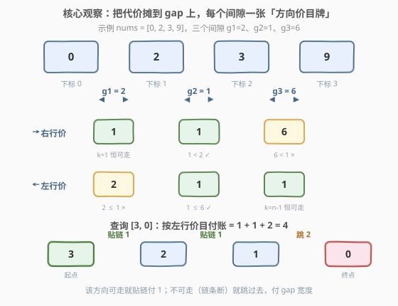
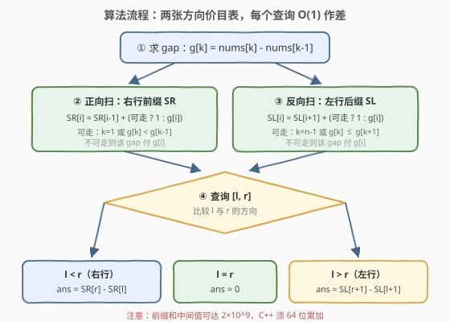

# LeetCode 在下标间移动的最小代价 题解

## 1. 题目概述

- **标题 / 题号**：在下标间移动的最小代价（#3919，medium）
- **链接**：https://leetcode.cn/problems/minimum-cost-to-move-between-indices/
- **难度**：中等
- **标签**：贪心、数组、前缀和

**题意**：给你一个**严格递增**的整数数组 `nums`。对每个下标 `x`，定义 `closest(x)` 为使得 $|\text{nums}[x] - \text{nums}[y]|$ 最小的**相邻**下标 `y`（相邻即 `x-1` 或 `x+1`；两侧差值相同时取**较小**的下标）。

从任意下标 `x` 出发，每一步有两种移动方式：

- **跳跃**：移动到任意下标 `y`，代价为 $|\text{nums}[x] - \text{nums}[y]|$；
- **贴链步进**：移动到 `closest(x)`，代价为 1。

再给定二维整数数组 `queries`，其中 `queries[i] = [li, ri]`。对每个查询，计算从下标 $l_i$ 移动到下标 $r_i$ 的**最小总代价**，返回数组 `ans`。

**示例 1**：

```text
输入：nums = [-5,-2,3], queries = [[0,2],[2,0],[1,2]]
输出：[6,2,5]
解释：closest 依次为 [1, 0, 1]。
     [0,2]：0 →(贴链,1) 1 →(跳,5) 2，总代价 6；
     [2,0]：2 →(贴链,1) 1 →(贴链,1) 0，总代价 2；
     [1,2]：closest(1)=0 方向不对，直接跳，|-2−3| = 5。
```

**示例 2**：

```text
输入：nums = [0,2,3,9], queries = [[3,0],[1,2],[2,0]]
输出：[4,1,3]
解释：closest 依次为 [1, 2, 1, 2]。
     [3,0]：3 →(贴链,1) 2 →(贴链,1) 1 →(跳,2) 0，总代价 4；
     [1,2]：closest(1)=2，贴链一步，总代价 1；
     [2,0]：2 →(贴链,1) 1 →(跳,2) 0，总代价 3。
```

**约束**：

- $2 \le n \le 10^5$，$-10^9 \le \text{nums}[i] \le 10^9$，`nums` 严格递增
- $1 \le q \le 10^5$，$0 \le l_i, r_i < n$（**允许 $l_i = r_i$，也允许 $l_i > r_i$**）

> 💡 **审题关键**：①**贴链是有向的**——从 `x` 只能走到 `closest(x)`，而 `closest(x)` 的 closest 未必指回 `x`，左右两个方向的可行判定**不对称**；②**平局取较小下标**——平局时 `closest` 指向左边，这决定了右行判定用**严格小于**、左行判定用**小于等于**；③**查询双向**——必须同时支持 $l < r$ 与 $l > r$，以及 $l = r$（代价 0）。

## 2. 解题思路

### 2.1 暴力思路：建图跑最短路

把每个下标看作图中的一个点：从 `x` 向**所有** `y` 连一条权为 $|\text{nums}[x]-\text{nums}[y]|$ 的有向边，再向 `closest(x)` 连一条权 1 的边，对每个查询的起点跑一遍 Dijkstra 即得精确答案。但点数 $n \le 10^5$、每个点出度为 $n$，边数 $O(n^2) \approx 10^{10}$，光建图就不可行；即便利用稠密图 Dijkstra 的 $O(n^2)$ 实现并对相同起点缓存结果，$q \le 10^5$ 个任意起点也是天文数字。

瓶颈在于把"跳到任意下标"当成了 $n-1$ 条彼此独立的边。其实**跳跃的代价按值域可加**——在严格递增数组上从 `x` 跳到 `y`，代价恰等于途中跨越的所有间隙宽度之和。把结算单位从"边"换成"间隙（gap）"，跳跃与贴链就能统一成同一套账本。

### 2.2 核心观察：代价摊到 gap 上，逐段定价



记 $g_k = \text{nums}[k] - \text{nums}[k-1]$（$1 \le k \le n-1$，即第 $k$ 个间隙的宽度；严格递增的整数保证 $g_k \ge 1$）。

**观察一（每步代价都能摊到 gap 上）。** 从 $x$ 跳到 $y$（设 $x < y$）的代价为

$$\text{nums}[y] - \text{nums}[x] = \sum_{k=x+1}^{y} g_k$$

恰是途中跨越的所有 gap 之和；一次贴链步进只跨**一个** gap，代价 1。于是任何一条路径的总代价，都可以按"每个 gap 被怎样跨越"逐段结算。

**观察二（每个 gap 的净穿越次数被起终点钉死）。** 设 $l < r$。把路径看成下标轨迹：无论怎么走，区间 $(l, r]$ 内每个 gap 都恰好被**净**右穿一次（右穿次数 − 左穿次数 = 1，由起终点唯一确定），区间外的 gap 净穿越 0 次。每次穿越都要单独付费（贴链 1 元、跳跃 $g_k$ 元），总代价就是所有穿越的费用之和。若某个 gap 被多穿——多出的部分必然成对出现（想多右穿一次，就得先左穿一次）——每对至少付 $1 + 1 = 2$ 元，却换不来任何折扣：各 gap 的单次最低价（见观察三）相互独立、已是下限。区间外的 gap 同理，碰它就是纯付费零收益。所以**最优解 = 每个中间 gap 恰穿越一次、按行进方向的最低价付费**。

**观察三（一个 gap 的最低过路费）。** 右行跨越 gap $k$（从下标 $k-1$ 走到 $k$）只有两种付法：

- **贴链**：需要 $\text{closest}(k-1) = k$，即右侧间隙严格更小——$g_k < g_{k-1}$（$k = 1$ 时下标 0 只有右邻居，恒可走）→ 付 **1**；
- **跳跃**：付 $g_k$。

由 $g_k \ge 1$，能贴链就贴链不会更差。左行跨越 gap $k$（从 $k$ 走到 $k-1$）对称：

- **贴链**：需要 $\text{closest}(k) = k-1$，即左侧间隙不大于右侧——$g_k \le g_{k+1}$（**平局取较小下标 ⇒ 平局向左**；$k = n-1$ 时下标 $n-1$ 只有左邻居，恒可走）→ 付 **1**；
- **跳跃**：付 $g_k$。

**观察四（各 gap 的最低价可以同时取到）。** 贴链步进不必"整条链走完"：先跳到 $k-1$、步进一格到 $k$、再跳出，就单独买下了 gap $k$ 的 1 元票；若连续一段 gap 都可贴链（对应 $g$ 逐段严格递减的一段），一次走完总价相同——因为**总代价只按 gap 结算**，与分几段走无关。跳跃可以落在任意下标，因此各 gap 的选择互不干扰，逐段最低价可以全部同时拿下。

> 💡 **一句话总结**：$\text{ans}(l, r) = \sum_{\text{途中 gap } k} \text{price}(k)$，其中 $\text{price}(k) = 1$（该方向可贴链）或 $g_k$（只能跳）。方向判定：右行可走 $\iff k=1$ 或 $g_k < g_{k-1}$；左行可走 $\iff k = n-1$ 或 $g_k \le g_{k+1}$。

**前缀和落地。** 预处理两个方向的价目表：

$$SR[i] = \sum_{k=1}^{i} \text{price}_r(k), \qquad SL[i] = \sum_{k=i}^{n-1} \text{price}_l(k)$$

每个查询 $O(1)$ 作差回答：

$$\text{ans}(l,r) = \begin{cases} 0 & l = r \\ SR[r] - SR[l] & l < r \\ SL[r+1] - SL[l+1] & l > r \end{cases}$$

### 2.3 算法流程图



| 步骤 | 操作 | 说明 |
|------|------|------|
| ① | 求 gap 数组 $g_k = \text{nums}[k]-\text{nums}[k-1]$ | $O(n)$，$g_k \ge 1$ |
| ② | 正向扫，建右行前缀 $SR$ | $SR[i] = SR[i-1] + (\text{可走} ? 1 : g_i)$，可走 $\iff i=1$ 或 $g_i < g_{i-1}$ |
| ③ | 反向扫，建左行后缀 $SL$ | $SL[i] = SL[i+1] + (\text{可走} ? 1 : g_i)$，可走 $\iff i=n-1$ 或 $g_i \le g_{i+1}$ |
| ④ | 逐查询分支回答 | $l{=}r$→0；$l{<}r$→$SR[r]-SR[l]$；$l{>}r$→$SL[r{+}1]-SL[l{+}1]$ |
| ⑤ | 返回 `ans` | 中间和可达 $2\times 10^9$，用 64 位累加 |

### 2.4 示例演算

以 `nums = [0, 2, 3, 9]`（$g = [2, 1, 6]$，$n = 4$）为例，先列价目表：

| gap $k$ | 宽度 $g_k$ | 右行可走？($g_k < g_{k-1}$) | 右行价 | 左行可走？($g_k \le g_{k+1}$) | 左行价 |
|---------|-----------|---------------------------|--------|------------------------------|--------|
| 1 | 2 | $k=1$ 恒可走 | **1** | $2 \le 1$？✗ | **2** |
| 2 | 1 | $1 < 2$？✓ | **1** | $1 \le 6$？✓ | **1** |
| 3 | 6 | $6 < 1$？✗ | **6** | $k = n-1$ 恒可走 | **1** |

据此 $SR = [0, 1, 2, 8]$，$SL = [4, 2, 1, 0]$（$SL[4] = 0$ 作哨兵）。三个查询：

| 查询 | 方向 | 计算 | 答案 | 对应路径 |
|------|------|------|------|----------|
| `[3,0]` | 左行 | $SL[1] - SL[4] = 4$ | **4** | 3 →(贴链 1) 2 →(贴链 1) 1 →(跳 2) 0 |
| `[1,2]` | 右行 | $SR[2] - SR[1] = 1$ | **1** | 1 →(贴链 1) 2 |
| `[2,0]` | 左行 | $SL[1] - SL[3] = 3$ | **3** | 2 →(贴链 1) 1 →(跳 2) 0 |

与示例输出 `[4, 1, 3]` 完全一致 ✓。

## 3. 参考代码

### C++

```cpp
class Solution {
  public:
    vector<int> minCost(vector<int>& nums, vector<vector<int>>& queries) {
        int n = nums.size();
        vector<long long> g(n + 1, 0);
        for (int k = 1; k < n; k++) g[k] = nums[k] - nums[k - 1];

        vector<long long> SR(n, 0);
        for (int i = 1; i < n; i++) {
            bool walk = (i == 1) || (g[i] < g[i - 1]);
            SR[i] = SR[i - 1] + (walk ? 1 : g[i]);
        }
        vector<long long> SL(n + 1, 0);
        for (int i = n - 1; i >= 1; i--) {
            bool walk = (i == n - 1) || (g[i] <= g[i + 1]);
            SL[i] = SL[i + 1] + (walk ? 1 : g[i]);
        }

        vector<int> ans;
        ans.reserve(queries.size());
        for (auto& q : queries) {
            int l = q[0], r = q[1];
            if (l == r) ans.push_back(0);
            else if (l < r) ans.push_back((int)(SR[r] - SR[l]));
            else ans.push_back((int)(SL[r + 1] - SL[l + 1]));
        }
        return ans;
    }
};
```

> 💡 **写法要点**：
> - `g`、`SR`、`SL` 全部用 `long long`：前缀和中间值可达 $2\times 10^9$，超出 32 位；而最终答案 $\le$ 直跳代价 $\le 2\times 10^9 < 2^{31}$，出口处转 `int` 恰好安全（题目签名要求 `vector<int>`）；
> - 右行判定是**严格** `<`（平局向左走）、左行判定是**带等号** `<=`，两个方向的条件恰好差一个等号，千万别写反；
> - `SL` 开 `n + 1` 长度、`SL[n] = 0` 当哨兵，`l > r` 时公式 $SL[r+1] - SL[l+1]$ 两端下标都合法，无需特判。

### Python

```python
class Solution:
    def minCost(self, nums: List[int], queries: List[List[int]]) -> List[int]:
        n = len(nums)
        g = [0] * (n + 1)
        for k in range(1, n):
            g[k] = nums[k] - nums[k - 1]

        SR = [0] * n
        for i in range(1, n):
            walk = (i == 1) or (g[i] < g[i - 1])
            SR[i] = SR[i - 1] + (1 if walk else g[i])

        SL = [0] * (n + 1)
        for i in range(n - 1, 0, -1):
            walk = (i == n - 1) or (g[i] <= g[i + 1])
            SL[i] = SL[i + 1] + (1 if walk else g[i])

        ans = []
        for l, r in queries:
            if l == r:
                ans.append(0)
            elif l < r:
                ans.append(SR[r] - SR[l])
            else:
                ans.append(SL[r + 1] - SL[l + 1])
        return ans
```

> 💡 **写法要点**：
> - 两个预处理循环一正一反，条件只差一个等号——写完建议互相检查一遍，这是本题最大的笔误点；
> - `SL` 的循环 `range(n - 1, 0, -1)` 终点是 `1`（gap 从 1 编号），`SL[n]` 保持哨兵 0；
> - Python 无溢出顾虑；移植到 C++ 时才需要留意 64 位累加。

## 4. 复杂度分析

| 维度 | 复杂度 | 说明 |
|------|--------|------|
| 时间 | $O(n + q)$ | 两次线性扫描建 $SR / SL$，每个查询 $O(1)$ 分支作差 |
| 空间 | $O(n)$ | gap 数组与两张价目表，共 4 个长度 $O(n)$ 的数组 |
| 正确性边界 | — | $l = r$（答 0）、$l > r$（左行价目）、$g_k = 1$（贴链与跳跃同价）均被统一公式覆盖，无特判分支 |

## 5. 扩展：构造具体路径与规则变体

**构造路径本身。** 本解只回答代价；若还要求输出一条最优路径，用观察四贪心重构即可：沿行进方向扫描，遇到"该方向可走"的 gap 就贴链走一步（连续可走段顺路一次走完），遇到不可走的 gap 就直接跳过它——跳跃落点选在下一段可走链的入口（下一个可走 gap 的左侧下标）。构造与计价同源，额外 $O(n)$。

**平局规则反转。** 若把"平局取较小下标"改成"取较大下标"，则平局时 `closest` 指向右边：右行判定变为 $g_k \le g_{k-1}$、左行变为 $g_k < g_{k+1}$——两个方向的**严格性与等号互换**，其余推理全部不变。左右不对称性完全由平局规则与首尾边界（只有单侧邻居）决定，这正是本题题面里最"阴"的一处设计。

**为什么不用双指针？** 接雨水式的双指针依赖"左右两端取 min"的对称结构；本题的贴链是**有向边**，左右两张价目表不对称（一张用严格 `<`、一张用 `<=`），且查询允许反向，所以为每个方向单独维护一张价目前缀/后缀、查询时按方向作差，才是最自然的组织方式。

## 6. 面试要点

**Q1：为什么最优路径可以假设"每个 gap 恰穿越一次、按最低价付费"？**

> 净穿越次数由起终点唯一钉死：$l < r$ 时 $(l, r]$ 内每个 gap 净右穿恰一次。每次穿越单独计费（贴链 1 或跳跃 $g_k$），所以总代价是各次穿越费用之和。想多穿必须成对多穿（多右穿一次得先左穿一次），每对至少 $1+1=2$ 元，且不可能换来任何 gap 的折扣——各 gap 的单次最低价相互独立、已经封底。区间外的 gap 净穿越 0 次，碰它纯属倒贴。

**Q2：右行可贴链的条件为什么是严格小于，左行却是小于等于？**

> `closest(x)` 在两侧差值相等时取**较小下标**：$g_k = g_{k+1}$ 时 `closest(k) = k-1`，指向左。于是左行跨 gap $k$ 只需 $g_k \le g_{k+1}$（平局也算可走），右行跨 gap $k$（站在 $k-1$）必须 $g_k < g_{k-1}$（平局会走向左边）。两个判定恰好差一个等号，是本题最隐蔽的笔误点。

**Q3：贴链必须"链式连续"，为什么各 gap 还能独立定价？**

> 下界按 gap 独立成立：每次穿越至少付该 gap 在该方向的最低价。上界用"分段租用"达到——跳到 $k-1$、步进一格、再跳出，就单独按 1 元买下 gap $k$；跳跃落点任意，各 gap 互不干扰。总代价只按 gap 结算，连续可走段合并成一趟走总价不变，所以独立最低价可以全部同时取到。

**Q4：答案会溢出 32 位整数吗？中间量呢？**

> 最终答案 $\le$ 直跳代价 $|\text{nums}[l]-\text{nums}[r]| \le 2\times 10^9 < 2^{31}$，勉强在 `int` 范围内；但 $SR / SL$ 的中间累加值同样可达 $2\times 10^9$，必须用 `long long` 累加、仅在返回时转回题目要求的 `int`（Python 无此顾虑）。

**Q5：暴力 Dijkstra 差在哪，怎么想到"摊到 gap"的？**

> 暴力把"跳到任意下标"建成 $n-1$ 条独立边，边数 $O(n^2)$ 直接爆内存。而跳跃代价本质是**值差**，在严格递增数组上恰等于途中 gap 之和——代价天然按区间可加。把结算单位从"边"换成"gap"，跳跃与贴链就统一为"按 gap 付费"，前缀和顺理成章。这是"从边权结构反推建模单位"的典型例子。

> 💡 **一句话总结**：跳跃 = 途中 gap 之和、贴链 = 单 gap 付 1 → 每个 gap 按行进方向各付一次最低价（可贴链付 1，否则付 $g_k$；右行判 $g_k < g_{k-1}$、左行判 $g_k \le g_{k+1}$）→ 两张价目前缀/后缀，查询 $O(1)$ 作差。

## 同类练习题

| # | 题目 | 与本题的关联 |
|---|------|-------------|
| 2602 | [使数组元素全部相等的最少操作数](https://leetcode.cn/problems/minimum-operations-to-make-all-array-elements-equal/) | 预处理前缀和 + 排序二分，$O(1)$ 级回答大批区间型查询的同款思路 |
| 2559 | [统计范围内的元音字符串数](https://leetcode.cn/problems/count-vowel-strings-in-ranges/) | 前缀和数组直接作差回答区间查询，本题 $SR[r]-SR[l]$ 的裸版 |
| 42 | [接雨水](https://leetcode.cn/problems/trapping-rain-water/) | 把总答案拆到每根柱子上独立结算的贪心经典，对照本题"按 gap 结算" |
| 1109 | [航班预订统计](https://leetcode.cn/problems/corporate-flight-bookings/) | 差分转前缀和，区间型代价的另一种摊派方向 |
| 1526 | [形成目标数组的子数组最少增加次数](https://leetcode.cn/problems/minimum-number-of-increments-on-subarrays-to-form-a-target-array/) | 总代价摊到相邻差分上逐段定价，与本题"按 gap 付费"神似 |
